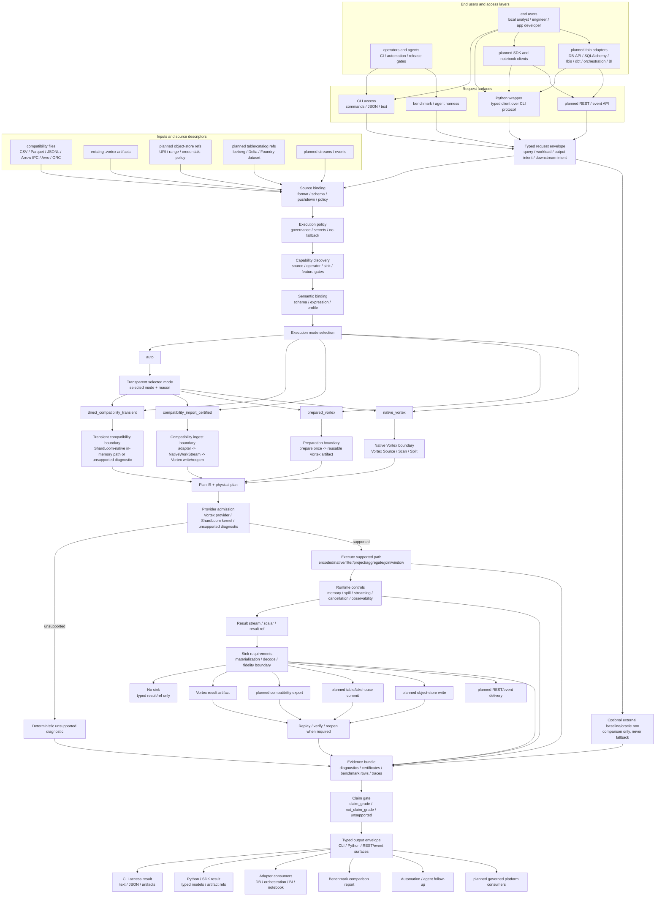
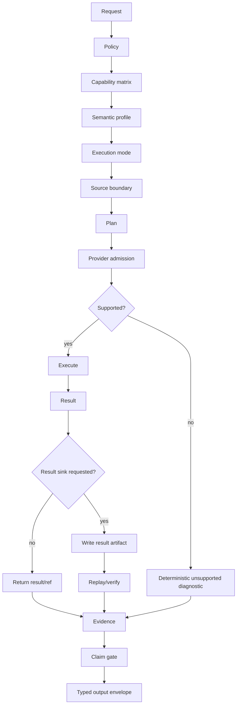
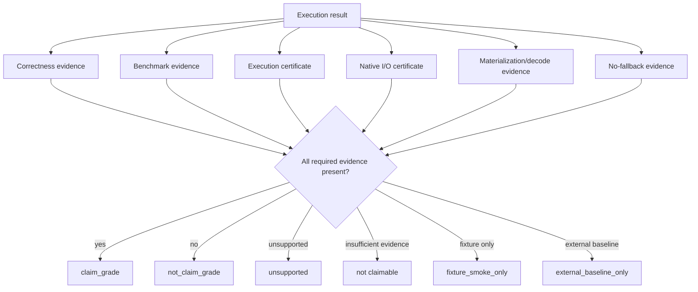

# ShardLoom Compute Engine Flow Reference

## Purpose

This document defines the high-level compute-engine flow ShardLoom is supposed to follow.

It is a reference for implementation, Codex agents, benchmarks, docs, and planned API/client
surfaces. It keeps ShardLoom from confusing these different things:

```text
one-shot compatibility query
ingest/stage workflow
prepared Vortex query
native Vortex query
benchmark baseline comparison
```

ShardLoom's core identity remains:

```text
Vortex-first
no external fallback
explicit execution mode
explicit materialization/decode boundaries
evidence-certified execution
claim-gated benchmark/reporting
```

The repo-alignment review and completed overhaul mapping live in:

```text
docs/architecture/compute-engine-flow-overhaul-review.md
```

## One-Sentence Vision

ShardLoom should let users run local and planned platform data workflows through explicit execution
modes, while proving what ran, what materialized, what stayed Vortex-native, what returned an
unsupported diagnostic, and whether any claim is allowed.

```text
User request
-> policy + capability admission
-> explicit execution mode
-> source/preparation boundary
-> ShardLoom/Vortex execution provider
-> result/result sink/downstream reference
-> certificates + evidence
-> claim gate
-> typed output for CLI / Python / REST/event surfaces / downstream consumers
```

## Top-Level Compute Engine Flow



This diagram is intentionally broader than the current implementation. Planned nodes must remain
unchecked in `docs/architecture/global-architecture-review.md` and represented in
`docs/architecture/phased-execution-plan.md` until implemented and certified. Current commands must
return deterministic unsupported diagnostics where execution is absent. Planned nodes do not
authorize fallback execution, dependency expansion, package publication, external side effects, or
public performance claims.

End-to-end contract:

- Every request binds source descriptors, policy, capability, semantic profile, execution mode,
  output intent, end-user access path, adapter surface, and downstream usage before execution.
- CLI access is the current canonical user and automation entrypoint. Wrappers and planned adapters
  must preserve the typed protocol instead of creating independent execution semantics.
- End-user and adapter surfaces may improve ergonomics, but they must not hide selected execution
  mode, unsupported diagnostics, materialization/decode boundaries, or claim-gate status.
- Every source path reports what was read, what decoded, what materialized, what stayed native, and
  which Native I/O certificate applies.
- Every sink path reports what was written, what replayed or verified, what materialized, what
  decoded, and whether the sink can support a claim.
- Downstream consumers, including adapters, notebooks, BI tools, orchestration tools, and governed
  platforms, read the typed output envelope or referenced artifacts. They do not imply a hidden
  execution mode, fallback engine, or unverified sink.
- Public claims are allowed only after the claim gate sees the required correctness, benchmark,
  execution-certificate, Native I/O, materialization/decode, policy, and no-fallback evidence.

## The Five Execution Modes

| Mode | What it means | Primary use | Vortex-native claim? | Claim posture |
| --- | --- | --- | --- | --- |
| `compatibility_import_certified` | Read compatibility input, import to Vortex, write/reopen/scan, compute, certify | Certified ingest/stage workflow | Partial/scoped | Can be claim-grade for ingest/stage workload |
| `prepared_vortex` | Prepare Vortex once, then run many queries/scenarios from prepared artifacts | Main performance comparison path | Yes, if evidence supports it | Preferred benchmark path |
| `native_vortex` | Existing `.vortex` input, Vortex-native scan/operator path | Cleanest native query path | Yes | Cleanest native-engine lane |
| `direct_compatibility_transient` | Read compatibility input and compute directly without persistent Vortex write/reopen | Small one-shot jobs, quick ETL | No | Not Vortex-native |
| `auto` | Transparent mode choice based on input/request/policy | User convenience | Depends on selected mode | Must report selected mode and reason |

## Mode 1 - `compatibility_import_certified`

This is the current ShardLoom certified ingest/stage shape.

```text
CSV / Parquet / JSONL / Arrow IPC / Avro / ORC
  -> compatibility source adapter
  -> NativeWorkStream
  -> Vortex import
  -> Vortex file write
  -> Vortex reopen
  -> Vortex scan
  -> ShardLoom temporary/current operator path
  -> optional result.vortex sink
  -> replay / verify
  -> execution certificate + Native I/O certificate + no-fallback evidence
```

Use this when the user wants certified ingest/stage workflow, Vortex artifact creation, Native I/O
evidence, result-sink replay proof, `fallback_attempted=false`, and
`external_engine_invoked=false`.

This mode is not the default pure query-speed benchmark path. It includes source read,
compatibility parsing, compatibility-to-Vortex import, Vortex write, Vortex reopen, Vortex scan,
operator compute, result-sink write if enabled, and evidence rendering.

Evidence posture:

```text
execution_mode=compatibility_import_certified
vortex_artifact_created=true
compatibility_import_included=true
vortex_write_reopen_included=true
native_io_certificate_required=true
vortex_native_claim_allowed=scoped
claim_gate_status=claim_grade | not_claim_grade
fallback_attempted=false
external_engine_invoked=false
```

## Mode 2 - `prepared_vortex`

This should become the primary ShardLoom performance comparison path.

```text
compatibility input
  -> prepare once
  -> Vortex artifact
  -> reuse prepared Vortex artifact across many scenarios
  -> Vortex scan / source-backed execution
  -> ShardLoom/Vortex-native operators
  -> optional result sink
  -> evidence + claim gate
```

This mode matches the ShardLoom thesis:

```text
data lives in Vortex
queries execute from Vortex
evidence proves what happened
```

Prepared Vortex mode must separate:

```text
preparation_millis
scenario_runtime_millis
operator_compute_millis
result_sink_write_millis
total_runtime_millis
```

Preparation timing is allowed, but it must not be mixed into pure query timing unless explicitly
requested.

Evidence posture:

```text
execution_mode=prepared_vortex
prepared_artifact_ref=...
prepared_artifact_digest=...
preparation_included_in_timing=false by default
computed_result_sink_requested=true|false
computed_result_sink_replay_verified=true|false
computed_result_sink_native_io_certificate_status=certified|none
result_sink_claim_gate_status=result_sink_replay_certified|not_claim_grade_missing_result_sink_evidence
vortex_native_claim_allowed=true if evidence supports it
native_io_certificate_required=true
fallback_attempted=false
external_engine_invoked=false
```

## Mode 3 - `native_vortex`

This is the cleanest native ShardLoom path.

```text
existing .vortex input
  -> Vortex source / scan / split
  -> Vortex-native or ShardLoom-native provider
  -> encoded/native operator path where supported
  -> result or result sink
  -> certificates + evidence
```

Use this when input already lives in Vortex, the user wants native Vortex execution, the benchmark is
comparing query/runtime behavior, and operator support exists or can return a deterministic
unsupported diagnostic.

Current native Vortex benchmark rows start from existing `.vortex` inputs, but they may still use
temporary ShardLoom operator paths until encoded/native operator coverage matures. A row is not an
encoded-native or fused-operator claim unless its representation-transition, materialization/decode,
provider-admission, and certificate evidence say so.

Native Vortex rows must not claim more than they prove:

```text
native Vortex scan evidence exists
operator support exists or deterministic unsupported diagnostic exists
representation transitions are visible
materialization/decode boundaries are visible
fallback_attempted=false
external_engine_invoked=false
```

Evidence posture:

```text
execution_mode=native_vortex
input_format=vortex
compatibility_import_included=false
vortex_write_reopen_included=false unless result sink enabled
computed_result_sink_write_micros=separate from operator timing when enabled
result_sink_claim_gate_status=result_sink_replay_certified|not_claim_grade_missing_result_sink_evidence
vortex_native_claim_allowed=true
claim_gate_status=fixture_smoke_only | claim_grade | not_claim_grade | unsupported
```

## Mode 4 - `direct_compatibility_transient`

This is the planned traditional-compute-like ShardLoom path. The current repo exposes the mode
vocabulary and deterministic unsupported/report-only capability rows, but it does not yet implement
a direct transient runtime path.

```text
CSV / Parquet / JSONL / etc.
  -> compatibility source adapter
  -> transient in-memory ShardLoom-native representation
  -> ShardLoom-native operator path
  -> result
  -> optional evidence
```

Once implemented, this mode is for small one-shot local jobs, developer quick checks, direct ETL,
and cases where Vortex persistence is not desired.

It must not pretend to be Vortex-native:

```text
vortex_native=false
vortex_artifact_created=false
native_vortex_claim_allowed=false
claim_gate_status=not_vortex_native
```

Evidence posture:

```text
execution_mode=direct_compatibility_transient
direct_transient_execution=true
compatibility_import_included=false
persistent_vortex_write=false
vortex_native_claim_allowed=false
fallback_attempted=false
external_engine_invoked=false
```

This mode may eventually be faster for small one-shot workloads, but it must not become a hidden
bypass around ShardLoom's evidence model. It is ShardLoom-native only if it is implemented by
ShardLoom code.

It is not allowed to call Spark, DataFusion, DuckDB, Polars, Dask, Ray, Trino, Velox, or external
SQL engines as runtime fallback.

## Mode 5 - `auto`

Auto mode is allowed only if it is transparent.

```text
user requests auto
  -> ShardLoom evaluates input + policy + workload
  -> ShardLoom selects explicit mode
  -> ShardLoom reports selected mode + reason
```

Examples:

```text
input already .vortex
-> selected_execution_mode=native_vortex
-> mode_selection_reason=input_already_vortex

compatibility input + user requested certification
-> selected_execution_mode=compatibility_import_certified
-> mode_selection_reason=certified_ingest_stage_requested

small compatibility input + no Vortex persistence requested
-> selected_execution_mode=direct_compatibility_transient
-> mode_selection_reason=small_one_shot_without_persistence

compatibility input + benchmark performance comparison requested
-> selected_execution_mode=prepared_vortex
-> mode_selection_reason=benchmark_reuses_prepared_vortex_artifact
```

Auto must never silently select an external fallback engine:

```text
fallback_attempted=false
external_engine_invoked=false
selected_execution_mode must be explicit
mode_selection_reason must be explicit
```

## Canonical End-To-End Flow



## Provider Admission Flow

```text
plan node
  -> Vortex-first provider check
  -> can upstream Vortex provide this natively?
     yes -> use_vortex_native_provider
     partially -> use provider + ShardLoom residual, or return residual unsupported diagnostic
     no -> implement_shardloom_kernel
     external integration only -> baseline_or_oracle_only
     insufficient evidence -> unsupported_until_vortex_or_shardloom_evidence
```

Provider classifications:

```text
use_vortex_native_provider
wrap_vortex_concept
implement_shardloom_kernel
baseline_or_oracle_only
unsupported_until_vortex_or_shardloom_evidence
```

Unsupported residuals must be executed by ShardLoom-native code or returned as deterministic
unsupported diagnostics. They must not be sent to external engines.

## Performance Attribution Flow

Every benchmark row should say exactly where time went.

```text
total_runtime_millis
  process_start_millis
  source_read_millis
  compatibility_parse_millis
  compatibility_to_vortex_import_millis
  vortex_write_millis
  vortex_reopen_millis
  vortex_scan_millis
  operator_compute_millis
  result_sink_write_millis
  evidence_render_millis
```

Interpretation:

```text
compatibility_import_certified = staging + query + evidence
prepared_vortex = preparation once + query many times
native_vortex = query over existing Vortex
direct_compatibility_transient = one-shot direct ShardLoom compute, not Vortex-native
```

## Benchmark Lanes

### Lane A - Compatibility Import Certified

```text
compatibility file -> Vortex import every measured scenario -> compute -> result sink/evidence
```

Use for ingest/stage certification, universal I/O proof, and result-sink proof. Do not use it as
the primary pure query-speed comparison.

### Lane B - Prepared Vortex

```text
compatibility file -> prepare Vortex once -> run many measured scenarios from prepared Vortex
```

Use for primary ShardLoom performance comparison, query-speed evaluation, and Vortex-native
workflow proof.

### Lane C - Native Vortex

```text
existing .vortex -> native scan/operator
```

Use for clean native runtime comparison, operator maturity tracking, and encoded/native execution
proof.

### Lane D - Direct Transient

```text
compatibility file -> direct ShardLoom-native transient compute
```

Use for small one-shot local workloads, traditional-compute-like UX, and quick developer paths.
Never claim Vortex-native, Native Vortex, or encoded-native unless a separate certificate explicitly
proves the relevant property.

### Lane E - Benchmark Baseline Comparison

```text
local comparison engine -> baseline timing/correctness row -> external_baseline_only coverage row
```

External engines remain baselines only. pandas, Polars, DuckDB, DataFusion, Spark, Dask, Velox,
Trino, Snowflake, Databricks, BigQuery, and similar systems may appear in comparison reports as
local or platform baselines, migration references, or oracle references. They must never execute
unsupported ShardLoom work as fallback, and their rows cannot satisfy ShardLoom-native,
Vortex-native, Native I/O, execution-certificate, or no-fallback claim gates.

## Claim Gate Flow



A ShardLoom timing row can be `claim_grade` only when it has:

```text
stable correctness digest
minimum iteration count
benchmark row ref
coverage row ref
execution certificate
Native I/O certificate when data is read or written
materialization/decode boundary evidence
fallback_attempted=false
external_engine_invoked=false
mode-specific evidence
```

## Source And Sink Flow

```text
Source
  -> SourceCapabilityReport
  -> SourcePushdownReport
  -> NativeWorkStream or Vortex Source/Split
  -> Execution provider
  -> NativeResultStream or result ref
  -> SinkRequirementReport
  -> AdapterFidelityReport
  -> MaterializationBoundaryReport
  -> NativeIoCertificate
```

Every source/sink path must say:

```text
what was read
what was written
what materialized
what decoded
what stayed native
what returned an unsupported diagnostic
what certificate proves it
```

## Materialization And Decode Flow

```text
encoded/native representation
  -> can operation run encoded?
     yes -> encoded/native execution
     no -> can ShardLoom materialize safely?
       yes -> explicit materialization boundary
       no -> unsupported/not claimable
```

Required fields:

```text
decoded=true|false
materialized=true|false
row_read=true|false
arrow_converted=true|false
materialization_boundary_ref
decode_boundary_ref
representation_transition_summary
```

## Native Vortex Optimization Target

The target flow is:

```text
Vortex artifact
  -> Vortex Source / Scan / Split
  -> field mask:
       filter columns
       output columns
  -> predicate pushdown
  -> projection pushdown
  -> encoded/native operator where supported
  -> fused filter/project/limit where supported
  -> result or result sink
  -> evidence
```

Optimization priorities:

```text
1. Prepared Vortex reuse.
2. Native Vortex taxonomy coverage.
3. Fused filter + projection + limit.
4. Multi-key group by.
5. Join + aggregate.
6. Top-N per group.
7. Row number window.
8. Source-backed Scan API path.
9. Layout advisor applying real write/layout choices.
10. Persistent in-process benchmark runner.
```

## What Codex Should Optimize Toward

Current state to improve:

```text
compatibility input
  -> import to Vortex every scenario
  -> write/reopen
  -> scan
  -> temporary materialized operator
  -> result sink/evidence
```

This is valid certification evidence, but not the desired primary performance path.

Target performance path:

```text
prepare Vortex once
  -> run many scenarios from prepared Vortex
  -> use native/encoded/fused operators where supported
  -> preserve evidence
  -> benchmark query/runtime separately from preparation
```

Target UX path:

```text
user picks mode explicitly
or
auto selects transparently
```

The output always says:

```text
requested_execution_mode
selected_execution_mode
mode_selection_reason
vortex_native_claim_allowed
compatibility_import_included
vortex_prepare_included
vortex_write_reopen_included
direct_transient_execution
fallback_attempted=false
external_engine_invoked=false
claim_gate_status
```

## What Should Never Happen

```text
Unsupported work silently runs through Spark.
Unsupported work silently runs through DataFusion.
Unsupported work silently runs through DuckDB.
Unsupported work silently runs through Polars.
Direct transient mode is reported as Vortex-native.
Compatibility import timing is reported as pure query timing.
Auto mode hides what it selected.
A fixture-smoke row becomes a public performance claim.
A benchmark row hides materialization/decode.
A result artifact is written without sink/replay evidence when certification requires it.
```

## Codex Anchor Prompt

Use this prompt when aligning to this flow:

```text
Use docs/architecture/compute-engine-flow-reference.md as the canonical ShardLoom compute-engine
flow.

Before changing execution, benchmark, source/sink, Vortex, or result behavior, classify the change
by execution mode:

- compatibility_import_certified
- prepared_vortex
- native_vortex
- direct_compatibility_transient
- auto

Do not create a hidden global fast-mode toggle. Every row/output must report
requested_execution_mode, selected_execution_mode, mode_selection_reason, Vortex-native claim
status, compatibility import status, materialization/decode status, certificates,
fallback_attempted=false, and external_engine_invoked=false.

Optimize toward prepared_vortex and native_vortex for performance comparisons. Preserve
compatibility_import_certified for certified ingest/stage workflows. Allow
direct_compatibility_transient only as a ShardLoom-native one-shot mode and never report it as
Vortex-native.

Unsupported work must return deterministic unsupported diagnostics, not delegate to external engines.
```

## Footer

This document is a flow reference only. It does not authorize new runtime behavior, package
publication, external engine invocation, fallback execution, or public performance claims.

Actionable implementation work must be represented in
`docs/architecture/phased-execution-plan.md` before implementation begins.
