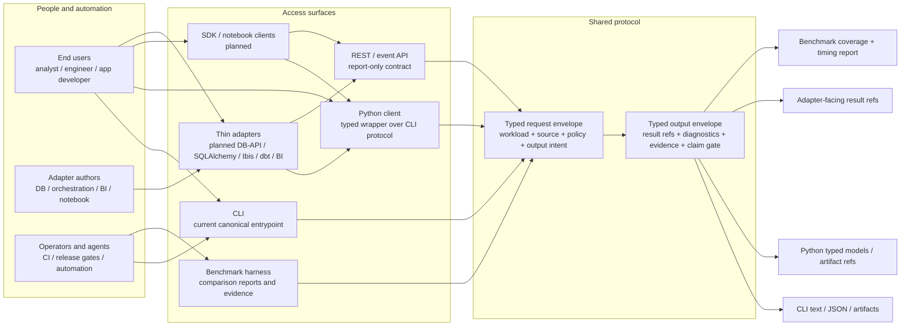
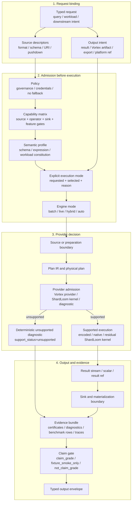
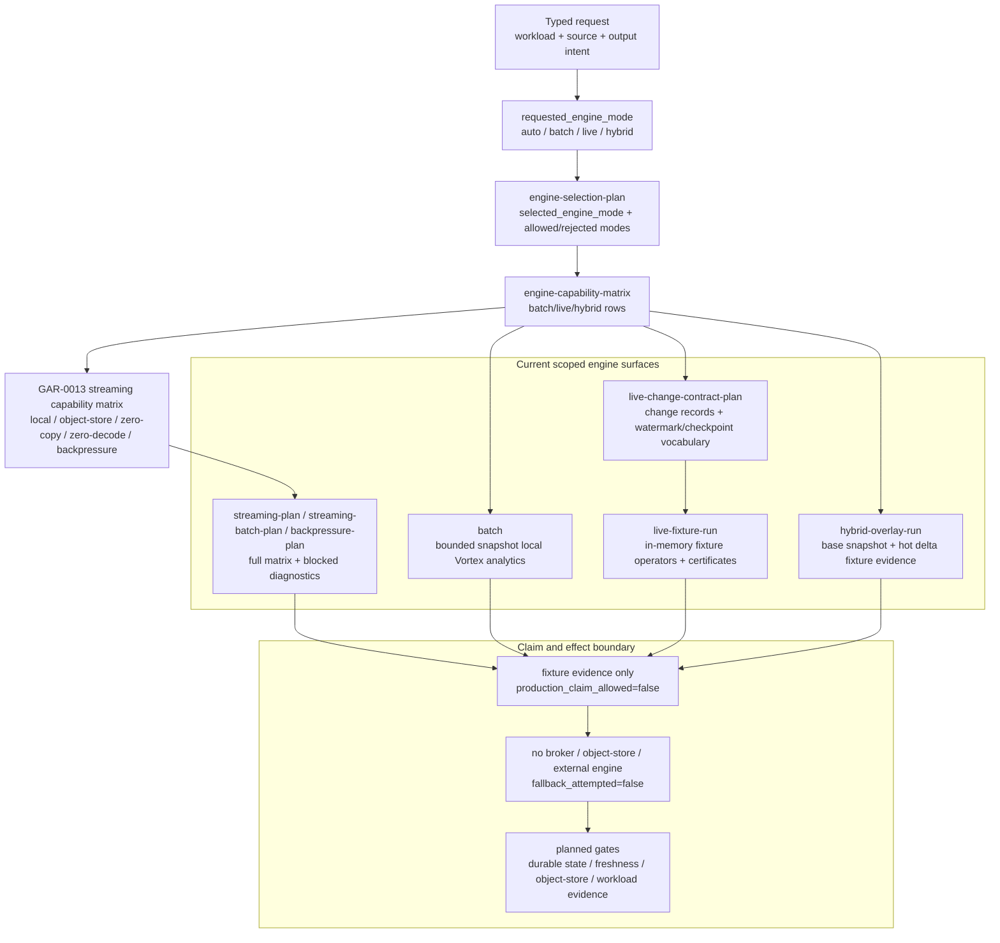
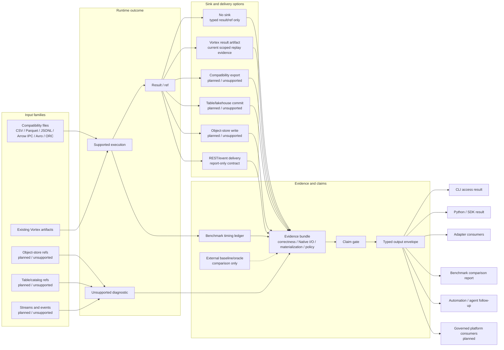
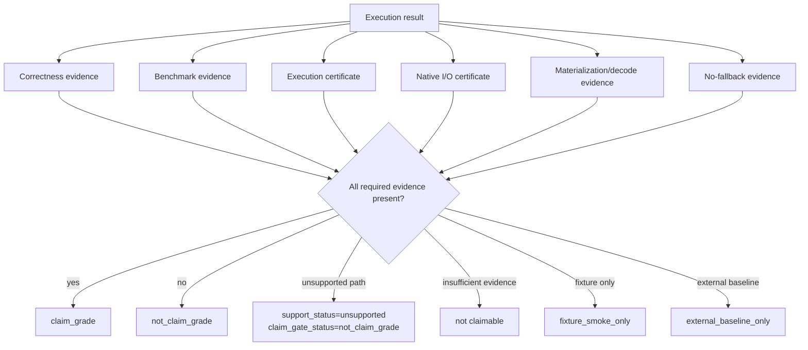

# ShardLoom Compute Engine Flow Reference

## Purpose

This document defines the high-level compute-engine flow ShardLoom is supposed to follow.

It is a reference for implementation, Codex agents, benchmarks, docs, and planned API/client
surfaces. It keeps ShardLoom from confusing these different things:

```text
one-shot compatibility query
ingest/stage workflow
prepared Vortex query
native Vortex query
batch/live/hybrid workload semantics
benchmark baseline comparison
```

ShardLoom's core identity remains:

```text
Vortex-first
no external fallback
explicit execution mode
explicit materialization/decode boundaries
evidence-certified execution
claim-gated benchmark/reporting
```

The repo-alignment review and completed overhaul mapping live in:

```text
docs/architecture/compute-engine-flow-overhaul-review.md
```

## One-Sentence Vision

ShardLoom should let users run local and planned platform data workflows through explicit execution
modes, while proving what ran, what materialized, what stayed Vortex-native, what returned an
unsupported diagnostic, and whether any claim is allowed.

```text
User request
-> policy + capability admission
-> explicit execution mode
-> explicit engine mode where the workload needs batch/live/hybrid semantics
-> source/preparation boundary
-> ShardLoom/Vortex execution provider
-> result/result sink/downstream reference
-> certificates + evidence
-> claim gate
-> typed output for CLI / Python / REST/event surfaces / downstream consumers
```

## How To Read The Flow

This reference uses layered Markdown diagrams rather than one all-purpose architecture picture.
The structure follows three documentation rules:

- Use GitHub-rendered Mermaid fenced code blocks so the diagram stays versioned beside the text
  ([GitHub Mermaid docs](https://docs.github.com/en/get-started/writing-on-github/working-with-advanced-formatting/creating-diagrams),
  [Mermaid flowchart syntax](https://mermaid.js.org/syntax/flowchart.html)).
- Keep abstraction levels separate, following the C4 idea that different diagrams answer different
  questions for different audiences ([C4 model](https://c4model.com/introduction)).
- Treat this file as explanation plus reference, not a tutorial or runbook
  ([Diataxis](https://diataxis.fr/)).

Read only as far as needed:

| View | Question answered | Primary audience | Stop here when |
| --- | --- | --- | --- |
| 1. Access and users | Who can enter ShardLoom, and what do they receive back? | End users, adapter authors, operators | You need product/API orientation. |
| 2. Runtime contract | What must happen before any supported work executes? | Implementers, reviewers, agents | You need invariant request-to-output behavior. |
| 3. Mode lanes | Which execution mode owns each source/preparation boundary? | Benchmark authors, runtime implementers | You need timing and mode interpretation. |
| 4. Engine fabric | Where do batch, live, and hybrid semantics fit? | Workflow/API implementers, platform integrators | You need workload semantics and live/hybrid boundaries. |
| 5. Evidence and downstream use | How do sinks, adapters, reports, and claims consume outputs? | Release reviewers, benchmark readers, platform integrators | You need claim and downstream boundaries. |

Diagram notation:

| Notation | Meaning |
| --- | --- |
| Solid arrow | Request, result, or evidence flow inside ShardLoom. |
| Dotted arrow | Comparison-only baseline/oracle path, never fallback execution. |
| `current` | Implemented surface or certified/scoped evidence exists. |
| `report-only` | Deterministic report/diagnostic exists, but no runtime behavior is claimed. |
| `planned` | Future surface that must remain unchecked in the phase plan until implemented. |
| `unsupported` | Deterministic unsupported diagnostic; `fallback_attempted=false`. |

## Current Runtime Snapshot

This table is the shortest current-state read of the diagrams below. It separates source/preparation
execution lanes from batch/live/hybrid workload semantics so readers do not infer a hidden runtime
or claim.

| Layer | Current repo state | Planned updates | Claim boundary |
| --- | --- | --- | --- |
| User access | CLI is the canonical entrypoint; Python wraps typed CLI envelopes; benchmark harness records comparison/evidence rows. REST/event surfaces and thin adapters are report-only or planned. | Keep adapters, REST/event contracts, and notebook/SDK surfaces aligned to the same typed envelope. | No adapter may hide selected modes, diagnostics, fallback status, materialization/decode fields, or claim gates. |
| Execution modes | `compatibility_import_certified`, `prepared_vortex`, `native_vortex`, `direct_compatibility_transient`, and `auto` are visible in reports. | Continue shifting performance work toward prepared/native Vortex paths while preserving compatibility certification. | `auto` is selection only; it must emit the selected mode and reason. |
| Prepared/native batch runtime | Scoped local paths for selective filter, wide projection, filter/project/limit, grouped aggregates, joins, distinct count, null-heavy aggregate, clean/cast/filter/write, malformed timestamp / dirty CSV, nested JSON field scan, CDC-overlay small change over large base, global sort/top-k, top-N, row-number, high-cardinality string group/distinct, and partition-pruning/date-range scans avoid full fact-table materialization in prepared/native rows. Prepared/native rows now emit explicit `source_backed_scan_*` evidence for local source roles, projected columns, residual executor, Native I/O certificate status, materialization boundary, and no-fallback status. Selective-filter rows also emit `encoded_predicate_provider_*` blockers so Vortex scan filter pushdown is not confused with an admitted encoded predicate provider. CPU specialization reports record side-effect-free host feature probes and a blocked filter/encoded vector-kernel admission diagnostic. | Next planned work is the reader-backed primitive selective-filter encoded predicate bridge, then evidence-gated provider/runtime expansion. | These paths are residual-native unless evidence says otherwise; they are not encoded-native, SQL/DataFrame, production, distributed sort, SIMD-dispatch, object-store pruning, layout/statistics pruning, broad CDC/table transactions, or broad performance claims. |
| Batch engine mode | Bounded/snapshot local Vortex analytics are the practical execution foundation. | Broader operator/source/sink coverage plus correctness and benchmark claim gates. | Batch support is scoped to evidence-backed workloads. |
| Live engine mode | `engine-selection-plan`, `engine-capability-matrix`, `live-change-contract-plan`, Python helpers, and in-memory `live-fixture-run` reports exist. | Durable state/checkpoints, broker/source adapters, freshness evidence, and workload certification. | Fixture evidence only; no production live claim. |
| Hybrid engine mode | `engine-selection-plan`, `engine-capability-matrix`, Python helpers, and in-memory `hybrid-overlay-run` reports exist. | Durable micro-segment flush, object-store/table commit, catalog snapshot discovery, and hot/cold benchmark evidence. | Fixture evidence only; no production hybrid, object-store, or table-commit claim. |
| Streaming/zero-copy/backpressure | `streaming-plan`, `streaming-batch-plan`, `backpressure-plan`, `engine-capability-matrix`, and `capabilities engines` now expose a GAR-0013 streaming capability matrix covering local fixture evidence, object-store streaming reads, zero-decode, zero-copy/materialization boundaries, bounded backpressure, and live/hybrid broker runtime. | Object-store streaming reads, durable broker adapters, runtime backpressure enforcement, broad operator/source/sink evidence, and workload certification. | Matrix rows are fixture-smoke or report-only unless explicitly blocked/materializing; broad streaming/runtime/object-store/broker claims remain not claim-grade. |

### View 1 - Access And Users

This view is the product/API map. Every entrypoint must preserve the same typed protocol; adapters
are allowed to improve ergonomics, not to create a hidden execution path.



### View 2 - Runtime Contract

This view is the invariant. A request reaches execution only after policy, capability, semantics,
and explicit mode selection. Unsupported work exits through diagnostics and evidence, not fallback.



### View 3 - Execution Mode Lanes

This view explains timing interpretation. `auto` is not a runtime engine; it selects and reports one
explicit mode. Compatibility lanes include ingest/stage/certification costs. Prepared/native lanes
are the intended query-runtime lanes when evidence supports them.


Mode timing fields must stay visible:

```text
source_read_millis
compatibility_parse_millis
compatibility_to_vortex_import_millis
vortex_write_millis
vortex_reopen_millis
vortex_scan_millis
operator_compute_millis
result_sink_write_millis
evidence_render_millis
total_runtime_millis
```

### View 4 - Engine Fabric Layer

Execution modes and engine modes answer different questions:

- Execution mode answers "what source/preparation lane did this run through?"
- Engine mode answers "what workload semantics did ShardLoom admit?"

The current repo has concrete engine-mode contracts and fixture evidence. It does not yet have
production broker-backed live execution, durable live state, object-store-backed hybrid execution, or
live/hybrid public claims.



Current engine-mode surfaces:

| Engine mode | Current surface | Current support | Claim boundary |
| --- | --- | --- | --- |
| `batch` | `engine-selection-plan`, `engine-capability-matrix`, local Vortex analytics paths | Partially supported for bounded snapshot workflows and scoped local Vortex benchmark/runtime evidence | Not a broad production or SQL/DataFrame claim. |
| `live` | `engine-selection-plan live ...`, `live-change-contract-plan`, `live-fixture-run` | Partially supported for in-memory fixture change streams with fixture freshness/state/execution/Native I/O certificates | No broker, durable state store, object-store I/O, or production live claim. |
| `hybrid` | `engine-selection-plan hybrid ...`, `hybrid-overlay-run` | Partially supported for in-memory base-plus-hot-delta fixture overlays with delta/freshness/execution/Native I/O certificate fields | No durable micro-segment writes, object-store commit, catalog snapshot discovery, or production hybrid claim. |
| `auto` | `engine-selection-plan` default selection | Transparent selector; defaults to `batch` for bounded snapshot workloads and must report selected/rejected modes | Not a hidden engine and never a fallback route. |
| `streaming capability` | `streaming-plan`, `streaming-batch-plan`, `backpressure-plan`, `engine-capability-matrix`, `capabilities engines` | Full GAR-0013 matrix exists; local count fixture and zero-decode rows are scoped fixture-smoke, while object-store streaming and broker-backed live/hybrid rows are blocked | No broad streaming runtime, object-store streaming read, broker-backed production, or zero-copy compatibility claim. |

These commands are side-effect controlled:

```text
engine-selection-plan: runtime_execution=false, data_read=false, write_io=false
engine-capability-matrix: runtime_execution=false, data_read=false, write_io=false
streaming capability matrix: runtime_execution=false, object_store_io=false, write_io=false
live-change-contract-plan: runtime_execution=false, data_read=false, write_io=false
live-fixture-run: scoped fixture runtime, data_read=false, write_io=false, broker_io=false
hybrid-overlay-run: scoped fixture runtime, data_read=false, write_io=false, object_store_io=false
```

Planned updates are carried in the phase plan, especially `GAR-0034-A` for live/hybrid fabric
blockers and freshness gates. Runtime-focused follow-through now shifts from the completed scoped
prepared/native benchmark paths and CPU admission diagnostics toward kernel/provider expansion,
source-backed API coverage, facade coverage, and other evidence-gated residual-native paths.

### View 5 - I/O, Evidence, And Downstream Use

This view connects runtime output to every consumer. Downstream users read typed outputs or
referenced artifacts; they do not imply a hidden execution mode, fallback engine, or unverified
sink.



These diagrams are intentionally broader than the current implementation. Planned nodes must remain
unchecked in `docs/architecture/global-architecture-review.md` and represented in
`docs/architecture/phased-execution-plan.md` until implemented and certified. Current commands must
return deterministic unsupported diagnostics where execution is absent. Planned nodes do not
authorize fallback execution, dependency expansion, package publication, external side effects, or
public performance claims.

End-to-end contract:

- Every request binds source descriptors, policy, capability, semantic profile, execution mode,
  engine mode where applicable, output intent, end-user access path, adapter surface, and downstream
  usage before execution.
- CLI access is the current canonical user and automation entrypoint. Wrappers and planned adapters
  must preserve the typed protocol instead of creating independent execution semantics.
- SQL/DataFrame access currently exposes a report-only planner-readiness matrix through
  `capabilities sql`, `capabilities dataframe`, and Python `CapabilityView` accessors. It names
  SQL parse/bind/plan/execute and DataFrame lazy-plan/expression/join/aggregate/window readiness
  rows, but it does not execute a parser, binder, planner, DataFrame runtime, or fallback engine.
- End-user and adapter surfaces may improve ergonomics, but they must not hide selected execution
  mode, unsupported diagnostics, materialization/decode boundaries, or claim-gate status.
- Every source path reports what was read, what decoded, what materialized, what stayed native, and
  which Native I/O certificate applies.
- Every sink path reports what was written, what replayed or verified, what materialized, what
  decoded, and whether the sink can support a claim.
- Downstream consumers, including adapters, notebooks, BI tools, orchestration tools, and governed
  platforms, read the typed output envelope or referenced artifacts. They do not imply a hidden
  execution mode, fallback engine, or unverified sink.
- Public claims are allowed only after the claim gate sees the required correctness, benchmark,
  execution-certificate, Native I/O, materialization/decode, policy, and no-fallback evidence.

## Execution Modes And Engine Modes

Execution modes are source/preparation/timing lanes. Engine modes are workload semantics. A single
request can therefore have both:

```text
selected_execution_mode=prepared_vortex
selected_engine_mode=batch
```

For scoped engine-fabric fixture commands, source/preparation execution mode may be absent because
the command is proving engine semantics rather than a compatibility/Vortex source lane:

```text
selected_engine_mode=live
execution_mode_fields=not_applicable_to_engine_fabric_fixture
```

The fields must not be collapsed. `auto` exists in both vocabularies, but in both cases it is only a
transparent selector and must report what it selected.

## The Five Execution Modes

| Mode | What it means | Primary use | Vortex-native claim? | Claim posture |
| --- | --- | --- | --- | --- |
| `compatibility_import_certified` | Read compatibility input, import to Vortex, write/reopen/scan, compute, certify | Certified ingest/stage workflow | Partial/scoped | Can be claim-grade for ingest/stage workload |
| `prepared_vortex` | Prepare Vortex once, then run many queries/scenarios from prepared artifacts | Main performance comparison path | Yes, if evidence supports it | Preferred benchmark path |
| `native_vortex` | Existing `.vortex` input, Vortex-native scan/operator path | Cleanest native query path | Yes | Cleanest native-engine lane |
| `direct_compatibility_transient` | Read compatibility input and compute directly without persistent Vortex write/reopen | Small one-shot jobs, quick ETL | No | Not Vortex-native |
| `auto` | Transparent mode choice based on input/request/policy | User convenience | Depends on selected mode | Must report selected mode and reason |

## Mode 1 - `compatibility_import_certified`

This is the current ShardLoom certified ingest/stage shape.

```text
CSV / Parquet / JSONL / Arrow IPC / Avro / ORC
  -> compatibility source adapter
  -> NativeWorkStream
  -> Vortex import
  -> Vortex file write
  -> Vortex reopen
  -> Vortex scan
  -> ShardLoom temporary/current operator path
  -> optional result.vortex sink
  -> replay / verify
  -> execution certificate + Native I/O certificate + no-fallback evidence
```

Use this when the user wants certified ingest/stage workflow, Vortex artifact creation, Native I/O
evidence, result-sink replay proof, `fallback_attempted=false`, and
`external_engine_invoked=false`.

This mode is not the default pure query-speed benchmark path. It includes source read,
compatibility parsing, compatibility-to-Vortex import, Vortex write, Vortex reopen, Vortex scan,
operator compute, result-sink write if enabled, and evidence rendering.

Evidence posture:

```text
execution_mode=compatibility_import_certified
vortex_artifact_created=true
compatibility_import_included=true
vortex_write_reopen_included=true
native_io_certificate_required=true
vortex_native_claim_allowed=scoped
claim_gate_status=claim_grade | not_claim_grade
fallback_attempted=false
external_engine_invoked=false
```

## Mode 2 - `prepared_vortex`

This should become the primary ShardLoom performance comparison path.

```text
compatibility input
  -> prepare once
  -> Vortex artifact
  -> reuse prepared Vortex artifact across many scenarios
  -> Vortex scan / source-backed execution
  -> ShardLoom/Vortex-native operators
  -> optional result sink
  -> evidence + claim gate
```

This mode matches the ShardLoom thesis:

```text
data lives in Vortex
queries execute from Vortex
evidence proves what happened
```

Prepared Vortex mode must separate:

```text
preparation_millis
scenario_runtime_millis
operator_compute_millis
result_sink_write_millis
total_runtime_millis
```

Preparation timing is allowed, but it must not be mixed into pure query timing unless explicitly
requested.

Evidence posture:

```text
execution_mode=prepared_vortex
prepared_artifact_ref=...
prepared_artifact_digest=...
preparation_included_in_timing=false by default
computed_result_sink_requested=true|false
computed_result_sink_replay_verified=true|false
computed_result_sink_native_io_certificate_status=certified|none
result_sink_claim_gate_status=result_sink_replay_certified|not_claim_grade_missing_result_sink_evidence
vortex_native_claim_allowed=true if evidence supports it
native_io_certificate_required=true
fallback_attempted=false
external_engine_invoked=false
```

Current selective-filter provider posture:

```text
source_backed_scan_provider_kind=vortex_file_projected_scan
source_backed_scan_projected_columns=metric
encoded_predicate_provider_status=blocked_until_reader_backed_encoded_predicate_evidence
encoded_predicate_provider_filter_only_columns=flag,value
encoded_predicate_provider_projected_output_columns=metric
encoded_predicate_provider_encoded_native_claim_allowed=false
encoded_predicate_provider_fallback_attempted=false
encoded_predicate_provider_external_engine_invoked=false
```

This records that the local Vortex scan path can request filter pushdown, but it is not yet an
admitted encoded predicate provider. The next runtime slice is the reader-backed primitive
selective-filter bridge that must prove encoded value batches, selection-vector evidence,
certificates, materialization/decode boundaries, and no-fallback policy before any encoded-native
predicate claim is allowed.

## Mode 3 - `native_vortex`

This is the cleanest native ShardLoom path.

```text
existing .vortex input
  -> Vortex source / scan / split
  -> Vortex-native or ShardLoom-native provider
  -> encoded/native operator path where supported
  -> result or result sink
  -> certificates + evidence
```

Use this when input already lives in Vortex, the user wants native Vortex execution, the benchmark is
comparing query/runtime behavior, and operator support exists or can return a deterministic
unsupported diagnostic.

Current native Vortex benchmark rows start from existing `.vortex` inputs, but they may still use
temporary ShardLoom operator paths until encoded/native operator coverage matures. A row is not an
encoded-native or fused-operator claim unless its representation-transition, materialization/decode,
provider-admission, and certificate evidence say so.

Native Vortex rows must not claim more than they prove:

```text
native Vortex scan evidence exists
operator support exists or deterministic unsupported diagnostic exists
representation transitions are visible
materialization/decode boundaries are visible
fallback_attempted=false
external_engine_invoked=false
```

Evidence posture:

```text
execution_mode=native_vortex
input_format=vortex
compatibility_import_included=false
vortex_write_reopen_included=false unless result sink enabled
computed_result_sink_write_micros=separate from operator timing when enabled
result_sink_claim_gate_status=result_sink_replay_certified|not_claim_grade_missing_result_sink_evidence
vortex_native_claim_allowed=true
claim_gate_status=fixture_smoke_only | claim_grade | not_claim_grade
```

## Mode 4 - `direct_compatibility_transient`

This is the traditional-compute-like ShardLoom path. The current repo has one scoped local CSV
selective-filter smoke path with execution-certificate evidence; adjacent formats, operators,
result sinks, SQL/DataFrame access, and broader transient runtime behavior still return
deterministic unsupported diagnostics.

SQL/DataFrame diagnostics for this mode are interpreted through the GAR-0001A-A planner-readiness
matrix. The matrix is `not_claim_grade`, preserves `fallback_attempted=false` and
`external_engine_invoked=false`, and cannot be used as evidence for SQL/DataFrame runtime support.

```text
CSV / Parquet / JSONL / etc.
  -> compatibility source adapter
  -> transient in-memory ShardLoom-native representation
  -> ShardLoom-native operator path
  -> result
  -> optional evidence
```

As it matures, this mode is for small one-shot local jobs, developer quick checks, direct ETL, and
cases where Vortex persistence is not desired.

It must not pretend to be Vortex-native:

```text
vortex_native=false
vortex_artifact_created=false
native_vortex_claim_allowed=false
claim_gate_status=not_vortex_native
```

Evidence posture:

```text
execution_mode=direct_compatibility_transient
direct_transient_execution=true
compatibility_import_included=false
persistent_vortex_write=false
vortex_native_claim_allowed=false
fallback_attempted=false
external_engine_invoked=false
```

This mode may eventually be faster for small one-shot workloads, but it must not become a hidden
bypass around ShardLoom's evidence model. It is ShardLoom-native only if it is implemented by
ShardLoom code.

It is not allowed to call Spark, DataFusion, DuckDB, Polars, Dask, Ray, Trino, Velox, or external
SQL engines as runtime fallback.

## Mode 5 - `auto`

Auto mode is allowed only if it is transparent.

```text
user requests auto
  -> ShardLoom evaluates input + policy + workload
  -> ShardLoom selects explicit mode
  -> ShardLoom reports selected mode + reason
```

Examples:

```text
input already .vortex
-> selected_execution_mode=native_vortex
-> mode_selection_reason=input_already_vortex

compatibility input + user requested certification
-> selected_execution_mode=compatibility_import_certified
-> mode_selection_reason=certified_ingest_stage_requested

small compatibility input + no Vortex persistence requested
-> selected_execution_mode=direct_compatibility_transient
-> mode_selection_reason=small_one_shot_without_persistence

compatibility input + benchmark performance comparison requested
-> selected_execution_mode=prepared_vortex
-> mode_selection_reason=benchmark_reuses_prepared_vortex_artifact
```

Auto must never silently select an external fallback engine:

```text
fallback_attempted=false
external_engine_invoked=false
selected_execution_mode must be explicit
mode_selection_reason must be explicit
```

## Engine Modes - Batch, Live, Hybrid, Auto

| Mode | What it means | Current repo state | Planned updates |
| --- | --- | --- | --- |
| `batch` | Finite workload over bounded or snapshot inputs. | Current local Vortex analytics foundation; prepared/native paths are being optimized scenario by scenario. | Broader operator coverage, source/sink certification, correctness/benchmark gates. |
| `live` | Continuous workload over change streams. | Engine selection, capability rows, live-change contract, and in-memory fixture execution/certificate reports exist. | Durable state/checkpoints, broker/source adapters, freshness evidence, workload certification. |
| `hybrid` | Cold/base snapshot plus hot delta overlay. | Engine selection, capability rows, and in-memory hybrid overlay fixture/certificate reports exist. | Durable micro-segment flush, object-store/table commit, catalog snapshot discovery, hot/cold benchmark evidence. |
| `auto` | Transparent engine selection from workload contract. | Selects or rejects with explicit allowed/rejected modes; no runtime, reads, writes, or fallback. | More precise selection once live/hybrid production gates exist. |

Engine-mode report fields must stay visible:

```text
requested_engine_mode
selected_engine_mode
allowed_engine_modes
rejected_engine_modes
boundedness
update_mode
output_mode
selection_status
runtime_execution
data_read
write_io
fallback_attempted=false
external_engine_invoked=false
```

Live and hybrid fixture reports may have `runtime_execution=true`, but only for scoped in-memory
fixtures. They must still report no external broker/object-store I/O and no fallback. Production
claims stay blocked until workload-scoped evidence exists.

Current CLI/Python-facing engine-mode surfaces:

```text
shardloom engine-selection-plan [auto|batch|live|hybrid] ...
shardloom engine-capability-matrix
shardloom live-change-contract-plan
shardloom live-fixture-run [filter|project|count|count-where|group-count] ...
shardloom hybrid-overlay-run [filter|project|count|count-where|group-count] ...
Python: Context(engine="batch|live|hybrid|auto") plus matching typed helper methods
```

## Canonical Stage Checklist

Use this checklist when reviewing a concrete command, benchmark row, adapter call, or future API
surface against the diagrams above.

| Stage | Required fact | Failure mode |
| --- | --- | --- |
| Request | `requested_execution_mode`, source descriptor, output intent, downstream intent | Reject or report unsupported before execution. |
| Policy | governance, credential, side-effect, and no-fallback policy | `fallback_attempted=false`; no external engine invocation. |
| Capability | source, operator, sink, and feature-gate support status | Deterministic diagnostic with missing evidence. |
| Semantics | schema, expression, workload constitution, profile | Deterministic diagnostic or not-claim-grade evidence. |
| Mode selection | `selected_execution_mode` and `mode_selection_reason` | `auto` cannot hide the selected mode. |
| Boundary | source/preparation/materialization/decode boundary | No native, performance, or sink claim without boundary evidence. |
| Provider admission | Vortex provider, ShardLoom kernel, or unsupported diagnostic | External systems remain baseline/oracle only. |
| Execution | encoded/native/residual/materialized class | Temporary/residual paths cannot claim encoded-native execution. |
| Sink | result/ref, Vortex artifact, export, commit, object-store write, REST/event delivery | Sink claim blocked until replay/fidelity evidence exists. |
| Evidence | correctness, benchmark, execution certificate, Native I/O, materialization/decode, policy | `claim_gate_status=not_claim_grade`. |
| Output | typed envelope for CLI, Python, adapters, benchmarks, REST/event contracts | Adapters must preserve mode, diagnostics, and claim fields. |

## Provider Admission Flow

```text
plan node
  -> Vortex-first provider check
  -> can upstream Vortex provide this natively?
     yes -> use_vortex_native_provider
     partially -> use provider + ShardLoom residual, or return residual unsupported diagnostic
     no -> implement_shardloom_kernel
     external integration only -> baseline_or_oracle_only
     insufficient evidence -> unsupported_until_vortex_or_shardloom_evidence
```

Provider classifications:

```text
use_vortex_native_provider
wrap_vortex_concept
implement_shardloom_kernel
baseline_or_oracle_only
unsupported_until_vortex_or_shardloom_evidence
```

Unsupported residuals must be executed by ShardLoom-native code or returned as deterministic
unsupported diagnostics. They must not be sent to external engines.

## Performance Attribution Flow

Every benchmark row should say exactly where time went.

```text
total_runtime_millis
  process_start_millis
  source_read_millis
  compatibility_parse_millis
  compatibility_to_vortex_import_millis
  vortex_write_millis
  vortex_reopen_millis
  vortex_scan_millis
  operator_compute_millis
  result_sink_write_millis
  evidence_render_millis
```

Interpretation:

```text
compatibility_import_certified = staging + query + evidence
prepared_vortex = preparation once + query many times
native_vortex = query over existing Vortex
direct_compatibility_transient = one-shot direct ShardLoom compute, not Vortex-native
batch = bounded/snapshot workload semantics
live = continuous/change-stream workload semantics
hybrid = base snapshot plus hot delta workload semantics
```

The benchmark artifact must also carry
`execution_mode_attribution_contract`, including the canonical mode vocabulary,
the required execution-mode fields, and the required stage timing fields. The
harness rejects rows that omit the contract fields. Unknown stage values stay
explicit as `null`, `n/a`, or `not_measured`; missing fields are not allowed.
Prepared/native rows must also carry an operator blocker matrix with
`operator_execution_class`, `operator_admission_status`, `operator_blocker_id`,
`operator_blocker_reason`, and `operator_encoded_native_claim_allowed` so
temporary or residual-native operators are never read as encoded-native
operator execution.
Native Vortex benchmark rows must additionally carry `native_vortex_admission_*`
fields that identify the exact admitted lane, provider kind/API surface,
certificate refs, materialization/decode refs, fallback status, and claim
boundary. Today that admits only `local_vortex_count_scalar`; downstream readers
must not infer universal native Vortex support from that row.

The artifact must also carry `persistent_runner_admission_gate`. Current rows
must keep `persistent_runner_status=process_per_scenario_attributed_not_reduced`
and the persistent-runner admission fields (`process_startup_attribution`,
`python_harness_overhead_status`, `cli_process_wall_millis`,
`python_harness_overhead_millis`, `startup_warmup_millis`,
`build_time_millis`, `build_time_excluded`, `preparation_millis`,
`preparation_cli_process_wall_millis`, and
`preparation_included_in_timing`). A future persistent runner is not admitted
unless it preserves typed envelopes, execution-mode evidence, Native I/O refs,
operator blocker fields, materialization/decode boundaries, result-sink replay
evidence, deterministic unsupported diagnostics, and no-fallback fields per run.

The artifact also carries `work_avoidance_evidence_schema`. ShardLoom rows must
report `measured`, `not_available`, `unsupported`, or `not_applicable` status
for rows avoided, segments pruned, bytes avoided, encoded-vector reuse, and
pushdown proof. `not_available` means unknown/not measured, not zero, and it
does not permit performance or optimization claims.

`auto` is selection vocabulary only. A row with `requested_execution_mode=auto`
must preserve `selected_execution_mode` and `mode_selection_reason` so downstream
readers can see the actual runtime path.

## Benchmark Lanes

### Lane A - Compatibility Import Certified

```text
compatibility file -> Vortex import every measured scenario -> compute -> result sink/evidence
```

Use for ingest/stage certification, universal I/O proof, and result-sink proof. Do not use it as
the primary pure query-speed comparison.

### Lane B - Prepared Vortex

```text
compatibility file -> prepare Vortex once -> run many measured scenarios from prepared Vortex
```

Use for primary ShardLoom performance comparison, query-speed evaluation, and Vortex-native
workflow proof.

### Lane C - Native Vortex

```text
existing .vortex -> native scan/operator
```

Use for clean native runtime comparison, operator maturity tracking, and encoded/native execution
proof.

### Lane D - Direct Transient

```text
compatibility file -> direct ShardLoom-native transient compute
```

Use for small one-shot local workloads, traditional-compute-like UX, and quick developer paths.
Never claim Vortex-native, Native Vortex, or encoded-native unless a separate certificate explicitly
proves the relevant property.

### Lane E - Benchmark Baseline Comparison

```text
local comparison engine -> baseline timing/correctness row -> external_baseline_only coverage row
```

External engines remain baselines only. pandas, Polars, DuckDB, DataFusion, Spark, Dask, Velox,
Trino, Snowflake, Databricks, BigQuery, and similar systems may appear in comparison reports as
local or platform baselines, migration references, or oracle references. They must never execute
unsupported ShardLoom work as fallback, and their rows cannot satisfy ShardLoom-native,
Vortex-native, Native I/O, execution-certificate, or no-fallback claim gates.

## Claim Gate Flow



A ShardLoom timing row can be `claim_grade` only when it has:

```text
stable correctness digest
minimum iteration count
benchmark row ref
coverage row ref
execution certificate
Native I/O certificate when data is read or written
materialization/decode boundary evidence
fallback_attempted=false
external_engine_invoked=false
mode-specific evidence
```

## Source And Sink Flow

```text
Source
  -> SourceCapabilityReport
  -> SourcePushdownReport
  -> NativeWorkStream or Vortex Source/Split
  -> Execution provider
  -> NativeResultStream or result ref
  -> SinkRequirementReport
  -> AdapterFidelityReport
  -> MaterializationBoundaryReport
  -> NativeIoCertificate
```

Every source/sink path must say:

```text
what was read
what was written
what materialized
what decoded
what stayed native
what returned an unsupported diagnostic
what certificate proves it
```

The report-only `native-io-envelope-plan` source/sink coverage matrix is the current RFC 0031
coverage reference. It enumerates local Vortex, compatibility import, object-store/range-read,
table/catalog, streaming, unstructured/media, and external-adapter source/sink families with:

```text
direction
support_status
native_io_certificate_refs
unsupported_diagnostic_code
blocker_id
required_future_evidence
claim_gate_status
fallback_attempted=false
external_engine_invoked=false
```

Benchmark coverage rows can point to this matrix through
`native_io_source_sink_coverage_ref`. That ref explains source/sink support posture; it does not
turn benchmark timing into object-store, table/catalog, streaming, external-adapter, or production
runtime evidence.

GAR-0042A adds a second Source/Split-specific admission reference:
`vortex_source_split_admission_ref`. That ref points to the `vortex-api-inventory` proof for the
scoped `local_vortex_file_scan_into_array_iter` fixture path. It records provider/version/API
surface, Source/Split refs, field-mask and predicate-ordering blockers, execution and Native I/O
refs, and no-fallback policy. It is not a generalized Source/Split runtime claim.

GAR-0003-A adds `vortex_segment_extraction_admission_ref`. That ref points to the
`vortex-api-inventory` sparse segment extraction admission report for `sparse_patch_fill`. It
records deterministic unsupported diagnostics, required correctness/execution/Native
I/O/materialization evidence, `claim_gate_status=not_claim_grade`, and no-fallback policy. It is not
a sparse extraction runtime claim, broad layout support claim, or production segment extraction
claim.

GAR-0003-B adds `materialization_policy_ref`. That ref points to the
`compute-capability-matrix` shared materialization/decode policy for encoded-native,
residual-native, materialized-temporary, and unsupported operator paths. It records
`data_decoded`, `data_materialized`, `stayed_encoded`, materialization-boundary requirements,
claim boundaries, and no-fallback policy. Materialized-temporary paths cannot satisfy
encoded-native claims.

GAR-0042B adds `vortex_layout_device_managed_boundary_ref`. That ref points to a
runtime-utilization boundary matrix for layout/write, device execution, object-store I/O, and
managed-platform comparison lanes. Those lanes stay `not_claim_grade`; managed platforms remain
comparison-only and cannot satisfy ShardLoom-native execution claims.

GAR-0001A-B adds `global_architecture_runtime_claim_gate_ref` through
`global-architecture-gate`. That gate aggregates distributed coordinator/worker/task execution,
object-store reads/writes/commits, and lakehouse/catalog/CDC/delete/tombstone runtime-claim
boundaries. It is `not_claim_grade`, side-effect-free, and required release/readiness evidence
before any distributed, object-store, or lakehouse runtime claim can be made.

## Materialization And Decode Flow

```text
encoded/native representation
  -> can operation run encoded?
     yes -> encoded/native execution
     no -> can ShardLoom materialize safely?
       yes -> explicit materialization boundary
       no -> unsupported/not claimable
```

Required fields:

```text
decoded=true|false
materialized=true|false
stayed_encoded=true|false
operator_execution_class=encoded_native|residual_native|materialized_temporary|unsupported
row_read=true|false
arrow_converted=true|false
materialization_boundary_ref
decode_boundary_ref
representation_transition_summary
materialization_policy_ref
```

## Native Vortex Optimization Target

The target flow is:

```text
Vortex artifact
  -> Vortex Source / Scan / Split
  -> field mask:
       filter columns
       output columns
  -> predicate pushdown
  -> projection pushdown
  -> encoded/native operator where supported
  -> fused filter/project/limit where supported
  -> result or result sink
  -> evidence
```

Optimization priorities:

```text
1. Prepared Vortex reuse.
2. Native Vortex taxonomy coverage.
3. Fused filter + projection + limit.
4. Single-key grouped aggregate.
5. Multi-key group by.
6. Hash join.
7. Join + aggregate.
8. Top-N per group.
9. Row number window.
10. High-cardinality string group/distinct.
11. Distinct-count projected scan.
12. Null-heavy aggregate projected scan.
13. Clean/cast/filter/write projected scan.
14. Malformed timestamp / dirty CSV projected scan.
15. Nested JSON field projected scan.
16. CDC overlay projected base/delta scan.
17. Partition-pruning/date-range streaming.
18. Global sort/top-k streaming.
19. Source-backed scan evidence for prepared/native rows.
20. Layout advisor applying real write/layout choices.
21. Persistent in-process benchmark runner.
```

Current scoped progress: `filter + projection + limit` has a prepared/native
residual-native fused scan path. It uses Vortex scan filter/projection pushdown
and bounded top-N state to avoid full fact-table materialization. `group by
aggregation` now also has a prepared/native residual-native scan path using
projection pushdown over `group_key`/`metric` and ShardLoom-native grouped
state. `multi-key group by` extends that path to composite `group_key`/`category`
residual state after projection pushdown over `group_key`/`category`/`metric`.
`hash join` now scans projected dimension and fact columns into bounded ShardLoom-native dimension
state plus residual grouped join output without full fact-table materialization.
`join + aggregate` now adds fact-side value filter pushdown and residual grouped
`(dim_label, category)` aggregation over projected fact/dimension scans without
full fact-table materialization.
`top-N per group` now scans projected `group_key`/`id`/`metric` columns into bounded
ShardLoom-native per-group ranking state without full fact-table materialization.
`sort and top-k` now scans projected `id`/`metric` columns into bounded ShardLoom-native global
top-k state without full fact-table materialization.
`row number window` uses the same projected scan boundary with bounded rank-1 per-group state
without full fact-table materialization.
`high-cardinality string group/distinct` now scans projected `category`/`metric` columns into
ShardLoom-native string grouping state without full fact-table materialization.
`distinct count` now scans only the projected `category` column into ShardLoom-native distinct state
without full fact-table materialization.
`null-heavy aggregate` now scans only projected `nullable_metric_00` values into ShardLoom-native
null-skipping aggregate state without full fact-table materialization.
`clean/cast/filter/write` now scans only projected `raw_event_time`, `dirty_numeric`, and
`dirty_flag` values into ShardLoom-native cleanup/filter/aggregate state without full fact-table
materialization.
`malformed timestamp / dirty CSV` now scans only projected `raw_event_time` and `dirty_numeric`
values into ShardLoom-native validation/parse/aggregate state without full fact-table
materialization.
`nested JSON field scan` now scans only projected `nested_payload` values into ShardLoom-native
generated-field extraction state without full fact-table materialization.
`small change over large base` now scans projected base `id`/`metric` values and CDC delta
`id`/`op`/`value`/`metric`/`effective_ts` values into ShardLoom-native overlay state without full
fact-table materialization. This is local benchmark CDC overlay evidence, not a broad
table-transaction, catalog, object-store, or delete/tombstone runtime claim.
`partition pruning` now scans projected `event_date`/`metric` columns with a Vortex date-range
filter and residual scalar aggregation without full fact-table materialization. This is local
date-range scan evidence, not an object-store partition-pruning, layout-pruning, or
statistics-pruning claim.
Prepared/native rows now expose a scoped `source_backed_scan_*` evidence block that records source
roles, source refs/digests, projected columns, provider scope, Native I/O certificate status,
materialization boundary rows, residual executor, and no-fallback/no-external-engine flags. This is
source-backed local scan evidence only; it is not a generalized Source API runtime, object-store
runtime, encoded-native operator claim, or performance claim.
None of these paths are encoded-native operator claims, and they still carry
`operator_encoded_native_claim_allowed=false`.
`cpu-specialization-plan` now records host CPU architecture/features through a side-effect-free
probe and emits a filter/encoded vector-kernel admission status. That admission remains blocked by
missing correctness and benchmark evidence; no SIMD dispatch, unsafe code, or performance claim is
enabled.

## What Codex Should Optimize Toward

Current state to improve:

```text
compatibility input
  -> import to Vortex every scenario
  -> write/reopen
  -> scan
  -> temporary materialized operator
  -> result sink/evidence
```

This is valid certification evidence, but not the desired primary performance path.

Target performance path:

```text
prepare Vortex once
  -> run many scenarios from prepared Vortex
  -> use native/encoded/fused operators where supported
  -> preserve evidence
  -> benchmark query/runtime separately from preparation
```

Target UX path:

```text
user picks mode explicitly
or
auto selects transparently
```

The output always says:

```text
requested_execution_mode
selected_execution_mode
mode_selection_reason
requested_engine_mode where applicable
selected_engine_mode where applicable
vortex_native_claim_allowed
compatibility_import_included
vortex_prepare_included
vortex_write_reopen_included
direct_transient_execution
fallback_attempted=false
external_engine_invoked=false
claim_gate_status
```

## What Should Never Happen

```text
Unsupported work silently runs through Spark.
Unsupported work silently runs through DataFusion.
Unsupported work silently runs through DuckDB.
Unsupported work silently runs through Polars.
Direct transient mode is reported as Vortex-native.
Compatibility import timing is reported as pure query timing.
Auto mode hides what it selected.
A fixture-smoke row becomes a public performance claim.
A benchmark row hides materialization/decode.
A result artifact is written without sink/replay evidence when certification requires it.
```

## Codex Anchor Prompt

Use this prompt when aligning to this flow:

```text
Use docs/architecture/compute-engine-flow-reference.md as the canonical ShardLoom compute-engine
flow.

Before changing execution, benchmark, source/sink, Vortex, or result behavior, classify the change
by execution mode:

- compatibility_import_certified
- prepared_vortex
- native_vortex
- direct_compatibility_transient
- auto

Also classify the workload by engine mode when batch/live/hybrid semantics are involved:

- batch
- live
- hybrid
- auto

Do not create a hidden global fast-mode toggle. Every row/output must report
requested_execution_mode, selected_execution_mode, mode_selection_reason, Vortex-native claim
status, compatibility import status, materialization/decode status, certificates,
fallback_attempted=false, and external_engine_invoked=false. Engine-fabric rows must additionally
report requested_engine_mode, selected_engine_mode, allowed/rejected modes, boundedness,
update_mode, output_mode, runtime_execution, data_read, and write_io.

Optimize toward prepared_vortex and native_vortex for performance comparisons. Preserve
compatibility_import_certified for certified ingest/stage workflows. Allow
direct_compatibility_transient only as a ShardLoom-native one-shot mode and never report it as
Vortex-native.

Unsupported work must return deterministic unsupported diagnostics, not delegate to external engines.
```

## Footer

This document is a flow reference only. It does not authorize new runtime behavior, package
publication, external engine invocation, fallback execution, or public performance claims.

Actionable implementation work must be represented in
`docs/architecture/phased-execution-plan.md` before implementation begins.
