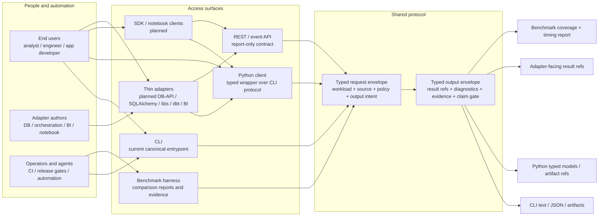
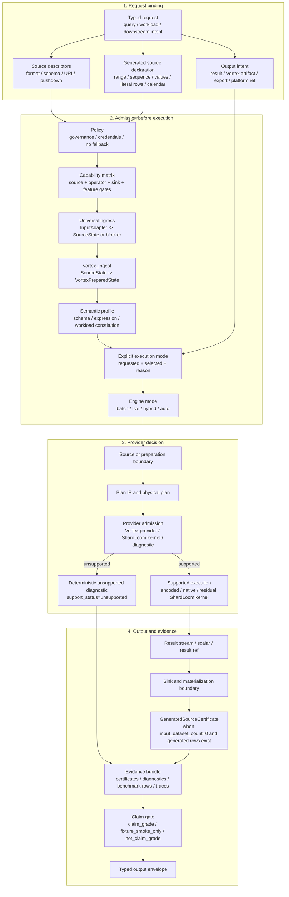
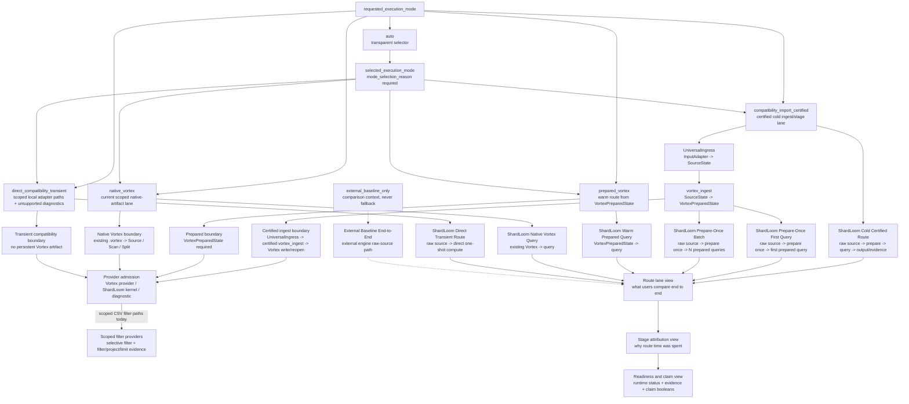
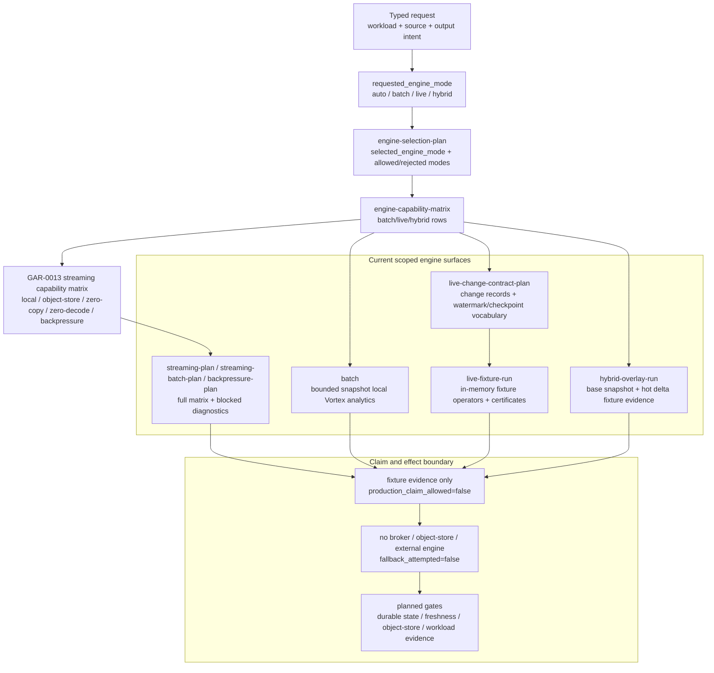
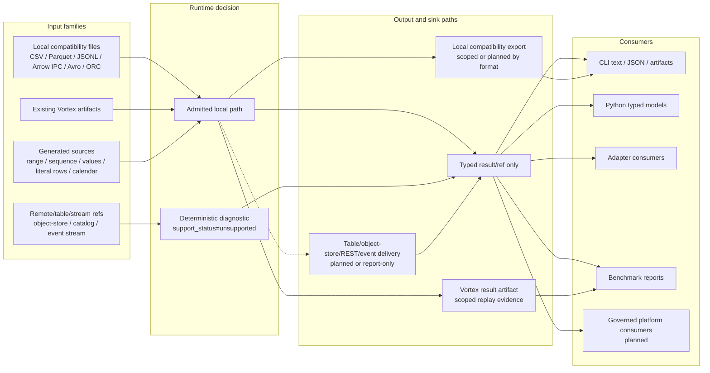
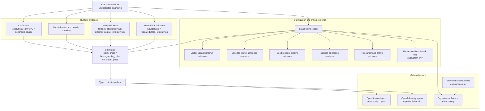
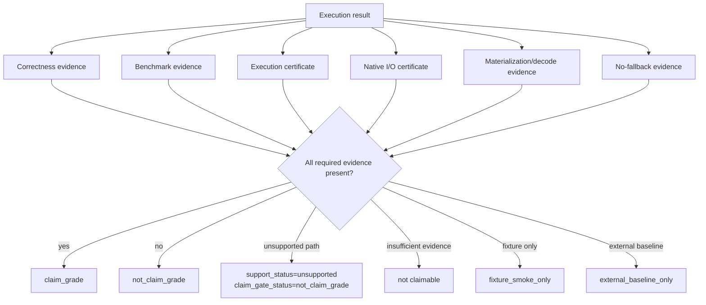

# ShardLoom Compute Engine Flow Reference

## Purpose

This document defines the high-level compute-engine flow ShardLoom is supposed to follow.

It is a reference for implementation, Codex agents, benchmarks, docs, and planned API/client
surfaces. It keeps ShardLoom from confusing these different things:

```text
one-shot compatibility query
ingest/stage workflow
prepared Vortex query
native Vortex query
batch/live/hybrid workload semantics
benchmark baseline comparison
```

ShardLoom's core identity remains:

```text
Vortex-first
no external fallback
explicit execution mode
explicit materialization/decode boundaries
evidence-certified execution
claim-gated benchmark/reporting
```

The repo-alignment review and completed overhaul mapping live in:

```text
docs/architecture/compute-engine-flow-overhaul-review.md
```

The website syncs this file through `website-src/scripts/sync-content.mjs` and renders it into
`website/compute-engine-flow/index.html` plus the legacy `website/compute-engine-flow.html`
compatibility page during `npm run build` from `website-src/`. Keep this Markdown document as the
canonical source; the generated page is a static publication surface for readers who need the same
flow outside GitHub.

## One-Sentence Vision

ShardLoom should let users run local and planned platform data workflows through explicit execution
modes, while proving what ran, what materialized, what stayed Vortex-native, what returned an
unsupported diagnostic, and whether any claim is allowed.

```text
User request
-> policy + capability admission
-> explicit execution mode
-> explicit engine mode where the workload needs batch/live/hybrid semantics
-> source/preparation boundary
-> ShardLoom/Vortex execution provider
-> result/result sink/downstream reference
-> certificates + evidence
-> claim gate
-> typed output for CLI / Python / REST/event surfaces / downstream consumers
```

## How To Read The Flow

This reference uses layered Markdown diagrams rather than one all-purpose architecture picture.
The structure follows three documentation rules:

- Use GitHub-rendered Mermaid fenced code blocks so the diagram stays versioned beside the text
  ([GitHub Mermaid docs](https://docs.github.com/en/get-started/writing-on-github/working-with-advanced-formatting/creating-diagrams),
  [Mermaid flowchart syntax](https://mermaid.js.org/syntax/flowchart.html)).
- Keep abstraction levels separate, following the C4 idea that different diagrams answer different
  questions for different audiences ([C4 model](https://c4model.com/introduction)).
- Treat this file as explanation plus reference, not a tutorial or runbook
  ([Diataxis](https://diataxis.fr/)).

Read only as far as needed:

| View | Question answered | Primary audience | Stop here when |
| --- | --- | --- | --- |
| 1. Access and users | Who can enter ShardLoom, and what do they receive back? | End users, adapter authors, operators | You need product/API orientation. |
| 2. Runtime contract | What must happen before any supported work executes? | Implementers, reviewers, agents | You need invariant request-to-output behavior. |
| 3. Mode lanes | Which execution mode owns each source/preparation boundary? | Benchmark authors, runtime implementers | You need timing and mode interpretation. |
| 4. Engine fabric | Where do batch, live, and hybrid semantics fit? | Workflow/API implementers, platform integrators | You need workload semantics and live/hybrid boundaries. |
| 5. I/O and downstream use | How do inputs, sinks, adapters, and consumers connect? | End users, adapter authors, platform integrators | You need source, sink, and delivery boundaries. |
| 6. Evidence and claims | Which evidence feeds observability, benchmark reports, and claim gates? | Release reviewers, benchmark readers, implementers | You need claim and evidence boundaries. |

Diagram notation:

| Notation | Meaning |
| --- | --- |
| Solid arrow | Request, result, or evidence flow inside ShardLoom. |
| Dotted arrow | Comparison-only baseline/oracle path, never fallback execution. |
| `current` | Implemented surface or certified/scoped evidence exists. |
| `report-only` | Deterministic report/diagnostic exists, but no runtime behavior is claimed. |
| `planned` | Future surface that must remain unchecked in the phase plan until implemented. |
| `unsupported` | Deterministic unsupported diagnostic; `fallback_attempted=false`. |

## Human-Readable Mental Model

For a non-expert reader, the whole flow should reduce to one question:

```text
Can ShardLoom admit this request, run it through a visible mode, and prove what happened?
```

Users normally think in workflow terms:

```text
Python / SQL / CLI
-> read or generate data
-> transform or query
-> write one or more outputs
```

ShardLoom records the engine route separately:

```text
front door
-> source route
-> ingress route
-> preparation route
-> execution route
-> output route
-> evidence route
```

The front door is how the user expresses work. Python, SQL, CLI, adapters, and future
DataFrame/API surfaces are front doors; they are not execution routes. The route is selected from
the source type, preparation policy, execution mode, output sink, and evidence level, then reported
back in the typed output envelope.

For the common non-Vortex local-file workflow, the intended steady-state route is:

```text
local non-Vortex input
-> UniversalIngress / InputAdapter
-> SourceState
-> vortex_ingest
-> VortexPreparedState
-> prepared_vortex execution
-> ExecutionPlan
-> OutputPlan
-> SinkArtifact + evidence
```

`prepared_vortex` starts at `VortexPreparedState`; it does not read local CSV, Parquet, JSONL,
database rows, object-store objects, or generated rows directly. Those sources become eligible for
prepared execution only after `UniversalIngress` admits them and `vortex_ingest` creates the
prepared state.

`compatibility_import_certified` uses the same `UniversalIngress` and `vortex_ingest` machinery, but
it is the certified cold route: source read, parse/decode, Vortex ingest, Vortex write/reopen, scan,
operator work, output/replay, certificates, and claim-gate evidence are all part of the row.

Cold-lane improvement work is tracked separately from warm query optimization. `GAR-IOREUSE-1H`
through `GAR-IOREUSE-1L` plus adjacent `GAR-PERF-2J` / `GAR-PERF-2K` now cover cold-lane
attribution, Vortex-native source/sink/split preparation, differential preparation, capillary I/O
with PulseWeave control, scout ingress, layout/write advice, and cold-lane copy/buffer evidence on
the existing `vortex_ingest` route. The flow must keep cold costs visible instead of treating them
as query compute or hiding them behind `auto`.

For source-free workflows, the route is:

```text
generated source
-> GeneratedSourceCertificate
-> optional Vortex/prepared execution
-> OutputPlan
-> SinkArtifact + evidence
```

The answer is carried through the same route model whether the user entered through CLI, Python,
benchmarks, an adapter, or a future API surface.

```mermaid
flowchart LR
    ACCESS["1. Access<br/>CLI / Python / benchmark / adapter"]
    REQUEST["2. Typed request<br/>workload + source + output intent"]
    ADMISSION["3. Admission<br/>policy + capability + semantics"]
    MODE["4. Explicit modes<br/>execution mode + engine mode"]
    PROVIDER["5. Provider path<br/>Vortex / ShardLoom kernel / diagnostic"]
    OUTPUT["6. Output path<br/>result ref / sink artifact / unsupported status"]
    EVIDENCE["7. Evidence and claim gate<br/>certificates + no-fallback + claim status"]

    ACCESS --> REQUEST --> ADMISSION --> MODE --> PROVIDER --> OUTPUT --> EVIDENCE
```



Keep these labels separate:

| Label | Answers | Examples | Must not imply |
| --- | --- | --- | --- |
| Execution mode | Which source/preparation lane ran? | `compatibility_import_certified`, `prepared_vortex`, `native_vortex`, `direct_compatibility_transient`, `auto` | Performance, production, SQL/DataFrame, or object-store support. |
| Engine mode | What workload semantics were admitted? | `batch`, `live`, `hybrid`, `auto` | Hidden fallback, broker-backed live runtime, or production hybrid support. |
| Evidence level | How much proof was emitted? | `minimal_runtime`, `certified`, `full_replay` | A faster mode or a claim-grade result by itself. |
| Scale class | What resource envelope was proven? | `local_smoke`, `local_claim_grade`, planned split/object-store/distributed classes | Literal any-volume support or Spark-displacement support. |

Use friendlier route labels in user-facing prose while keeping the canonical fields in evidence:

| Canonical field/value | User-facing label | Use when | Timing means | Must not imply |
| --- | --- | --- | --- | --- |
| `compatibility_import_certified` | Certified cold route | The user wants proof of local ingest, Vortex staging, sink, replay, and evidence. | End-to-end source read, parse, Vortex ingest/write/reopen/scan, operator work, sink, and evidence. | Pure query-speed timing or performance superiority. |
| `vortex_ingest` | Vortex ingest / prepare once route | An admitted non-Vortex `SourceState` should become a reusable `VortexPreparedState`. | Source admission, parse/decode planning, Vortex preparation/write/reopen verification when measured. | Query execution or claim-grade compute by itself. |
| `prepared_vortex` | Prepared warm route | A `VortexPreparedState` already exists and the request executes from it. | Warm query, output, and evidence timing after preparation. | Direct non-Vortex source reading, broad SQL/DataFrame support, or object-store/table runtime. |
| `native_vortex` | Already-Vortex route | Input already exists as a Vortex artifact. | Native/prepared scan plus admitted operator, output, and evidence timing. | Universal encoded-native operator coverage. |
| `direct_compatibility_transient` | Direct one-shot route | Quick local work without persistent Vortex staging. | Source read/parse plus ShardLoom-native compute and optional output. | Vortex-native execution or hidden fallback. |
| Generated-source reports | Source-free generated-output route | No input dataset exists and ShardLoom generates rows. | Generation plus output write and evidence; source-read timing is zero. | No-dataset smoke, SQL/DataFrame breadth, or object-store/Foundry output support. |
| Output/fanout reports | Multi-output fanout route | One admitted source/result needs multiple local outputs. | Query/reuse timing, `ResultBatchState` creation, sink-driven OutputPlan requirements, shared fanout conversion, output capillary admission, per-output planning, write, replay, and evidence. | Object-store/table commit, broad nested writer fidelity, production sink support, or a performance claim by itself. |

Route lanes and stage pieces are separate views:

```text
Route lanes = what users compare end to end.
Stage pieces = why a route took that time.
```

The public route lane roster is:

| Public lane | Start state | Includes preparation? | Comparable to raw-source external baselines? | Claim boundary |
| --- | --- | --- | --- | --- |
| ShardLoom Cold Certified Route | Raw compatibility source | Yes, plus certification evidence | Yes, with cold-route scope visible | Ingest/stage, query, output, and evidence for the measured local route. |
| ShardLoom Prepare-Once First Query | Raw compatibility source | Yes, once | Yes | Primary non-Vortex user route: prepare once, run first prepared query, emit output/evidence. |
| ShardLoom Prepare-Once Batch | Raw compatibility source | Once per batch | Yes, with amortization count visible | Reuse route: prepare once, run multiple prepared scenarios in one process. |
| ShardLoom Warm Prepared Query | `VortexPreparedState` | No | No | Runtime query slice after preparation exists. |
| ShardLoom Native Vortex Query | Existing Vortex artifact | No | No, unless external baselines also start from Vortex | Native-input route and operator maturity evidence. |
| ShardLoom Direct Transient Route | Raw compatibility source | No persistent Vortex preparation | Limited to its direct one-shot scope | Quick local route without Vortex-native persistence. |
| External Baseline End-to-End | External engine raw-source path | Not applicable | Baseline context only | Never fallback evidence for ShardLoom. |

Every public row should expose route readiness separately from evidence and claim posture:

```text
route_runtime_status=scoped_runtime_supported|smoke_supported|feature_gated|blocked|unsupported|external_baseline_only
claim_gate_status=claim_grade|not_claim_grade|fixture_smoke_only|external_baseline_only
performance_claim_allowed=false
production_claim_allowed=false
spark_replacement_claim_allowed=false
```

`claim_grade` means the row's evidence package is strong enough for its scoped claim. It does not
mean production support, speed superiority, broad SQL/DataFrame support, or Spark-displacement.

## UniversalIngress And `vortex_ingest`

The architecture must not model `prepared_vortex` as a second reader for normal files. The reader
layer is `UniversalIngress`; the preparation layer is `vortex_ingest`; the execution layer is
`prepared_vortex`.

```text
Any admitted non-Vortex source
-> UniversalIngress / InputAdapter
-> SourceState
-> vortex_ingest
-> VortexPreparedState
-> prepared_vortex
-> OutputPlan
-> SinkArtifact / evidence
```

The companion route taxonomy lives at:

```text
docs/architecture/universal-ingress-route-taxonomy.md
docs/architecture/universal-ingress-route-taxonomy.json
```

It projects the potential source universe into route status fields:

```text
source_kind
source_format
source_adapter_id
source_adapter_status
source_adapter_blocker_id
ingress_route
ingress_route_label
ingress_status
ingress_certification_level
vortex_ingest_performed
vortex_ingest_status
vortex_ingest_blocker_id
prepared_state_id
prepared_state_digest
prepared_state_created
prepared_state_reused
prepared_state_reuse_hit
execution_mode
selected_execution_mode
execution_route_label
timing_scope
certification_policy
certification_status
certification_blocker_id
output_route
output_format
output_plan_id
output_plan_status
claim_gate_status
fallback_attempted=false
external_engine_invoked=false
```

Both `vortex_ingest` and `compatibility_import_certified` must recognize the same potential
non-Vortex input universe. Recognized does not mean runtime-supported; unsupported inputs must
return deterministic blocker IDs instead of disappearing from route matrices.

`compatibility_import_certified` may still block when `vortex_ingest` can run if certification
evidence is incomplete. That is a claim/evidence blocker, not a different input universe.

Current scoped runtime surface:

```powershell
cargo run -q -p shardloom-cli --features vortex-write -- vortex-ingest-smoke <local-source.csv|json|jsonl> <target.vortex> --allow-overwrite --certification-level ingest_certified --format json
```

From Python, the same local preparation shape is exposed as
`ctx.read_csv(...).prepare_vortex(workspace=...)`,
`ctx.from_rows(...).prepare_vortex(workspace=...)`, `ctx.prepare_vortex(...)`, and
`ShardLoomClient.vortex_ingest_smoke(...)`. Compatibility-file preparation calls
`vortex-ingest-smoke`; generated-source preparation calls the generated-source Vortex writer and
surfaces prepared-state creation/reuse-boundary fields on `GeneratedSourceWriteReport`. The command
is feature-gated because it writes through upstream Vortex APIs. Default builds return a
deterministic feature-gate blocker with
`source_io_performed=false`, `vortex_ingest_performed=false`, `prepared_state_created=false`,
`fallback_attempted=false`, and `external_engine_invoked=false`. The admitted feature-gated path is
a local flat non-null int/uint/float/UTF-8/date32/timestamp fixture smoke only. Certification depth
is explicit: `ingest_minimal` records artifact bytes/digest and writer evidence without reopen
verification, `ingest_certified` reopens/scans for row-count proof, and `ingest_full_replay` fails
closed until a workflow supplies downstream output replay evidence. This is not broad Vortex writer
support, object-store/table output support, or a performance claim.

## Current Runtime Snapshot

This table is the detailed current-state ledger behind the diagrams. Skim the `Layer` column first;
read a row only when you need its exact support boundary. It separates source/preparation execution
lanes from batch/live/hybrid workload semantics so readers do not infer a hidden runtime or claim.

| Layer | Current repo state | Planned updates | Claim boundary |
| --- | --- | --- | --- |
| User access | CLI is the canonical entrypoint; Python wraps typed CLI envelopes; benchmark harness records comparison/evidence rows. REST/event surfaces expose checked-in OpenAPI/AsyncAPI and GAR-0035-A runtime-unsupported contract rows. | Keep adapters, REST/event contracts, and notebook/SDK surfaces aligned to the same typed envelope. | No adapter may hide selected modes, diagnostics, fallback status, materialization/decode fields, or claim gates. REST does not imply an HTTP listener, remote execution, Flight/ADBC, broker runtime, dependency-expanded server, or production API claim. |
| Adoption and commercial readiness | Source-local dry-run proof, first-10-minutes docs, website/status, package-channel matrix, enterprise evidence export pack, Foundry dev-stack starter, workflow recipe library, and public-preview posture exist, but public package publication and production platform proofs are incomplete. | GAR-COMMERCIAL-1 turns local proof, package channels, buyer-facing status, evidence export, Foundry starter, and recipes into claim-safe adoption surfaces. | Adoption surfaces reduce evaluation friction only; they do not authorize production, package release, performance, Spark-replacement, SQL/DataFrame, object-store/lakehouse, or Foundry claims. |
| Universal compatibility coverage | `docs/architecture/universal-compatibility-coverage-scoreboard.md` and `docs/architecture/universal-compatibility-coverage-scoreboard.json` now provide a capability map for local files, Vortex, generated/source-free outputs, Python rows/DataFrame, SQL literals/VALUES, databases, warehouses, object stores, table formats, REST/Flight/ADBC, and Foundry. `docs/architecture/universal-ingress-route-taxonomy.md` and `.json` project the same source universe into `UniversalIngress`, `vortex_ingest`, and `compatibility_import_certified` status rows so sources do not appear in one route and disappear from another. GAR-COMPAT-1B adds a compatibility-level `shardloom.universal_compatibility.generated_output_contract.v1` projection for no-dataset smoke, scoped Python generated-output smokes, local-output-only posture, SQL/DataFrame report-only rows, and Foundry/object-store blockers. GAR-COMPAT-1C adds `shardloom.universal_compatibility.object_store_admission_ladder.v1` for S3/GCS/ADLS URI parse, credential policy, public read, authenticated read, byte-range read, full-file read, local cache, write staging, and commit protocol admission status. GAR-COMPAT-1D adds `shardloom.universal_compatibility.table_format_boundary_matrix.v1` for Iceberg/Delta/Hudi metadata, scan, snapshot/time-travel, partition evolution, delete/tombstone, append, merge/update/delete, commit, rollback, catalog, and object-store coupling boundaries. GAR-COMPAT-1E adds `shardloom.universal_compatibility.database_warehouse_boundary_matrix.v1` for SQLite, Postgres, MySQL, JDBC/ODBC, Snowflake, BigQuery, and Databricks SQL import/export/query-pushdown boundaries; the only admitted database fixture is local SQLite named-table import/export through `sqlite-local-import-export-smoke`. | Future GAR-COMPAT follow-through now moves to runtime-specific connector evidence only through scoped later slices. Future adapter work must preserve the route projection: non-Vortex sources enter prepared execution only through `vortex_ingest` and `VortexPreparedState`; SQLite currently remains blocked from that route rather than becoming a standalone prepared lane. | Compatibility coverage is a capability map, not a production, performance, Spark-replacement, object-store/lakehouse, Foundry, SQL/DataFrame, network database/warehouse connector, or package-readiness claim. Route recognition is not runtime support. |
| I/O reuse and cross-format fanout | Prepared/native rows reuse selected source metadata and scenario-family source-state. GAR-IOREUSE-1A adds a universal local SourceState benchmark/report contract for source discovery/schema identity/fingerprints/parse-plan posture across CSV, JSONL, Parquet, Arrow IPC, Avro, and ORC rows. GAR-IOREUSE-1B adds a VortexPreparedState benchmark/report contract for prepared artifact refs/digests, preparation timing separation, source-state linkage, and scoped reuse posture. The feature-gated `vortex-ingest-smoke` / `ctx.prepare_vortex(...)` path now writes admitted local flat non-null boolean/int/uint/float/UTF-8/date32/timestamp rows to a local `.vortex` artifact, reopens/scans it for row-count proof, and emits SourceState/VortexPreparedState refs/digests with no-fallback evidence. When built with `vortex-write` plus `universal-format-io`, flat scalar Parquet/Arrow IPC/Avro/ORC `vortex_ingest` inputs preserve Arrow `RecordBatch` columnar SourceState through prepare-once and report `source_state_columnar_preserved`, record-batch count, `source_to_columnar_millis`, and `vortex_array_build_millis` before writing the prepared artifact. GAR-IOREUSE-1C adds an OutputPlan benchmark/report contract for scoped local Vortex result-sink planning, metadata preservation posture, write/replay refs, and sink artifact identity. GAR-IOREUSE-1D adds report-only fanout benchmark rows for required cross-format cases. GAR-IOREUSE-1E adds cache invalidation/fingerprint rows for current local source/prepared/plan/output posture. GAR-IOREUSE-1F adds evidence-safe reuse-level rows and a reuse-level matrix. GAR-RUNTIME-IMPL-5P promotes the Foundry dev-stack proof to local-style generated-output fanout plus staged-input transform evidence with local result/evidence dataset-shaped outputs. Scoped local-source SQL/Python and source-free generated-output paths now accept repeated `--fanout-output format=local-path` targets, and Python query-builder/generated workflows expose `.fanout(...)` for admitted local JSONL/CSV and feature-gated flat scalar Parquet/Arrow IPC/Avro/ORC/Vortex sinks with OutputPlan digests, sink-driven materialization/required-column/statistics/text-boundary/blocker fields, shared fanout conversion DAG evidence, output capillary status/window/sink-pressure/memory-pressure/PulseWeave policy fields, per-output bytes, digests, certificates, local replay status/timing, scoped fidelity/loss reporting, workspace path-safety, commit-mode, and no-fallback evidence. Python `ShardLoomSession` can reuse admitted local query-builder and session-bound SQL workflow collect/write/fanout reports when statement, source fingerprints, and output artifact fingerprints still match. Persistent cross-process OutputPlan reuse, broad metadata fidelity, real Foundry output APIs, object-store/table sinks, and claim-grade output/replay evidence remain planned in their owning queues. | GAR-IOREUSE-1 follow-through now moves to broader VortexPreparedState/session reuse, persistent OutputPlan/cache promotion, object-store/table/real-Foundry sink proof, and claim-grade output/replay evidence only through later scoped slices. | Input and output formats remain decoupled. The current local `vortex_ingest` route is runtime-supported for admitted flat local file schemas under its feature gates; SourceState, VortexPreparedState, OutputPlan, fanout matrix, cache invalidation evidence, reuse-level evidence, scoped local compatibility/generated fanout, output capillary scheduling evidence, and local Foundry-style generated/staged proof are not persistent cache support, performance claims, object-store/lakehouse support, Foundry production support, or broad output-fidelity claims by themselves. |
| Source-free generated output | No-input smoke/capability behavior exists, benchmark synthetic fixtures exist, `shardloom.generated_source_certificate_contract.v1` exposes the case split, and scoped generated-output runtime can write local JSONL/CSV for `generated-source-user-rows-smoke`, `generated-source-range-smoke`, `generated-source-sequence-smoke`, `generated-source-sql-smoke`, Python `ctx.from_rows([...]).write(...)`, `ctx.literal_table([...]).write(...)`, `ctx.calendar(...).write(...)`, `ctx.range(...).write(...)`, `ctx.sequence(...).write(...)`, `ctx.sql_values(...).write(...)`, `ctx.sql_literal_select(...).write(...)`, `ctx.sql("SELECT * FROM generate_series/range(...)").write(...)`, and scoped `ctx.sql("SELECT value AS id, value + 1 AS next FROM range(...)").write(...)` source-free range projections. Feature-gated generated-source Vortex output is also exposed as `prepare_vortex(workspace=...)` on generated rows/range/sequence/SQL helpers, returning `GeneratedSourceWriteReport` with `prepared_state_created`, artifact-adjacent reuse scope/reason/digest/invalidation evidence, no-fallback evidence, upstream Vortex write/reopen evidence on misses, and manifest-hit reuse on repeated compatible caller-owned local `.vortex` targets. User route capability reports project the generated Vortex-output path as `GeneratedSourceState -> VortexPreparedState` and expose the artifact-adjacent reuse manifest contract. GAR-COMPAT-1B projects those rows into compatibility/status surfaces, GAR-NOVEL-1A adds `shardloom.generated_source_evidence_alignment.v1` for lineage/telemetry/confidence/Foundry refs, and GAR-RUNTIME-IMPL-5P uses the scoped generated-output route inside the local Foundry-style dev-stack proof. Broad DataFrame execution, object-store writes, real Foundry generated-output runtime, arbitrary SQL table functions, and synthetic profiles remain unsupported/report-only. | GAR-GEN follow-through now moves to generated-source benchmark/public row promotion, broader SQL/DataFrame generated-source runtime, other engine-native generator nodes, and broader output evidence through later scoped runtime slices; GAR-NOVEL-1B/C/D keep lineage, telemetry, and confidence as separate report-only follow-through slices. | No source Native I/O certificate is claimed when no source dataset is read. Current generated-output runtime is fixture-smoke-only and local-output-only; generated-source Vortex preparation is a scoped local prepared artifact plus artifact-adjacent manifest reuse proof, not broad source-free runtime, object-store/lakehouse, real Foundry runtime, broad SQL/DataFrame, performance, package, or production claim. |
| Evidence exports and confidence | Evidence artifacts, protocol parity rows, internal timing fields, the GAR-NOVEL-1A generated-source evidence alignment report, `shardloom.openlineage_facet_mapping.v1`, `shardloom.opentelemetry_trace_export_contract.v1`, `shardloom.enterprise_evidence_export_pack.v1`, the GAR-PERF-1D report-only Bayesian performance/layout advisor contract, and `shardloom.traditional_analytics.bayesian_claim_confidence.v1` exist. OpenLineage custom facets and OpenTelemetry span placeholders are mapped but not emitted; the enterprise export pack is opt-in/local-first/report-only; Bayesian posterior claim-confidence is report-only/not-fit. | Future work fits posterior models and wires uncertainty blockers into release claim gates without enabling runtime decisions. Future evidence export implementation must stay opt-in, local-only by default, and redacted unless a separate backend/export gate lands. | OpenLineage mapping, telemetry export, enterprise export packs, and confidence surfaces cannot upgrade runtime support, production readiness, performance, lineage/telemetry backend support, or claim status. |
| Execution modes | `compatibility_import_certified`, `prepared_vortex`, `native_vortex`, `direct_compatibility_transient`, and `auto` are visible in reports. `prepared_vortex` means execution from `VortexPreparedState`, not direct non-Vortex source reads. The scoped `vortex_ingest` runtime command creates a local `VortexPreparedState` artifact before any warm prepared query timing, and `traditional-analytics-prepare-batch-run` now combines that local preparation with a prepared Vortex batch in one CLI process while keeping preparation timing separate. | Continue shifting performance work toward broader `vortex_ingest` plus prepared/native Vortex query paths while preserving compatibility certification. | `auto` is selection only; it must emit the selected mode and reason. Prepared/native labels cannot hide source admission, preparation, materialization/decode, or certification boundaries. Current `vortex_ingest` and prepare/batch evidence are scoped local workflow evidence, not a persistent cache, production runtime, or performance claim. |
| Runtime evidence level | `traditional-analytics-vortex-batch-run` now emits first-class evidence-level fields with the values `minimal_runtime`, `certified`, and `full_replay` beside execution mode for scoped prepared/native local artifacts. `minimal_runtime` blocks result-sink replay and reports `claim_gate_status=not_claim_grade`; `certified` emits normal certificate-bearing evidence without replay by default; `full_replay` requires result-sink replay proof. | Continue propagating the contract into future Python/API capability views and broader execution envelopes only where evidence exists. Later slices can add runtime-light benchmark lanes and policy views without hidden fast modes. | Every evidence level keeps `fallback_attempted=false`, `external_engine_invoked=false`, source/output digest status, and claim boundaries visible. Evidence level explains proof depth; it is not execution mode, performance evidence, SQL/DataFrame support, object-store/lakehouse support, Foundry support, or production readiness. |
| Scale claim gate | GAR-SCALE-1A adds `scale_contract_schema_version=shardloom.traditional_analytics.scale_claim_gate.v1` plus scale profile/status, volume, split, memory, spill, shuffle, retry, commit, platform, no-fallback, and claim-boundary fields. GAR-SCALE-1B adds `split_manifest_contract_schema_version=shardloom.traditional_analytics.split_manifest.v1` plus split planning fields. GAR-SCALE-1C adds `memory_spill_contract_schema_version=shardloom.traditional_analytics.memory_spill_backpressure.v1` plus memory/spill/backpressure fields. GAR-SCALE-1D adds `shuffle_contract_schema_version=shardloom.traditional_analytics.shuffle_repartition.v1` plus shuffle/repartition fields. GAR-SCALE-1E adds `object_table_ladder_schema_version=shardloom.traditional_analytics.object_table_scale_ladder.v1` plus object-store/table ladder fields. GAR-SCALE-1F adds `distributed_protocol_schema_version=shardloom.traditional_analytics.distributed_protocol.v1` plus coordinator, worker, task lease, task attempt, split, retry, fragment, merge, no-fallback, and `distributed_claim_gate_status=not_distributed_runtime_grade` fields. GAR-SCALE-1G adds `scale_benchmark_profile_schema_version=shardloom.traditional_analytics.scale_benchmark_profile.v1` plus profile registry, profile status, synthetic metadata, real-input-byte, correctness, no-fallback, and leaderboard-separation fields. GAR-SCALE-1H adds `schema_version=shardloom.foundry_scale_proof_boundary.v1` to the local Foundry proof report with Foundry runtime/compute/Spark, input/output dataset count, staged input bytes, execution mode, split, memory, evidence dataset, no-fallback, and public claim fields. Current ShardLoom rows are restricted to `local_smoke` or `local_claim_grade` and report `scale_claim_gate_status=not_scale_grade`. | Future runtime slices can promote only scoped scale classes with real workload bytes, correctness proof, no-fallback evidence, and relevant runtime gates. | Scale, SplitManifest, memory/spill, shuffle, object-store/table ladder, distributed protocol, scale benchmark profile, and Foundry scale proof fields are fail-closed. They do not authorize literal any-volume support, Spark-replacement, larger-than-memory execution, runtime spill, backpressure runtime, split-parallel runtime, distributed shuffle, object-store/table runtime, object-store write/commit, table commit, distributed runtime, remote workers, Foundry production support, managed-platform proof, public leaderboard placement, or performance/superiority claims. |
| Evidence-aware logical optimizer | `optimizer-plan`, Python typed accessors, and benchmark row contracts now expose a report-only optimizer rule registry and trace for predicate/projection/slice pushdown, common subplan/source-state reuse, expression simplification, constant folding, type coercion, join ordering, and cardinality estimation. No runtime rewrite is applied. | Future slices can promote individual rules only with before/after plan digests, correctness smoke, materialization/decode proof, no-fallback evidence, and claim gates. | Optimizer trace evidence is classification/explainability evidence only. It is not Polars/DataFusion parity, broad SQL/DataFrame runtime, performance evidence, or an applied-rewrite claim. |
| Expression and operator semantics baseline | `shardloom-core` exposes `shardloom.expression_semantics.v1`, `shardloom.projection_semantics.v1`, `shardloom.filter_semantics.v1`, and `shardloom.limit_semantics.v1` for scoped in-memory row evaluation. The admitted baseline covers literals, column references, aliases, casts/try-casts including scoped scalar-to-binary casts, boolean `AND`/`OR`/`NOT`, `IS NULL`, `IS NOT NULL`, comparisons including bytewise binary equality/inequality, projection, filter selection, limit row-count semantics, UTF-8 string predicates/functions including scoped regex match, null coalesce/nullif/CASE, Date32 and UTC timestamp parsing/extract/arithmetic/difference including scoped interval literals inside temporal helper functions, scalar and row-value literal IN semantics, bounded scalar and row-value local-source IN-subquery semantics, scoped correlated `outer.<column>` local-source scalar/row-value IN, EXISTS, and quantified subquery filters, nested scalar IN-subquery materialization, joined and grouped/HAVING projected scalar/row-value/EXISTS/quantified subquery semantics, correlated joined and grouped/HAVING projected scalar/row-value/EXISTS/quantified subquery semantics, scoped local-source EXISTS predicate semantics, scoped local-source quantified ANY/ALL predicate semantics, HAVING-level local-source EXISTS/quantified subquery semantics, scoped SQL `UNION` / `UNION ALL` composition over admitted branch SELECTs, grouped/distinct/HAVING aggregate semantics, join/window fixture semantics, scoped binary hex/text literal projection, scoped binary cast projection/predicate, source-column helper projection semantics, and scoped ARRAY literal/STRUCT source-column projection semantics, and deterministic unsupported diagnostics with explicit null/type behavior. Scoped decimal precision/scale casts, mixed-scale add/subtract/multiply projections, mixed-scale decimal/integer comparisons, and exact fixed-scale decimal division are admitted separately; advanced scalar blockers remain explicit for non-exact decimal division, broad ANSI decimal coercion, exponent notation, decimal/float comparison, typed decimal sinks, non-UTC/offset timestamp literals, timezone database conversion, arbitrary interval arithmetic outside scoped temporal helpers, locale-aware collation, broad binary source dtype decoding, and binary ordering; complex dtype blockers are explicit for list/struct accessors, equality, casts, nested source decoding, variant, union dtype, parent/child null policy, schema field identity, and flat nested sink persistence beyond scoped JSONL/result-boundary complex projections; advanced subquery blockers are explicit for scalar-left multi-column IN-subquery, unbound qualified references, or otherwise non-admitted broad ANSI subquery shapes; scoped source-qualified local subquery references, scoped local-source EXISTS, scoped quantified ANY/ALL predicates, HAVING-level local-source EXISTS/quantified subqueries, scoped correlated `outer.<column>` subquery filters, and scoped UTF-8 `RLIKE` / `REGEXP` / `REGEXP_LIKE` predicates are admitted separately. | Next slices broaden only the remaining split follow-up family: broad encoded-kernel/operator coverage. | This is a ShardLoom-native semantics contract and fixture/runtime building block, not broad SQL/DataFrame support, not blanket encoded-native operator coverage, not non-exact decimal division/broad ANSI decimal coercion/exponent notation/decimal-float comparison/typed decimal sink/arbitrary-interval/timezone/collation/broad list/struct/variant/union-dtype/broad-binary-source admission, not binary ordering, not locale-aware regex/collation parity, not broad ANSI subquery parity, not a production claim, and not performance evidence. Rows keep `fallback_attempted=false`, `external_engine_invoked=false`, and `claim_gate_status=not_claim_grade`. |
| SQL local-source smoke | `sql-local-source-smoke` admits local CSV/JSONL/flat JSON plus feature-gated flat scalar Parquet/Arrow IPC/Avro/ORC direct-transient projection/optional-filter/limit, row-level `SELECT DISTINCT` over bounded projection, aggregate/HAVING, window, and join output rows with dedupe-before-limit evidence, scalar aggregate, multi-key group-by aggregate, post-aggregate `HAVING` filters over emitted aggregate output rows or admitted unprojected aggregate functions, multi-key scalar `ORDER BY ... LIMIT ...` top-N over projection rows, aggregate output aliases, and group keys, scoped `CAST(column AS dtype)` predicates for `int64`, `float64`, `utf8`, `boolean`, and `date32`, bounded `column [NOT] IN (<literal>,...)` predicates over local rows, scoped row-value literal `(<column>,...) [NOT] IN ((...),...)` predicates, scoped local `column [NOT] IN (SELECT <column> FROM '<local-source>' [WHERE <predicate>] [ORDER BY <column>] [LIMIT <n>])` predicates over bounded local scalar sources, scoped projected local `column IN (SELECT <column> FROM <local-source> JOIN <local-source> ...)`, `column IN (SELECT <column> FROM <local-source> GROUP BY ... HAVING ...)`, and projected `EXISTS (...)` predicates over joined or grouped/HAVING local-source plans through the same join/group/HAVING evaluator, scoped correlated joined and grouped/HAVING projected scalar/row-value/EXISTS/quantified subqueries when admitted `outer.<column>` comparisons are carried in the projected local-source plan, scoped local `(<column>,...) [NOT] IN (SELECT <column>,... FROM '<local-source>' [WHERE <predicate>] [ORDER BY <column>] [LIMIT <n>])` predicates over bounded local row-value sources, scoped correlated `outer.<column>` subquery filters for scalar `IN`, row-value `IN`, `EXISTS`, and quantified `ANY` / `ALL`, scoped source-qualified local subquery selected/filter/order refs for explicit `AS` aliases or SQL-identifier file stems, scoped local `EXISTS (SELECT <projection> FROM '<local-source>' [WHERE <predicate>] [ORDER BY <column>] [LIMIT <n>])` and `NOT EXISTS` predicates over bounded local sources, scoped local `<column> <comparison> ANY|ALL (SELECT <column> FROM '<local-source>' [WHERE <predicate>] [ORDER BY <column>] [LIMIT <n>])` predicates over bounded local scalar sources, boolean truth predicates (`WHERE <column>`, `<column> IS TRUE`, `<column> IS FALSE`, `<column> IS NOT TRUE`, `<column> IS NOT FALSE`, and logical `NOT <column>`) with scoped SQL boolean/null semantics, direct SQL `column [NOT] BETWEEN <lower> AND <upper>` predicates lowered to ShardLoom-native comparison/logical predicates for scalar, `DATE`, and `TIMESTAMP` literal bounds, scoped numeric `ABS`, `FLOOR`, `CEIL`, and `ROUND` predicates/projections, scoped UTC timestamp second arithmetic predicates/projections, generalized local numeric expression-tree predicates/projections over admitted numeric columns and finite numeric literals, scoped UTF-8 `LOWER`/`UPPER`/`TRIM` transform predicates, scoped UTF-8 `CONCAT`/`SUBSTR`/`REPLACE` predicates/projections, scoped `LIKE` / `NOT LIKE` string predicates including single-character `ESCAPE` clauses, and explicit single- or multi-key local-source inner equi-joins, left/right/full outer equi-joins, left semi/anti equi-joins, cross joins, scoped expression-condition joins, plus scoped scalar/grouped join aggregates over admitted local formats. The aggregate slices cover `COUNT(*)`, `COUNT(column)`, `COUNT(DISTINCT column)`, `SUM`, `AVG`, `MIN`, and `MAX` across all rows or after the same scoped `WHERE` predicate, with optional aggregate `AS` aliases and optional `HAVING` predicates bound to aggregate output aliases, selected group keys, admitted unprojected aggregate functions evaluated as hidden HAVING-only columns, or bounded local scalar IN, EXISTS, and quantified subqueries over aggregate output rows. Execution certificate refs, source certificate refs, materialization boundaries, pushdown status, route fields, and claim-gate reasons are source-format-aware: CSV rows use `sql-local-source.csv.*`, flat JSON rows use `sql-local-source.json.*` plus `local_json_row_materialization_to_expression_semantics`, JSONL/NDJSON rows use `sql-local-source.jsonl.*` plus `local_jsonl_row_materialization_to_expression_semantics`, admitted Parquet rows use `sql-local-source.parquet.*` plus `local_parquet_row_materialization_to_expression_semantics`, admitted Arrow IPC rows use `sql-local-source.arrow_ipc.*` plus `local_arrow_ipc_row_materialization_to_expression_semantics`, admitted Avro rows use `sql-local-source.avro.*` plus `local_avro_row_materialization_to_expression_semantics`, and admitted ORC rows use `sql-local-source.orc.*` plus `local_orc_row_materialization_to_expression_semantics`; default builds return deterministic Parquet/Arrow IPC/Avro/ORC adapter/sink blockers unless `shardloom-cli` is built with `--features universal-format-io`. SourceState evidence uses `shardloom.local_source_state.v1`, requested/materialized/read-projection columns, pruning status, and `source_state_projection_pushdown_status`; CSV/JSON/JSONL perform parser-level column pruning, while feature-gated Parquet/Arrow IPC/Avro/ORC push projection into the underlying reader before scalar-row conversion, with Avro `COUNT(*)` using a one-column reader anchor to preserve row counts. No-filter rows emit `filter_runtime_execution=false`, `predicate_operator_family=none`, and non-filter execution certificate suffixes such as `projection-limit`. Distinct output rows emit `distinct_projection_runtime_execution=true`, output-column, input/output-row-count, dedupe-before-limit, and null-semantics evidence across projection, aggregate/HAVING, window, and join routes; broader non-admitted DISTINCT shapes remain deterministic blockers. The aggregate paths emit `aggregate_runtime_execution=true`, `aggregate_output_columns`, `aggregate_alias_runtime_execution`, and `aggregate_aliases`; the group-by path also emits `group_by_runtime_execution=true`, `group_by_key_arity`, and `group_by_multi_key_runtime_execution`; the HAVING path emits `having_runtime_execution=true`, `having_operator_family`, `having_source_column`, `having_input_row_count`, `having_selected_row_count`, `having_aggregate_runtime_execution`, `having_aggregate_function`, and `having_aggregate_output_column`, and certificate/statement suffixes append `having`; the top-N path emits sort key, direction, null-ordering blocker policy, and `top_n_runtime_execution=true` evidence; the cast path emits `predicate_operator_family=cast`, `cast_runtime_execution=true`, `cast_source_column`, and `cast_target_dtype` evidence when a predicate is present; numeric ABS rows emit `numeric_abs_*` evidence; numeric rounding rows emit `numeric_rounding_*` and `numeric_rounding_projection_*` evidence; UTC timestamp second arithmetic rows emit `timestamp_arithmetic_*` and `timestamp_arithmetic_projection_*` evidence; generic expression predicate rows emit `generic_expression_predicate_*` evidence including source-column groups, operator-family groups, binary-operator count, and comparison operators; generic expression projection rows emit `generic_expression_projection_*` evidence including source columns, output columns, operator families, and binary-operator count; the string-transform path emits `predicate_operator_family=string_transform`, `string_transform_runtime_execution=true`, `string_transform_operator`, and `string_transform_source_column`; the string-function path emits `predicate_operator_family=string_function`, `string_function_runtime_execution=true`, `string_function_operator`, source-column/literal-count/RHS-dtype evidence, and `string_function_projection_*` evidence for computed projections; the string-predicate path emits `string_predicate_runtime_execution`, `string_predicate_operator`, and `string_predicate_like_escape_*` evidence when an admitted `ESCAPE` clause is present; the boolean truth path emits `boolean_predicate_runtime_execution=true`, operator/source-column fields, and `boolean_predicate_null_semantics=sql_where_true_only_null_filters_out|sql_boolean_is_not_true_false_null_matches`; the `IN` / `NOT IN` path emits `in_predicate_runtime_execution=true`, `in_list_value_count`, and SQL three-valued null-semantics fields; row-value literal and row-value subquery predicates also emit `row_value_in_predicate_runtime_execution`, `row_value_in_source_columns`, `row_value_in_column_groups`, `row_value_in_tuple_count`, and `row_value_in_null_semantics`, with deterministic blockers for empty, mixed DATE/non-DATE, mixed TIMESTAMP/non-TIMESTAMP, trailing empty, and oversized literal lists; scoped local IN-subquery rows also emit `predicate_operator_family=in_subquery|row_value_in_subquery`, `in_subquery_runtime_execution=true`, `in_subquery_source_column`, `in_subquery_source_format`, `in_subquery_filter_runtime_execution`, `in_subquery_order_by_runtime_execution`, `in_subquery_limit_runtime_execution`, `in_subquery_input_row_count`, `in_subquery_filtered_row_count`, `in_subquery_materialization_bound`, `in_subquery_materialized_value_count`, `in_subquery_materialized_null_value_count`, and `having_in_subquery_runtime_execution`; scoped correlated rows also emit `correlated_subquery_runtime_execution`, `correlated_subquery_outer_alias`, `correlated_subquery_outer_column`, `correlated_subquery_evaluation_strategy`, and `correlated_subquery_outer_row_evaluation_count`, with deterministic blockers for missing source columns, oversized materialized sets, star-projected membership materialization, scalar-left multi-column IN-subquery, unbound source qualifiers, or remaining non-admitted broad ANSI subquery shapes; scoped local EXISTS rows emit `predicate_operator_family=exists_subquery`, `exists_subquery_runtime_execution=true`, `exists_subquery_projection_kind`, `exists_subquery_source_column`, `exists_subquery_source_format`, `exists_subquery_filter_runtime_execution`, `exists_subquery_order_by_runtime_execution`, `exists_subquery_limit_runtime_execution`, `exists_subquery_input_row_count`, `exists_subquery_filtered_row_count`, `exists_subquery_bounded_row_count`, `exists_subquery_scan_bound`, `exists_subquery_result`, `exists_subquery_null_semantics`, and `having_exists_subquery_runtime_execution`; scoped local quantified ANY/ALL rows emit `predicate_operator_family=quantified_subquery`, `quantified_subquery_runtime_execution=true`, quantifier/comparison/source-format fields, subquery filter/order/limit flags, input/filtered row counts, materialization bounds, materialized/null value counts, null-semantics fields, and `having_quantified_subquery_runtime_execution`; direct SQL `BETWEEN`, `NOT BETWEEN`, `NOT IN`, and `NOT LIKE` emit logical-predicate evidence because they lower to admitted comparison, IN-list, IN-subquery, or string predicate leaves under ShardLoom-native logical `NOT`; the join path emits `join_runtime_execution=true`, `join_type=inner_equi|left_outer_equi|right_outer_equi|full_outer_equi|left_semi_equi|left_anti_equi|cross|inner_expression|left_outer_expression|right_outer_expression|full_outer_expression|left_semi_expression|left_anti_expression`, expression ON predicate fields when applicable, left/right source refs, `right_source_format`, `join_source_formats`, join keys, `join_key_arity`, `join_multi_key_runtime_execution`, scanned/matched/candidate/unmatched/output row counts, and a scoped memory estimate; join aggregate rows additionally emit `join_aggregate_runtime_execution=true`, `join_aggregate_operator_family=scalar_join_aggregate|grouped_join_aggregate`, `join_aggregate_group_count`, and the same HAVING fields when post-aggregate filtering is present. It performs ShardLoom-owned parsing, binding, planning, local CSV/JSONL/flat JSON/Parquet/Arrow IPC/Avro/ORC read/parse/decode, projection/optional-filter/limit, distinct output-row deduplication, cast/numeric/generic-expression/boolean/string-transform/string-function/timestamp-arithmetic/BETWEEN/IN/row-value-IN/row-value-IN-subquery/IN-subquery/EXISTS-subquery/quantified-subquery/LIKE/LIKE ESCAPE predicate, aggregate, HAVING, top-N, local hash/cross/expression join, or join-aggregate evaluation, bounded inline JSONL result rendering or optional local JSONL/CSV plus feature-gated flat scalar Parquet/Arrow IPC/Avro/ORC output with format-specific sink certificate refs, and source/output/execution/materialization/no-fallback evidence. Python `ctx.read_csv(...)`, local flat `ctx.read_json(...)`, and feature-gated local `ctx.read_parquet(...)` / `ctx.read_arrow_ipc(...)` / `ctx.read_avro(...)` / `ctx.read_orc(...)` wrap scoped projection/optional-filter/limit, row-level `.distinct()` / `.drop_duplicates()` / `.unique()` duplicate removal, preview/select-star, scalar aggregate, multi-key group-by aggregate, aggregate aliases, post-aggregate `having(...)` or post-`agg(...)` `filter(...)` over aggregate output/group-key aliases, admitted unprojected aggregate functions, or admitted local-source subqueries, multi-key scalar top-N, aggregate-output/group-key top-N, scoped local-source join paths including expression-condition joins, and scoped scalar/grouped join-aggregate paths through query-builder chains for local `.csv`, `.json`, `.jsonl`, `.ndjson`, `.parquet`, `.arrow`, `.ipc`, `.avro`, and `.orc` files, including generic numeric expression filters, scoped timestamp-arithmetic predicates/projections, scoped string-function predicates/projections via `sl.concat(...)`, `.substr(...)`, `.substring(...)`, and `.replace(...)`, scoped `sl.col(...).like(..., escape=...)` / `.not_like(..., escape=...)` predicates, local source-backed `isin_source(...)` / `not_in_source(...)` predicates, row-value `sl.row_in(...)` / `sl.row_not_in(...)` predicates, row-value source-backed `sl.row_in_source(...)` / `sl.row_not_in_source(...)` predicates, source-backed `sl.exists_source(...)` / `sl.not_exists_source(...)` predicates, source-backed `sl.any_source(...)` / `sl.all_source(...)` and `sl.col(...).any_source(...)` / `.all_source(...)` predicates, column-to-column/chained numeric computed projections, local JSONL writes, `write_csv(...)`, and feature-gated `write_parquet(...)`, `write_arrow_ipc(...)`, `write_avro(...)`, and `write_orc(...)`; direct Python `client.sql_local_source_smoke(...)` calls expose typed DISTINCT/BETWEEN/IN/row-value-IN/row-value-IN-subquery/IN-subquery/projected-subquery/EXISTS-subquery/quantified-subquery/numeric/generic-expression/string-transform/string-function/HAVING/join/join-aggregate and broader SQL smoke evidence. | Later slices can add nested JSON/JSONPath, broader Parquet/Arrow IPC/Avro/ORC type/nesting/metadata-fidelity coverage, Vortex SQL sources, broader Vortex output sinks, benchmark-family fanout promotion, pushdown, broader typed coercions/functions, broad ANSI subquery parity beyond admitted bounded local scalar IN-subqueries, row-value IN-subqueries, source-qualified local subqueries, scoped correlated `outer.<column>` subquery filters, joined/grouped projected IN/EXISTS subqueries, correlated joined/grouped projected subqueries, scoped EXISTS/quantified ANY/ALL, and HAVING-level local subquery variants, arbitrary join predicate trees beyond the admitted expression ON families, broader DISTINCT expression/function parity, HAVING over non-output source columns or broader HAVING expression trees, locale/collation/null ordering parity, window ranking, and broader planner lowering only with source/sink/correctness evidence. | This is a scoped fixture-smoke local CSV/JSONL/flat JSON/Parquet/Arrow IPC/Avro/ORC SQL/Python query-builder path. Feature-gated Parquet/Arrow IPC/Avro/ORC output covers flat scalar local sink rows only. It is not broad SQL/DataFrame support, not generalized arbitrary join-predicate or ordering support, not arbitrary SQL expression parity, not locale/collation completeness, not nested JSON support, not broad structured-format feature parity, not a broad output/fanout claim, not a production SQL claim, not an object-store/table source claim, and not performance evidence. |

Scoped local fanout is now admitted through local-source SQL/Python and source-free generated-output
surfaces. `sql-local-source-smoke --fanout-output format=local-path`,
`generated-source-*-smoke --fanout-output format=local-path`, Python query-builder `.fanout(...)`,
and Python generated-source `.fanout(...)` reuse one computed result for multiple admitted local
sinks and emit per-output bytes, digests, certificate refs/statuses, replay/fidelity fields,
`output_fanout_performed=true`, and `fanout_result_reuse_hit=true`. This is not claim-grade broad
result replay/fidelity proof, persistent OutputPlan cache support, or object-store/table output
support.

4D/5G/F1 closeout note: current release-gated admitted semantics now include `matrix_row_count=68`
and `executable_fixture_count=61`, including scoped UTF-8 regex predicates, composed string functions, temporal arithmetic/
difference, CASE, IN-list NULL semantics, row-value literal IN predicates, row-value IN-subquery predicates, projected row-value/EXISTS/quantified subqueries, correlated joined and grouped/HAVING projected scalar/row-value/EXISTS/quantified subqueries, scoped quantified ANY/ALL subqueries, scoped SQL UNION
composition, bounded scalar IN subqueries with admitted WHERE/ORDER BY/LIMIT clauses, nested scalar
IN subqueries, joined and grouped/HAVING projected scalar IN/EXISTS subqueries, HAVING
IN/EXISTS/quantified subquery predicates, scoped correlated `outer.<column>` scalar/row-value/EXISTS/quantified filters, COUNT(DISTINCT), hidden HAVING aggregates, mixed
window row_number/rank/lag/ntile semantics, multi-key joins, source-qualified local subqueries, scoped SQL `X'<hex>'`, `BINARY '<utf8>'`, and `BLOB '<utf8>'` binary literal projections, scoped binary casts and equality/inequality cast predicates, scoped `UNHEX(<utf8-column>)` / `FROM_BASE64(<utf8-column>)` binary helper projections, scoped decimal128/decimal/numeric cast projection and predicate fixtures with exact JSONL string and CSV text boundaries, scoped mixed-scale decimal add/subtract/multiply projections, mixed-scale decimal comparisons, exact fixed-scale decimal division, and deterministic unsupported
diagnostics for non-UTC timestamp/timezone, arbitrary interval arithmetic, collation, non-exact decimal division, broad ANSI decimal coercion, exponent notation, decimal/float comparison, or typed decimal sinks, complex equality/accessors/casts/nested source decoding/flat sinks beyond scoped JSONL/result-boundary `ARRAY[...]` and `STRUCT(<source column>, ...)` projections, variant,
union dtype, broad binary source dtype decoding, binary ordering, scalar-left multi-column IN-subquery, unbound qualified references, and remaining non-admitted broad ANSI subquery shapes, and
non-admitted quantified shapes while scoped EXISTS, scoped quantified ANY/ALL, HAVING-level scoped
EXISTS/quantified subqueries, scoped UTF-8 regex predicates, and scoped interval literals inside temporal helper functions are admitted. `runtime.5g-f1` now exposes the current physical operator plan, operator
coverage matrix, function coverage matrix, compute capability rows for scalar expression functions
and sort/top-N/limit, and broad blocker rows for encoded-native/spill/claim-grade follow-through.
Supported current-runtime physical families are scan, filter, project, limit, count aggregate,
aggregate, join, top-k, sort, and window; repartition and write remain explicit blockers. Broad
encoded-native aggregate/join/top-k/window/spill claims and production Vortex writer support remain
gated rather than hidden side lanes.

| Vortex Scan pushdown | Prepared/native rows now emit complete local `scan_pushdown_*` evidence for the current runtime: required filter/projection/limit dimensions, pushed-down status, filter-only versus output column sets, residual-limit row counts/executor, blocker IDs/reasons, claim boundary, and no-fallback/no-external-engine fields. | GAR-PERF-2C maps each prepared/native family to Vortex Scan filter/projection/limit evidence or a deterministic blocker, and `compute-capability-matrix` exposes `shardloom.prepared_vortex.scan_pushdown_matrix.v1` plus Python typed rows for the same matrix. | Pushdown evidence is source/provider-boundary evidence only. Limit-like rows currently execute as ShardLoom-native residuals or block; this is not an encoded-native operator claim, broad Source/Split runtime claim, SQL/DataFrame claim, object-store/lakehouse claim, or performance claim. |
| Compressed/encoded kernel registry | GAR-PERF-2D now emits scoped `compressed_kernel_registry_*` evidence for prepared/native rows. Observed `flag:fastlanes.bitpacked`, `value:vortex.sequence`, and `flag:vortex.constant` filter inputs execute as reader-generated selection-vector inputs when present; a real prepared Vortex `group_key:vortex.dict` reader chunk executes dictionary group-by evidence with decoded-reference digest comparison. `runtime.5g-f1` also projects registry and operator coverage into the current-runtime physical operator plan and capability/compute rows so supported residual-native families and unsupported blockers are visible from one route. Sorted/min-max, FSST/string, sparse, TurboQuant/vector, and broader encoded-native operator pairs remain deterministic blockers or future candidates. | Later slices can broaden encoded-native kernel families only with correctness, materialization/decode, certificate, no-fallback, spill/memory where applicable, and claim-gate evidence. | Registry admission is not blanket encoded-native support. Rows keep canonicalization, decode, materialization, validity, input-row counts, decoded-reference digests, no-fallback, and claim-gate evidence visible with `encoded_native_claim_allowed=false`. |
| Fused operator pipeline | GAR-PERF-2E now emits scoped `fused_pipeline_*` evidence with family statuses, correctness digest parity fields, row counts, materialization/decode posture, deterministic blockers, and no-fallback fields. Executed scoped families are filter/projection/limit, filter/aggregate via selective-filter selection vectors, and top-k/projection; filter/group-by is blocked until a filtered grouped scenario exists. | Later slices can add stronger independent unfused runtime re-execution certificates and broader fused families only with correctness, materialization/decode, and claim-gate evidence. | Fusion evidence is scoped residual-native runtime evidence only. It is not an encoded-native operator claim, broad SQL/DataFrame claim, object-store/lakehouse claim, production claim, or public performance claim. |
| In-process session runtime | `ShardLoomSessionModelReport` exists as report-only explicit session/registry posture, `traditional-analytics-vortex-batch-run` emits scoped session-backed prepared/native local-artifact evidence, and `traditional-analytics-prepare-batch-run` prepares compatibility inputs once before executing the prepared batch in the same process. Python exposes a caller-owned `ShardLoomSession` for local `vortex_ingest` prepared-state reuse plus session-bound `read_*` and `sql(...)` workflows whose admitted collect/write/fanout terminal calls reuse local SourceState/result/OutputPlan reports when source, output, and prepared-artifact fingerprints still match. Python `CompatibilityPreparedVortexRoute` handles now add a workspace-scoped prepared-state reuse manifest for compatibility-file prepare-once routes: repeated compatible calls reuse existing local Vortex artifacts through `traditional-analytics-vortex-batch-run`, while source or artifact drift re-enters normal preparation and reports `prepared_state_reuse_*` plus invalidation fields. `session-cache-smoke` now exercises the CLI-visible scoped cache lifecycle for SourceState, VortexPreparedState, OutputPlan, schema cache, dictionary cache, fingerprint invalidation, scratch-buffer reuse, optimizer-trace linkage, explicit close, and cleanup. | Continue broadening only evidence-backed session reuse into CLI-native prepared-state reuse reports, benchmark artifact promotion enforcement, object-store/table/non-local workflows, and persistent cross-process cache through their owning runtime queues. | Session support is local, caller-owned, and explicit-close only. The new Python workspace manifest is caller-owned route state, not a daemon/service, hidden global cache, remote server, distributed cache, object-store/table cache, production claim, broad SQL/DataFrame claim, or performance/superiority claim. |
| Allocation and buffer-pool optimization | Session-backed prepared/native batch rows now emit scoped allocation/resource-profile evidence with explicit `not_available` allocation counts/bytes/peak RSS, `buffer_pool_enabled=false`, `buffer_reuse_count=0`, deterministic buffer-reuse blocker, no unsafe lifetime shortcut, and no-fallback/no-external-engine fields. No global allocation profiling or buffer-pool optimization pass is claimable. | GAR-PERF-2G follow-through can add safe measurement and scoped reuse only after ownership/lifecycle, correctness parity, and evidence parity are proven. | Allocation and buffer-pool evidence is resource-profile evidence only. Current rows show visibility and blockers, not buffer reuse, memory-efficiency, performance, production, or broad runtime claims. |
| Optimized build profiles and PGO | The benchmark harness records `build_profile` evidence for `release`, `release-lto`, `release-pgo`, and `release-native-benchmark`. | GAR-PERF-2H adds explicit Cargo profiles, benchmark row fields, PGO helper workflow, and host-native benchmark-only boundaries. | Build-profile evidence is compiler/config evidence only. `target-cpu=native` is benchmark-only, portable release artifacts stay portable, and optimized builds do not create performance or release claims. |
| Native microbenchmarks | The traditional analytics harness emits first-class `benchmark_category=native_microbenchmark` rows for subsystem optimization visibility. Implemented smoke rows cover encoded count, Vortex count/projection/filter-style primitives, local commit manifest evidence, and evidence rendering. Scan-only, group-by kernel, hash-join kernel, top-k, and result-sink write remain deterministic blocked rows until isolated primitives exist. | Use these rows to identify prepared/native optimization targets without mixing them with compatibility-import, prepared/native end-to-end, or external baseline rows. | Native microbenchmarks are subsystem evidence only. They are not end-to-end performance, superiority, Spark-replacement, SQL/DataFrame, object-store/lakehouse, Foundry, or production claims. |
| Prepared/native batch runtime | Scoped local paths for selective filter, wide projection, filter/project/limit, grouped aggregates, joins, distinct count, null-heavy aggregate, clean/cast/filter/write, malformed timestamp / dirty CSV, nested JSON field scan, CDC-overlay small change over large base, global sort/top-k, top-N, row-number, high-cardinality string group/distinct, and partition-pruning/date-range scans avoid full fact-table materialization in prepared/native rows. Prepared/native rows now emit explicit `source_backed_scan_*` and `prepared_native_vortex_lifecycle_*` evidence for local artifact refs/digests, scan status, pushed-down filters/projections, residual executor, Native I/O certificate status, materialization/decode boundary, output/replay posture, no-standalone-lane posture, and no-fallback status. `traditional-analytics-prepare-batch-run` also emits top-level `prepare_batch_lifecycle_*` rollups for preparation, write/reopen, scan, pushdown, materialization/decode, output, and claim boundary. `traditional-analytics-vortex-batch-run` also reuses one per-batch Vortex source metadata snapshot for caller-supplied fact/dim/CDC artifacts and emits `source_metadata_snapshot_*` evidence so repeated child scenarios do not recompute artifact size/digest metadata. Hash-join and join-aggregate child scenarios share one per-batch dimension-label lookup state when both are present; distinct-count and high-cardinality string-group/distinct child scenarios share one per-batch category/metric grouped state when both are present; group-by aggregation and multi-key group-by child scenarios share one per-batch group/category/metric grouped state when both are present; sort/top-k, top-N per group, and row-number/window child scenarios share one per-batch ranked-metric state when multiple ranked consumers are present; selective-filter and filter/projection/limit child scenarios share one per-batch filtered `id,value,metric` state when both are present; clean/cast/filter/write and malformed timestamp / dirty CSV child scenarios share one per-batch dirty-input cleanup state when both are present; partition-pruning and null-heavy aggregate child scenarios share one per-batch date/null metric state when both are present. The batch envelope emits aggregate and family-specific `source_state_*` fields, `source_state_coverage_*` classification, and `source_state_prepare_micros` evidence so shared setup cost and non-reusable rows are visible. GAR-IOREUSE-1A maps every benchmark row into `source_state_contract_schema_version=shardloom.traditional_analytics.source_state.v1` with SourceState identity, digest, source format/location/fingerprint, schema digest, file/byte/compression/partition posture, parse/decode plan digest, reuse hit/reason, materialization policy ref, no-fallback fields, and `source_state_claim_gate_status=not_claim_grade`. GAR-IOREUSE-1B maps prepared/native rows into `prepared_state_contract_schema_version=shardloom.traditional_analytics.vortex_prepared_state.v1` with prepared artifact refs/digests, prepared-state ID/digest, source-state linkage, preparation timing separation, reuse hit/reason, materialization policy ref, no-fallback fields, and `prepared_state_claim_gate_status=not_claim_grade`. GAR-IOREUSE-1C maps rows into `output_plan_contract_schema_version=shardloom.traditional_analytics.output_plan.v1` with OutputPlan ID/digest, target format/schema/location posture, local Vortex write/replay refs, output layout/write advisor strategy, metadata preservation/loss status, sink artifact refs/digests, no-fallback fields, and `output_plan_claim_gate_status=not_claim_grade`. GAR-IOREUSE-1D adds `io_reuse_and_fanout` report-only rows for required cross-format output cases with blocker IDs, timing/reuse columns, `fanout_output_count=0`, `fallback_attempted=false`, `external_engine_invoked=false`, and `claim_gate_status=not_claim_grade`. GAR-IOREUSE-1E adds `cache_invalidation_contract_schema_version=shardloom.traditional_analytics.cache_invalidation.v1` rows with current local source/prepared/plan/output fingerprint posture, source mtime/size, plan/output-plan digests, invalidation reason, credential-redaction status, no-fallback fields, and `claim_gate_status=not_claim_grade`. GAR-IOREUSE-1F adds `reuse_level_contract_schema_version=shardloom.traditional_analytics.evidence_safe_reuse_levels.v1` rows and `reuse_level_matrix` entries for discovery, schema, parse-plan, prepared-state, operator-source-state, output-plan, and result-replay reuse posture with hit/allowed/digest/blocker fields, evidence-level linkage, output-format separation, invalidation reasons, `claim_grade_requirements_met=false`, no-fallback fields, and `claim_gate_status=not_claim_grade`. `compute-capability-matrix` aligns scalar expression functions, grouped aggregates, sort/top-N/limit, joins, semi/anti joins, and row-number/window with scoped current-runtime or residual-native fixture evidence while keeping `operator_encoded_native_claim_allowed=false`. Selective-filter rows also emit `encoded_predicate_provider_*` v4 fields, record projected reader chunks, separately capture real `flag,value` reader chunks without decode/materialization, lower observed `flag:fastlanes.bitpacked` and `value:vortex.sequence` chunks into admitted reader-generated encoded kernel inputs, intersect their selection vectors, and consume the admitted selection vector for scoped metric `row_count`/`metric_sum` evidence through `encoded_predicate_provider_selected_metric_*` fields. When those rows also pass the prepared Vortex scale route, `prepared_vortex_scale_split_operator_*` certifies the scoped stateless local split-operator runtime, retry replay, and result-sink replay proof without opening stateful/shuffle, larger-than-memory, object-store/table, distributed, or performance claims. GAR-PERF-2E rows additionally emit `fused_pipeline_*` family, blocker, and correctness-digest parity evidence for filter/projection/limit, filter/aggregate, top-k/projection, and blocked filter/group-by posture, with encoded-native claims blocked. Batch selective-filter reuse may instead report `batch_source_state_metric_aggregation_used` to show that the metric aggregate came from the shared filtered state, not an encoded-native operator. CPU specialization reports record side-effect-free host feature probes and a blocked filter/encoded vector-kernel admission diagnostic. Cold-preparation rows now carry scout-ingress, layout/write advisor, and copy-budget schema fields inside `vortex_ingest`; output/fanout rows now carry output layout/write advisor strategy and metadata-loss fields before benchmark refresh. | Next planned work is user-surface graduation, stronger encoded-native certificates, spill/memory promotion, and claim-grade correctness/benchmark gates. | These paths are residual-native unless evidence says otherwise; SourceState, VortexPreparedState, OutputPlan, scout-ingress, layout/write advisor, copy-budget, lifecycle, fanout matrix, cache invalidation matrix, reuse-level matrix, source metadata, split-operator proof, current-runtime physical/operator/function matrices, and dimension-label/category-metric/group-category-metric/ranked-metric/selective-filter/dirty-input/date-null-metric source-state reuse are runtime plumbing evidence only, not a performance, encoded-native, SQL/DataFrame, production, distributed sort, SIMD-dispatch, persistent cache, object-store pruning, layout/statistics pruning, broad CDC/table transaction, broad production cross-format fanout support, or broad performance claim. |
| Batch engine mode | Bounded/snapshot local Vortex analytics are the practical execution foundation. | Broader operator/source/sink coverage plus correctness and benchmark claim gates. | Batch support is scoped to evidence-backed workloads. |
| Live engine mode | `engine-selection-plan`, `engine-capability-matrix`, `live-change-contract-plan`, Python helpers, and in-memory `live-fixture-run` reports exist. | Durable state/checkpoints, broker/source adapters, freshness evidence, and workload certification. | Fixture evidence only; no production live claim. |
| Hybrid engine mode | `engine-selection-plan`, `engine-capability-matrix`, Python helpers, and in-memory `hybrid-overlay-run` reports exist. | Durable micro-segment flush, object-store/table commit, catalog snapshot discovery, and hot/cold benchmark evidence. | Fixture evidence only; no production hybrid, object-store, or table-commit claim. |
| Streaming/zero-copy/backpressure | `streaming-plan`, `streaming-batch-plan`, `backpressure-plan`, `engine-capability-matrix`, and `capabilities engines` now expose a GAR-0013 streaming capability matrix covering local fixture evidence, object-store streaming reads, zero-decode, zero-copy/materialization boundaries, bounded backpressure, and live/hybrid broker runtime. | Object-store streaming reads, durable broker adapters, runtime backpressure enforcement, broad operator/source/sink evidence, and workload certification. | Matrix rows are fixture-smoke or report-only unless explicitly blocked/materializing; broad streaming/runtime/object-store/broker claims remain not claim-grade. |

The prepared Vortex split-operator evidence now distinguishes stateless filter, stateful
aggregate/distinct/sort/window, shuffle-required join, and CDC-overlay source-replay rows through
the `prepared_vortex_scale_split_operator_*` fields. These rows certify only the local
prepared/native split runtime, retry replay, bounded-memory/backpressure posture, and result-sink
replay proof under the declared fixture envelope; broader larger-than-memory, data-spill,
object-store/table, distributed, and performance gates remain blocked.

`GAR-RUNTIME-IMPL-5R` adds PulseWeave to the same prepared/native batch path. Per-scenario rows
emit `pulseweave_*`, `flow_inventory_*`, `scarcity_ledger_*`, `endopulse_*`, and `proofbound_*`
fields, and prepare/batch envelopes emit `prepare_batch_scale_pulseweave_*` rollups. This is
certificate-gated local task shaping over the existing prepared Vortex route, not a standalone
scheduler lane, performance claim, object-store/distributed runtime, or real query-data spill
permission.

`traditional-analytics-vortex-batch-run` is the scoped prepared/native batch command for
caller-supplied Vortex artifacts. `traditional-analytics-prepare-batch-run` is the adjacent scoped
local route for compatibility inputs: it runs certified preparation once, emits
`prepare_batch_*` and `prepare_batch_lifecycle_*` evidence, then invokes the same prepared/native
batch path without including preparation in child query timing. Per-scenario rows preserve
`prepared_native_vortex_lifecycle_*` fields so write/reopen, scan/pushdown, materialization/decode,
and optional result-sink replay evidence stay inside the existing Vortex route rather than a
standalone lane. The prepared/native batch path runs a comma-separated list of
Vortex scenarios in one ShardLoom process, computes one source metadata snapshot for the fact,
dimension, and optional CDC Vortex inputs, preserves per-scenario evidence fields, and emits
`persistent_runner_status=single_process_batch_runner_supported` plus
`source_metadata_snapshot_status=per_batch_source_metadata_reused`. For hash-join and
join-aggregate batches it also prepares one shared dimension-label lookup state and emits
`source_state_reuse_status=per_batch_dimension_label_state_reused`. For distinct-count plus
high-cardinality string-group/distinct batches it prepares one shared category/metric grouped state
and emits `source_state_reuse_status=per_batch_category_metric_state_reused` plus family-specific
`source_state_category_metric_*` fields. For group-by aggregation plus multi-key group-by batches it
prepares one shared group/category/metric grouped state over `group_key,category,metric` and emits
`source_state_reuse_status=per_batch_group_category_metric_state_reused` plus family-specific
`source_state_group_category_metric_*` fields. For sort/top-k, top-N per group, and
row-number/window batches it prepares one shared ranked-metric state over `group_key,id,metric` when
multiple ranked consumers are present and emits
`source_state_reuse_status=per_batch_ranked_metric_state_reused` plus family-specific
`source_state_ranked_metric_*` fields. For selective-filter plus filter/projection/limit batches it
prepares one shared filtered state over `id,value,metric` when both consumers are present and emits
`source_state_reuse_status=per_batch_selective_filter_state_reused` plus family-specific
`source_state_selective_filter_*` fields. For clean/cast/filter/write plus malformed timestamp / dirty
CSV batches it prepares one shared dirty-input cleanup state over
`raw_event_time,dirty_numeric,dirty_flag` when both consumers are present and emits
`source_state_reuse_status=per_batch_dirty_input_state_reused` plus family-specific
`source_state_dirty_input_*` fields. For partition-pruning plus null-heavy aggregate batches it
prepares one shared date/null metric state over `event_date,metric,nullable_metric_00` when both
consumers are present and emits
`source_state_reuse_status=per_batch_date_null_metric_state_reused` plus family-specific
`source_state_date_null_metric_*` fields. All batch source-state paths emit
`source_state_prepare_timing_scope=batch_shared_pre_scenario`. GAR-PERF-1B adds the coverage matrix
at `docs/architecture/source-state-reuse-coverage-matrix.md` and the machine-readable
`source_state_coverage_*` fields, including per-child
`scenario_<slug>_source_state_coverage_status`, to classify each scenario as `source-state-reused`,
`source-state-not-needed`, `blocked-with-reason`, or `unsupported-with-reason`. Batch source-state
families remain scoped in-process derived state, and rows now emit
`source_state_digest_status=emitted_scoped_in_memory_source_state_digest`,
`source_state_digest_algorithm=fnv1a64`, `source_state_digest_scope`, and
`source_state_family_digests` as evidence-only reuse identities over source artifact digests,
requested execution mode, and family reuse posture. Benchmark rows expose the direct batch digest
as `batch_source_state_digest` to keep it distinct from the universal SourceState row digest.
GAR-IOREUSE-1A adds a separate universal
SourceState row contract with `source_state_id`, `source_state_digest`,
source-format/location/fingerprint/schema fields, parse/decode plan digest, reuse hit/reason,
no-fallback fields, and `source_state_claim_gate_status=not_claim_grade`. Those statuses mean scoped
process/source-metadata/source-state reuse only; they are not a daemon, service, hidden benchmark
fast mode, encoded-native claim, output claim, object-store/lakehouse claim, SQL/DataFrame claim, or
performance claim.

### View 1 - Access And Users

This view is the product/API map. Every entrypoint must preserve the same typed protocol; adapters
are allowed to improve ergonomics, not to create a hidden execution path.



### View 2 - Runtime Contract

This view is the invariant. A request reaches execution only after policy, capability, semantics,
and explicit mode selection. Unsupported work exits through diagnostics and evidence, not fallback.



### View 3 - Execution Mode Lanes

This view explains timing interpretation. `auto` is not a runtime engine; it selects and reports one
explicit mode. Compatibility lanes include ingest/stage/certification costs. Prepared/native lanes
are the intended query-runtime lanes when evidence supports them.



Mode timing fields must stay visible:

```text
route_lane_id
route_display_name
start_state
end_state
route_runtime_status
route_comparable_to_external_end_to_end
route_timing_scope
route_total_formula
source_stat_millis
source_read_millis
source_parse_millis
compatibility_parse_millis
source_admission_millis
source_state_build_millis
source_to_columnar_millis
compatibility_to_vortex_import_millis
compatibility_to_vortex_import_timing_scope
vortex_array_build_millis
vortex_array_build_provider_kind
vortex_array_build_provider_surface
vortex_array_build_strategy
vortex_array_build_input_layout
vortex_array_build_record_batch_count
vortex_array_build_manual_scalar_copy_avoided
vortex_write_millis
vortex_digest_millis
vortex_reopen_millis
vortex_reopen_verify_millis
vortex_scan_millis
operator_compute_millis
operator_compute_timing_scope
result_sink_write_millis
evidence_render_millis
evidence_render_timing_status
total_runtime_millis
preparation_timing_included_in_total
query_timing_included_in_total
output_timing_included_in_total
evidence_timing_included_in_total
timing_scope
preparation_included
query_timing_starts_after_preparation
prepared_state_reused
certification_level
```

### View 4 - Engine Fabric Layer

Execution modes and engine modes answer different questions:

- Execution mode answers "what source/preparation lane did this run through?"
- Engine mode answers "what workload semantics did ShardLoom admit?"

The current repo has concrete engine-mode contracts and fixture evidence. It does not yet have
production broker-backed live execution, durable live state, object-store-backed hybrid execution, or
live/hybrid public claims.



Current engine-mode surfaces:

| Engine mode | Current surface | Current support | Claim boundary |
| --- | --- | --- | --- |
| `batch` | `engine-selection-plan`, `engine-capability-matrix`, local Vortex analytics paths | Partially supported for bounded snapshot workflows and scoped local Vortex benchmark/runtime evidence | Not a broad production or SQL/DataFrame claim. |
| `live` | `engine-selection-plan live ...`, `live-change-contract-plan`, `live-fixture-run` | Partially supported for in-memory fixture change streams with fixture freshness/state/execution/Native I/O certificates | No broker, durable state store, object-store I/O, or production live claim. |
| `hybrid` | `engine-selection-plan hybrid ...`, `hybrid-overlay-run` | Partially supported for in-memory base-plus-hot-delta fixture overlays with delta/freshness/execution/Native I/O certificate fields | No durable micro-segment writes, object-store commit, catalog snapshot discovery, or production hybrid claim. |
| `auto` | `engine-selection-plan` default selection | Transparent selector; defaults to `batch` for bounded snapshot workloads and must report selected/rejected modes | Not a hidden engine and never a fallback route. |
| `streaming capability` | `streaming-plan`, `streaming-batch-plan`, `backpressure-plan`, `engine-capability-matrix`, `capabilities engines` | Full GAR-0013 matrix exists; local count fixture and zero-decode rows are scoped fixture-smoke, while object-store streaming and broker-backed live/hybrid rows are blocked | No broad streaming runtime, object-store streaming read, broker-backed production, or zero-copy compatibility claim. |
| `live/hybrid fabric gate` | `engine-capability-matrix`, `capabilities engines`, Python `ctx.engine_capability_matrix()` | Full GAR-0034-A gate exists for broker/state-store, unbounded scheduler, freshness, exactly-once, object-store commit, catalog snapshot, and baseline/oracle rows | Fixture-scoped freshness only; production live/hybrid, broker/state-store, object-store/table/catalog, exactly-once, benchmark, and Spark-displacement claims remain blocked. |

These commands are side-effect controlled:

```text
engine-selection-plan: runtime_execution=false, data_read=false, write_io=false
engine-capability-matrix: runtime_execution=false, data_read=false, write_io=false
streaming capability matrix: runtime_execution=false, object_store_io=false, write_io=false
live/hybrid fabric gate: runtime_execution=false, data_read=false, write_io=false, fallback_attempted=false, external_engine_invoked=false
live-change-contract-plan: runtime_execution=false, data_read=false, write_io=false
live-fixture-run: scoped fixture runtime, data_read=false, write_io=false, broker_io=false
hybrid-overlay-run: scoped fixture runtime, data_read=false, write_io=false, object_store_io=false
```

`GAR-0034-A` is complete as a report-only/fail-closed gate. Runtime-focused follow-through now
shifts from scoped prepared/native benchmark paths, CPU admission diagnostics, and live/hybrid
fabric blockers toward kernel/provider expansion, source-backed API coverage, facade coverage, and
other evidence-gated residual-native paths.

### View 5 - I/O And Downstream Use

This view connects sources, supported execution, sinks, and consumers. It intentionally avoids
showing every evidence field so the delivery route stays readable. Downstream users read typed
outputs or referenced artifacts; they do not imply a hidden execution mode, fallback engine, or
unverified sink.



### View 6 - Evidence, Observability, And Claims

This view shows how proof artifacts are assembled after execution or a deterministic diagnostic.
External baselines can inform reports, but they cannot satisfy ShardLoom-native claim gates.



These diagrams are intentionally broader than the current implementation. Planned nodes must remain
unchecked in the architecture review and represented in the active phase queue until implemented
and certified. Current commands must
return deterministic unsupported diagnostics where execution is absent. Planned nodes do not
authorize fallback execution, dependency expansion, package publication, external side effects, or
public performance claims.

End-to-end contract:

- Every request binds source descriptors, policy, capability, semantic profile, execution mode,
  engine mode where applicable, output intent, end-user access path, adapter surface, and downstream
  usage before execution.
- CLI access is the current canonical user and automation entrypoint. Wrappers and planned adapters
  must preserve the typed protocol instead of creating independent execution semantics.
- `GAR-NOVEL-1B` now exposes `shardloom.openlineage_facet_mapping.v1` as a report-only
  observability capability. It maps execution mode, no-fallback, Native I/O certificate,
  materialization boundary, claim gate, generated-source, and Vortex artifact evidence into
  ShardLoom-owned future OpenLineage custom facets. It does not emit events, publish schemas, add a
  client dependency, configure a backend, make network calls, or authorize runtime behavior.
- `GAR-NOVEL-1C` now exposes `shardloom.opentelemetry_trace_export_contract.v1` as a
  report-only observability capability. It maps request admission, source read, compatibility
  parse, Vortex import, Vortex scan, operator compute, result sink, evidence render, and claim gate
  timing/evidence fields into future OpenTelemetry internal span placeholders. It does not add an
  OTel SDK dependency, configure OTLP, configure a collector/backend, emit traces/metrics/logs, make
  network calls, or authorize runtime behavior.
- Bayesian confidence is advisory. GAR-PERF-1D now gives benchmark rows a report-only advisor
  contract for confidence, uncertainty, input evidence refs, and future mode/reuse/sizing/layout
  decision surfaces. GAR-NOVEL-1D adds
  `shardloom.traditional_analytics.bayesian_claim_confidence.v1` as a report-only/not-fit
  claim-confidence schema with posterior runtime distribution, credible interval, regression
  probability, minimum-run policy, evidence population refs, and claim-blocking posture. It can only
  block future performance/release claims after a fitted model and release gate exist; it cannot
  apply runtime decisions or upgrade `claim_gate_status` without the existing correctness, benchmark,
  execution-certificate, Native I/O, materialization, policy, and no-fallback evidence.
- Evidence level is independent from execution mode and engine mode. `minimal_runtime`,
  `certified`, and `full_replay` describe proof depth, not hidden execution semantics. Every level
  must keep `fallback_attempted=false`, `external_engine_invoked=false`, and `claim_gate_status`
  visible.
- SQL/DataFrame access currently combines narrow smoke support with broader report-only posture.
  Source-free SQL `VALUES` and literal `SELECT` can write local JSONL/CSV through
  `generated-source-sql-smoke`, and local CSV
  `SELECT <columns> FROM '<local.csv>' WHERE <scoped predicate> LIMIT <n>` can execute through
  `sql-local-source-smoke`. The scoped predicate grammar admits comparisons, `DATE` literals,
  casts, null checks, bounded `IN` / `NOT IN`, `BETWEEN` / `NOT BETWEEN`,
  prefix/contains/suffix `LIKE` / `NOT LIKE`, UTF-8 `LOWER`/`UPPER`/`TRIM` transform
  predicates, scoped `CONCAT`/`SUBSTR`/`REPLACE` predicates, `AND`/`OR`/`NOT`, and balanced grouping
  parentheses over those admitted leaves. `capabilities sql`, `capabilities dataframe`, and Python
  `CapabilityView` accessors still keep broad SQL/DataFrame parse/bind/plan/execute, lazy-plan,
  expression, join, aggregate, and window support report-only or blocked outside those scoped smoke
  paths.
- Wrapper and connector access now exposes `shardloom.wrapper_connector_implementation_registry.v1`
  through `capabilities api-surfaces` and Python `ctx.wrapper_connector_registry()`. The registry
  marks the source-tree Python CLI JSON wrapper and scoped local Python helper surfaces as
  `ready_local`, generated clients/report viewers as `report_only`, and DB-API, SQLAlchemy, Ibis,
  dbt, Airflow, Dagster, Prefect, MCP, Flight SQL, ADBC, JDBC/ODBC, BI, and Grafana connectors as
  `blocked`. It does not start a server, add dependencies, open listeners, create a data-plane
  bridge, invoke an external engine, or authorize wrapper ecosystem claims.
- End-user and adapter surfaces may improve ergonomics, but they must not hide selected execution
  mode, unsupported diagnostics, materialization/decode boundaries, or claim-gate status.
- Every source path reports what was read, what decoded, what materialized, what stayed native, and
  which Native I/O certificate applies.
- Every sink path reports what was written, what replayed or verified, what materialized, what
  decoded, and whether the sink can support a claim.
- Downstream consumers, including adapters, notebooks, BI tools, orchestration tools, and governed
  platforms, read the typed output envelope or referenced artifacts. They do not imply a hidden
  execution mode, fallback engine, or unverified sink.
- Public claims are allowed only after the claim gate sees the required correctness, benchmark,
  execution-certificate, Native I/O, materialization/decode, policy, and no-fallback evidence.

## Source-Free Generated Output

Source-free generated output is the flow for requests that create output without reading an input
dataset. The repo has the certificate contract for the full flow plus scoped local user-row,
literal-table, calendar/date-dimension, range, sequence, SQL `VALUES`, SQL literal `SELECT`, and
SQL `generate_series`/`range` JSONL
fixture-smoke runtime paths. It keeps generated-output execution distinct from no-input smoke and
benchmark fixture generation.

The governing GAR item is `GAR-GEN-1 source-free generated-output execution and
GeneratedSourceCertificate`. GAR-GEN-1A/GAR-GEN-1B expose
`shardloom.generated_source_certificate_contract.v1` through CLI and Python capability views.
GAR-GEN-1C adds `generated-source-user-rows-smoke` plus Python `ctx.from_rows([...]).write(...)`,
`ctx.literal_table([...]).write(...)`, and `ctx.calendar(...).write(...)` for scoped local
user-generated JSONL/CSV output smoke paths. GAR-GEN-1D adds `generated-source-range-smoke` plus
Python `ctx.range(...).write(...)` for one ShardLoom-native range JSONL/CSV output smoke path. This
runtime slice adds `generated-source-sequence-smoke` plus Python `ctx.sequence(...).write(...)` with
the same scoped local JSONL/CSV sink and generated-source/output/no-fallback evidence contract.
GAR-GEN-1E adds the source-free SQL/DataFrame/Python/API admission matrix
`shardloom.generated_source_api_admission.v1` so users and agents can inspect supported,
report-only, and blocked forms without executing unsupported runtime.
GAR-RUNTIME-IMPL-1A adds `generated-source-sql-smoke` plus Python
`ctx.sql_values(...).write(...)` and `ctx.sql_literal_select(...).write(...)` for scoped local
source-free SQL `VALUES`, literal `SELECT`, and `SELECT *` or scoped projections from
`generate_series/range(...)`
JSONL/CSV output smoke paths.
GAR-COMPAT-1B projects the same generated-output posture into the universal compatibility
scoreboard through `shardloom.universal_compatibility.generated_output_contract.v1`, making the
website/status, CLI compatibility capability, Python `ctx.compatibility_scoreboard()`, SQL/DataFrame
posture, and Foundry/object-store blockers read from the same compatibility-level contract.

### Case Split

| Case | Meaning | Current posture | Evidence boundary |
| --- | --- | --- | --- |
| `no_dataset_smoke` | Status, capability, or proof command runs with no input dataset and no output data execution. | Smoke-only capability/proof behavior; also present as the first generated-source contract row. | `generated_source_created=false`, `output_io_performed=false`, `generated_source_certificate_status=not_applicable_no_generated_rows`; no source Native I/O certificate, no generated rows, no output data claim. |
| `user_generated_source` | User Python code creates rows, then ShardLoom consumes those rows as a generated/literal/calendar/source-free SQL source. | Scoped local JSONL/CSV fixture smoke through `generated-source-user-rows-smoke`, `ctx.from_rows([...]).write(...)`, `ctx.literal_table([...]).write(...)`, `ctx.calendar(...).write(...)`, `generated-source-sql-smoke`, `ctx.sql_values(...).write(...)`, `ctx.sql_literal_select(...).write(...)`, `ctx.sql("SELECT * FROM generate_series/range(...)").write(...)`, and scoped `ctx.sql("SELECT value AS id, value + 1 AS next FROM range(...)").write(...)`; broader SQL/DataFrame and non-local sinks remain report-only or blocked. | Deterministic claim only for the scoped local user-generated and source-free SQL paths when row creation, schema digest, row count, plan digest, sink evidence, and no-fallback evidence exist. |
| `engine_native_generated_source` | ShardLoom plan contains generator nodes such as `range`, `sequence`, engine-native `values`, or a deterministic synthetic profile. | Scoped local JSONL/CSV fixture smoke for the `range` and `sequence` generators through `generated-source-range-smoke`, `generated-source-sequence-smoke`, `ctx.range(...).write(...)`, and `ctx.sequence(...).write(...)`; other engine-native generator nodes remain report-only. | Deterministic claim only for the scoped local range/sequence paths when row count, schema digest, plan digest, sink evidence, materialization boundary, and no-fallback evidence exist. |

### Planned API Shape

Python and future adapter surfaces converge on one generated-source contract. The currently
runtime-supported fixture-smoke shapes are:

```python
ctx.from_rows([{"id": 1, "label": "alpha"}]).write("target/generated.jsonl")
ctx.literal_table([{"code": "A", "weight": 1.5}]).write("target/generated-literal.jsonl")
ctx.calendar("2026-05-18", "2026-05-21", column="dt").write("target/calendar.jsonl")
ctx.range(0, 1000).write("target/generated-range.jsonl")
ctx.sequence(0, 1000).write("target/generated-sequence.jsonl")
ctx.sql_values("VALUES (1, 'alpha'), (2, 'beta')").write("target/generated-sql-values.jsonl")
ctx.sql_literal_select("SELECT 1 AS id, 'alpha' AS label").write("target/generated-sql-select.jsonl")
ctx.sql("SELECT * FROM generate_series(0, 4)").write("target/generated-sql-series.jsonl")
ctx.sql("SELECT value AS id, value + 1 AS next FROM range(0, 4)").write(
    "target/generated-sql-range-projection.jsonl"
)
```

The current SQL smoke subset classifies:

```sql
SELECT 1 AS value;
VALUES (1, 'alpha'), (2, 'beta');
SELECT * FROM generate_series(0, 4);
SELECT * FROM range(0, 4);
SELECT value AS id, value + 1 AS next FROM range(0, 4);
```

as source-free literal/VALUES/range-generator forms when they use admitted literal types or int64
generator arguments and local JSONL/CSV output. `generate_series` uses an inclusive end; `range`
uses an exclusive end. The scoped range projection admits only the generated `value` column,
int64 literals, and checked `value +/-/* int64` expressions with explicit `AS` aliases for computed
columns. Broader SQL source-free projection, SQL over input datasets beyond the scoped local
CSV/JSONL/flat JSON/feature-gated flat scalar Parquet smoke, arbitrary functions, joins,
subqueries, UDFs, and table-function shapes outside the admitted `generate_series/range(...)`
subset stay report-only or blocked capability rows.

DataFrame-style builder methods should classify source-free builders and local writes without
implying broad DataFrame runtime. The runtime-supported generated-output builders today are scoped
local user-row, literal-table, calendar/date-dimension, range, sequence, SQL `VALUES`, SQL literal
`SELECT`, SQL `generate_series`/`range`, scoped range projection, generated-row literal
`with_column`, generated-range int64 `with_column`, and scoped DataFrame literal projection JSONL
smokes; joins, aggregations, broad expression-backed SQL/DataFrame source-free projection,
non-local output, and other source-free builders require future admission evidence.

`ctx.dataframe_source_free_projection("lit(...).alias('name')").write(...)` is an admitted scoped
literal-projection generated-output path. `ctx.dataframe_generated_with_column("name",
"lit(...)").write(...)` is likewise admitted for a one-row literal generated-column smoke. Both
helpers write through the same generated-source local-output command and emit generated-source,
output Native I/O, execution, sink-artifact, and no-fallback evidence. Scoped generated
`with_column` execution over concrete generated sources remains available through
`ctx.from_rows(...).with_column(literal).write(...)` and
`ctx.range(...).with_column(int64_expression).write(...)`.
`ctx.generated_output_to_object_store(...)` is admitted for scoped local-emulator fixture paths: the
helper stages generated rows through `generated-source-user-rows-smoke` and then writes the staged
artifact through `object-store-write-smoke` with local commit/rollback evidence and no fallback.
Remote S3/GCS/ADLS targets still return a deterministic unsupported report when called with
`check=False`, before any staging rows are written. `ctx.foundry_generated_output(...)` is admitted
only for local Foundry-style result/evidence dataset-shaped paths: generated rows still flow through
ShardLoom's generated-source command, then the helper writes local dataset metadata/evidence through
the dev-stack output API boundary. Real `foundry://...` references still return a
`workflow-unsupported-plan` envelope with source-free blocker IDs and required evidence; they do not
stage rows, invoke Foundry, invoke external engines, or attempt fallback.

### Source-Free API Admission Matrix

Capability discovery surfaces expose `shardloom.generated_source_api_admission.v1` for SQL,
Python, DataFrame, and API scopes. The matrix is an admission/status surface, not a parser,
planner, runtime, or write operation.

| Row | Current posture | Runtime/effect boundary |
| --- | --- | --- |
| `python_ctx_from_rows` | `fixture_smoke_supported` | Admits only scoped local JSONL/CSV user-row writes with generated-source and output evidence. |
| `python_ctx_range` | `fixture_smoke_supported` | Admits only scoped local JSONL/CSV range writes with generated-source and output evidence. |
| `python_ctx_sequence` | `fixture_smoke_supported` | Admits only scoped local JSONL/CSV sequence writes with generated-source and output evidence. |
| `python_ctx_literal_table` | `fixture_smoke_supported` | Admits only scoped local JSONL/CSV literal-table writes with generated-source and output evidence. |
| `python_ctx_calendar` | `fixture_smoke_supported` | Admits only scoped local JSONL/CSV calendar/date-dimension writes with generated-source and output evidence. |
| `python_generated_source_write` | `fixture_smoke_supported` | Write helper is admitted only when attached to supported `user_rows`, `literal_table`, `calendar`, `range`, `sequence`, `sql_values`, `sql_literal_select`, `sql_generate_series_range`, scoped range projection, or scoped generated `with_column` generated sources. |
| `sql_literal_select` | `fixture_smoke_supported` | Admits only scoped source-free literal `SELECT` local JSONL/CSV writes with parser/binder/planner, generated-source, output, execution, and no-fallback evidence. |
| `sql_values` | `fixture_smoke_supported` | Admits only scoped source-free `VALUES` local JSONL/CSV writes with parser/binder/planner, generated-source, output, execution, and no-fallback evidence. |
| `sql_source_free_projection` | `fixture_smoke_supported` | Admits scoped range-generator projections over the generated `value` column with admitted int64 expressions, local JSONL/CSV writes, generated-source evidence, output evidence, and no-fallback evidence; arbitrary source-free SQL projection remains blocked. |
| `sql_generate_series_range` | `fixture_smoke_supported` | Admits `SELECT * FROM generate_series/range(...)` plus scoped range projections over the generated `value` column with int64 arithmetic, local JSONL/CSV writes, generated-source evidence, output evidence, and no-fallback evidence. |
| `dataframe_source_free_projection` | `fixture_smoke_supported` | Admits scoped literal projection rows to local JSONL/CSV writes with generated-source, output, execution, sink-artifact, and no-fallback evidence; broad expression-backed DataFrame projection remains blocked. |
| `dataframe_generated_with_column` | `fixture_smoke_supported` | Admits scoped generated-row literal columns and generated-range int64 expression columns before local output; broad expression-backed generation remains blocked. |

Every row reports `support_status`, `runtime_execution`, `data_read`, `write_io`,
`source_io_performed`, `generated_source_created`, `blocker_id`, `required_evidence`,
`claim_gate_status`, `fallback_attempted=false`, `external_engine_invoked=false`, and
`fallback_execution_allowed=false`. Report-only rows do not parse SQL, materialize rows, write
output, resolve credentials, probe object stores, invoke Foundry, or invoke external engines.

### Generated-Source Evidence Alignment

`GAR-NOVEL-1A` adds `shardloom.generated_source_evidence_alignment.v1` to the same capability
views that expose source-free generated-output posture. `GAR-NOVEL-1B` adds
`shardloom.openlineage_facet_mapping.v1` to the observability capability surface, and
`GAR-NOVEL-1C` adds `shardloom.opentelemetry_trace_export_contract.v1`. Together they tie the
`GeneratedSourceCertificate` contract and source-free API admission matrix to report-only
OpenLineage generated-source facets, OpenTelemetry result/evidence span placeholders, Bayesian
confidence refs, and the Foundry generated-output boundary without emitting events, exporting
telemetry, fitting a posterior confidence model, invoking Foundry, or itself writing object-store
output. The separate scoped `ctx.generated_output_to_object_store(...)` helper is runtime evidence
for a local-emulator object-store write, not an OpenLineage/telemetry export row.
`GAR-NOVEL-1D` adds the benchmark-level
`shardloom.traditional_analytics.bayesian_claim_confidence.v1` report as the current
report-only/not-fit claim-confidence posture for those future Bayesian refs.

The stable row order is:

| Row | Current posture | Alignment boundary |
| --- | --- | --- |
| `no_dataset_smoke` | `smoke_only` | No generated rows, no output data, and no generated-source certificate. |
| `python_generated_source_write` | `fixture_smoke_supported` | Scoped local JSONL/CSV fixture-smoke evidence can map to future lineage/telemetry refs, but those refs remain report-only. |
| `sql_dataframe_source_free` | `report_only` | SQL/DataFrame source-free generation remains blocked until parser/planner/API runtime evidence exists. |
| `foundry_generated_output` | `report_only` | References `shardloom.foundry_generated_output_boundary.v1`; no Foundry runtime, output API, Spark, direct S3, or object-store path is invoked. |

The alignment fields keep `openlineage_export_enabled=false`, `opentelemetry_export_enabled=false`,
`opentelemetry_network_exporter_enabled=false`, `bayesian_confidence_enabled=false`,
`foundry_runtime_invoked=false`, `object_store_io_performed=false`, `fallback_attempted=false`,
`external_engine_invoked=false`, and `claim_gate_status=not_claim_grade`.

The Bayesian claim-confidence report keeps `posterior_runtime_distribution=not_fit`,
`credible_interval=not_computed`, `probability_of_regression=not_computed`,
`performance_claim_allowed=false`, `claim_upgrade_allowed=false`,
`runtime_decision_applied=false`, `layout_decision_applied=false`,
`benchmark_recomputed=false`, `fallback_attempted=false`, `external_engine_invoked=false`, and
`claim_gate_status=advisory_only_not_claim_grade`.

The OpenLineage facet mapping rows keep `export_enabled=false`, `event_emitted=false`,
`network_call_performed=false`, `backend_configured=false`, `client_dependency_added=false`,
`schema_published=false`, `redaction_policy_required=true`, `retention_policy_required=true`,
`fallback_attempted=false`, `external_engine_invoked=false`, and
`claim_gate_status=not_claim_grade`.

The top-level observability capability mirrors those as
`openlineage_facet_mapping_event_emitted=false`,
`openlineage_facet_mapping_network_call_performed=false`, and
`openlineage_facet_mapping_claim_gate_status=not_claim_grade`.

The OpenTelemetry trace-export contract rows keep `trace_export_enabled=false`,
`metric_export_enabled=false`, `log_export_enabled=false`, `otlp_exporter_configured=false`,
`network_exporter_enabled=false`, `collector_configured=false`, `sdk_dependency_added=false`,
`runtime_collection_enabled=false`, `trace_emitted=false`, `metric_emitted=false`,
`log_emitted=false`, `network_call_performed=false`, `fallback_attempted=false`,
`external_engine_invoked=false`, and `claim_gate_status=not_claim_grade`.

The top-level observability capability mirrors those as
`opentelemetry_trace_export_trace_export_enabled=false`,
`opentelemetry_trace_export_otlp_exporter_configured=false`,
`opentelemetry_trace_export_network_exporter_enabled=false`,
`opentelemetry_trace_export_network_call_performed=false`, and
`opentelemetry_trace_export_claim_gate_status=not_claim_grade`.

### Compatibility Projection

The universal compatibility scoreboard now exposes the companion
`source_free_generated_output_contract` object with:

- `schema_version=shardloom.universal_compatibility.generated_output_contract.v1`
- stable row order for no-dataset smoke, Python generated-source forms, SQL source-free forms,
  DataFrame source-free forms, and local-output-only posture
- `no_dataset_smoke_separate=true`
- `local_output_only=true`
- `source_native_io_certificate_emitted=false`
- `output_certificate_required=true`
- `object_store_runtime_supported=false`
- `foundry_runtime_supported=false`
- `broad_sql_dataframe_claim_allowed=false`
- `fallback_attempted=false`
- `external_engine_invoked=false`

This projection is a compatibility/status surface. It does not add generator runtime beyond the
already scoped local JSONL/CSV smokes, does not promote SQL/DataFrame execution, does not enable
object-store or Foundry output, and does not create a performance, package, production, or
Spark-replacement claim.

### Required Generated-Source Evidence Fields

The contract defines these as the required fields for generated-output runtime. Current scoped
runtime emits them for user-row, literal-table, calendar, range, sequence, and source-free SQL
local JSONL/CSV smokes:

```text
input_dataset_count=0
source_io_performed=false
generated_source_created=true
generated_source_kind
generated_source_schema_digest
generated_source_row_count
generated_source_plan_digest
generated_source_seed
generation_deterministic
output_io_performed
output_native_io_certificate_status
generated_source_certificate_status
fallback_attempted=false
external_engine_invoked=false
claim_gate_status
```

Range and sequence smokes also emit `generated_source_range_start`, `generated_source_range_end`,
`generated_source_range_step`, and `generated_source_range_column` so the generated plan is
inspectable without reading an input source.

The engine-native generated-source capability row now uses
`none_scoped_local_range_sequence_jsonl_csv_smoke_only` to mark the admitted range/sequence
fixture-smoke scope. That blocker/status does not admit engine-native `values`, synthetic
generators, SQL `generate_series`/`range`, DataFrame expressions, object-store writes, or Foundry
output.

Current no-dataset smoke capability rows intentionally report:

```text
input_dataset_count=0
source_io_performed=false
generated_source_created=false
output_io_performed=false
generated_source_certificate_status=not_applicable_no_generated_rows
claim_gate_status=smoke_only|not_claim_grade
```

No source Native I/O certificate is claimed when no source dataset was read. Output evidence still
matters: generated output is not claimable unless the sink path reports what was written, where it was
written, which materialization/decode boundaries applied, and whether a Native I/O output certificate
exists.

### S3, Object-Store, And Foundry Boundary

Generated-output object-store writes are now admitted only for the scoped `local-emulator` fixture
route. The Python helper stages generated rows locally, invokes `object-store-write-smoke`, and
returns local commit/rollback, object-store IO, and no-fallback evidence. Live S3/GCS/ADLS
providers, credential resolution, network probing, cloud writes, lakehouse/table commits, retry
semantics beyond the local fixture, production claims, and object-store performance claims remain
gated.

Foundry production generated-output remains gated, but the local dev-stack proof now executes a
scoped generated-output workflow and writes local result/evidence dataset-shaped artifacts through a
Foundry-style output API. The proof report exposes
`shardloom.foundry_generated_output_fanout_posture.v1` with
`support_status=local_style_smoke_supported`,
`generated_output_execution_performed=true`, `generated_source_created=true`,
`generated_source_certificate_status=present`,
`output_native_io_certificate_status=certified_local_file_sink`,
`foundry_style_output_api_invoked=true`, `foundry_style_result_dataset_written=true`,
`foundry_style_evidence_dataset_written=true`, `direct_s3_write_invoked=false`,
`foundry_spark_invoked=false`, `fallback_attempted=false`, `external_engine_invoked=false`, and
`claim_gate_status=fixture_smoke_only`. GAR-GEN-1F adds the dedicated
`shardloom.foundry_generated_output_boundary.v1` proof boundary with
`foundry_output_api_required=true`, `foundry_output_api_invoked=false`,
`foundry_result_dataset_written=false`, `foundry_evidence_dataset_written=false`,
`direct_s3_read_invoked=false`, `direct_s3_write_invoked=false`,
`object_store_read_invoked=false`, `object_store_write_invoked=false`,
`object_store_commit_invoked=false`, `foundry_runtime_invoked=false`,
`foundry_compute_invoked=false`, and `foundry_spark_invoked=false`. A future real Foundry runtime
proof must write result and evidence datasets through real Foundry output APIs, not direct
S3/object-store paths, and it must not imply Foundry production support, Foundry certification, or
third-party platform endorsement until the owning release and claim gates pass.

## Execution Modes And Engine Modes

Execution modes are source/preparation/timing lanes. Engine modes are workload semantics. A single
request can therefore have both:

```text
selected_execution_mode=prepared_vortex
selected_engine_mode=batch
```

For scoped engine-fabric fixture commands, source/preparation execution mode may be absent because
the command is proving engine semantics rather than a compatibility/Vortex source lane:

```text
selected_engine_mode=live
execution_mode_fields=not_applicable_to_engine_fabric_fixture
```

The fields must not be collapsed. `auto` exists in both vocabularies, but in both cases it is only a
transparent selector and must report what it selected.

## The Five Execution Modes

| Mode | User-facing label | What it means | Primary use | Vortex-native claim? | Claim posture |
| --- | --- | --- | --- | --- | --- |
| `compatibility_import_certified` | Certified cold route | Use UniversalIngress plus certified `vortex_ingest`, then write/reopen/scan, compute, and certify. | Certified ingest/stage workflow. | Partial/scoped. | Can be claim-grade for ingest/stage workload. |
| `prepared_vortex` | Prepared warm route | Execute from `VortexPreparedState`. Non-Vortex input reaches this only through `vortex_ingest`. | Main prepared-runtime path after preparation. | Yes, if evidence supports it. | Preferred benchmark/runtime-development path. |
| `native_vortex` | Already-Vortex route | Existing `.vortex` input, Vortex-native scan/operator path. | Cleanest native query path when the input is already Vortex. | Yes. | Cleanest native-engine lane. |
| `direct_compatibility_transient` | Direct one-shot route | Read compatibility input and compute directly without persistent Vortex write/reopen. | Small one-shot jobs, quick ETL, and deterministic diagnostics. | No. | Not Vortex-native. |
| `auto` | Transparent route selector | Select a concrete execution mode based on input/request/policy. | User convenience. | Depends on selected mode. | Must report selected mode and reason. |

## Mode 1 - `compatibility_import_certified`

This is the current ShardLoom certified ingest/stage shape.

```text
CSV / Parquet / JSONL / Arrow IPC / Avro / ORC / future admitted sources
  -> UniversalIngress / InputAdapter
  -> SourceState
  -> certified vortex_ingest
  -> VortexPreparedState
  -> Vortex file write
  -> Vortex reopen
  -> Vortex scan
  -> ShardLoom temporary/current operator path
  -> optional result.vortex sink
  -> replay / verify
  -> execution certificate + Native I/O certificate + no-fallback evidence
```

Use this when the user wants certified ingest/stage workflow, Vortex artifact creation, Native I/O
evidence, result-sink replay proof, `fallback_attempted=false`, and
`external_engine_invoked=false`.

This mode is not the default pure query-speed benchmark path. It includes source read,
compatibility parsing, compatibility-to-Vortex import, Vortex write, Vortex reopen, Vortex scan,
operator compute, result-sink write if enabled, and evidence rendering.

The certified route must expose exclusive attribution fields where the current runtime can isolate
them. `compatibility_to_vortex_import_millis` is scoped as
`source_read_parse_including_columnar_decode_plus_vortex_array_build_plus_vortex_write`: structured
Parquet/Arrow IPC/Avro/ORC adapters report `source_to_columnar_millis`,
`source_state_materialization_layout`, `source_state_parse_normalization`,
`source_state_columnar_preserved`, and `source_state_record_batch_count` before the current
traditional row normalization and Vortex array-build boundary. Current certified import rows also
report `vortex_array_build_provider_kind`, `vortex_array_build_provider_surface`,
`vortex_array_build_strategy`, `vortex_array_build_input_layout`,
`vortex_array_build_record_batch_count`, and
`vortex_array_build_manual_scalar_copy_avoided` so users can distinguish ShardLoom scalar-row
construction from the admitted Vortex `ArrayRef::from_arrow(RecordBatch)` provider. If the current
streaming loop cannot isolate Vortex scan from operator work, rows must keep
`operator_compute_millis` present and disclose the limitation through
`operator_compute_timing_scope=included_in_vortex_scan_millis_for_current_streaming_loop`.

Evidence posture:

```text
execution_mode=compatibility_import_certified
vortex_artifact_created=true
compatibility_import_included=true
vortex_write_reopen_included=true
native_io_certificate_required=true
vortex_native_claim_allowed=scoped
claim_gate_status=claim_grade | not_claim_grade
fallback_attempted=false
external_engine_invoked=false
```

## Mode 2 - `prepared_vortex`

This should become the primary ShardLoom prepared-runtime comparison path.

```text
VortexPreparedState
  -> prepared_vortex execution
  -> Vortex scan / source-backed execution
  -> ShardLoom/Vortex-native operators
  -> optional result sink
  -> evidence + claim gate
```

Non-Vortex inputs do not enter this mode directly. They must first run through:

```text
UniversalIngress / InputAdapter
  -> SourceState
  -> vortex_ingest
  -> VortexPreparedState
```

This mode matches the ShardLoom thesis:

```text
data lives in Vortex
queries execute from Vortex
evidence proves what happened
```

Prepared Vortex mode must separate:

```text
preparation_millis
scenario_runtime_millis
operator_compute_millis
result_sink_write_millis
total_runtime_millis
```

Preparation timing is allowed, but it must not be mixed into pure query timing unless explicitly
requested.

Evidence posture:

```text
execution_mode=prepared_vortex
prepared_artifact_ref=...
prepared_artifact_digest=...
preparation_included_in_timing=false by default
computed_result_sink_requested=true|false
computed_result_sink_replay_verified=true|false
computed_result_sink_native_io_certificate_status=certified|none
result_sink_claim_gate_status=result_sink_replay_certified|not_claim_grade_missing_result_sink_evidence
vortex_native_claim_allowed=true if evidence supports it
native_io_certificate_required=true
fallback_attempted=false
external_engine_invoked=false
```

Current selective-filter provider posture:

```text
source_backed_scan_provider_kind=vortex_file_projected_scan
source_backed_scan_projected_columns=metric
encoded_predicate_provider_status=reader_generated_filter_column_batches_and_selected_metric_aggregation_admitted
encoded_predicate_provider_filter_only_columns=flag,value
encoded_predicate_provider_projected_output_columns=metric
encoded_predicate_provider_filter_column_probe_requested=true
encoded_predicate_provider_filter_column_probe_reader_chunk_columns_observed=flag,value
encoded_predicate_provider_filter_column_probe_reader_chunk_encoding_summary=flag:fastlanes.bitpacked,value:vortex.sequence
encoded_predicate_provider_filter_column_probe_data_decoded=false
encoded_predicate_provider_conjunctive_bridge_schema_version=shardloom.vortex_reader_generated_conjunctive_selection_vector_bridge.v1
encoded_predicate_provider_conjunctive_bridge_status=intersected_selection_vectors
encoded_predicate_provider_conjunctive_bridge_selected_row_count=31
encoded_predicate_provider_reader_chunk_columns_observed=metric
encoded_predicate_provider_reader_chunk_encoding_summary=metric:vortex.alp
encoded_predicate_provider_reader_backed_bridge_status=bridge_consumed_reader_generated_filter_column_kernel_inputs_and_metric_selection_vector
encoded_predicate_provider_predicate_shape_status=conjunctive_predicate_shape_supported_by_reader_generated_bridge
encoded_predicate_provider_filter_column_batch_status=admitted_filter_column_kernel_inputs
encoded_predicate_provider_kernel_input_count=2
encoded_predicate_provider_selection_vector_intersection_status=selection_vectors_intersected
encoded_predicate_provider_selected_metric_aggregation_status=selection_vector_consumed
encoded_predicate_provider_selected_metric_selection_vector_consumed=true
encoded_predicate_provider_selected_metric_source=reader_generated_conjunctive_bridge_selection_vectors
encoded_predicate_provider_selected_metric_row_count=31
encoded_predicate_provider_selected_metric_sum=12601.5
encoded_predicate_provider_selected_metric_scan_split_count=1
encoded_predicate_provider_selected_metric_data_decoded=true
encoded_predicate_provider_selected_metric_data_materialized=false
encoded_predicate_provider_kernel_input_lowering_status=reader_generated_encoded_kernel_inputs_admitted
encoded_predicate_provider_operator_execution_class=residual_native
encoded_predicate_provider_encoded_native_claim_allowed=false
encoded_predicate_provider_fallback_attempted=false
encoded_predicate_provider_external_engine_invoked=false
```

This records that the local Vortex scan path can separately project real `flag,value` reader chunks
without decode/materialization, lower the observed `fastlanes.bitpacked` and `vortex.sequence`
chunks into ShardLoom-owned encoded kernel inputs, intersect their reader-generated selection
vectors, and consume the admitted selection vector for scoped metric `row_count` and `metric_sum`
evidence. Non-empty admitted rows expose selection-vector-backed projected metric evidence;
admitted empty selections report a consumed selection vector with row count `0`. Blocked or changed
encodings continue to use deterministic no-fallback diagnostics. Encoded-native and performance
claims remain blocked because the scoped metric aggregation is residual-native and not a generalized
encoded aggregation kernel.

## Mode 3 - `native_vortex`

This is the cleanest native ShardLoom path.

```text
existing .vortex input
  -> Vortex source / scan / split
  -> Vortex-native or ShardLoom-native provider
  -> encoded/native operator path where supported
  -> result or result sink
  -> certificates + evidence
```

Use this when input already lives in Vortex, the user wants native Vortex execution, the benchmark is
comparing query/runtime behavior, and operator support exists or can return a deterministic
unsupported diagnostic.

Current native Vortex benchmark rows start from existing `.vortex` inputs, but they may still use
temporary ShardLoom operator paths until encoded/native operator coverage matures. A row is not an
encoded-native or fused-operator claim unless its representation-transition, materialization/decode,
provider-admission, and certificate evidence say so.

Native Vortex rows must not claim more than they prove:

```text
native Vortex scan evidence exists
operator support exists or deterministic unsupported diagnostic exists
representation transitions are visible
materialization/decode boundaries are visible
fallback_attempted=false
external_engine_invoked=false
```

Evidence posture:

```text
execution_mode=native_vortex
input_format=vortex
compatibility_import_included=false
vortex_write_reopen_included=false unless result sink enabled
computed_result_sink_write_micros=separate from operator timing when enabled
result_sink_claim_gate_status=result_sink_replay_certified|not_claim_grade_missing_result_sink_evidence
vortex_native_claim_allowed=true
claim_gate_status=fixture_smoke_only | claim_grade | not_claim_grade
```

## Mode 4 - `direct_compatibility_transient`

This is the traditional-compute-like ShardLoom path. The traditional analytics direct-transient
path now admits CSV, JSONL/NDJSON, and feature-gated Parquet/Arrow IPC/Avro/ORC local inputs for
`selective filter` and `filter + projection + limit` through the shared read/ingest adapter
boundary, with per-format SourceState timing, columnar-preservation, certificate, benchmark, and
no-persistence evidence. The `sql-local-source-smoke`
path covers local CSV, flat JSONL/NDJSON, flat top-level `.json`, and feature-gated flat scalar
Parquet/Arrow IPC/Avro/ORC `SELECT` projection/optional-filter/limit, row-level `SELECT DISTINCT`
over projection, aggregate/HAVING, join, and window output rows, scalar aggregate,
multi-key group-by aggregate, aggregate aliases, post-aggregate `HAVING` filters over emitted
aggregate output rows or admitted unprojected aggregate functions, multi-key scalar `ORDER BY ... LIMIT ...` top-N
shapes over projection rows, aggregate output aliases, and group keys, scoped local-source
inner/outer/semi/anti equi-joins, cross joins, and scoped expression-condition joins, scoped
computed projections and multi-key scalar top-N over joined rows, scoped
scalar/grouped join aggregates with aggregate-output/group-key `HAVING` plus top-N, and scoped
parenthesized logical predicates over admitted comparison, cast, date-literal, null, and string
predicate leaves, including bounded `IN (...)` lists with non-null scalar literals and scoped
composed UTF-8 string-expression leaves.
That SQL path can render bounded inline JSONL or write local JSONL/CSV plus
feature-gated flat scalar Parquet/Arrow IPC/Avro/ORC output with format-specific output Native I/O
certificate fields.
Python `ctx.read(path)` plus explicit `ctx.read_csv(...)` / flat `ctx.read_json(...)` aliases wrap
the same admitted projection/scalar/multi-key grouped/top-N/aggregate-output-top-N/join/
join-computed-top-N/join-aggregate runtime for local `.csv`, `.json`, `.jsonl`, `.ndjson`, and
feature-gated `.parquet`, `.arrow`, `.ipc`, `.feather`, `.avro`, and `.orc` files, including
aggregate aliases and scoped composed UTF-8 helper chains across `sl.concat(...)`,
`.lower()`, `.upper()`, `.trim()`, `.substr(...)`, `.substring(...)`, `.left(...)`,
`.right(...)`, `.replace(...)`, and `.length()`. Adjacent formats, nested JSON/JSONPath,
null ordering, collation parity, arbitrary join predicate trees beyond the admitted expression ON
families, windows, broader result sinks, broad
SQL/DataFrame access, and broader transient operator behavior still return deterministic unsupported
diagnostics. Balanced predicate grouping does not imply arbitrary SQL predicate-tree completeness or
optimizer rewrite support.

SQL/DataFrame diagnostics for this mode are interpreted through the GAR-0001A-A planner-readiness
matrix. The matrix is `not_claim_grade`, preserves `fallback_attempted=false` and
`external_engine_invoked=false`, and cannot be used as evidence for SQL/DataFrame runtime support.
The scoped Python query-builder terminal methods are fixture-smoke-supported only for the admitted
local CSV, flat JSON/JSONL/NDJSON, and feature-gated flat scalar Parquet projection/optional-filter/limit, preview/select-star, scalar aggregate, multi-key grouped
aggregate, aggregate aliases, multi-key scalar top-N, aggregate-output/group-key top-N, scoped joined
computed-projection/top-N, aggregate-output or admitted unprojected aggregate-function `HAVING`, joined aggregate-output `HAVING`/top-N, and
scoped row-value literal `IN`/`NOT IN`, local scalar and row-value IN-subquery
shapes, local EXISTS/NOT EXISTS subquery shapes, and local quantified ANY/ALL subquery shapes, including bounded admitted subquery
WHERE/ORDER BY/LIMIT tails and HAVING over aggregate output aliases. Bounded `IN`
predicates expose `in_predicate_runtime_execution` and `in_list_value_count`; row-value
predicates also expose `row_value_in_*` evidence; scoped local
IN-subquery predicates also expose `in_subquery_runtime_execution`, subquery filter/order/limit flags, input/filtered row counts, materialization bounds, and materialized source-set
counts; scoped local EXISTS predicates expose `exists_subquery_runtime_execution`,
projection/source-format fields, subquery filter/order/limit flags, input/filtered/bounded row
counts, and the two-valued presence result; scoped local quantified ANY/ALL predicates expose
`quantified_subquery_runtime_execution`, quantifier/comparison/source-format fields, subquery
filter/order/limit flags, input/filtered row counts, materialization bounds, materialized value
counts, and SQL three-valued ANY/ALL null semantics. Scoped HAVING rows expose `having_runtime_execution`,
`having_source_column`,
`having_aggregate_*`, and before/after aggregate-row counts. Scoped composed string
predicates/projections expose
`string_function_*` and
`string_function_projection_*` evidence. Empty literal lists, malformed row-value literal tuples,
mixed DATE/non-DATE lists, oversized lists/subquery sets, and broader scalar-left multi-column
IN-subquery, unbound qualified references, and other non-admitted
quantified subquery shapes remain deterministic blockers.

```text
CSV / Parquet / JSONL / etc.
  -> compatibility source adapter
  -> transient in-memory ShardLoom-native representation
  -> ShardLoom-native operator path
  -> result
  -> optional evidence
```

As it matures, this mode is for small one-shot local jobs, developer quick checks, direct ETL, and
cases where Vortex persistence is not desired.

It must not pretend to be Vortex-native:

```text
vortex_native=false
vortex_artifact_created=false
native_vortex_claim_allowed=false
claim_gate_status=not_vortex_native
```

Evidence posture:

```text
execution_mode=direct_compatibility_transient
direct_transient_execution=true
compatibility_import_included=false
persistent_vortex_write=false
vortex_native_claim_allowed=false
fallback_attempted=false
external_engine_invoked=false
```

This mode may eventually be faster for small one-shot workloads, but it must not become a hidden
bypass around ShardLoom's evidence model. It is ShardLoom-native only if it is implemented by
ShardLoom code.

It is not allowed to call Spark, DataFusion, DuckDB, Polars, Dask, Ray, Trino, Velox, or external
SQL engines as runtime fallback.

## Mode 5 - `auto`

Auto mode is allowed only if it is transparent.

```text
user requests auto
  -> ShardLoom evaluates input + policy + workload
  -> ShardLoom selects explicit mode
  -> ShardLoom reports selected mode + reason
```

Examples:

```text
input already .vortex
-> selected_execution_mode=native_vortex
-> mode_selection_reason=input_already_vortex

compatibility input + user requested certification
-> selected_execution_mode=compatibility_import_certified
-> mode_selection_reason=certified_ingest_stage_requested

small compatibility input + no Vortex persistence requested
-> selected_execution_mode=direct_compatibility_transient
-> mode_selection_reason=small_one_shot_without_persistence

compatibility input + VortexPreparedState already prepared for warm benchmark comparison
-> selected_execution_mode=prepared_vortex
-> mode_selection_reason=benchmark_reuses_prepared_vortex_artifact
```

Auto must never silently select an external fallback engine:

```text
fallback_attempted=false
external_engine_invoked=false
selected_execution_mode must be explicit
mode_selection_reason must be explicit
```

## Engine Modes - Batch, Live, Hybrid, Auto

| Mode | What it means | Current repo state | Planned updates |
| --- | --- | --- | --- |
| `batch` | Finite workload over bounded or snapshot inputs. | Current local Vortex analytics foundation; prepared/native paths are being optimized scenario by scenario. | Broader operator coverage, source/sink certification, correctness/benchmark gates. |
| `live` | Continuous workload over change streams. | Engine selection, capability rows, live-change contract, and in-memory fixture execution/certificate reports exist. | Durable state/checkpoints, broker/source adapters, freshness evidence, workload certification. |
| `hybrid` | Cold/base snapshot plus hot delta overlay. | Engine selection, capability rows, and in-memory hybrid overlay fixture/certificate reports exist. | Durable micro-segment flush, object-store/table commit, catalog snapshot discovery, hot/cold benchmark evidence. |
| `auto` | Transparent engine selection from workload contract. | Selects or rejects with explicit allowed/rejected modes; no runtime, reads, writes, or fallback. | More precise selection once live/hybrid production gates exist. |

Engine-mode report fields must stay visible:

```text
requested_engine_mode
selected_engine_mode
allowed_engine_modes
rejected_engine_modes
boundedness
update_mode
output_mode
selection_status
runtime_execution
data_read
write_io
fallback_attempted=false
external_engine_invoked=false
```

Live and hybrid fixture reports may have `runtime_execution=true`, but only for scoped in-memory
fixtures. They must still report no external broker/object-store I/O and no fallback. Production
claims stay blocked until workload-scoped evidence exists.

Current CLI/Python-facing engine-mode surfaces:

```text
shardloom engine-selection-plan [auto|batch|live|hybrid] ...
shardloom engine-capability-matrix
shardloom live-change-contract-plan
shardloom live-fixture-run [filter|project|count|count-where|group-count] ...
shardloom hybrid-overlay-run [filter|project|count|count-where|group-count] ...
Python: Context(engine="batch|live|hybrid|auto") plus matching typed helper methods
```

## Canonical Stage Checklist

Use this checklist when reviewing a concrete command, benchmark row, adapter call, or future API
surface against the diagrams above.

| Stage | Required fact | Failure mode |
| --- | --- | --- |
| Request | `requested_execution_mode`, source descriptor, output intent, downstream intent | Reject or report unsupported before execution. |
| Policy | governance, credential, side-effect, and no-fallback policy | `fallback_attempted=false`; no external engine invocation. |
| Capability | source, operator, sink, and feature-gate support status | Deterministic diagnostic with missing evidence. |
| Semantics | schema, expression, workload constitution, profile | Deterministic diagnostic or not-claim-grade evidence. |
| Mode selection | `selected_execution_mode` and `mode_selection_reason` | `auto` cannot hide the selected mode. |
| Boundary | source/preparation/materialization/decode boundary | No native, performance, or sink claim without boundary evidence. |
| Provider admission | Vortex provider, ShardLoom kernel, or unsupported diagnostic | External systems remain baseline/oracle only. |
| Execution | encoded/native/residual/materialized class | Temporary/residual paths cannot claim encoded-native execution. |
| Sink | result/ref, Vortex artifact, export, commit, object-store write, REST/event delivery | Sink claim blocked until replay/fidelity evidence exists. |
| Evidence | correctness, benchmark, execution certificate, Native I/O, materialization/decode, policy | `claim_gate_status=not_claim_grade`. |
| Output | typed envelope for CLI, Python, adapters, benchmarks, REST/event contracts | Adapters must preserve mode, diagnostics, and claim fields. |

## Provider Admission Flow

```text
plan node
  -> Vortex-first provider check
  -> can upstream Vortex provide this natively?
     yes -> use_vortex_native_provider
     partially -> use provider + ShardLoom residual, or return residual unsupported diagnostic
     no -> implement_shardloom_kernel
     external integration only -> baseline_or_oracle_only
     insufficient evidence -> unsupported_until_vortex_or_shardloom_evidence
```

Provider classifications:

```text
use_vortex_native_provider
wrap_vortex_concept
implement_shardloom_kernel
baseline_or_oracle_only
unsupported_until_vortex_or_shardloom_evidence
```

Unsupported residuals must be executed by ShardLoom-native code or returned as deterministic
unsupported diagnostics. They must not be sent to external engines.

## Performance Attribution Flow

Every benchmark row should say exactly where time went.

```text
route_lane_id
route_display_name
route_runtime_status
start_state
end_state
includes_preparation
includes_query
includes_output
includes_evidence
route_comparable_to_external_end_to_end
route_total_formula
route_timing_scope
total_runtime_millis
  process_start_millis
  source_admission_millis
  source_stat_millis
  source_read_millis
  source_parse_millis
  compatibility_parse_millis
  source_state_build_millis
  source_to_columnar_millis
  compatibility_to_vortex_import_millis
  compatibility_to_vortex_import_timing_scope
  vortex_array_build_millis
  vortex_array_build_provider_kind
  vortex_array_build_provider_surface
  vortex_array_build_strategy
  vortex_array_build_input_layout
  vortex_array_build_record_batch_count
  vortex_array_build_manual_scalar_copy_avoided
  vortex_write_millis
  vortex_digest_millis
  vortex_reopen_millis
  vortex_reopen_verify_millis
  vortex_scan_millis
  operator_compute_millis
  operator_compute_timing_scope
  result_sink_write_millis
  evidence_render_millis
  evidence_render_timing_status
  timing_scope
  preparation_included
  preparation_timing_included_in_total
  query_timing_included_in_total
  output_timing_included_in_total
  evidence_timing_included_in_total
  query_timing_starts_after_preparation
  prepared_state_reused
  certification_level
```

Route interpretation:

```text
ShardLoom Cold Certified Route =
  compatibility_import_certified end-to-end total

ShardLoom Prepare-Once First Query =
  raw compatibility source -> SourceState -> VortexPreparedState -> first prepared query -> output/evidence

ShardLoom Prepare-Once Batch =
  raw compatibility source -> SourceState -> VortexPreparedState -> N prepared queries -> outputs/evidence

ShardLoom Warm Prepared Query =
  prepared_vortex query + output + evidence only, from VortexPreparedState

ShardLoom Native Vortex Query =
  native_vortex query + output + evidence only

ShardLoom Direct Transient Route =
  direct parse + ShardLoom compute + output; not Vortex-native

Source-free generated-output route =
  generated rows + output + evidence; source-read timing is zero

Multi-output fanout route =
  query once + per-output planning/write/replay/evidence

External Baseline End-to-End =
  external engine raw-source path; baseline only, never fallback

batch = bounded/snapshot workload semantics
live = continuous/change-stream workload semantics
hybrid = base snapshot plus hot delta workload semantics
```

Compare routes, not front doors. `ctx.sql(...)`, Python query-builder calls, CLI commands, and
future DataFrame methods can enter the same route model. The benchmark question is where time and
evidence were spent, not whether the user typed SQL or Python. Prepared rows must disclose that
their query timing starts after `VortexPreparedState` exists.

Rows must also say whether each stage contributes to `total_runtime_millis`. Stage timings may be
diagnostic context, route-total components, or both; a public route table must not imply visible
stage fields sum to a row total unless `route_total_formula` and the inclusion booleans say so.

The benchmark artifact must also carry
`execution_mode_attribution_contract`, including the canonical mode vocabulary,
the required execution-mode fields, and the required stage timing fields. The
harness rejects rows that omit the contract fields. Unknown stage values stay
explicit as `null`, `n/a`, or `not_measured`; missing fields are not allowed.
Prepared/native rows must also carry an operator blocker matrix with
`operator_execution_class`, `operator_admission_status`, `operator_blocker_id`,
`operator_blocker_reason`, and `operator_encoded_native_claim_allowed` so
temporary or residual-native operators are never read as encoded-native
operator execution.
Native Vortex benchmark rows must additionally carry `native_vortex_admission_*`
fields that identify the exact admitted lane, provider kind/API surface,
certificate refs, materialization/decode refs, fallback status, and claim
boundary. Today that admits only `local_vortex_count_scalar`; downstream readers
must not infer universal native Vortex support from that row.

The artifact must also carry `persistent_runner_admission_gate`. Eligible
comparative prepared/native rows now consume the explicit
`traditional-analytics-vortex-batch-run` command and report
`persistent_runner_status=single_process_batch_runner_supported` while
preserving per-scenario typed evidence and no-fallback fields. Those rows also
carry `batch_runner_kind`, `batch_scenario_count`,
`batch_cli_process_wall_millis`, `batch_process_wall_shared=true`, and
`batch_process_startup_attribution` so shared process wall time is not mistaken
for per-scenario operator work. Eligible batch rows may also carry
`source_state_dimension_label_*`, `source_state_category_metric_*`,
`source_state_group_category_metric_*`, `source_state_ranked_metric_*`,
`source_state_selective_filter_*`, `source_state_dirty_input_*`, and
`source_state_date_null_metric_*` fields to show which scoped
source-state family was reused. Rows that still use explicit single-scenario CLI
execution keep `persistent_runner_status=process_per_scenario_attributed_not_reduced`
and the existing persistent-runner admission fields (`process_startup_attribution`,
`python_harness_overhead_status`, `cli_process_wall_millis`,
`python_harness_overhead_millis`, `startup_warmup_millis`,
`build_time_millis`, `build_time_excluded`, `preparation_millis`,
`preparation_cli_process_wall_millis`, and `preparation_included_in_timing`).
The batch status does not admit a persistent daemon, service runtime, hidden
fast mode, or performance claim. Any broader persistent runner must preserve
typed envelopes, execution-mode evidence, Native I/O refs, operator blocker
fields, materialization/decode boundaries, result-sink replay evidence,
deterministic unsupported diagnostics, and no-fallback fields per run.

`GAR-PERF-1` is the planned prepared/native performance architecture layer. It separates four
follow-ups:

- `GAR-PERF-1A`: refresh local prepared/native benchmark evidence after source-state reuse, keeping
  benchmark output framed as evidence rather than a leaderboard.
- `GAR-PERF-1B`: complete the source-state reuse coverage matrix and emit
  `source_state_coverage_*` fields for every requested traditional analytics scenario family.
- `GAR-PERF-1C`: complete scoped `fused_pipeline_*` evidence for filter/project/limit plus
  selection-vector metric aggregation without overclaiming encoded-native execution.
- `GAR-PERF-1D`: the report-only Bayesian performance and layout advisor contract is implemented in
  benchmark artifacts; fitted posterior models and any decision-applying advisor remain blocked.

Those slices may improve attribution and local runtime evidence, but they do not authorize
performance, superiority, Spark-displacement, production, SQL/DataFrame, object-store/lakehouse, or
encoded-native claims without workload-scoped evidence and claim gates.

`GAR-PERF-2A` adds the first runtime evidence-level tiering layer to the scoped
`traditional-analytics-vortex-batch-run` path. It separates proof depth from execution mode:

- `minimal_runtime`: runtime/development rows with required no-fallback policy fields and no
  result-sink replay; `claim_gate_status=not_claim_grade`.
- `certified`: normal certificate-bearing execution for scoped local evidence, without
  result-sink replay by default.
- `full_replay`: certified evidence plus result-sink write/reopen/replay proof; this level
  requires `--write-result-vortex` and a caller-owned workspace.

Evidence level appears beside `execution_mode`, not in place of it. Batch rows emit
`runtime_evidence_level_schema_version`, `requested_evidence_level`, `selected_evidence_level`,
`evidence_level`, `evidence_level_claim_gate_status`,
`evidence_level_result_sink_replay_required`,
`evidence_level_result_sink_replay_verified`, `evidence_level_certificate_refs`,
`evidence_level_source_state_digest`, `evidence_level_output_digest`,
`evidence_level_fallback_attempted=false`, `evidence_level_external_engine_invoked=false`, and an
explicit claim boundary. This lets benchmark readers see proof overhead without treating
evidence-light rows as public performance rankings or claim-grade evidence.

`GAR-PERF-2B` is the evidence-aware logical optimizer report-only layer. It adds an optimizer rule
registry and optimizer trace over ShardLoom Plan IR without applying runtime rewrites. The first
rule families are:

- predicate pushdown.
- projection pushdown.
- slice/limit pushdown.
- common subplan/source-state reuse.
- expression simplification.
- constant folding.
- type coercion.
- join ordering.
- cardinality estimation.

Optimizer trace rows expose optimizer trace ID, registry version, phase, rule ID/family,
admitted/applied/blocked/unsupported/not-applicable/report-only status, report-only before/after
plan digest placeholders, rewrite safety, `evidence_preserved=true`,
`no_fallback_preserved=true`, `claim_boundary_preserved=true`, materialization boundary
preservation, source-state reuse admission, cardinality estimates and estimation status,
correctness smoke refs, no-fallback status, and a claim gate. Current rows apply no rewrites:
predicate/projection pushdown are `report_only`, slice/limit, type coercion, and join ordering are
`blocked`, common subplan/source-state reuse is `admitted`, expression simplification and constant
folding are `unsupported`, and cardinality estimation is `not_applicable`. Any future applied
rewrite must preserve semantic, evidence, materialization/decode, and claim boundaries and must
never call Polars, DataFusion, DuckDB, Spark, or another external engine as optimizer or execution
fallback.

Optimizer trace evidence is explainability and rewrite-safety evidence only. It does not authorize
broad SQL/DataFrame runtime, Polars/DataFusion parity, performance, superiority,
Spark-displacement, production, object-store/lakehouse, Foundry, package, or release claims.

`GAR-PERF-2C` is the planned Vortex Scan API pushdown completion layer. It promotes existing
`source_backed_scan_*` evidence into a complete per-scenario-family pushdown/blocker contract for:

- filter pushdown.
- projection pushdown.
- limit/slice pushdown.
- filter-only column read sets.
- output column read sets.
- materialization/decode boundaries.

Every prepared/native scenario family should either map its filter/projection/limit intent into the
Vortex Scan/source-backed boundary or emit a deterministic blocker. Filter-only columns may be read
to evaluate predicates, but they must not appear in output streams unless requested. Unsupported
expressions remain ShardLoom-native residual work or deterministic blockers; they must not be routed
through Spark, DataFusion, DuckDB, Polars, Velox, or another external engine. Scan pushdown evidence
does not imply encoded-native operator execution, generalized Source/Split runtime, object-store or
table scans, SQL/DataFrame execution, production readiness, or public performance.

`GAR-PERF-2D` is the scoped compressed/encoded kernel registry layer. It turns selective-filter
encoded-predicate evidence into explicit encoding/operator registry rows for:

- bitpacked boolean/integer filter.
- sequence equality/range predicate.
- dictionary equality/group-by.
- constant array count/filter.
- sorted min/max range pruning.
- FSST/dictionary string equality where available.

Selective-filter rows execute the observed `flag:fastlanes.bitpacked`, `value:vortex.sequence`, and
`flag:vortex.constant` reader-generated filter inputs when present and keep metric aggregation
residual-native. Group-by rows execute dictionary evidence from a real prepared Vortex
`group_key:vortex.dict` reader chunk. Sorted/min-max, FSST/string, sparse, TurboQuant/vector, and
broader operator pairs remain deterministic blockers or future candidates.

Registry rows expose `encoding_id`, logical dtype, physical encoding, operator family,
`kernel_admitted`, `kernel_executed`, `canonicalization_required`, `decoded`, `materialized`,
selection-vector behavior, input-row counts, decoded-reference correctness digests, validity
semantics, `encoded_native_claim_allowed`, no-fallback status, and a claim gate. Unsupported
encodings are deterministic blockers. Registry admission alone is not
encoded-native operator support; encoded-native claims remain blocked until the full path proves
correctness, representation state, materialization/decode boundaries, certificates, and no-fallback
evidence.

`GAR-PERF-2E` is the scoped fused operator pipeline layer. It turns selected prepared/native
residual-native paths into explicit fused pipeline evidence for:

- filter + projection + limit.
- filter + aggregate.
- filter + group-by.
- top-k with projection.

Current rows execute filter/projection/limit, filter/aggregate through selective-filter
selection-vector metric aggregation, and top-k/projection. Filter/group-by emits
`gar-perf-2e.filter_group_by_filter_absent` because current grouped rows do not yet include a scoped
filtered grouped scenario.

Fused rows expose `fused_pipeline_used`, `fused_operator_family`,
`intermediate_materialization_avoided`, row counts, fused and unfused correctness digests,
`fused_pipeline_correctness_digest_match`, materialization/decode status, no-fallback status, and a
claim gate. Fusion applies only when a ShardLoom-native fused path produces the same canonical
result digest as the reference slot. Unsafe or unsupported fusion must be a deterministic blocker.
Fusion evidence does not imply encoded-native operator execution, broad operator coverage,
SQL/DataFrame runtime, object-store/lakehouse support, production readiness, or public performance.

`GAR-PERF-2F` now has a scoped in-process session-backed prepared/native batch lane. The existing
`traditional-analytics-vortex-batch-run` command opens an explicit caller-owned local session for
the supplied prepared/native Vortex artifacts, executes the requested scenarios through that
session, and closes it before emitting evidence. Python also exposes a caller-owned
`ShardLoomSession`: callers can either prepare local Vortex artifacts explicitly or build
session-bound `read_*` / `sql(...)` workflows whose admitted `collect`, `write`, and `fanout`
terminal calls reuse session-local reports when fingerprints still match. The scoped session
carries:

- prepared artifact registry.
- source metadata cache.
- source-state cache.
- schema cache status (`not_externalized_digest_policy_pending`).
- dictionary cache status (`not_externalized_digest_policy_pending`).
- buffer pool status (`scoped_buffer_pool_disabled_with_reported_blocker`).
- kernel registry reference.
- evidence recorder.

Session-backed rows must expose `session_id`, cache hit/miss fields, source-state reuse count,
prepared-artifact reuse count, close/drop status, `session_hidden_global_cache=false`,
`session_daemon_or_service=false`, `session_fallback_attempted=false`, and
`session_external_engine_invoked=false`. This support is local-artifact-only and does not imply a
daemon, service, remote server, hidden global cache, production claim, broad SQL/DataFrame runtime,
object-store/lakehouse runtime, Foundry claim, package claim, persistent cross-process cache, or
performance claim.

`GAR-IOREUSE-1` is the planned reusable I/O state and cross-format output fanout layer. It expands
scenario-local source-state reuse into a general, decoupled path:

```text
InputAdapter -> SourceState -> VortexPreparedState -> ExecutionPlan -> OutputPlan -> SinkArtifact
```

The path means input format and output format do not need to match. Source discovery,
schema/dtype inference, parse/decode planning, Vortex preparation, operator source-state, output
planning, and sink artifacts are separate evidence layers. SourceState preparation evidence does
not imply Vortex-native execution; VortexPreparedState evidence does not imply output support; and
OutputPlan evidence does not imply object-store or table commit support.

The current `GAR-IOREUSE-1A` slice implements the first SourceState artifact contract in the
traditional analytics benchmark JSON/Markdown report. It covers local CSV, JSONL, Parquet, Arrow
IPC, Avro, and ORC SourceState posture with `source_state_contract_schema_version`,
`source_state_status`, identity/digest/fingerprint/schema fields, source parse timing when measured,
reuse hit/reason, materialization policy ref, no-fallback fields, and claim boundary text.
The scoped local-source SQL runtime now emits direct-transient
`shardloom.local_source_state.v1` read-plan evidence as well: requested source columns,
materialized columns, pruned-column count, parse-normalization family, scalar-row materialization
layout, and local adapter-registry version.
The feature-gated `vortex_ingest` prepare-once runtime now preserves flat scalar
Parquet/Arrow IPC/Avro/ORC SourceState as Arrow `RecordBatch` batches until Vortex artifact
preparation when both `vortex-write` and `universal-format-io` are enabled. That path reports
columnar-preservation, record-batch count, source-to-columnar timing, and Vortex array-build timing;
CSV/JSON/JSONL remain scalar-row compatibility paths.

The current `GAR-IOREUSE-1I` slice adds the VortexPreparationSpine evidence contract on that same
path. `vortex-ingest-smoke`, Python `LazyFrame.prepare_vortex(...)`,
`ctx.prepare_vortex(...)`, and the benchmark harness schema now carry
`vortex_preparation_spine_*` fields for the Vortex-first decision, provider crate/version/API
surface, SourceState split refs, whole-local-file byte ranges, row ranges, local Vortex sink refs,
write/reopen surfaces, prepared-artifact segment evidence, Native I/O certificate posture,
no-standalone-lane status, and no-fallback fields. This spine is internal preparation plumbing
between SourceState and VortexPreparedState; it is not a side lane, performance claim, object-store
runtime, table runtime, or broad Vortex writer claim.

The current `GAR-IOREUSE-1J` slice adds scoped local VortexDifferentialPreparation evidence to the
same route. `vortex-ingest-smoke --delta-source <local-source> --delta-target <delta.vortex>` writes
only the delta Vortex artifact after the base prepared state exists, then emits
`vortex_differential_preparation_*` fields for base/delta SourceState and VortexPreparedState IDs,
delta manifest digest, changed byte/row/segment refs, schema compatibility, update-mode policy,
overlay/correctness digests, replay status, Native I/O posture, no-standalone-lane status, and
no-fallback fields. Append-only overlays are admitted when fingerprints and schemas match; update,
delete, upsert, schema mismatch, missing-base, and empty-delta shapes block before prepared-state
reuse.

`GAR-RUNTIME-IMPL-6E-4` adds the automatic local append-only refinement branch to that same route.
When the artifact-adjacent prepared-state reuse manifest misses only because the current local
CSV/JSONL source digest/size changed, `vortex_ingest` verifies the old source as a byte prefix,
checks the base prepared artifact fingerprint, writes a content-addressed delta source/artifact
without rewriting the base artifact, and writes a digest-backed differential refinement manifest.
The first admitted prepared consumer is count-family only: base manifest row count plus delta reopen
row count produces refined prepared-state and correctness digests. Non-append drift,
update/delete/upsert, schema drift, missing base manifests, changed compression/format posture, and
unsupported consumers block or require explicit user-requested full preparation; they are not
hidden fallback execution.

`GAR-IOREUSE-1K` adds scoped local VortexCapillaryPreparation evidence to that same route.
`vortex-ingest-smoke` now emits `vortex_capillary_preparation_*` fields for source split
discovery, read chunk, columnarize/encode, Vortex segment write, reopen verification, and sink
evidence tasks. The report carries task manifest IDs/digests, task roles, source split refs, byte
and row range refs, Vortex segment refs, writer sink refs, memory/sink pressure posture,
execution-window IDs/counts/digests, `vortex_capillary_preparation_scheduler_applied`,
execution/Native I/O certificates, correctness refs, prefixed PulseWeave fields, and
no-standalone-lane/no-fallback fields. PulseWeave can apply only when ProofBound admits the
capillary task graph; admitted rows use `batch_window_size()` to expose the bounded manifest window
plan. The 6E-2 runtime promotion adds `vortex_capillary_preparation_prewrite_*` evidence and applies
the admitted task-role gates before local source split/read, array build, Vortex write, reopen
verification, and sink-evidence rendering. Blocked or below-threshold rows keep the existing
ShardLoom-native route and report why the pre-write scheduler did not apply.

`GAR-IOREUSE-1L` adds VortexScoutIngress evidence to that same route. `vortex-ingest-smoke` now
emits `vortex_scout_ingress_*` fields for source format/path, SourceState ID/digest, schema digest
before/after, row/byte/column counts, read plan, metadata/sample ranges, anomaly families,
malformed row refs, schema drift, unsupported shapes, nullability posture, small-file pathology,
quarantine-output planning, redaction status, unsupported diagnostic code, correctness policy,
claim boundary, no-standalone-lane status, and no-fallback fields. Malformed sources, schema/header
drift, unsupported nested shapes, source-admission failures, and feature-gated Vortex writes block
before prepared-state creation.

`GAR-PERF-2J` adds VortexLayoutWriteAdvisor evidence to that same route.
`vortex-ingest-smoke` now emits `vortex_layout_write_advisor_*` fields for workload constitution,
SourceState statistics posture, requested pushdown/output requirements, layout/chunking/
segmentation/dictionary/statistics policy, writer provider kind/version/surface, writer admission
policy, write/reopen verification depth, materialization/decode boundary, expected read/write
tradeoff, strategy admission, unsupported diagnostics, correctness refs, benchmark refs, claim
boundary, no-standalone-lane status, and no-fallback fields. Unsupported layout/write strategies
block before write, and admitted strategies remain scoped to local Vortex artifact preparation.

`GAR-PERF-2K` adds VortexCopyBudget evidence to that same route. `vortex-ingest-smoke` now emits
`vortex_copy_budget_*` fields for SourceState and VortexPreparedState identity, allocation/copy
scope, measured source-read and writer bytes, explicit `not_measured` parse/handoff/
Vortex-array-build/reopen/evidence segments, total measured bytes, buffer family, ownership policy, writer
buffering posture, buffer reuse status/count, unsafe-lifetime blocker status, correctness parity
refs, materialization/decode boundary, unsupported diagnostics, claim boundary,
no-standalone-lane status, and no-fallback fields. Scoped buffer reuse remains blocked until
ownership and correctness parity evidence admits it; unsafe lifetime shortcuts remain blocked.

The current `GAR-IOREUSE-1B` slice implements the companion VortexPreparedState artifact contract in
the traditional analytics benchmark JSON/Markdown report. It covers local prepared Vortex artifact
posture with `prepared_state_contract_schema_version`, `prepared_state_status`,
`prepared_state_id`, `prepared_state_digest`, `prepared_state_source_state_id`,
`vortex_artifact_ref`, `vortex_artifact_digest`, preparation timing separation,
`prepared_state_reuse_hit`, `prepared_state_reuse_reason`, materialization/decode policy refs,
no-fallback fields, and claim boundary text.

The current `GAR-IOREUSE-1C` slice implements the companion OutputPlan artifact contract in the
traditional analytics benchmark JSON/Markdown report. It covers local Vortex result-sink output
planning posture with `output_plan_contract_schema_version`, `output_plan_status`,
`output_plan_id`, `output_plan_digest`, `output_format`, `output_location`,
`output_schema_digest`, metadata preservation/materialization fields, `output_write_millis`,
`result_replay_verified`, `output_native_io_certificate_status`, `sink_artifact_ref`,
`sink_artifact_digest`, no-fallback fields, and claim boundary text.

`GAR-RUNTIME-IMPL-6F-1` adds the scoped local `ResultBatchState` output boundary between admitted
SQL/Python execution and terminal sink conversion. Local inline output, local sink writes, fanout,
feature-gated structured output, and scoped Vortex output rows now report
`result_batch_state_status`, `result_batch_state_digest`, `result_batch_state_layout`,
`result_batch_state_row_count`, `result_batch_state_column_count`,
`result_batch_state_materialization_required`, `result_batch_state_decode_required`,
`result_batch_state_build_millis`, `output_conversion_millis`,
`sink_artifact_conversion_millis`, and `fanout_output_conversion_millis` where applicable.
`GAR-RUNTIME-IMPL-6F-3` adds a scoped shared fanout conversion DAG: local output/fanout rows report
`fanout_conversion_dag_status`, `fanout_shared_stage_count`, `fanout_terminal_sink_count`,
`fanout_shared_conversion_millis`, `fanout_terminal_conversion_millis`, and
`fanout_duplicate_conversion_avoided`, while terminal sinks still emit separate artifacts, digests,
replay statuses, and certificate statuses. `GAR-RUNTIME-IMPL-6F-4` adds thresholded output
capillary scheduling: local output/fanout rows report `output_capillary_status`,
`output_capillary_task_roles`, `output_capillary_window_count`, `output_sink_pressure_status`,
`output_memory_pressure_status`, and `pulseweave_output_policy_applied` so small single-sink local
outputs stay explicitly below threshold while fanout or larger local outputs can use
ProofBound-admitted PulseWeave output windows. `GAR-RUNTIME-IMPL-6F-5` adds format-aware output
layout/write advisor evidence: local output/fanout rows report
`output_layout_write_advisor_status`, `output_layout_write_advisor_selected_strategy`,
`output_layout_write_advisor_runtime_decision_applied`, `output_metadata_preservation_map`, and
`output_metadata_loss`. Scoped local Vortex output can apply the admitted single-artifact writer
strategy through the real Vortex writer/reopen path; CSV/JSONL and feature-gated compatibility
exports remain advisory and report metadata loss explicitly. This is the current local columnar
output boundary for flat scalar result sets; CSV/JSONL are terminal text materialization targets,
Parquet/Arrow IPC/Avro/ORC are feature-gated compatibility exports, and Vortex remains the
highest-fidelity local sink. It does not claim broad nested-schema output, arbitrary layout
optimization, object-store/table writes, production sink support, real query-data spill, or
performance improvement.

The scoped local-source SQL/Python and source-free generated-output paths now have runtime fanout:
repeated `--fanout-output format=local-path` arguments, plus Python `.fanout(...)`, write one
computed local result to multiple admitted local sinks through the `ResultBatchState` boundary.
These rows report OutputPlan digests, result-batch identity/layout/materialization posture, shared
fanout conversion DAG status/timing, output capillary admission/window/pressure policy evidence,
output layout/write advisor strategy and metadata-loss fields, per-output terminal conversion
timing, per-output bytes, digests, certificate refs/statuses, `output_fanout_performed`,
`fanout_result_reuse_hit`, replay status/timing, scoped fidelity/loss reporting, workspace
path-safety, commit mode, first-class `sink_artifact_*`
refs/digests/counts/replay/commit evidence across primary and fanout sinks, Vortex artifact/reopen
fields when feature-gated and admitted, and no-fallback/no-external-engine evidence. Python
`ShardLoomSession` can reuse
admitted local query-builder and session-bound SQL workflow collect/write/fanout reports only when
statement, source fingerprints, and output artifact fingerprints still match; changed output
artifacts invalidate reuse.

The current `GAR-IOREUSE-1D` slice implements the first fanout benchmark matrix in the traditional
analytics benchmark JSON/Markdown report. It lists required `io_reuse_and_fanout` cases for CSV,
Parquet, JSONL, generated source, and prepared Vortex inputs, exposes requested output formats and
blockers, carries timing/reuse columns as explicit not-measured values, and keeps
`fanout_output_count=0`, `fallback_attempted=false`, `external_engine_invoked=false`, and
`claim_gate_status=not_claim_grade`. Runtime fanout has landed for scoped local SQL/Python and
generated-output workflows; benchmark-family fanout promotion remains a separate claim/evidence
gate rather than a prerequisite for local output/fanout runtime support.

The current `GAR-IOREUSE-1E` slice implements the cache invalidation/fingerprint contract in the
traditional analytics benchmark JSON/Markdown report. Rows expose
`cache_invalidation_contract_schema_version`, `cache_invalidation_status`,
`cache_invalidation_layer_scope`, `source_content_digest`, `source_mtime`, `source_size`,
`object_etag`, `manifest_version`, `schema_digest`, `plan_digest`, `output_plan_digest`,
`cache_valid`, `invalidation_reason`, no-fallback/no-external-engine fields,
`cache_invalidation_redaction_status`, and
`cache_invalidation_claim_gate_status=not_claim_grade`. `cache_valid=true` means current-row local
fingerprints are internally consistent; it is not a persistent cache hit or performance claim.

The current `GAR-IOREUSE-1F` slice implements the evidence-safe reuse-level contract in the
traditional analytics benchmark JSON/Markdown report. Rows expose
`reuse_level_contract_schema_version=shardloom.traditional_analytics.evidence_safe_reuse_levels.v1`,
`reuse_level_supported_levels`, `reuse_level_matrix_ref`, `reuse_level_summary_digest`,
`reuse_level_hit_count`, `reuse_level_allowed_count`, `reuse_level_claim_gate_status=not_claim_grade`,
`claim_grade_requirements_met=false`, no-fallback/no-external-engine fields, and a
`reuse_level_matrix` with per-level status, hit, digest, allowed, blocker, invalidation reason,
execution mode, evidence level, and output format. Reuse hits or misses are visibility evidence
only; they do not prove correctness, output fidelity, performance, or production support.

`GAR-RUNTIME-IMPL-5P` promotes the Foundry dev-stack proof from report-only posture to a local
Foundry-style generated-output fanout and staged-transform proof. It exposes
`schema_version=shardloom.foundry_generated_output_fanout_posture.v1`,
`support_status=local_style_smoke_supported`, `generated_output_execution_performed=true`,
`no_dataset_smoke_separate_from_generated_output=true`, `input_dataset_count=0`,
`source_io_performed=false`, `generated_source_created=true`,
`generated_source_certificate_status=present`, `output_io_performed=true`,
`output_native_io_certificate_status=certified_local_file_sink`, `foundry_output_api_required=true`,
`foundry_style_output_api_invoked=true`, `foundry_style_result_dataset_written=true`,
`foundry_style_evidence_dataset_written=true`, `foundry_runtime_invoked=false`,
`foundry_compute_invoked=false`, `foundry_spark_invoked=false`, `foundry_output_api_invoked=false`,
`direct_s3_write_invoked=false`, `object_store_write_invoked=false`, no-fallback/no-external-engine
fields, and `claim_gate_status=fixture_smoke_only`. This is local/dev-stack evidence only; it is not
real Foundry runtime, real Foundry output API proof, direct S3/object-store support, package
publication, or Foundry production support.

GAR-GEN-1F adds a narrower generated-output proof boundary through
`schema_version=shardloom.foundry_generated_output_boundary.v1`. It requires future real
Foundry generated-output smoke to use real Foundry output APIs and keeps
`foundry_output_api_invoked=false`, `foundry_result_dataset_written=false`,
`foundry_evidence_dataset_written=false`, `direct_s3_read_invoked=false`,
`direct_s3_write_invoked=false`, `object_store_read_invoked=false`,
`object_store_write_invoked=false`, `object_store_commit_invoked=false`,
`fallback_attempted=false`, and `external_engine_invoked=false` in the current local proof. It does
not add Foundry runtime, Foundry package, S3/object-store, lakehouse, or production support.

The planned benchmark families are:

- `io_reuse_and_fanout`.
- `source_state_reuse`.
- `prepared_state_reuse`.
- `output_plan_reuse`.
- `cross_format_output`.
- `generated_source_output`.

Planned benchmark fanout cases include CSV input -> Parquet + JSONL + Vortex outputs, Parquet input
-> CSV + Vortex outputs, JSONL input -> Parquet + Vortex outputs, generated source -> CSV +
Parquet + Vortex outputs, and prepared Vortex -> multiple output formats. Runtime local fanout
exists for scoped SQL/Python and generated-output workflows; benchmark fanout rows should expose
`source_discovery_millis`, `schema_inference_millis`, `source_parse_millis`,
`vortex_prepare_millis`, `operator_compute_millis`, `output_plan_millis`,
`result_batch_state_build_millis`, `output_conversion_millis`, `output_write_millis`,
`output_replay_millis`, `total_runtime_millis`, `source_state_reuse_hit`,
`prepared_state_reuse_hit`, `output_plan_reuse_hit`, `fanout_output_count`,
`fallback_attempted=false`, `external_engine_invoked=false`, and `claim_gate_status`. SourceState,
VortexPreparedState, OutputPlan, report-only fanout rows, cache invalidation rows,
evidence-safe reuse-level rows, scoped local-source SQL/Python fanout, and generated-source fanout
expose their current subsets; benchmark fanout promotion, broader sink artifact proof, and
claim-grade output/replay remain planned.

Future runtime reuse must be invalidated when source content, schema, plan, output plan, policy, or
relevant version state changes. Object-store ETag/version handling is planned but not a runtime
claim. Cache keys and evidence must not contain credentials, tokens, or private values.

I/O reuse and fanout evidence is workflow/plumbing evidence only. It does not authorize public
performance, superiority, Spark-displacement, production, SQL/DataFrame, object-store/lakehouse,
Foundry production, package, or release claims.

`GAR-PERF-2G` is the allocation and buffer-pool optimization evidence layer. The first slice adds
resource-profile evidence around prepared/native local session-backed batch rows before any
buffer-reuse optimization is promoted. The first scope covers:

- result buffers.
- temporary vectors.
- hash tables.
- dictionary/string state.
- source-state arrays.

Rows expose `allocation_profile_status`, allocation profile scope, family classification,
`allocation_count`, `allocation_bytes`, `buffer_pool_enabled`, buffer-pool scope, buffer-reuse count
and family, buffer-reuse blocker, `peak_rss_delta`, source/output/correctness digests where
available, `evidence_regression_status`, `unsafe_lifetime_shortcut_used=false`, no-fallback status,
and a claim gate. The current slice reports `allocation_count=not_available`,
`allocation_bytes=not_available`, `peak_rss_delta=not_available`, `buffer_pool_enabled=false`, and
`buffer_reuse_count=0`. `not_available` means unknown/not measured, not zero. Future buffer reuse
must be opt-in or scoped to an explicit run/session, preserve correctness and evidence parity with a
no-reuse path, and emit deterministic blockers when ownership, lifecycle, schema, encoding,
nullability, or ordering boundaries are unsafe.

Allocation and buffer-pool evidence is resource-profile visibility only. It does not authorize a
performance, memory-efficiency, production, SQL/DataFrame, object-store/lakehouse, Foundry, remote
runtime, package, or Spark-replacement claim.

`GAR-PERF-2H` is the optimized build-profile and PGO benchmark lane. It adds compiler/build evidence
around local benchmark binaries before optimized builds are used for interpretation. The implemented
lanes are:

- `release-lto` for a portable optimized local artifact lane.
- `release-pgo` for a reproducible PGO benchmark experiment.
- `release-native-benchmark` for host-local benchmark exploration only.

Rows expose `build_profile`, build-profile kind, `rustc_version`, `cargo_version`,
`target_triple`, target CPU policy, `target_cpu_native_enabled`, LTO status/mode, codegen units, PGO
status, profile-generate/profile-use status, PGO artifact and training workload refs,
build-reproducibility status, portable-release-artifact status, benchmark-only-build status,
build-profile correctness digest, no-fallback status, and a claim gate. The default release build
remains the portable release baseline. `target-cpu=native` is applied only by the
`release-native-benchmark` harness path and cannot be used as a portable release/publication
artifact. PGO requires a reproducible instrumented-build, training-run, `llvm-profdata` merge, and
profile-use rebuild flow; without `SHARDLOOM_PGO_PROFILE`, `release-pgo` remains report-only.

Optimized build-profile evidence is compiler/config evidence only. It does not authorize a
performance, superiority, production, package/public-release, SQL/DataFrame, object-store/lakehouse,
Foundry, or Spark-replacement claim.

`GAR-PERF-2I` adds first-class native microbenchmark suite rows. It keeps kernel/subsystem rows
separate from end-to-end benchmark rows and compatibility-import rows. The suite covers or
deterministically blocks:

- Vortex scan only.
- filter predicate only.
- projection only.
- group-by kernel.
- hash join kernel.
- top-k.
- result-sink write.
- evidence render.

Native microbenchmark rows identify optimization opportunities only. They report
`benchmark_category=native_microbenchmark`, primitive family, subsystem, optimization question,
support status, row counts, decode/materialization status, `fallback_attempted=false`,
`external_engine_invoked=false`, `claim_gate_status`, and unsupported reasons for blocked
families, but they do not authorize performance, superiority, Spark-displacement, production,
SQL/DataFrame, object-store/lakehouse, Foundry, or package claims.

The artifact also carries `work_avoidance_evidence_schema`. ShardLoom rows must
report `measured`, `not_available`, `unsupported`, or `not_applicable` status
for rows avoided, segments pruned, bytes avoided, encoded-vector reuse, and
pushdown proof. `not_available` means unknown/not measured, not zero, and it
does not permit performance or optimization claims.

`auto` is selection vocabulary only. A row with `requested_execution_mode=auto`
must preserve `selected_execution_mode` and `mode_selection_reason` so downstream
readers can see the actual runtime path.

## Benchmark Lanes

Benchmark reports must present route lanes first and stage pieces second. Route lanes answer what
a user can compare. Stage pieces explain where the route spent time.

### Route A - ShardLoom Cold Certified Route

```text
compatibility file -> UniversalIngress -> certified vortex_ingest -> Vortex write/reopen every measured scenario -> compute -> result sink/evidence
```

Use for ingest/stage certification, universal I/O proof, and result-sink proof. Do not use it as
the primary pure query-speed comparison.

### Route B - ShardLoom Prepare-Once First Query

```text
compatibility file -> UniversalIngress -> SourceState -> vortex_ingest -> VortexPreparedState -> first prepared_vortex query -> result sink/evidence
```

Use as the primary raw-source-to-prepared-Vortex comparison route. It includes preparation once and
the first prepared query, so it is comparable to raw-source external end-to-end baselines when the
row also exposes route scope, output scope, and claim boundaries.

### Route C - ShardLoom Prepare-Once Batch

The `shardloom-prepare-batch` benchmark lane is the single-process version of the same lifecycle:
it runs `UniversalIngress`, `SourceState`, `vortex_ingest`, `VortexPreparedState`, and a prepared
scenario batch in one ShardLoom process while keeping preparation timing separate from child query
timing. Full local benchmark profiles must include this lane so public evidence covers the
prepare-once runtime route, not only the warm prepared replay route.

The Python route handle also has a caller-owned workspace reuse form. After one successful
compatibility preparation, `ctx.prepare_vortex(..., workspace=...).run_batch(...)` writes
`<workspace>/.shardloom/prepared-vortex-reuse-manifest.json`. A later compatible call validates
source fingerprints, prepare policy, and local Vortex artifact fingerprints; on a hit it skips
compatibility re-preparation and invokes `traditional-analytics-vortex-batch-run` over the existing
`VortexPreparedState` artifacts. On source or artifact drift it invalidates the manifest and uses
the normal prepare/batch route. Rust/CLI reports now carry the same reuse vocabulary in typed
`compute_flow_evidence`: cold preparation, warm prepared input, native Vortex input, and
single-process prepare/batch reuse are distinguishable without benchmark-promotion inference.
The Rust/CLI `traditional-analytics-prepare-batch-run` surface now uses the workspace manifest
directly as well: repeated compatible calls skip compatibility preparation, execute the prepared
Vortex batch route over the manifest artifacts, and expose workspace reuse hit/reason/digest and
invalidation fields.
For single-source local `auto` workflows, `LazyFrame.prepare_vortex(...)` derives a caller-owned
local `.vortex` target from `workspace=...` or accepts an explicit target path, then calls the real
`vortex-ingest-smoke` route. Its typed report exposes `prepared_state_reuse_hit`,
`prepared_state_reuse_reason`, `prepared_state_reuse_manifest_digest`, and
`prepared_state_invalidation_reason`; it prepares the raw local source before query operators rather
than treating a query-result sink as prepared-source reuse.
`vortex-ingest-smoke` now also writes an artifact-adjacent prepared-state reuse manifest for local
`.vortex` outputs and emits a dedicated reuse report on manifest hits, so repeated identical local
ingest skips writer/reopen work while source/artifact/plan/policy drift remains fail-closed. The
generated-source Vortex-output route now projects its artifact-adjacent manifest reuse contract in
user route capability reports. The user route capability report now also publishes
`public_front_door_route_rows` for `local_source_auto_prepare_vortex_front_door` and
`generated_source_prepare_vortex_front_door`. These rows make
`ctx.read_csv(...).prepare_vortex(workspace=...).query(...).collect()` and
`ctx.from_rows(...).prepare_vortex(workspace=...)` machine-readable public route examples with
start/end state, preparation/query inclusion, reuse-manifest, no-fallback, and claim-boundary
fields. Benchmark publication now mirrors those rows as `public_front_door_benchmark_rows` and the
website renders them as public front-door route identity evidence. They bind the public Python
prepared front doors to route lane identity, timing boundary, prepared-state reuse scope,
no-fallback posture, and claim boundary without adding comparative timing rows or performance
claims.

Prepared-batch reports should publish amortized route summaries for `N=1`, `N=5`, `N=10`, `N=50`,
and `N=100` when the artifact contains enough child query evidence. If an amortization count is
synthetic or not available, the row must say so rather than implying a measured batch.

### Route D - ShardLoom Warm Prepared Query

```text
VortexPreparedState -> prepared_vortex query -> result sink/evidence
```

Use for warm-query evaluation after preparation already exists. This route is important runtime
evidence, but it is not a raw-source end-to-end comparison by itself.

### Route E - ShardLoom Native Vortex Query

```text
existing .vortex -> native scan/operator
```

Use for clean native runtime comparison, operator maturity tracking, and encoded/native execution
proof.

### Route F - ShardLoom Direct Transient Route

```text
compatibility file -> direct ShardLoom-native transient compute
```

Use for small one-shot local workloads, traditional-compute-like UX, and quick developer paths.
Never claim Vortex-native, Native Vortex, or encoded-native unless a separate certificate explicitly
proves the relevant property.

### Route G - External Baseline End-to-End

```text
local comparison engine -> baseline timing/correctness row -> external_baseline_only coverage row
```

External engines remain baselines only. pandas, Polars, DuckDB, DataFusion, Spark, Dask, Velox,
Trino, Snowflake, Databricks, BigQuery, and similar systems may appear in comparison reports as
local or platform baselines, migration references, or oracle references. They must never execute
unsupported ShardLoom work as fallback, and their rows cannot satisfy ShardLoom-native,
Vortex-native, Native I/O, execution-certificate, or no-fallback claim gates.

### Stage Attribution Rows

Stage rows or stage fields are allowed only as attribution. They must not look like competing
products. A prepared-Vortex query slice can be excellent runtime evidence while still starting
after `VortexPreparedState` exists. A Vortex ingest/write/reopen slice can explain cold-route cost
without being a user-comparable query route.

## Claim Gate Flow

Runtime support, evidence quality, and public claims are separate axes:

```text
row executed successfully
row has claim-grade route evidence
route is runtime-supported for a user workflow
performance/production/replacement claim is allowed
```

A public row must not force readers to infer runtime readiness from `claim_gate_status`. Use
`route_runtime_status` for workflow support, `claim_gate_status` for evidence quality, and explicit
claim booleans for public claims.



A ShardLoom timing row can be `claim_grade` only when it has:

```text
stable correctness digest
minimum iteration count
benchmark row ref
coverage row ref
execution certificate
Native I/O certificate when data is read or written
materialization/decode boundary evidence
fallback_attempted=false
external_engine_invoked=false
mode-specific evidence
```

## Source And Sink Flow

```text
Source
  -> SourceCapabilityReport
  -> SourcePushdownReport
  -> NativeWorkStream or Vortex Source/Split
  -> Execution provider
  -> NativeResultStream or result ref
  -> SinkRequirementReport
  -> AdapterFidelityReport
  -> MaterializationBoundaryReport
  -> NativeIoCertificate
```

Every source/sink path must say:

```text
what was read
what was written
what materialized
what decoded
what stayed native
what returned an unsupported diagnostic
what certificate proves it
```

The report-only `native-io-envelope-plan` source/sink coverage matrix is the current RFC 0031
coverage reference. It enumerates local Vortex, compatibility import, object-store/range-read,
table/catalog, streaming, unstructured/media, and external-adapter source/sink families with:

```text
direction
support_status
native_io_certificate_refs
unsupported_diagnostic_code
blocker_id
required_future_evidence
claim_gate_status
fallback_attempted=false
external_engine_invoked=false
```

Benchmark coverage rows can point to this matrix through
`native_io_source_sink_coverage_ref`. That ref explains source/sink support posture; it does not
turn benchmark timing into object-store, table/catalog, streaming, external-adapter, or production
runtime evidence.

`GAR-COMPAT-1` adds the broader universal compatibility coverage scoreboard. That scoreboard is the
human-readable map for local compatibility files, Vortex, generated/source-free outputs, Python rows
and DataFrame-style builders, SQL literals/VALUES, databases and warehouses, object stores, table
formats, REST/Flight/ADBC, and Foundry. It separates plan/report coverage from runtime coverage
using `runtime-supported`, `smoke-supported`, `report-only`, `blocked`, and `not-planned` rows. No
S3/GCS/ADLS, table/lakehouse format, database/warehouse connector, REST/Flight/ADBC bridge, Foundry
integration, broad SQL/DataFrame surface, or generated-output API is runtime-supported merely
because it appears in the scoreboard.

GAR-COMPAT-1E adds the database/warehouse import-export boundary matrix through
`shardloom.universal_compatibility.database_warehouse_boundary_matrix.v1`. The matrix separates
SQLite, Postgres, MySQL, JDBC/ODBC, Snowflake, BigQuery, and Databricks SQL import/export and
query-pushdown posture. SQLite is the only admitted fixture exception: it supports local named-table
import/export through `sqlite-local-import-export-smoke`, with query pushdown disabled and Vortex
ingest still blocked. Every matrix row preserves `credential_resolution_performed=false`,
`network_probe_performed=false`, `driver_loaded=false`, `query_pushdown_supported=false`,
`fallback_attempted=false`, and `external_engine_invoked=false`. External databases and warehouses
may be future endpoints or external baselines, but they are not ShardLoom runtime connectors,
query-pushdown targets, fallback engines, production support, performance evidence, or
Spark-replacement evidence.

GAR-COMPAT-1C adds the object-store admission ladder to that scoreboard through
`shardloom.universal_compatibility.object_store_admission_ladder.v1`. The ladder is visibility
only: it separates URI parse, credential policy, public no-credential read, authenticated read,
byte-range read, full-file read, local cache, write staging, and commit protocol while preserving
`credential_resolution_performed=false`, `network_probe_allowed=false`,
`provider_probe_allowed=false`, `object_store_io=false`, `write_io=false`,
`fallback_attempted=false`, and `external_engine_invoked=false` for every row. It does not authorize
object-store runtime, local cache runtime, object-store writes, table/lakehouse runtime, production
use, performance claims, or fallback execution.

The runtime exceptions are explicit local-emulator smokes, not broad object-store support:
`object-store-read-smoke` can read a local fixture object with full-file or byte-range evidence, and
`object-store-write-smoke` can stage a local source file into a local-emulator target, commit a
sidecar manifest, and optionally roll the object and manifest back. Both emit provider/profile,
Native I/O, credential/network-disabled, no-fallback, and claim-gate evidence. They still leave real
S3/GCS/ADLS providers, credentials, network probes, provider listing, local cache runtime,
table/lakehouse commits, catalogs, distributed execution, production support, and performance claims
blocked.

GAR-COMPAT-1D adds the table-format boundary matrix through
`shardloom.universal_compatibility.table_format_boundary_matrix.v1`. The matrix is visibility only:
it separates Iceberg, Delta, and Hudi metadata read, table scan, snapshot/time-travel, partition
evolution, delete/tombstone, append, merge/update/delete, commit, rollback, catalog interaction,
and object-store coupling. Local manifest metadata and delete/tombstone smokes are related evidence
only; every matrix row preserves `catalog_io_allowed=false`, `object_store_io_allowed=false`,
`table_metadata_read_allowed=false`, `table_data_read_allowed=false`, `write_io_allowed=false`,
`commit_allowed=false`, `rollback_allowed=false`, `fallback_attempted=false`, and
`external_engine_invoked=false`. It does not authorize table-format runtime, table scans, table
writes, commits, rollbacks, external catalogs, object-store-backed tables, production lakehouse
support, performance claims, or fallback execution.

GAR-0042A adds a second Source/Split-specific admission reference:
`vortex_source_split_admission_ref`. That ref points to the `vortex-api-inventory` proof for the
scoped `local_vortex_file_scan_into_array_iter` fixture path. It records provider/version/API
surface, Source/Split refs, field-mask and predicate-ordering blockers, execution and Native I/O
refs, and no-fallback policy. It is not a generalized Source/Split runtime claim.

GAR-0003-A adds `vortex_segment_extraction_admission_ref`. That ref points to the
`vortex-api-inventory` sparse segment extraction admission report for `sparse_patch_fill`. It
records deterministic unsupported diagnostics, required correctness/execution/Native
I/O/materialization evidence, `claim_gate_status=not_claim_grade`, and no-fallback policy. It is not
a sparse extraction runtime claim, broad layout support claim, or production segment extraction
claim.

GAR-0003-B adds `materialization_policy_ref`. That ref points to the
`compute-capability-matrix` shared materialization/decode policy for encoded-native,
residual-native, materialized-temporary, and unsupported operator paths. It records
`data_decoded`, `data_materialized`, `stayed_encoded`, materialization-boundary requirements,
claim boundaries, and no-fallback policy. Materialized-temporary paths cannot satisfy
encoded-native claims.

GAR-0042B adds `vortex_layout_device_managed_boundary_ref`. That ref points to a
runtime-utilization boundary matrix for layout/write, device execution, object-store I/O, and
managed-platform comparison lanes. Those lanes stay `not_claim_grade`; managed platforms remain
comparison-only and cannot satisfy ShardLoom-native execution claims.

GAR-0001A-B adds `global_architecture_runtime_claim_gate_ref` through
`global-architecture-gate`. That gate aggregates distributed coordinator/worker/task execution,
object-store reads/writes/commits, and lakehouse/catalog/CDC/delete/tombstone runtime-claim
boundaries. It is `not_claim_grade`, side-effect-free, and required release/readiness evidence
before any distributed, object-store, or lakehouse runtime claim can be made.

## Materialization And Decode Flow

```text
encoded/native representation
  -> can operation run encoded?
     yes -> encoded/native execution
     no -> can ShardLoom materialize safely?
       yes -> explicit materialization boundary
       no -> unsupported/not claimable
```

Required fields:

```text
decoded=true|false
materialized=true|false
stayed_encoded=true|false
operator_execution_class=encoded_native|residual_native|materialized_temporary|unsupported
row_read=true|false
arrow_converted=true|false
materialization_boundary_ref
decode_boundary_ref
representation_transition_summary
materialization_policy_ref
```

## Native Vortex Optimization Target

The target flow is:

```text
Vortex artifact
  -> Vortex Source / Scan / Split
  -> field mask:
       filter columns
       output columns
  -> predicate pushdown
  -> projection pushdown
  -> encoded/native operator where supported
  -> fused filter/project/limit where supported
  -> result or result sink
  -> evidence
```

Optimization priorities:

```text
1. Prepared Vortex reuse.
2. Native Vortex taxonomy coverage.
3. Fused filter + projection + limit.
4. Scoped grouped aggregate.
5. Prepared/native multi-key group by.
6. Hash join.
7. Join + aggregate.
8. Top-N per group.
9. Row number window.
10. High-cardinality string group/distinct.
11. Distinct-count projected scan.
12. Null-heavy aggregate projected scan.
13. Clean/cast/filter/write projected scan.
14. Malformed timestamp / dirty CSV projected scan.
15. Nested JSON field projected scan.
16. CDC overlay projected base/delta scan.
17. Partition-pruning/date-range streaming.
18. Global sort/top-k streaming.
19. Source-backed scan and lifecycle evidence for prepared/native rows.
20. Layout advisor applying real write/layout choices.
21. Persistent in-process benchmark runner.
```

Current scoped progress: `filter + projection + limit` has a prepared/native
residual-native fused scan path. It uses Vortex scan filter/projection pushdown
and bounded top-N state to avoid full fact-table materialization. `GAR-PERF-2C`
adds a `scan_pushdown_*` contract to each prepared/native source-backed row so
filter, projection, and limit/slice dimensions are reported separately with
`scan_filter_columns_read`, `scan_output_columns_read`,
`scan_filter_only_columns_read`, deterministic blocker IDs, and
`scan_pushdown_fallback_attempted=false` /
`scan_pushdown_external_engine_invoked=false`. Limit/slice pushdown remains
blocked for current limit-like scenarios because those rows require
order-sensitive or grouped residual state; this is explicit pushdown evidence,
not an encoded-native or performance claim. The CLI local Vortex primitive
surfaces now use the same contract shape for `vortex-project`, `vortex-filter`,
and `vortex-filter-project`: admitted local scan rows disclose filter,
projection, filter-only, materialization, decode, blocker, no-fallback, and
external-engine fields, while non-admitted rows fail closed with deterministic
blocker IDs. `vortex-filter-project --limit <rows>` is the first admitted
source-order limit runtime slice on this CLI primitive surface: Vortex Scan
still admits the filter and projection, ShardLoom applies the limit as a native
residual stage, and the row reports `scan_limit_pushed_down=false`,
`scan_limit_pushdown_status=blocked_no_scan_limit_admission`,
`scan_residual_limit_applied=true`, `scan_residual_limit_executor=shardloom_native`,
`fallback_attempted=false`, and `external_engine_invoked=false`. This is not a
broad Vortex Scan limit/slice pushdown claim. `group by
aggregation` now also has a prepared/native residual-native scan path using
projection pushdown over `group_key`/`metric` and ShardLoom-native grouped
state. `multi-key group by` extends that path to composite `group_key`/`category`
residual state after projection pushdown over `group_key`/`category`/`metric`.
`hash join` now scans projected dimension and fact columns into bounded ShardLoom-native dimension
state plus residual grouped join output without full fact-table materialization.
`join + aggregate` now adds fact-side value filter pushdown and residual grouped
`(dim_label, category)` aggregation over projected fact/dimension scans without
full fact-table materialization.
`traditional-analytics-vortex-batch-run` can reuse that dimension-label state across hash-join and
join-aggregate children, can reuse one category/metric grouped state across distinct-count and
high-cardinality string-group/distinct children, can reuse one group/category/metric grouped state
across group-by aggregation and multi-key group-by children, and can reuse one ranked-metric state
across sort/top-k, top-N per group, and row-number/window children, can reuse one filtered
selective state across selective-filter and filter/projection/limit children, and can reuse one
dirty-input cleanup state across clean/cast/filter/write and malformed timestamp / dirty CSV
children. These reuse families emit explicit `source_state_*` evidence and remain residual-native
runtime plumbing.
`top-N per group` now scans projected `group_key`/`id`/`metric` columns into bounded
ShardLoom-native per-group ranking state without full fact-table materialization.
`sort and top-k` now scans projected `id`/`metric` columns into bounded ShardLoom-native global
top-k state without full fact-table materialization.
`row number window` uses the same projected scan boundary with bounded rank-1 per-group state
without full fact-table materialization.
`high-cardinality string group/distinct` now scans projected `category`/`metric` columns into
ShardLoom-native string grouping state without full fact-table materialization.
`distinct count` now scans only the projected `category` column into ShardLoom-native distinct state
without full fact-table materialization.
`null-heavy aggregate` now scans only projected `nullable_metric_00` values into ShardLoom-native
null-skipping aggregate state without full fact-table materialization.
`clean/cast/filter/write` now scans only projected `raw_event_time`, `dirty_numeric`, and
`dirty_flag` values into ShardLoom-native cleanup/filter/aggregate state without full fact-table
materialization.
`malformed timestamp / dirty CSV` now scans only projected `raw_event_time` and `dirty_numeric`
values into ShardLoom-native validation/parse/aggregate state without full fact-table
materialization.
`nested JSON field scan` now scans only projected `nested_payload` values into ShardLoom-native
generated-field extraction state without full fact-table materialization.
`small change over large base` now scans projected base `id`/`metric` values and CDC delta
`id`/`op`/`value`/`metric`/`effective_ts` values into ShardLoom-native overlay state without full
fact-table materialization. This is local benchmark CDC overlay evidence, not a broad
table-transaction, catalog, object-store, or delete/tombstone runtime claim.
`partition pruning` now scans projected `event_date`/`metric` columns with a Vortex date-range
filter and residual scalar aggregation without full fact-table materialization. This is local
date-range scan evidence, not an object-store partition-pruning, layout-pruning, or
statistics-pruning claim.
Prepared/native rows now expose a scoped `source_backed_scan_*` evidence block that records source
roles, source refs/digests, projected columns, provider scope, Native I/O certificate status,
materialization boundary rows, residual executor, and no-fallback/no-external-engine flags. This is
source-backed local scan evidence only; it is not a generalized Source API runtime, object-store
runtime, encoded-native operator claim, or performance claim.
None of these paths are encoded-native operator claims, and they still carry
`operator_encoded_native_claim_allowed=false`.
`cpu-specialization-plan` now records host CPU architecture/features through a side-effect-free
probe and emits a filter/encoded vector-kernel admission status. That admission remains blocked by
missing correctness and benchmark evidence; no SIMD dispatch, unsafe code, or performance claim is
enabled.

## What Codex Should Optimize Toward

Current state to improve:

```text
compatibility input
  -> UniversalIngress / InputAdapter
  -> SourceState
  -> certified vortex_ingest every scenario
  -> write/reopen
  -> scan
  -> temporary materialized operator
  -> result sink/evidence
```

This is valid certification evidence, but not the desired primary performance path.

Target performance path:

```text
UniversalIngress / InputAdapter
  -> SourceState
  -> vortex_ingest / prepare Vortex once
  -> VortexPreparedState
  -> run many scenarios from prepared_vortex
  -> use native/encoded/fused operators where supported
  -> preserve evidence
  -> benchmark query/runtime separately from preparation
```

Target UX path:

```text
user picks mode explicitly
or
auto selects transparently
```

The output always says:

```text
requested_execution_mode
selected_execution_mode
mode_selection_reason
requested_engine_mode where applicable
selected_engine_mode where applicable
source_adapter_status
ingress_route
vortex_ingest_status
prepared_state_id where applicable
timing_scope
vortex_native_claim_allowed
compatibility_import_included
vortex_prepare_included
vortex_write_reopen_included
direct_transient_execution
fallback_attempted=false
external_engine_invoked=false
claim_gate_status
```

## What Should Never Happen

```text
Unsupported work silently runs through Spark.
Unsupported work silently runs through DataFusion.
Unsupported work silently runs through DuckDB.
Unsupported work silently runs through Polars.
Direct transient mode is reported as Vortex-native.
Compatibility import timing is reported as pure query timing.
prepared_vortex is reported as reading non-Vortex inputs directly.
Auto mode hides what it selected.
A fixture-smoke row becomes a public performance claim.
A benchmark row hides materialization/decode.
A result artifact is written without sink/replay evidence when certification requires it.
```

## Codex Anchor Prompt

Use this prompt when aligning to this flow:

```text
Use docs/architecture/compute-engine-flow-reference.md as the canonical ShardLoom compute-engine
flow.

Before changing execution, benchmark, source/sink, Vortex, or result behavior, classify the change
by execution mode:

- compatibility_import_certified
- prepared_vortex
- native_vortex
- direct_compatibility_transient
- auto

Also classify the workload by engine mode when batch/live/hybrid semantics are involved:

- batch
- live
- hybrid
- auto

Classify requested proof depth by evidence level when benchmark, result-sink, certificate, or API
evidence behavior changes:

- minimal_runtime
- certified
- full_replay

Do not create a hidden global fast-mode toggle. Every row/output must report
requested_execution_mode, selected_execution_mode, mode_selection_reason, Vortex-native claim
status, compatibility import status, evidence_level, materialization/decode status, certificates,
fallback_attempted=false, external_engine_invoked=false, and claim_gate_status. Engine-fabric rows
must additionally report requested_engine_mode, selected_engine_mode, allowed/rejected modes, boundedness,
update_mode, output_mode, runtime_execution, data_read, and write_io.

Optimize toward prepared_vortex and native_vortex for performance comparisons. Preserve
vortex_ingest / prepare-once lifecycle evidence before prepared_vortex timing, and preserve
compatibility_import_certified for certified cold ingest/stage workflows. Allow
direct_compatibility_transient only as a ShardLoom-native one-shot mode and never report it as
Vortex-native.

Unsupported work must return deterministic unsupported diagnostics, not delegate to external engines.
```

## Footer

This document is a flow reference only. It does not authorize new runtime behavior, package
publication, external engine invocation, fallback execution, or public performance claims.

Actionable implementation work must be represented in the active phase queue before implementation
begins.
