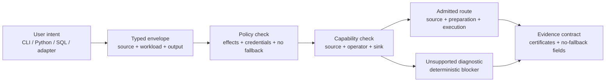
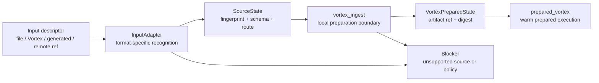
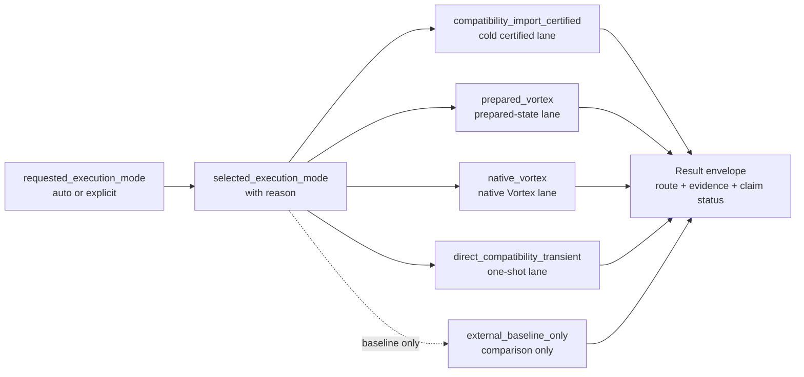
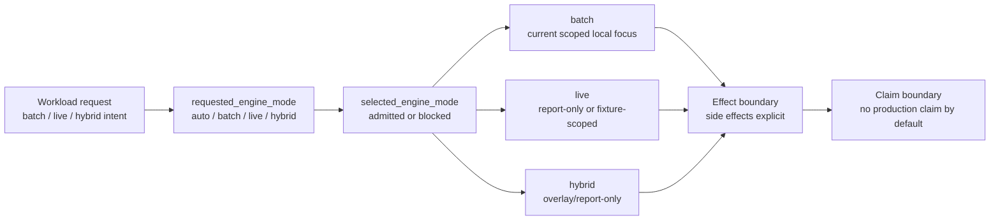
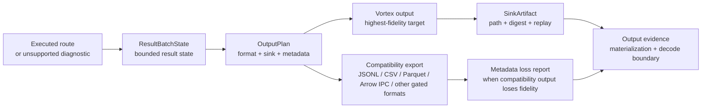
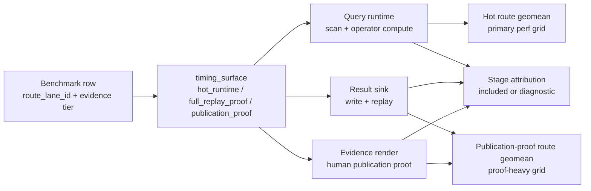

# ShardLoom Compute Engine Flow Reference

## Purpose

This file is the canonical ShardLoom compute-flow reference. It defines the public mental model,
runtime route vocabulary, benchmark timing surfaces, and claim boundaries that the website,
benchmarks, docs, and Codex agents should use.

Keep this file compact. It is a reference atlas, not a phase ledger, benchmark appendix, or
implementation history. Detailed work queues live in the phase plan and linked architecture docs.

Canonical source:

```text
docs/architecture/compute-engine-flow-reference.md
```

Website sync:

```text
website-src/scripts/sync-content.mjs
-> website/assets/data/compute-engine-flow-reference.md
-> website-public/assets/data/compute-engine-flow-reference.md
-> website/compute-engine-flow/index.html
-> website/compute-engine-flow.html
```

Historical alignment review:

```text
docs/architecture/compute-engine-flow-overhaul-review.md
```

This reference, not the overhaul review, owns current compute-flow vocabulary. The overhaul review
is historical alignment evidence and should not be used as a second active queue.

## One-Sentence Model

ShardLoom admits a request, chooses explicit route modes, executes only through ShardLoom-native
and Vortex-native boundaries, records what materialized or decoded, emits certificates and no-fallback
evidence, then blocks or allows a narrow claim.

```text
front door
-> source route
-> preparation route
-> execution route
-> output route
-> timing surface
-> evidence
-> claim gate
```

Core identity:

```text
Vortex-first
no external fallback
encoded-columnar execution
late materialization
explicit unsupported diagnostics
evidence-certified routes
claim-gated benchmark reporting
```

SQL and Python are front doors. The execution route is the admitted source, preparation,
execution-mode, output, timing, and evidence path behind those front doors.

## Documentation Structure

This reference uses a small set of source-grounded documentation rules:

- Root READMEs should explain what the project does, why it is useful, how to get started, and
  where to get more help or detail; long docs belong outside the README
  ([GitHub README docs](https://docs.github.com/en/repositories/managing-your-repositorys-settings-and-features/customizing-your-repository/about-readmes)).
- Architecture diagrams stay in Markdown Mermaid blocks so GitHub, pull requests, and the static
  website can render them from the same source
  ([GitHub diagram docs](https://docs.github.com/en/get-started/writing-on-github/working-with-advanced-formatting/creating-diagrams)).
- Reference material should be optimized for scanning, random access, complete examples, and
  related links rather than narrative sprawl
  ([Diataxis-style reference guidance](https://nix.dev/contributing/documentation/diataxis)).

## How To Use This Reference

| Reader | Start here | Stop when you can answer |
| --- | --- | --- |
| New user | At a glance, Route atlas, Current support snapshot | Which route am I using? |
| Runtime implementer | Runtime contract, Execution mode lanes, Provider admission | Where is support decided? |
| Benchmark reviewer | Timing surfaces, Stage attribution, Benchmark route labels | What was timed? |
| Release reviewer | Evidence fields, Claim gate, What must never happen | Is a public claim allowed? |
| Codex agent | Codex anchor prompt, Required invariants, Validation | Which invariant must my edit preserve? |

Entry anatomy for future additions:

```text
term or route name
one-sentence definition
where it appears in the flow
current posture
required evidence fields
claim boundary
next owning doc or phase item
```

## At A Glance

```mermaid
flowchart LR
    ACCESS["Access<br/>CLI / Python / SQL / adapter"]
    REQUEST["Typed request<br/>source + workload + output intent"]
    ADMISSION["Admission<br/>policy + capability + semantics"]
    SOURCE["Source route<br/>UniversalIngress / SourceState"]
    PREPARE["Preparation<br/>vortex_ingest / VortexPreparedState"]
    EXECUTE["Execution route<br/>compatibility / prepared / native / direct"]
    OUTPUT["Output route<br/>OutputPlan / SinkArtifact"]
    TIMING["Timing surface<br/>hot_runtime / replay / publication"]
    CLAIM["Claim gate<br/>evidence + blockers + no fallback"]

    ACCESS --> REQUEST --> ADMISSION --> SOURCE --> PREPARE --> EXECUTE --> OUTPUT --> TIMING --> CLAIM
```



## Required Invariants

| Invariant | Meaning |
| --- | --- |
| No fallback execution | Unsupported work returns deterministic diagnostics with `fallback_attempted=false` and `external_engine_invoked=false`; Spark, DataFusion, DuckDB, Polars, pandas, Dask, Ray, Velox, Trino, databases, and warehouses do not execute ShardLoom work as fallback. |
| Vortex is native | Vortex is the preferred input/output persistence target; compatibility formats are translation or import/export boundaries, not fallback execution engines. |
| Front door is not route | CLI, Python, SQL, notebooks, adapters, and planned REST/event APIs express work; route evidence names the actual source/preparation/execution/output path. |
| Preparation is visible | Non-Vortex inputs reach `prepared_vortex` only through `UniversalIngress`, `SourceState`, `vortex_ingest`, and `VortexPreparedState`. |
| Claims are gated | Runtime support, claim-grade evidence, production support, package readiness, performance claims, and Spark-replacement claims are separate fields. |
| Timing surface is explicit | `hot_runtime`, `full_replay_proof`, and `publication_proof` rows must never silently replace each other. |

## Reference Groups

| Group | Owns | Primary evidence |
| --- | --- | --- |
| Access and front doors | CLI, Python, SQL, adapters, planned API surfaces | typed request envelope, typed output envelope |
| Source and preparation | `UniversalIngress`, `InputAdapter`, `SourceState`, `vortex_ingest`, `VortexPreparedState` | source fingerprints, prepared-state IDs/digests, import certificates |
| Execution lanes | `compatibility_import_certified`, `prepared_vortex`, `native_vortex`, `direct_compatibility_transient`, `auto` | `requested_execution_mode`, `selected_execution_mode`, `mode_selection_reason`, execution certificates |
| Engine fabric | batch, live, hybrid, auto engine mode | `requested_engine_mode`, `selected_engine_mode`, effect and state boundaries |
| Output and materialization | `OutputPlan`, `SinkArtifact`, Vortex output, compatibility exports | decode/materialization status, result-sink replay, metadata preservation/loss |
| Timing and benchmarks | route lanes, timing surfaces, stage attribution | `timing_surface`, `route_total_formula`, stage milliseconds, claim gate status |
| Claims and release gates | hard release readiness, benchmark publication, package channel, public website | no-fallback fields, blockers, public claim booleans |

## Route Atlas

| Route | Starts from | Includes | Does not imply |
| --- | --- | --- | --- |
| `compatibility_import_certified` | A recognized compatibility source admitted through `UniversalIngress` | source read, parse/decode where required, `vortex_ingest`, Vortex write/reopen, scan/query, output/replay, certificates, claim-gate evidence | pure query-speed timing, broad SQL/DataFrame support, object-store/table production I/O |
| `prepared_vortex` | Existing `VortexPreparedState` | warm prepared query work, provider admission, output route, evidence | direct CSV/JSONL/Parquet/database/object-store reads |
| `native_vortex` | Existing Vortex artifact or native Vortex state | native Vortex scan/source path, provider admission, output route, evidence | compatibility import or external engine evaluation |
| `direct_compatibility_transient` | Scoped local compatibility source | one-shot transient local path with explicit materialization/decode status | prepared-state reuse or claim-grade production runtime |
| `auto` | User request with selection allowed | selector evidence with `selected_execution_mode` and `mode_selection_reason` | hidden fallback or invisible mode substitution |
| `external_baseline_only` | Explicit benchmark baseline row | comparison-only timing or correctness reference | ShardLoom runtime support or fallback execution |

Common local prepared route:

```text
local non-Vortex input
-> UniversalIngress / InputAdapter
-> SourceState
-> vortex_ingest
-> VortexPreparedState
-> prepared_vortex
-> ExecutionPlan
-> OutputPlan
-> SinkArtifact
-> evidence
-> claim gate
```

Source-free route:

```text
generated source
-> GeneratedSourceState or GeneratedSourceCertificate
-> optional prepared/native route
-> OutputPlan
-> SinkArtifact
-> evidence
-> claim gate
```

Generated-source contract markers:

```text
schema=shardloom.generated_source_certificate_contract.v1
no_dataset_smoke
user_generated_source
engine_native_generated_source
not_applicable_no_generated_rows
generated-source-user-rows-smoke
generated-source-range-smoke
generated-source-sequence-smoke
ctx.from_rows([{"id": 1}])
ctx.range(0, 10)
ctx.sequence([1, 2, 3])
none_scoped_local_range_sequence_jsonl_csv_smoke_only
shardloom.generated_source_api_admission.v1
shardloom.generated_source_evidence_alignment.v1
python_ctx_from_rows
python_ctx_range
python_ctx_sequence
python_generated_source_write
sql_values
sql_dataframe_source_free
foundry_generated_output
dataframe_generated_with_column
```

Observability/export contract markers:

```text
shardloom.openlineage_facet_mapping.v1
shardloom.opentelemetry_trace_export_contract.v1
openlineage_export_enabled=false
openlineage_facet_mapping_event_emitted=false
openlineage_facet_mapping_network_call_performed=false
opentelemetry_trace_export_trace_export_enabled=false
opentelemetry_trace_export_otlp_exporter_configured=false
opentelemetry_trace_export_network_exporter_enabled=false
opentelemetry_trace_export_network_call_performed=false
opentelemetry_export_enabled=false
opentelemetry_network_exporter_enabled=false
```

Novel/advisory performance markers:

```text
GAR-NOVEL-1A
GAR-NOVEL-1B
GAR-NOVEL-1C
GAR-NOVEL-1D
shardloom.traditional_analytics.bayesian_claim_confidence.v1
posterior_runtime_distribution=not_fit
credible_interval=not_computed
probability_of_regression=not_computed
runtime_decision_applied=false
layout_decision_applied=false
benchmark_recomputed=false
claim_gate_status=advisory_only_not_claim_grade
bayesian_confidence_enabled=false
```

## Timing Surfaces

Route timing rows must state their timing surface before any number is compared.

| Timing surface | Evidence tier | Route-total meaning | Sink/render inclusion |
| --- | --- | --- | --- |
| `hot_runtime` | `metadata_sink` | Hot route geomean. Query runtime only, or query plus compact metadata sink when explicitly declared. | `sink_timing_included_in_route_total=false` unless the row declares compact metadata inclusion. |
| `full_replay_proof` | `full_vortex_replay` | Full replay proof route total. Machine replay proof includes result-sink write/replay timing. | `sink_timing_included_in_route_total=true`. |
| `publication_proof` | `publication_full` | Publication-proof route geomean. Includes proof/output work needed for human publication evidence. | `sink_timing_included_in_route_total=true`; evidence render may be included. |

Required formula examples:

```text
route_total_formula=timing_surface=hot_runtime; query_runtime_millis
route_total_formula=timing_surface=full_replay_proof; query_runtime_millis + result_sink_write_millis + replay_millis
route_total_formula=timing_surface=publication_proof; preparation + query + result_sink_write + evidence_render
```

Stage attribution can show every measured piece, but each piece must be classified:

```text
included_hot_runtime
included_publication_proof
diagnostic_only
```

A `publication_full` row must not replace a missing hot-runtime row. If no hot-runtime row exists,
show `hot runtime row missing`.

## Benchmark Route Labels

Public benchmark rows should use stable route lane labels:

| Route lane id | Display label | Expected interpretation |
| --- | --- | --- |
| `cold_certified_route` | ShardLoom Cold Certified Route | Certified cold import/stage/query/output route. |
| `prepare_once_first_query` | ShardLoom Prepare-Once First Query | First query after preparation is included or adjacent, depending on row formula. |
| `prepare_once_batch` | ShardLoom Prepare-Once Batch | Amortized preparation plus child query rows with explicit attribution. |
| `warm_prepared_query` | ShardLoom Warm Prepared Query | Query from existing `VortexPreparedState`. |
| `native_vortex_query` | ShardLoom Native Vortex Query | Query from existing Vortex-native state/artifact. |
| `direct_transient_route` | ShardLoom Direct Transient Route | One-shot local transient path. |
| `external_baseline_end_to_end` | External Baseline End-to-End | Comparison-only external baseline. |

Benchmark artifacts and website rows must expose:

```text
route_runtime_status
route_lane_id
route_display_name
actual_evidence_tier
timing_surface
claim_gate_status
performance_claim_allowed=false
production_claim_allowed=false
spark_replacement_claim_allowed=false
fallback_attempted=false
external_engine_invoked=false
public_front_door_benchmark_rows
compute_flow_evidence
```

## Contract Test Anchors

The following labels are intentionally kept as stable reference anchors for validators, benchmark
artifacts, and website data. They are vocabulary contracts, not a second phase queue.

Workflow anchors:

```text
one-shot compatibility query
ingest/stage workflow
prepared Vortex query
native Vortex query
benchmark baseline comparison
explicit execution mode
explicit materialization/decode boundaries
evidence-certified execution
claim-gated benchmark/reporting
Transient compatibility boundary
```

Execution-mode transition anchors:

```text
SELECTED --> DIRECT
SELECTED --> COMPAT
SELECTED --> PREPARED
SELECTED --> NATIVE
```

Provider and blocker anchors:

```text
vortex_native_claim_allowed
compatibility_import_included
vortex_prepare_included
vortex_write_reopen_included
direct_transient_execution
claim_gate_status=not_claim_grade
execution_mode_attribution_contract
use_vortex_native_provider
wrap_vortex_concept
implement_shardloom_kernel
baseline_or_oracle_only
unsupported_until_vortex_or_shardloom_evidence
operator_execution_class
operator_blocker_id
operator_encoded_native_claim_allowed
persistent_runner_admission_gate
process_startup_attribution
Unsupported work must return deterministic unsupported diagnostics
SQL local-source smoke
scoped fixture-smoke local CSV/JSONL/flat JSON/Parquet/Arrow IPC/Avro/ORC
Actionable implementation work must be represented in the active phase queue
docs/architecture/compute-engine-flow-overhaul-review.md
```

Stage attribution anchors:

```text
total_runtime_millis
source_stat_millis
source_read_millis
source_parse_millis
compatibility_parse_millis
source_to_columnar_millis
source_state_materialization_layout
source_state_parse_normalization
source_state_columnar_preserved
source_state_record_batch_count
compatibility_to_vortex_import_millis
compatibility_to_vortex_import_timing_scope
vortex_array_build_millis
vortex_array_build_provider_kind
vortex_array_build_provider_surface
vortex_array_build_strategy
vortex_array_build_input_layout
vortex_array_build_record_batch_count
vortex_array_build_manual_scalar_copy_avoided
vortex_write_millis
vortex_digest_millis
vortex_reopen_verify_millis
vortex_reopen_millis
vortex_scan_millis
operator_compute_millis
operator_compute_timing_scope
result_sink_write_millis
evidence_render_millis
evidence_render_timing_status
not_available
not_applicable
rows avoided
stable correctness digest
Native I/O certificate
work_avoidance_evidence_schema
python_harness_overhead_status
```

Source-state reuse anchors are owned by
`docs/architecture/source-state-reuse-coverage-matrix.md`. Prepared/native batch evidence carries
`source_state_coverage` fields and uses
`source_state_digest_status=emitted_scoped_in_memory_source_state_digest` when scoped in-memory
source-state digests are present.

```text
source_metadata_snapshot_status=per_batch_source_metadata_reused
source_state_reuse_status=per_batch_dimension_label_state_reused
source_state_reuse_status=per_batch_category_metric_state_reused
source_state_category_metric_*
source_state_reuse_status=per_batch_group_category_metric_state_reused
source_state_group_category_metric_*
source_state_reuse_status=per_batch_ranked_metric_state_reused
source_state_ranked_metric_*
source_state_reuse_status=per_batch_selective_filter_state_reused
source_state_selective_filter_*
source_state_reuse_status=per_batch_dirty_input_state_reused
source_state_dirty_input_*
source_state_reuse_status=per_batch_date_null_metric_state_reused
source_state_date_null_metric_*
```

## Current Support Snapshot

| Surface | Current posture | Claim boundary |
| --- | --- | --- |
| CLI and Python local smokes | Scoped local technical-preview paths exist. | Not package-readiness, production, or broad DataFrame/SQL support. |
| Local compatibility inputs | CSV/JSONL/flat JSON and selected feature-gated local formats enter through `UniversalIngress`. | Compatibility import/export is not fallback execution. |
| Vortex preparation | Feature-gated local `vortex_ingest` creates `VortexPreparedState` evidence. | Scoped local flat-schema evidence only. |
| Prepared/native benchmark routes | Promoted artifacts separate cold, prepare-once, warm prepared, native, direct, and baseline lanes. | Claims depend on `timing_surface`, evidence tier, and claim gate. |
| SQL/DataFrame front doors | Scoped fixture/local-source rows exist for selected expressions and outputs. | Not broad PySpark, pandas, Polars, ANSI SQL, or production parity. |
| Object store, lakehouse, Foundry, live/hybrid | Mostly report-only, fixture-scoped, or blocked. | No production platform claim. |
| Package/release | Local no-publication rehearsals and gates exist. | Public package/release claims remain blocked until explicit release gates pass. |

## Runtime Contract



Admission happens before execution. Capability recognition is not runtime support. If a route is
not admitted, the result is an unsupported diagnostic, not external execution.

## Source And Preparation



`prepared_vortex` starts at `VortexPreparedState`. It does not become a parallel direct reader for
CSV, JSONL, Parquet, databases, object-store objects, generated rows, or ad hoc Python values.

## Execution Mode Lanes



`auto` is a selector, not an escape hatch. It must record the requested mode, selected mode,
selection reason, and unsupported alternatives when relevant.

## Engine Fabric



Engine mode is about workload semantics. It is not permission to delegate to an external streaming
system, database, warehouse, or lakehouse engine.

## Output And Materialization



Input format and output format are independent. Vortex output is the highest-fidelity persistence
target. Compatibility output must report metadata preservation or loss.

## Timing And Stage Attribution



Hot runtime comparisons should use `timing_surface=hot_runtime`. Publication-proof rows can be
slower because they include result-sink and human evidence-render work. That is extra proof work,
not automatically a core runtime regression.

## Evidence And Claim Gate

```mermaid
flowchart LR
    OUTCOME["Execution outcome<br/>result or blocker"]
    CORRECT["Correctness evidence<br/>digest / replay / oracle where allowed"]
    CERT["Certificates<br/>execution + Native I/O + source/sink"]
    NOFALLBACK["No-fallback evidence<br/>fallback_attempted=false"]
    TIMING["Timing evidence<br/>surface + formula + stage rows"]
    BLOCKERS["Blocker matrix<br/>missing or disallowed claims"]
    CLAIM["claim_gate_status<br/>claim_grade / not_claim_grade / fixture_smoke_only"]
    PUBLIC["Public claim booleans<br/>performance / production / package / Spark-displacement"]

    OUTCOME --> CORRECT --> CERT --> NOFALLBACK --> TIMING --> BLOCKERS --> CLAIM --> PUBLIC
```



Public claim booleans default to false:

```text
performance_claim_allowed=false
production_claim_allowed=false
spark_replacement_claim_allowed=false
public_release_claim_allowed=false
public_package_claim_allowed=false
publication_attempted=false
tag_created=false
secrets_required=false
fallback_attempted=false
external_engine_invoked=false
```

## External Baseline Boundary

External engines may appear only as comparison baselines, migration references, or correctness
oracles in tests where the boundary is explicit.

Allowed:

- `external_baseline_only` benchmark rows.
- Correctness/differential oracles that never satisfy runtime execution.
- Migration notes explaining what ShardLoom does not yet support.

Not allowed:

- Executing unsupported ShardLoom work through Spark, DataFusion, DuckDB, Polars, pandas, Dask, Ray,
  Velox, Trino, a database, or a warehouse.
- Reporting an external engine's residual evaluation as ShardLoom execution.
- Treating Vortex query-engine integrations as runtime fallback.

## What Must Never Happen

- Do not make `publication_full` rows drive the primary hot route grid.
- Do not compare hot query runtime against publication-proof totals without saying so.
- Do not call `prepared_vortex` a direct reader for compatibility files.
- Do not hide source admission, preparation, materialization, decode, sink, or evidence-render costs.
- Do not use `auto` to hide unsupported routes or mode substitution.
- Do not let website copy imply production support, package publication, Spark-displacement, object-store/lakehouse runtime, Foundry production, or performance superiority without claim-grade evidence.
- Do not keep outdated legacy docs on public pages when this reference, the phase plan, or promoted benchmark artifacts have moved on.

## Optimization Direction

Optimize remaining high-timing components by first separating route categories:

| Work area | Optimize toward | Keep visible |
| --- | --- | --- |
| Hot query runtime | Vortex-native scans, encoded kernels, pruning, pushdown, residual minimization | `timing_surface=hot_runtime`, query-only formula, route lane ID |
| Preparation | reusable `SourceState` and `VortexPreparedState`, narrow preparation timing, differential preparation | `prepared_state_lookup_or_create_ms`, `prepare_route_total_ms`, `prepare_cli_wall_ms` |
| Result sink/replay | lower write/replay overhead where proof surfaces need it | `result_sink_write_millis`, replay status, sink inclusion flag |
| Evidence render | avoid making human publication rendering part of hot runtime | `evidence_render_ms`, `included_publication_proof`, `diagnostic_only` |
| CI hard gate | parallel producer evidence jobs plus strict final artifact verification | final release rehearsal, production usability, hard release report |

## Codex Anchor Prompt

Use this prompt when an agent is about to change runtime, benchmark, website, or claim-surface code:

```text
You are editing ShardLoom. Preserve the no-fallback and Vortex-native architecture.
Before changing behavior, identify the front door, source route, preparation route,
execution route, output route, timing surface, evidence fields, and claim gate.
If unsupported, emit deterministic diagnostics with fallback_attempted=false and
external_engine_invoked=false. If benchmarking, keep hot_runtime, full_replay_proof,
and publication_proof rows separate. Do not make external baselines or publication
proof work stand in for ShardLoom hot runtime.
```

## Validation

After editing this file, sync and validate the website copies:

```bash
cd website-src
npm run sync-content
npm run build
npm run check
cd ..
python scripts/check_website_readiness.py
node website/validate_static_assets.js
git diff --check
```

For CI gate changes, also run:

```bash
python scripts/check_ci_gate_matrix.py
```

## Related Sources

- Active phase plan, kept as the repo-only source of truth for planned implementation work.
- `docs/architecture/canonical-terminology.md`
- `docs/architecture/universal-input-contract.md`
- `docs/architecture/universal-ingress-route-taxonomy.md`
- `docs/architecture/universal-compatibility-coverage-scoreboard.md`
- `docs/architecture/capability-certification-sequencing.md`
- `docs/benchmarks/local-taxonomy-benchmark.md`
- `docs/benchmarks/baseline-comparison-boundary.md`
- `benchmarks/traditional_analytics/README.md`
- `docs/release/ci-gate-matrix.md`
- `docs/release/hard-release-readiness-gate.md`

## Footer

This reference authorizes vocabulary and evidence shape. It does not authorize production claims,
package publication, performance superiority, Spark-displacement, broad SQL/DataFrame support,
object-store/lakehouse runtime, Foundry production support, or any external fallback execution.
