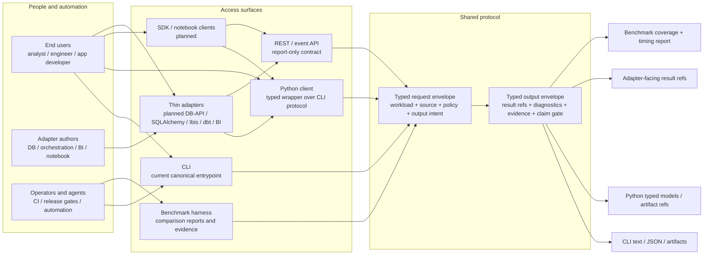
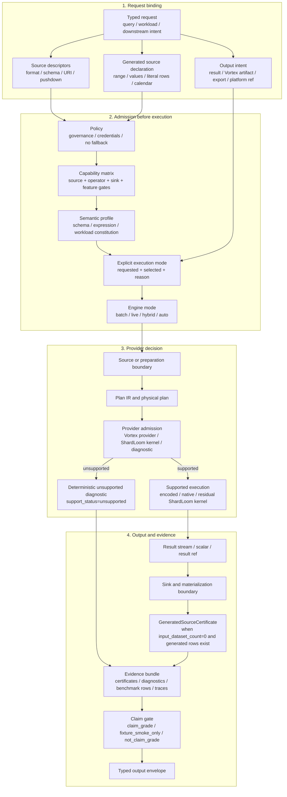
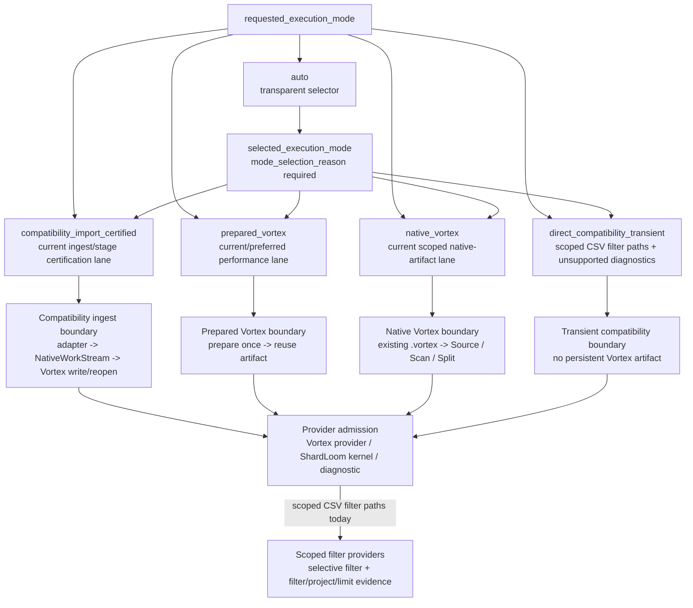
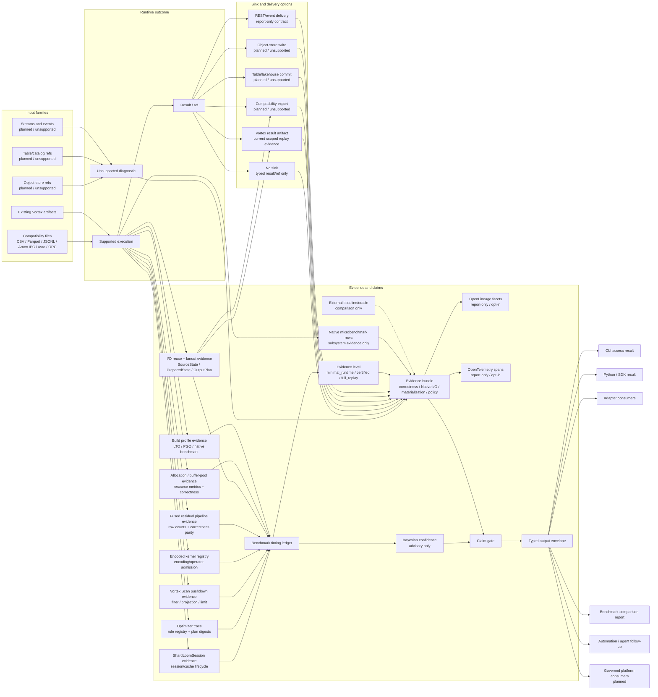
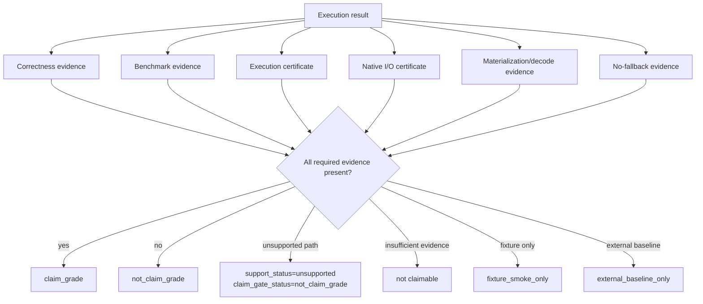

# ShardLoom Compute Engine Flow Reference

## Purpose

This document defines the high-level compute-engine flow ShardLoom is supposed to follow.

It is a reference for implementation, Codex agents, benchmarks, docs, and planned API/client
surfaces. It keeps ShardLoom from confusing these different things:

```text
one-shot compatibility query
ingest/stage workflow
prepared Vortex query
native Vortex query
batch/live/hybrid workload semantics
benchmark baseline comparison
```

ShardLoom's core identity remains:

```text
Vortex-first
no external fallback
explicit execution mode
explicit materialization/decode boundaries
evidence-certified execution
claim-gated benchmark/reporting
```

The repo-alignment review and completed overhaul mapping live in:

```text
docs/architecture/compute-engine-flow-overhaul-review.md
```

The website renders this file as `website/compute-engine-flow.html` through
`website/build_static_pages.py`. Keep this Markdown document as the canonical source; the generated
page is a static publication surface for readers who need the same flow outside GitHub.

## One-Sentence Vision

ShardLoom should let users run local and planned platform data workflows through explicit execution
modes, while proving what ran, what materialized, what stayed Vortex-native, what returned an
unsupported diagnostic, and whether any claim is allowed.

```text
User request
-> policy + capability admission
-> explicit execution mode
-> explicit engine mode where the workload needs batch/live/hybrid semantics
-> source/preparation boundary
-> ShardLoom/Vortex execution provider
-> result/result sink/downstream reference
-> certificates + evidence
-> claim gate
-> typed output for CLI / Python / REST/event surfaces / downstream consumers
```

## How To Read The Flow

This reference uses layered Markdown diagrams rather than one all-purpose architecture picture.
The structure follows three documentation rules:

- Use GitHub-rendered Mermaid fenced code blocks so the diagram stays versioned beside the text
  ([GitHub Mermaid docs](https://docs.github.com/en/get-started/writing-on-github/working-with-advanced-formatting/creating-diagrams),
  [Mermaid flowchart syntax](https://mermaid.js.org/syntax/flowchart.html)).
- Keep abstraction levels separate, following the C4 idea that different diagrams answer different
  questions for different audiences ([C4 model](https://c4model.com/introduction)).
- Treat this file as explanation plus reference, not a tutorial or runbook
  ([Diataxis](https://diataxis.fr/)).

Read only as far as needed:

| View | Question answered | Primary audience | Stop here when |
| --- | --- | --- | --- |
| 1. Access and users | Who can enter ShardLoom, and what do they receive back? | End users, adapter authors, operators | You need product/API orientation. |
| 2. Runtime contract | What must happen before any supported work executes? | Implementers, reviewers, agents | You need invariant request-to-output behavior. |
| 3. Mode lanes | Which execution mode owns each source/preparation boundary? | Benchmark authors, runtime implementers | You need timing and mode interpretation. |
| 4. Engine fabric | Where do batch, live, and hybrid semantics fit? | Workflow/API implementers, platform integrators | You need workload semantics and live/hybrid boundaries. |
| 5. Evidence and downstream use | How do sinks, adapters, reports, and claims consume outputs? | Release reviewers, benchmark readers, platform integrators | You need claim and downstream boundaries. |

Diagram notation:

| Notation | Meaning |
| --- | --- |
| Solid arrow | Request, result, or evidence flow inside ShardLoom. |
| Dotted arrow | Comparison-only baseline/oracle path, never fallback execution. |
| `current` | Implemented surface or certified/scoped evidence exists. |
| `report-only` | Deterministic report/diagnostic exists, but no runtime behavior is claimed. |
| `planned` | Future surface that must remain unchecked in the phase plan until implemented. |
| `unsupported` | Deterministic unsupported diagnostic; `fallback_attempted=false`. |

## Current Runtime Snapshot

This table is the shortest current-state read of the diagrams below. It separates source/preparation
execution lanes from batch/live/hybrid workload semantics so readers do not infer a hidden runtime
or claim.

| Layer | Current repo state | Planned updates | Claim boundary |
| --- | --- | --- | --- |
| User access | CLI is the canonical entrypoint; Python wraps typed CLI envelopes; benchmark harness records comparison/evidence rows. REST/event surfaces and thin adapters are report-only or planned. | Keep adapters, REST/event contracts, and notebook/SDK surfaces aligned to the same typed envelope. | No adapter may hide selected modes, diagnostics, fallback status, materialization/decode fields, or claim gates. |
| Adoption and commercial readiness | Source-local dry-run proof, first-10-minutes docs, website/status, and public-preview posture exist, but public package publication and channel readiness are incomplete. | GAR-COMMERCIAL-1 turns local proof, package channels, buyer-facing status, evidence export, Foundry starter, and recipes into claim-safe adoption surfaces. | Adoption surfaces reduce evaluation friction only; they do not authorize production, package release, performance, Spark-replacement, SQL/DataFrame, object-store/lakehouse, or Foundry claims. |
| Universal compatibility coverage | `docs/architecture/universal-compatibility-coverage-scoreboard.md` and `docs/architecture/universal-compatibility-coverage-scoreboard.json` now provide a report-only map for local files, Vortex, generated/source-free outputs, Python rows/DataFrame, SQL literals/VALUES, databases, warehouses, object stores, table formats, REST/Flight/ADBC, and Foundry. GAR-COMPAT-1B adds a compatibility-level `shardloom.universal_compatibility.generated_output_contract.v1` projection for no-dataset smoke, scoped Python generated-output smokes, local-output-only posture, SQL/DataFrame report-only rows, and Foundry/object-store blockers. GAR-COMPAT-1C adds `shardloom.universal_compatibility.object_store_admission_ladder.v1` for S3/GCS/ADLS URI parse, credential policy, public read, authenticated read, byte-range read, full-file read, local cache, write staging, and commit protocol admission status. | Future GAR-COMPAT children now move to table-format boundaries and database/warehouse import/export boundaries. | Compatibility coverage is a capability map, not a production, performance, Spark-replacement, object-store/lakehouse, Foundry, SQL/DataFrame, or package-readiness claim. |
| I/O reuse and cross-format fanout | Prepared/native rows reuse selected source metadata and scenario-family source-state. GAR-IOREUSE-1A adds a universal local SourceState benchmark/report contract for source discovery/schema identity/fingerprints/parse-plan posture across CSV, JSONL, Parquet, Arrow IPC, Avro, and ORC rows. GAR-IOREUSE-1B adds a VortexPreparedState benchmark/report contract for prepared artifact refs/digests, preparation timing separation, source-state linkage, and scoped reuse posture. GAR-IOREUSE-1C adds an OutputPlan benchmark/report contract for scoped local Vortex result-sink planning, metadata preservation posture, write/replay refs, and sink artifact identity. GAR-IOREUSE-1D adds report-only fanout benchmark rows for required cross-format cases. GAR-IOREUSE-1E adds cache invalidation/fingerprint rows for current local source/prepared/plan/output posture. GAR-IOREUSE-1F adds evidence-safe reuse-level rows and a reuse-level matrix. GAR-IOREUSE-1G adds report-only Foundry generated-output fanout posture to the local proof report. Runtime fanout and generated-output sink artifact evidence remain planned. | GAR-IOREUSE-1 follow-through now moves to runtime fanout, generated-source runtime, and claim-grade output evidence only through later scoped slices. | Input and output formats remain decoupled. SourceState, VortexPreparedState, OutputPlan, fanout matrix, cache invalidation evidence, reuse-level evidence, and Foundry generated-output fanout posture are not runtime cross-format fanout or persistent cache support by themselves, not a performance claim, and not object-store/lakehouse or Foundry production support. |
| Source-free generated output | No-input smoke/capability behavior exists, benchmark synthetic fixtures exist, `shardloom.generated_source_certificate_contract.v1` exposes the case split, GAR-GEN-1C adds one scoped `generated-source-user-rows-smoke`/Python `ctx.from_rows([...]).write(...)` local JSONL output path, GAR-GEN-1D adds one scoped `generated-source-range-smoke`/Python `ctx.range(...).write(...)` local JSONL output path, and GAR-COMPAT-1B projects those rows into compatibility/status surfaces. Other engine-native generator nodes, SQL `VALUES`/literal execution, broad DataFrame execution, object-store writes, and Foundry generated-output runtime remain unsupported/report-only. | GAR-GEN follow-through now moves to other engine-native local generator nodes and broader output evidence; GAR-NOVEL-1A keeps observability and lineage alignment with the same contract. | No source Native I/O certificate is claimed when no source dataset is read. Current generated-output runtime is fixture-smoke-only and local-output-only; it is not a broad source-free runtime, object-store/lakehouse, Foundry, SQL/DataFrame, performance, package, or production claim. |
| Evidence exports and confidence | Evidence artifacts, protocol parity rows, internal timing fields, and the GAR-PERF-1D report-only Bayesian performance/layout advisor contract exist. OpenLineage and OpenTelemetry posture is report-only; fitted Bayesian posterior models remain unimplemented. | GAR-NOVEL-1 defines report-only OpenLineage facets, OpenTelemetry span mapping, and Bayesian claim-confidence fields, all opt-in and no-network by default. | Export and confidence surfaces cannot upgrade runtime support, production readiness, performance, or claim status. |
| Execution modes | `compatibility_import_certified`, `prepared_vortex`, `native_vortex`, `direct_compatibility_transient`, and `auto` are visible in reports. | Continue shifting performance work toward prepared/native Vortex paths while preserving compatibility certification. | `auto` is selection only; it must emit the selected mode and reason. |
| Runtime evidence level | `traditional-analytics-vortex-batch-run` now emits first-class `evidence_level=minimal_runtime|certified|full_replay` fields beside execution mode for scoped prepared/native local artifacts. `minimal_runtime` blocks result-sink replay and reports `claim_gate_status=not_claim_grade`; `certified` emits normal certificate-bearing evidence without replay by default; `full_replay` requires result-sink replay proof. | Continue propagating the contract into future Python/API capability views and broader execution envelopes only where evidence exists. Later slices can add runtime-light benchmark lanes and policy views without hidden fast modes. | Every evidence level keeps `fallback_attempted=false`, `external_engine_invoked=false`, source/output digest status, and claim boundaries visible. Evidence level explains proof depth; it is not execution mode, performance evidence, SQL/DataFrame support, object-store/lakehouse support, Foundry support, or production readiness. |
| Scale claim gate | GAR-SCALE-1A adds `scale_contract_schema_version=shardloom.traditional_analytics.scale_claim_gate.v1` plus scale profile/status, volume, split, memory, spill, shuffle, retry, commit, platform, no-fallback, and claim-boundary fields. GAR-SCALE-1B adds `split_manifest_contract_schema_version=shardloom.traditional_analytics.split_manifest.v1` plus split planning fields. GAR-SCALE-1C adds `memory_spill_contract_schema_version=shardloom.traditional_analytics.memory_spill_backpressure.v1` plus memory/spill/backpressure fields. GAR-SCALE-1D adds `shuffle_contract_schema_version=shardloom.traditional_analytics.shuffle_repartition.v1` plus shuffle/repartition fields. GAR-SCALE-1E adds `object_table_ladder_schema_version=shardloom.traditional_analytics.object_table_scale_ladder.v1` plus object-store/table ladder fields. GAR-SCALE-1F adds `distributed_protocol_schema_version=shardloom.traditional_analytics.distributed_protocol.v1` plus coordinator, worker, task lease, task attempt, split, retry, fragment, merge, no-fallback, and `distributed_claim_gate_status=not_distributed_runtime_grade` fields. GAR-SCALE-1G adds `scale_benchmark_profile_schema_version=shardloom.traditional_analytics.scale_benchmark_profile.v1` plus profile registry, profile status, synthetic metadata, real-input-byte, correctness, no-fallback, and leaderboard-separation fields. GAR-SCALE-1H adds `schema_version=shardloom.foundry_scale_proof_boundary.v1` to the local Foundry proof report with Foundry runtime/compute/Spark, input/output dataset count, staged input bytes, execution mode, split, memory, evidence dataset, no-fallback, and public claim fields. Current ShardLoom rows are restricted to `local_smoke` or `local_claim_grade` and report `scale_claim_gate_status=not_scale_grade`. | Future runtime slices can promote only scoped scale classes with real workload bytes, correctness proof, no-fallback evidence, and relevant runtime gates. | Scale, SplitManifest, memory/spill, shuffle, object-store/table ladder, distributed protocol, scale benchmark profile, and Foundry scale proof fields are fail-closed. They do not authorize literal any-volume support, Spark-replacement, larger-than-memory execution, runtime spill, backpressure runtime, split-parallel runtime, distributed shuffle, object-store/table runtime, object-store write/commit, table commit, distributed runtime, remote workers, Foundry production support, managed-platform proof, public leaderboard placement, or performance/superiority claims. |
| Evidence-aware logical optimizer | `optimizer-plan`, Python typed accessors, and benchmark row contracts now expose a report-only optimizer rule registry and trace for predicate/projection/slice pushdown, common subplan/source-state reuse, expression simplification, constant folding, type coercion, join ordering, and cardinality estimation. No runtime rewrite is applied. | Future slices can promote individual rules only with before/after plan digests, correctness smoke, materialization/decode proof, no-fallback evidence, and claim gates. | Optimizer trace evidence is classification/explainability evidence only. It is not Polars/DataFusion parity, broad SQL/DataFrame runtime, performance evidence, or an applied-rewrite claim. |
| Vortex Scan pushdown | Prepared/native rows expose scoped `source_backed_scan_*` evidence, but filter/projection/limit pushdown is not complete or uniformly classified across every scenario family. | GAR-PERF-2C maps each prepared/native family to Vortex Scan filter/projection/limit evidence or a deterministic blocker, including filter-only versus output column read sets. | Pushdown evidence is source/provider-boundary evidence only. It is not an encoded-native operator claim, broad Source/Split runtime claim, SQL/DataFrame claim, object-store/lakehouse claim, or performance claim. |
| Compressed/encoded kernel registry | GAR-PERF-2D now emits scoped `compressed_kernel_registry_*` evidence for selective-filter prepared/native rows. Observed `flag:fastlanes.bitpacked` and `value:vortex.sequence` filter inputs are admitted/executed as reader-generated selection-vector inputs; dictionary, constant, sorted/min-max, and FSST/string pairs remain deterministic blockers or not-available rows. | Later slices can broaden kernel families only with correctness, materialization/decode, certificate, no-fallback, and claim-gate evidence. | Registry admission is not encoded-native support. Rows keep canonicalization, decode, materialization, validity, no-fallback, and claim-gate evidence visible with `encoded_native_claim_allowed=false`. |
| Fused operator pipeline | GAR-PERF-2E now emits scoped `fused_pipeline_*` evidence with family statuses, correctness digest parity fields, row counts, materialization/decode posture, deterministic blockers, and no-fallback fields. Executed scoped families are filter/projection/limit, filter/aggregate via selective-filter selection vectors, and top-k/projection; filter/group-by is blocked until a filtered grouped scenario exists. | Later slices can add stronger independent unfused runtime re-execution certificates and broader fused families only with correctness, materialization/decode, and claim-gate evidence. | Fusion evidence is scoped residual-native runtime evidence only. It is not an encoded-native operator claim, broad SQL/DataFrame claim, object-store/lakehouse claim, production claim, or public performance claim. |
| In-process session runtime | `ShardLoomSessionModelReport` exists as report-only explicit session/registry posture, and `traditional-analytics-vortex-batch-run` now emits scoped session-backed prepared/native local-artifact evidence. A general public `ShardLoomSession` API is not exposed. | Continue hardening the scoped session row fields, then promote only evidence-backed caller-owned APIs. Broader schema/dictionary cache, buffer-pool, kernel registry, and Python session surfaces remain gated. | Session support is local, caller-owned, and explicit-close only. It is not a daemon/service, remote server, hidden global cache, public Python session API, production claim, or performance/superiority claim. |
| Allocation and buffer-pool optimization | Session-backed prepared/native batch rows now emit scoped allocation/resource-profile evidence with explicit `not_available` allocation counts/bytes/peak RSS, `buffer_pool_enabled=false`, `buffer_reuse_count=0`, deterministic buffer-reuse blocker, no unsafe lifetime shortcut, and no-fallback/no-external-engine fields. No global allocation profiling or buffer-pool optimization pass is claimable. | GAR-PERF-2G follow-through can add safe measurement and scoped reuse only after ownership/lifecycle, correctness parity, and evidence parity are proven. | Allocation and buffer-pool evidence is resource-profile evidence only. Current rows show visibility and blockers, not buffer reuse, memory-efficiency, performance, production, or broad runtime claims. |
| Optimized build profiles and PGO | The benchmark harness records `build_profile` evidence for `release`, `release-lto`, `release-pgo`, and `release-native-benchmark`. | GAR-PERF-2H adds explicit Cargo profiles, benchmark row fields, PGO helper workflow, and host-native benchmark-only boundaries. | Build-profile evidence is compiler/config evidence only. `target-cpu=native` is benchmark-only, portable release artifacts stay portable, and optimized builds do not create performance or release claims. |
| Native microbenchmarks | The traditional analytics harness emits first-class `benchmark_category=native_microbenchmark` rows for subsystem optimization visibility. Implemented smoke rows cover encoded count, Vortex count/projection/filter-style primitives, local commit manifest evidence, and evidence rendering. Scan-only, group-by kernel, hash-join kernel, top-k, and result-sink write remain deterministic blocked rows until isolated primitives exist. | Use these rows to identify prepared/native optimization targets without mixing them with compatibility-import, prepared/native end-to-end, or external baseline rows. | Native microbenchmarks are subsystem evidence only. They are not end-to-end performance, superiority, Spark-replacement, SQL/DataFrame, object-store/lakehouse, Foundry, or production claims. |
| Prepared/native batch runtime | Scoped local paths for selective filter, wide projection, filter/project/limit, grouped aggregates, joins, distinct count, null-heavy aggregate, clean/cast/filter/write, malformed timestamp / dirty CSV, nested JSON field scan, CDC-overlay small change over large base, global sort/top-k, top-N, row-number, high-cardinality string group/distinct, and partition-pruning/date-range scans avoid full fact-table materialization in prepared/native rows. Prepared/native rows now emit explicit `source_backed_scan_*` evidence for local source roles, projected columns, residual executor, Native I/O certificate status, materialization boundary, and no-fallback status. `traditional-analytics-vortex-batch-run` also reuses one per-batch Vortex source metadata snapshot for caller-supplied fact/dim/CDC artifacts and emits `source_metadata_snapshot_*` evidence so repeated child scenarios do not recompute artifact size/digest metadata. Hash-join and join-aggregate child scenarios share one per-batch dimension-label lookup state when both are present; distinct-count and high-cardinality string-group/distinct child scenarios share one per-batch category/metric grouped state when both are present; group-by aggregation and multi-key group-by child scenarios share one per-batch group/category/metric grouped state when both are present; sort/top-k, top-N per group, and row-number/window child scenarios share one per-batch ranked-metric state when multiple ranked consumers are present; selective-filter and filter/projection/limit child scenarios share one per-batch filtered `id,value,metric` state when both are present; clean/cast/filter/write and malformed timestamp / dirty CSV child scenarios share one per-batch dirty-input cleanup state when both are present; partition-pruning and null-heavy aggregate child scenarios share one per-batch date/null metric state when both are present. The batch envelope emits aggregate and family-specific `source_state_*` fields, `source_state_coverage_*` classification, and `source_state_prepare_micros` evidence so shared setup cost and non-reusable rows are visible. GAR-IOREUSE-1A maps every benchmark row into `source_state_contract_schema_version=shardloom.traditional_analytics.source_state.v1` with SourceState identity, digest, source format/location/fingerprint, schema digest, file/byte/compression/partition posture, parse/decode plan digest, reuse hit/reason, materialization policy ref, no-fallback fields, and `source_state_claim_gate_status=not_claim_grade`. GAR-IOREUSE-1B maps prepared/native rows into `prepared_state_contract_schema_version=shardloom.traditional_analytics.vortex_prepared_state.v1` with prepared artifact refs/digests, prepared-state ID/digest, source-state linkage, preparation timing separation, reuse hit/reason, materialization policy ref, no-fallback fields, and `prepared_state_claim_gate_status=not_claim_grade`. GAR-IOREUSE-1C maps rows into `output_plan_contract_schema_version=shardloom.traditional_analytics.output_plan.v1` with OutputPlan ID/digest, target format/schema/location posture, local Vortex write/replay refs, metadata preservation status, sink artifact refs/digests, no-fallback fields, and `output_plan_claim_gate_status=not_claim_grade`. GAR-IOREUSE-1D adds `io_reuse_and_fanout` report-only rows for required cross-format output cases with blocker IDs, timing/reuse columns, `fanout_output_count=0`, `fallback_attempted=false`, `external_engine_invoked=false`, and `claim_gate_status=not_claim_grade`. GAR-IOREUSE-1E adds `cache_invalidation_contract_schema_version=shardloom.traditional_analytics.cache_invalidation.v1` rows with current local source/prepared/plan/output fingerprint posture, source mtime/size, plan/output-plan digests, invalidation reason, credential-redaction status, no-fallback fields, and `claim_gate_status=not_claim_grade`. GAR-IOREUSE-1F adds `reuse_level_contract_schema_version=shardloom.traditional_analytics.evidence_safe_reuse_levels.v1` rows and `reuse_level_matrix` entries for discovery, schema, parse-plan, prepared-state, operator-source-state, output-plan, and result-replay reuse posture with hit/allowed/digest/blocker fields, evidence-level linkage, output-format separation, invalidation reasons, `claim_grade_requirements_met=false`, no-fallback fields, and `claim_gate_status=not_claim_grade`. `compute-capability-matrix` aligns grouped aggregate, join, and row-number/window with scoped residual-native fixture evidence while keeping `operator_encoded_native_claim_allowed=false`. Selective-filter rows also emit `encoded_predicate_provider_*` v4 fields, record projected reader chunks, separately capture real `flag,value` reader chunks without decode/materialization, lower observed `flag:fastlanes.bitpacked` and `value:vortex.sequence` chunks into admitted reader-generated encoded kernel inputs, intersect their selection vectors, and consume the admitted selection vector for scoped metric `row_count`/`metric_sum` evidence through `encoded_predicate_provider_selected_metric_*` fields. GAR-PERF-2E rows additionally emit `fused_pipeline_*` family, blocker, and correctness-digest parity evidence for filter/projection/limit, filter/aggregate, top-k/projection, and blocked filter/group-by posture, with encoded-native claims blocked. Batch selective-filter reuse may instead report `batch_source_state_metric_aggregation_used` to show that the metric aggregate came from the shared filtered state, not an encoded-native operator. CPU specialization reports record side-effect-free host feature probes and a blocked filter/encoded vector-kernel admission diagnostic. | Next planned work is generalized encoded/native operator coverage, stronger independent fused/unfused runtime certificates, metric aggregation certificates, runtime cross-format fanout, and claim-grade correctness/benchmark gates. | These paths are residual-native unless evidence says otherwise; SourceState, VortexPreparedState, OutputPlan, fanout matrix, cache invalidation matrix, reuse-level matrix, source metadata, and dimension-label/category-metric/group-category-metric/ranked-metric/selective-filter/dirty-input/date-null-metric source-state reuse are runtime plumbing evidence only, not a performance, encoded-native, SQL/DataFrame, production, distributed sort, SIMD-dispatch, persistent cache, object-store pruning, layout/statistics pruning, broad CDC/table transaction, runtime cross-format fanout support, or broad performance claim. |
| Batch engine mode | Bounded/snapshot local Vortex analytics are the practical execution foundation. | Broader operator/source/sink coverage plus correctness and benchmark claim gates. | Batch support is scoped to evidence-backed workloads. |
| Live engine mode | `engine-selection-plan`, `engine-capability-matrix`, `live-change-contract-plan`, Python helpers, and in-memory `live-fixture-run` reports exist. | Durable state/checkpoints, broker/source adapters, freshness evidence, and workload certification. | Fixture evidence only; no production live claim. |
| Hybrid engine mode | `engine-selection-plan`, `engine-capability-matrix`, Python helpers, and in-memory `hybrid-overlay-run` reports exist. | Durable micro-segment flush, object-store/table commit, catalog snapshot discovery, and hot/cold benchmark evidence. | Fixture evidence only; no production hybrid, object-store, or table-commit claim. |
| Streaming/zero-copy/backpressure | `streaming-plan`, `streaming-batch-plan`, `backpressure-plan`, `engine-capability-matrix`, and `capabilities engines` now expose a GAR-0013 streaming capability matrix covering local fixture evidence, object-store streaming reads, zero-decode, zero-copy/materialization boundaries, bounded backpressure, and live/hybrid broker runtime. | Object-store streaming reads, durable broker adapters, runtime backpressure enforcement, broad operator/source/sink evidence, and workload certification. | Matrix rows are fixture-smoke or report-only unless explicitly blocked/materializing; broad streaming/runtime/object-store/broker claims remain not claim-grade. |

`traditional-analytics-vortex-batch-run` is the scoped prepared/native batch command. It runs a
comma-separated list of prepared/native Vortex scenarios in one ShardLoom process, reuses the
caller-supplied prepared Vortex artifacts, computes one source metadata snapshot for the fact,
dimension, and optional CDC Vortex inputs, preserves per-scenario evidence fields, and emits
`persistent_runner_status=single_process_batch_runner_supported` plus
`source_metadata_snapshot_status=per_batch_source_metadata_reused`. For hash-join and
join-aggregate batches it also prepares one shared dimension-label lookup state and emits
`source_state_reuse_status=per_batch_dimension_label_state_reused`. For distinct-count plus
high-cardinality string-group/distinct batches it prepares one shared category/metric grouped state
and emits `source_state_reuse_status=per_batch_category_metric_state_reused` plus family-specific
`source_state_category_metric_*` fields. For group-by aggregation plus multi-key group-by batches it
prepares one shared group/category/metric grouped state over `group_key,category,metric` and emits
`source_state_reuse_status=per_batch_group_category_metric_state_reused` plus family-specific
`source_state_group_category_metric_*` fields. For sort/top-k, top-N per group, and
row-number/window batches it prepares one shared ranked-metric state over `group_key,id,metric` when
multiple ranked consumers are present and emits
`source_state_reuse_status=per_batch_ranked_metric_state_reused` plus family-specific
`source_state_ranked_metric_*` fields. For selective-filter plus filter/projection/limit batches it
prepares one shared filtered state over `id,value,metric` when both consumers are present and emits
`source_state_reuse_status=per_batch_selective_filter_state_reused` plus family-specific
`source_state_selective_filter_*` fields. For clean/cast/filter/write plus malformed timestamp / dirty
CSV batches it prepares one shared dirty-input cleanup state over
`raw_event_time,dirty_numeric,dirty_flag` when both consumers are present and emits
`source_state_reuse_status=per_batch_dirty_input_state_reused` plus family-specific
`source_state_dirty_input_*` fields. For partition-pruning plus null-heavy aggregate batches it
prepares one shared date/null metric state over `event_date,metric,nullable_metric_00` when both
consumers are present and emits
`source_state_reuse_status=per_batch_date_null_metric_state_reused` plus family-specific
`source_state_date_null_metric_*` fields. All batch source-state paths emit
`source_state_prepare_timing_scope=batch_shared_pre_scenario`. GAR-PERF-1B adds the coverage matrix
at `docs/architecture/source-state-reuse-coverage-matrix.md` and the machine-readable
`source_state_coverage_*` fields, including per-child
`scenario_<slug>_source_state_coverage_status`, to classify each scenario as `source-state-reused`,
`source-state-not-needed`, `blocked-with-reason`, or `unsupported-with-reason`. The current
batch source-state families remain scoped in-process derived state, so family coverage fields report
`source_state_digest_status=not_emitted_scoped_in_memory_source_state`. GAR-IOREUSE-1A adds a
separate universal SourceState row contract with `source_state_id`, `source_state_digest`,
source-format/location/fingerprint/schema fields, parse/decode plan digest, reuse hit/reason,
no-fallback fields, and `source_state_claim_gate_status=not_claim_grade`. Those statuses mean scoped
process/source-metadata/source-state reuse only; they are not a daemon, service, hidden benchmark
fast mode, encoded-native claim, output claim, object-store/lakehouse claim, SQL/DataFrame claim, or
performance claim.

### View 1 - Access And Users

This view is the product/API map. Every entrypoint must preserve the same typed protocol; adapters
are allowed to improve ergonomics, not to create a hidden execution path.



### View 2 - Runtime Contract

This view is the invariant. A request reaches execution only after policy, capability, semantics,
and explicit mode selection. Unsupported work exits through diagnostics and evidence, not fallback.



### View 3 - Execution Mode Lanes

This view explains timing interpretation. `auto` is not a runtime engine; it selects and reports one
explicit mode. Compatibility lanes include ingest/stage/certification costs. Prepared/native lanes
are the intended query-runtime lanes when evidence supports them.



Mode timing fields must stay visible:

```text
source_read_millis
compatibility_parse_millis
compatibility_to_vortex_import_millis
vortex_write_millis
vortex_reopen_millis
vortex_scan_millis
operator_compute_millis
result_sink_write_millis
evidence_render_millis
total_runtime_millis
```

### View 4 - Engine Fabric Layer

Execution modes and engine modes answer different questions:

- Execution mode answers "what source/preparation lane did this run through?"
- Engine mode answers "what workload semantics did ShardLoom admit?"

The current repo has concrete engine-mode contracts and fixture evidence. It does not yet have
production broker-backed live execution, durable live state, object-store-backed hybrid execution, or
live/hybrid public claims.

```mermaid
flowchart TD
    REQUEST["Typed request<br/>workload + source + output intent"]
    ENGINE_REQUEST["requested_engine_mode<br/>auto / batch / live / hybrid"]
    ENGINE_SELECTION["engine-selection-plan<br/>selected_engine_mode + allowed/rejected modes"]
    MATRIX["engine-capability-matrix<br/>batch/live/hybrid rows"]
    STREAM_MATRIX["GAR-0013 streaming capability matrix<br/>local / object-store / zero-copy / zero-decode / backpressure"]

    subgraph CURRENT["Current scoped engine surfaces"]
        BATCH["batch<br/>bounded snapshot local Vortex analytics"]
        LIVE_CONTRACT["live-change-contract-plan<br/>change records + watermark/checkpoint vocabulary"]
        LIVE_FIXTURE["live-fixture-run<br/>in-memory fixture operators + certificates"]
        HYBRID_FIXTURE["hybrid-overlay-run<br/>base snapshot + hot delta fixture evidence"]
        STREAM_REPORTS["streaming-plan / streaming-batch-plan / backpressure-plan<br/>full matrix + blocked diagnostics"]
    end

    subgraph CLAIM_BOUNDARY["Claim and effect boundary"]
        FIXTURE_CLAIM["fixture evidence only<br/>production_claim_allowed=false"]
        NO_EFFECTS["no broker / object-store / external engine<br/>fallback_attempted=false"]
        PLANNED_GATES["planned gates<br/>durable state / freshness / object-store / workload evidence"]
    end

    REQUEST --> ENGINE_REQUEST --> ENGINE_SELECTION --> MATRIX
    MATRIX --> STREAM_MATRIX --> STREAM_REPORTS
    MATRIX --> BATCH
    MATRIX --> LIVE_CONTRACT --> LIVE_FIXTURE
    MATRIX --> HYBRID_FIXTURE
    STREAM_REPORTS --> FIXTURE_CLAIM
    BATCH --> FIXTURE_CLAIM
    LIVE_FIXTURE --> FIXTURE_CLAIM
    HYBRID_FIXTURE --> FIXTURE_CLAIM
    FIXTURE_CLAIM --> NO_EFFECTS --> PLANNED_GATES
```



Current engine-mode surfaces:

| Engine mode | Current surface | Current support | Claim boundary |
| --- | --- | --- | --- |
| `batch` | `engine-selection-plan`, `engine-capability-matrix`, local Vortex analytics paths | Partially supported for bounded snapshot workflows and scoped local Vortex benchmark/runtime evidence | Not a broad production or SQL/DataFrame claim. |
| `live` | `engine-selection-plan live ...`, `live-change-contract-plan`, `live-fixture-run` | Partially supported for in-memory fixture change streams with fixture freshness/state/execution/Native I/O certificates | No broker, durable state store, object-store I/O, or production live claim. |
| `hybrid` | `engine-selection-plan hybrid ...`, `hybrid-overlay-run` | Partially supported for in-memory base-plus-hot-delta fixture overlays with delta/freshness/execution/Native I/O certificate fields | No durable micro-segment writes, object-store commit, catalog snapshot discovery, or production hybrid claim. |
| `auto` | `engine-selection-plan` default selection | Transparent selector; defaults to `batch` for bounded snapshot workloads and must report selected/rejected modes | Not a hidden engine and never a fallback route. |
| `streaming capability` | `streaming-plan`, `streaming-batch-plan`, `backpressure-plan`, `engine-capability-matrix`, `capabilities engines` | Full GAR-0013 matrix exists; local count fixture and zero-decode rows are scoped fixture-smoke, while object-store streaming and broker-backed live/hybrid rows are blocked | No broad streaming runtime, object-store streaming read, broker-backed production, or zero-copy compatibility claim. |

These commands are side-effect controlled:

```text
engine-selection-plan: runtime_execution=false, data_read=false, write_io=false
engine-capability-matrix: runtime_execution=false, data_read=false, write_io=false
streaming capability matrix: runtime_execution=false, object_store_io=false, write_io=false
live-change-contract-plan: runtime_execution=false, data_read=false, write_io=false
live-fixture-run: scoped fixture runtime, data_read=false, write_io=false, broker_io=false
hybrid-overlay-run: scoped fixture runtime, data_read=false, write_io=false, object_store_io=false
```

Planned updates are carried in the phase plan, especially `GAR-0034-A` for live/hybrid fabric
blockers and freshness gates. Runtime-focused follow-through now shifts from the completed scoped
prepared/native benchmark paths and CPU admission diagnostics toward kernel/provider expansion,
source-backed API coverage, facade coverage, and other evidence-gated residual-native paths.

### View 5 - I/O, Evidence, And Downstream Use

This view connects runtime output to every consumer. Downstream users read typed outputs or
referenced artifacts; they do not imply a hidden execution mode, fallback engine, or unverified
sink.



These diagrams are intentionally broader than the current implementation. Planned nodes must remain
unchecked in `docs/architecture/global-architecture-review.md` and represented in
`docs/architecture/phased-execution-plan.md` until implemented and certified. Current commands must
return deterministic unsupported diagnostics where execution is absent. Planned nodes do not
authorize fallback execution, dependency expansion, package publication, external side effects, or
public performance claims.

End-to-end contract:

- Every request binds source descriptors, policy, capability, semantic profile, execution mode,
  engine mode where applicable, output intent, end-user access path, adapter surface, and downstream
  usage before execution.
- CLI access is the current canonical user and automation entrypoint. Wrappers and planned adapters
  must preserve the typed protocol instead of creating independent execution semantics.
- OpenLineage and OpenTelemetry surfaces are planned/report-only and opt-in. They map ShardLoom
  evidence into external observability/lineage shapes; they do not emit network events, configure
  exporters, invoke backends, or authorize runtime support by default.
- Bayesian confidence is advisory. GAR-PERF-1D now gives benchmark rows a report-only advisor
  contract for confidence, uncertainty, input evidence refs, and future mode/reuse/sizing/layout
  decision surfaces. It can identify uncertainty and block performance/release claims, but it
  cannot apply runtime decisions or upgrade `claim_gate_status` without the existing correctness,
  benchmark, execution-certificate, Native I/O, materialization, policy, and no-fallback evidence.
- Evidence level is independent from execution mode and engine mode. `minimal_runtime`,
  `certified`, and `full_replay` describe proof depth, not hidden execution semantics. Every level
  must keep `fallback_attempted=false`, `external_engine_invoked=false`, and `claim_gate_status`
  visible.
- SQL/DataFrame access currently exposes a report-only planner-readiness matrix through
  `capabilities sql`, `capabilities dataframe`, and Python `CapabilityView` accessors. It names
  SQL parse/bind/plan/execute and DataFrame lazy-plan/expression/join/aggregate/window readiness
  rows, but it does not execute a parser, binder, planner, DataFrame runtime, or fallback engine.
- End-user and adapter surfaces may improve ergonomics, but they must not hide selected execution
  mode, unsupported diagnostics, materialization/decode boundaries, or claim-gate status.
- Every source path reports what was read, what decoded, what materialized, what stayed native, and
  which Native I/O certificate applies.
- Every sink path reports what was written, what replayed or verified, what materialized, what
  decoded, and whether the sink can support a claim.
- Downstream consumers, including adapters, notebooks, BI tools, orchestration tools, and governed
  platforms, read the typed output envelope or referenced artifacts. They do not imply a hidden
  execution mode, fallback engine, or unverified sink.
- Public claims are allowed only after the claim gate sees the required correctness, benchmark,
  execution-certificate, Native I/O, materialization/decode, policy, and no-fallback evidence.

## Source-Free Generated Output

Source-free generated output is the flow for requests that create output without reading an input
dataset. The repo has the report-only certificate contract for the full flow plus scoped local
user-row and range JSONL fixture-smoke runtime paths. It keeps generated-output execution distinct
from no-input smoke and benchmark fixture generation.

The governing GAR item is `GAR-GEN-1 source-free generated-output execution and
GeneratedSourceCertificate`. GAR-GEN-1A/GAR-GEN-1B expose
`shardloom.generated_source_certificate_contract.v1` through CLI and Python capability views.
GAR-GEN-1C adds `generated-source-user-rows-smoke` plus Python `ctx.from_rows([...]).write(...)` for
one local user-row JSONL output smoke path. GAR-GEN-1D adds `generated-source-range-smoke` plus
Python `ctx.range(...).write(...)` for one ShardLoom-native range JSONL output smoke path.
GAR-GEN-1E adds the source-free SQL/DataFrame/Python/API admission matrix
`shardloom.generated_source_api_admission.v1` so users and agents can inspect supported,
report-only, and blocked forms without executing unsupported runtime.
GAR-COMPAT-1B projects the same generated-output posture into the universal compatibility
scoreboard through `shardloom.universal_compatibility.generated_output_contract.v1`, making the
website/status, CLI compatibility capability, Python `ctx.compatibility_scoreboard()`, SQL/DataFrame
posture, and Foundry/object-store blockers read from the same compatibility-level contract.

### Case Split

| Case | Meaning | Current posture | Evidence boundary |
| --- | --- | --- | --- |
| `no_dataset_smoke` | Status, capability, or proof command runs with no input dataset and no output data execution. | Smoke-only capability/proof behavior; also present as the first generated-source contract row. | `generated_source_created=false`, `output_io_performed=false`, `generated_source_certificate_status=not_applicable_no_generated_rows`; no source Native I/O certificate, no generated rows, no output data claim. |
| `user_generated_source` | User Python code creates rows, then ShardLoom consumes those rows as a generated/literal source. | Scoped local JSONL fixture smoke through `generated-source-user-rows-smoke` and `ctx.from_rows([...]).write(...)`; the broader contract remains report-only outside that slice. | Deterministic claim only for the scoped local user-row path when row creation, schema digest, row count, plan digest, sink evidence, and no-fallback evidence exist. |
| `engine_native_generated_source` | ShardLoom plan contains generator nodes such as `range`, `sequence`, `values`, `literal_table`, calendar/date dimension generation, or a deterministic synthetic profile. | Scoped local JSONL fixture smoke for the `range` generator through `generated-source-range-smoke` and `ctx.range(...).write(...)`; other generator nodes remain report-only. | Deterministic claim only for the scoped local range path when row count, schema digest, plan digest, sink evidence, materialization boundary, and no-fallback evidence exist. |

### Planned API Shape

Python and future adapter surfaces converge on one generated-source contract. The currently
runtime-supported fixture-smoke shapes are:

```python
ctx.from_rows([{"id": 1, "label": "alpha"}]).write("target/generated.jsonl")
ctx.range(0, 1000).write("target/generated-range.jsonl")
```

The following shapes remain future/report-only until their own runtime evidence lands:

```python
ctx.literal_table(...).write(...)
ctx.calendar(...).write(...)
```

SQL posture should eventually classify:

```sql
SELECT 1 AS value;
VALUES (1, 'alpha'), (2, 'beta');
```

as source-free literal/projection forms when a SQL parser, binder, planner, generator runtime, and
output sink have evidence. Until then, SQL literal `SELECT`, SQL `VALUES`, source-free projection,
and optional `generate_series`/`range` vocabulary stay report-only capability rows.

DataFrame-style builder methods should classify source-free builders and local writes without
implying broad DataFrame runtime. The runtime-supported generated-output builders today are scoped
local user-row JSONL and range JSONL smokes; expression-backed `with_column`, joins, aggregations,
SQL, non-local output, and other source-free builders require future admission evidence.

### Source-Free API Admission Matrix

Capability discovery surfaces expose `shardloom.generated_source_api_admission.v1` for SQL,
Python, DataFrame, and API scopes. The matrix is an admission/status surface, not a parser,
planner, runtime, or write operation.

| Row | Current posture | Runtime/effect boundary |
| --- | --- | --- |
| `python_ctx_from_rows` | `fixture_smoke_supported` | Admits only scoped local JSONL user-row writes with generated-source and output evidence. |
| `python_ctx_range` | `fixture_smoke_supported` | Admits only scoped local JSONL range writes with generated-source and output evidence. |
| `python_generated_source_write` | `fixture_smoke_supported` | Write helper is admitted only when attached to supported `user_rows` or `range` generated sources. |
| `python_ctx_literal_table` | `report_only` | `blocker_id=gar-gen-1.literal_table_runtime_not_implemented`; no rows generated and no output written. |
| `python_ctx_calendar` | `report_only` | `blocker_id=gar-gen-1.calendar_runtime_not_implemented`; no rows generated and no output written. |
| `sql_literal_select` | `report_only` | `blocker_id=gar-gen-1.sql_literal_select_runtime_not_implemented`; no parser, binder, planner, or runtime execution. |
| `sql_values` | `report_only` | `blocker_id=gar-gen-1.sql_values_runtime_not_implemented`; no parser, binder, planner, or runtime execution. |
| `sql_source_free_projection` | `report_only` | `blocker_id=gar-gen-1.sql_source_free_projection_runtime_not_implemented`; no SQL runtime or output claim. |
| `sql_generate_series_range` | `report_only` | `blocker_id=gar-gen-1.sql_generate_series_range_runtime_not_implemented`; SQL vocabulary only. |
| `dataframe_source_free_projection` | `report_only` | `blocker_id=gar-gen-1.dataframe_source_free_projection_runtime_not_implemented`; no broad DataFrame runtime. |
| `dataframe_generated_with_column` | `report_only` | `blocker_id=gar-gen-1.dataframe_generated_with_column_runtime_not_implemented`; no expression-backed generation. |

Every row reports `support_status`, `runtime_execution`, `data_read`, `write_io`,
`source_io_performed`, `generated_source_created`, `blocker_id`, `required_evidence`,
`claim_gate_status`, `fallback_attempted=false`, `external_engine_invoked=false`, and
`fallback_execution_allowed=false`. Report-only rows do not parse SQL, materialize rows, write
output, resolve credentials, probe object stores, invoke Foundry, or invoke external engines.

### Compatibility Projection

The universal compatibility scoreboard now exposes the companion
`source_free_generated_output_contract` object with:

- `schema_version=shardloom.universal_compatibility.generated_output_contract.v1`
- stable row order for no-dataset smoke, Python generated-source forms, SQL source-free forms,
  DataFrame source-free forms, and local-output-only posture
- `no_dataset_smoke_separate=true`
- `local_output_only=true`
- `source_native_io_certificate_emitted=false`
- `output_certificate_required=true`
- `object_store_runtime_supported=false`
- `foundry_runtime_supported=false`
- `broad_sql_dataframe_claim_allowed=false`
- `fallback_attempted=false`
- `external_engine_invoked=false`

This projection is a compatibility/status surface. It does not add generator runtime beyond the
already scoped local JSONL smokes, does not promote SQL/DataFrame execution, does not enable
object-store or Foundry output, and does not create a performance, package, production, or
Spark-replacement claim.

### Required Generated-Source Evidence Fields

The contract defines these as the required fields for generated-output runtime. GAR-GEN-1C emits
them for the scoped user-row local JSONL smoke, and GAR-GEN-1D emits them for the scoped
engine-native range local JSONL smoke:

```text
input_dataset_count=0
source_io_performed=false
generated_source_created=true
generated_source_kind
generated_source_schema_digest
generated_source_row_count
generated_source_plan_digest
generated_source_seed
generation_deterministic
output_io_performed
output_native_io_certificate_status
generated_source_certificate_status
fallback_attempted=false
external_engine_invoked=false
claim_gate_status
```

The range smoke also emits `generated_source_range_start`, `generated_source_range_end`,
`generated_source_range_step`, and `generated_source_range_column` so the generated plan is
inspectable without reading an input source.

The engine-native generated-source capability row now uses
`none_scoped_local_range_jsonl_smoke_only` to mark the admitted range fixture-smoke scope. That
blocker/status does not admit `sequence`, `values`, `literal_table`, calendar/date dimensions,
synthetic generators, SQL literals, DataFrame expressions, object-store writes, or Foundry output.

Current no-dataset smoke capability rows intentionally report:

```text
input_dataset_count=0
source_io_performed=false
generated_source_created=false
output_io_performed=false
generated_source_certificate_status=not_applicable_no_generated_rows
claim_gate_status=smoke_only|not_claim_grade
```

No source Native I/O certificate is claimed when no source dataset was read. Output evidence still
matters: generated output is not claimable unless the sink path reports what was written, where it was
written, which materialization/decode boundaries applied, and whether a Native I/O output certificate
exists.

### S3, Object-Store, And Foundry Boundary

S3 and object-store generated-output paths remain report-only/gated until a later object-store phase
adds credential, network, write, commit, retry, and certificate evidence. `GAR-GEN-1` does not allow
credential resolution, network probing, S3 reads, S3 writes, object-store commits, lakehouse writes,
or object-store performance claims.

Foundry generated-output smoke is a separate future proof target. The current local proof report
now exposes report-only Foundry generated-output fanout posture through
`shardloom.foundry_generated_output_fanout_posture.v1` with
`generated_output_execution_performed=false`, `generated_source_created=false`,
`fanout_output_count=0`, `direct_s3_write_invoked=false`, `foundry_spark_invoked=false`,
`fallback_attempted=false`, `external_engine_invoked=false`, and
`claim_gate_status=not_claim_grade`. A future runtime proof must write through Foundry output APIs,
not direct S3/object-store paths, and it must not imply Foundry production support, Foundry
certification, or third-party platform endorsement.

## Execution Modes And Engine Modes

Execution modes are source/preparation/timing lanes. Engine modes are workload semantics. A single
request can therefore have both:

```text
selected_execution_mode=prepared_vortex
selected_engine_mode=batch
```

For scoped engine-fabric fixture commands, source/preparation execution mode may be absent because
the command is proving engine semantics rather than a compatibility/Vortex source lane:

```text
selected_engine_mode=live
execution_mode_fields=not_applicable_to_engine_fabric_fixture
```

The fields must not be collapsed. `auto` exists in both vocabularies, but in both cases it is only a
transparent selector and must report what it selected.

## The Five Execution Modes

| Mode | What it means | Primary use | Vortex-native claim? | Claim posture |
| --- | --- | --- | --- | --- |
| `compatibility_import_certified` | Read compatibility input, import to Vortex, write/reopen/scan, compute, certify | Certified ingest/stage workflow | Partial/scoped | Can be claim-grade for ingest/stage workload |
| `prepared_vortex` | Prepare Vortex once, then run many queries/scenarios from prepared artifacts | Main performance comparison path | Yes, if evidence supports it | Preferred benchmark path |
| `native_vortex` | Existing `.vortex` input, Vortex-native scan/operator path | Cleanest native query path | Yes | Cleanest native-engine lane |
| `direct_compatibility_transient` | Read compatibility input and compute directly without persistent Vortex write/reopen | Small one-shot jobs, quick ETL | No | Not Vortex-native |
| `auto` | Transparent mode choice based on input/request/policy | User convenience | Depends on selected mode | Must report selected mode and reason |

## Mode 1 - `compatibility_import_certified`

This is the current ShardLoom certified ingest/stage shape.

```text
CSV / Parquet / JSONL / Arrow IPC / Avro / ORC
  -> compatibility source adapter
  -> NativeWorkStream
  -> Vortex import
  -> Vortex file write
  -> Vortex reopen
  -> Vortex scan
  -> ShardLoom temporary/current operator path
  -> optional result.vortex sink
  -> replay / verify
  -> execution certificate + Native I/O certificate + no-fallback evidence
```

Use this when the user wants certified ingest/stage workflow, Vortex artifact creation, Native I/O
evidence, result-sink replay proof, `fallback_attempted=false`, and
`external_engine_invoked=false`.

This mode is not the default pure query-speed benchmark path. It includes source read,
compatibility parsing, compatibility-to-Vortex import, Vortex write, Vortex reopen, Vortex scan,
operator compute, result-sink write if enabled, and evidence rendering.

Evidence posture:

```text
execution_mode=compatibility_import_certified
vortex_artifact_created=true
compatibility_import_included=true
vortex_write_reopen_included=true
native_io_certificate_required=true
vortex_native_claim_allowed=scoped
claim_gate_status=claim_grade | not_claim_grade
fallback_attempted=false
external_engine_invoked=false
```

## Mode 2 - `prepared_vortex`

This should become the primary ShardLoom performance comparison path.

```text
compatibility input
  -> prepare once
  -> Vortex artifact
  -> reuse prepared Vortex artifact across many scenarios
  -> Vortex scan / source-backed execution
  -> ShardLoom/Vortex-native operators
  -> optional result sink
  -> evidence + claim gate
```

This mode matches the ShardLoom thesis:

```text
data lives in Vortex
queries execute from Vortex
evidence proves what happened
```

Prepared Vortex mode must separate:

```text
preparation_millis
scenario_runtime_millis
operator_compute_millis
result_sink_write_millis
total_runtime_millis
```

Preparation timing is allowed, but it must not be mixed into pure query timing unless explicitly
requested.

Evidence posture:

```text
execution_mode=prepared_vortex
prepared_artifact_ref=...
prepared_artifact_digest=...
preparation_included_in_timing=false by default
computed_result_sink_requested=true|false
computed_result_sink_replay_verified=true|false
computed_result_sink_native_io_certificate_status=certified|none
result_sink_claim_gate_status=result_sink_replay_certified|not_claim_grade_missing_result_sink_evidence
vortex_native_claim_allowed=true if evidence supports it
native_io_certificate_required=true
fallback_attempted=false
external_engine_invoked=false
```

Current selective-filter provider posture:

```text
source_backed_scan_provider_kind=vortex_file_projected_scan
source_backed_scan_projected_columns=metric
encoded_predicate_provider_status=reader_generated_filter_column_batches_and_selected_metric_aggregation_admitted
encoded_predicate_provider_filter_only_columns=flag,value
encoded_predicate_provider_projected_output_columns=metric
encoded_predicate_provider_filter_column_probe_requested=true
encoded_predicate_provider_filter_column_probe_reader_chunk_columns_observed=flag,value
encoded_predicate_provider_filter_column_probe_reader_chunk_encoding_summary=flag:fastlanes.bitpacked,value:vortex.sequence
encoded_predicate_provider_filter_column_probe_data_decoded=false
encoded_predicate_provider_conjunctive_bridge_schema_version=shardloom.vortex_reader_generated_conjunctive_selection_vector_bridge.v1
encoded_predicate_provider_conjunctive_bridge_status=intersected_selection_vectors
encoded_predicate_provider_conjunctive_bridge_selected_row_count=31
encoded_predicate_provider_reader_chunk_columns_observed=metric
encoded_predicate_provider_reader_chunk_encoding_summary=metric:vortex.alp
encoded_predicate_provider_reader_backed_bridge_status=bridge_consumed_reader_generated_filter_column_kernel_inputs_and_metric_selection_vector
encoded_predicate_provider_predicate_shape_status=conjunctive_predicate_shape_supported_by_reader_generated_bridge
encoded_predicate_provider_filter_column_batch_status=admitted_filter_column_kernel_inputs
encoded_predicate_provider_kernel_input_count=2
encoded_predicate_provider_selection_vector_intersection_status=selection_vectors_intersected
encoded_predicate_provider_selected_metric_aggregation_status=selection_vector_consumed
encoded_predicate_provider_selected_metric_selection_vector_consumed=true
encoded_predicate_provider_selected_metric_source=reader_generated_conjunctive_bridge_selection_vectors
encoded_predicate_provider_selected_metric_row_count=31
encoded_predicate_provider_selected_metric_sum=12601.5
encoded_predicate_provider_selected_metric_scan_split_count=1
encoded_predicate_provider_selected_metric_data_decoded=true
encoded_predicate_provider_selected_metric_data_materialized=false
encoded_predicate_provider_kernel_input_lowering_status=reader_generated_encoded_kernel_inputs_admitted
encoded_predicate_provider_operator_execution_class=residual_native
encoded_predicate_provider_encoded_native_claim_allowed=false
encoded_predicate_provider_fallback_attempted=false
encoded_predicate_provider_external_engine_invoked=false
```

This records that the local Vortex scan path can separately project real `flag,value` reader chunks
without decode/materialization, lower the observed `fastlanes.bitpacked` and `vortex.sequence`
chunks into ShardLoom-owned encoded kernel inputs, intersect their reader-generated selection
vectors, and consume the admitted selection vector for scoped metric `row_count` and `metric_sum`
evidence. Non-empty admitted rows expose selection-vector-backed projected metric evidence;
admitted empty selections report a consumed selection vector with row count `0`. Blocked or changed
encodings continue to use deterministic no-fallback diagnostics. Encoded-native and performance
claims remain blocked because the scoped metric aggregation is residual-native and not a generalized
encoded aggregation kernel.

## Mode 3 - `native_vortex`

This is the cleanest native ShardLoom path.

```text
existing .vortex input
  -> Vortex source / scan / split
  -> Vortex-native or ShardLoom-native provider
  -> encoded/native operator path where supported
  -> result or result sink
  -> certificates + evidence
```

Use this when input already lives in Vortex, the user wants native Vortex execution, the benchmark is
comparing query/runtime behavior, and operator support exists or can return a deterministic
unsupported diagnostic.

Current native Vortex benchmark rows start from existing `.vortex` inputs, but they may still use
temporary ShardLoom operator paths until encoded/native operator coverage matures. A row is not an
encoded-native or fused-operator claim unless its representation-transition, materialization/decode,
provider-admission, and certificate evidence say so.

Native Vortex rows must not claim more than they prove:

```text
native Vortex scan evidence exists
operator support exists or deterministic unsupported diagnostic exists
representation transitions are visible
materialization/decode boundaries are visible
fallback_attempted=false
external_engine_invoked=false
```

Evidence posture:

```text
execution_mode=native_vortex
input_format=vortex
compatibility_import_included=false
vortex_write_reopen_included=false unless result sink enabled
computed_result_sink_write_micros=separate from operator timing when enabled
result_sink_claim_gate_status=result_sink_replay_certified|not_claim_grade_missing_result_sink_evidence
vortex_native_claim_allowed=true
claim_gate_status=fixture_smoke_only | claim_grade | not_claim_grade
```

## Mode 4 - `direct_compatibility_transient`

This is the traditional-compute-like ShardLoom path. The current repo has scoped local CSV smoke
paths for `selective filter` and `filter + projection + limit`, each with execution-certificate
evidence and explicit non-Vortex-native status. Adjacent formats, broader operators, result sinks,
SQL/DataFrame access, and broader transient runtime behavior still return deterministic unsupported
diagnostics.

SQL/DataFrame diagnostics for this mode are interpreted through the GAR-0001A-A planner-readiness
matrix. The matrix is `not_claim_grade`, preserves `fallback_attempted=false` and
`external_engine_invoked=false`, and cannot be used as evidence for SQL/DataFrame runtime support.

```text
CSV / Parquet / JSONL / etc.
  -> compatibility source adapter
  -> transient in-memory ShardLoom-native representation
  -> ShardLoom-native operator path
  -> result
  -> optional evidence
```

As it matures, this mode is for small one-shot local jobs, developer quick checks, direct ETL, and
cases where Vortex persistence is not desired.

It must not pretend to be Vortex-native:

```text
vortex_native=false
vortex_artifact_created=false
native_vortex_claim_allowed=false
claim_gate_status=not_vortex_native
```

Evidence posture:

```text
execution_mode=direct_compatibility_transient
direct_transient_execution=true
compatibility_import_included=false
persistent_vortex_write=false
vortex_native_claim_allowed=false
fallback_attempted=false
external_engine_invoked=false
```

This mode may eventually be faster for small one-shot workloads, but it must not become a hidden
bypass around ShardLoom's evidence model. It is ShardLoom-native only if it is implemented by
ShardLoom code.

It is not allowed to call Spark, DataFusion, DuckDB, Polars, Dask, Ray, Trino, Velox, or external
SQL engines as runtime fallback.

## Mode 5 - `auto`

Auto mode is allowed only if it is transparent.

```text
user requests auto
  -> ShardLoom evaluates input + policy + workload
  -> ShardLoom selects explicit mode
  -> ShardLoom reports selected mode + reason
```

Examples:

```text
input already .vortex
-> selected_execution_mode=native_vortex
-> mode_selection_reason=input_already_vortex

compatibility input + user requested certification
-> selected_execution_mode=compatibility_import_certified
-> mode_selection_reason=certified_ingest_stage_requested

small compatibility input + no Vortex persistence requested
-> selected_execution_mode=direct_compatibility_transient
-> mode_selection_reason=small_one_shot_without_persistence

compatibility input + benchmark performance comparison requested
-> selected_execution_mode=prepared_vortex
-> mode_selection_reason=benchmark_reuses_prepared_vortex_artifact
```

Auto must never silently select an external fallback engine:

```text
fallback_attempted=false
external_engine_invoked=false
selected_execution_mode must be explicit
mode_selection_reason must be explicit
```

## Engine Modes - Batch, Live, Hybrid, Auto

| Mode | What it means | Current repo state | Planned updates |
| --- | --- | --- | --- |
| `batch` | Finite workload over bounded or snapshot inputs. | Current local Vortex analytics foundation; prepared/native paths are being optimized scenario by scenario. | Broader operator coverage, source/sink certification, correctness/benchmark gates. |
| `live` | Continuous workload over change streams. | Engine selection, capability rows, live-change contract, and in-memory fixture execution/certificate reports exist. | Durable state/checkpoints, broker/source adapters, freshness evidence, workload certification. |
| `hybrid` | Cold/base snapshot plus hot delta overlay. | Engine selection, capability rows, and in-memory hybrid overlay fixture/certificate reports exist. | Durable micro-segment flush, object-store/table commit, catalog snapshot discovery, hot/cold benchmark evidence. |
| `auto` | Transparent engine selection from workload contract. | Selects or rejects with explicit allowed/rejected modes; no runtime, reads, writes, or fallback. | More precise selection once live/hybrid production gates exist. |

Engine-mode report fields must stay visible:

```text
requested_engine_mode
selected_engine_mode
allowed_engine_modes
rejected_engine_modes
boundedness
update_mode
output_mode
selection_status
runtime_execution
data_read
write_io
fallback_attempted=false
external_engine_invoked=false
```

Live and hybrid fixture reports may have `runtime_execution=true`, but only for scoped in-memory
fixtures. They must still report no external broker/object-store I/O and no fallback. Production
claims stay blocked until workload-scoped evidence exists.

Current CLI/Python-facing engine-mode surfaces:

```text
shardloom engine-selection-plan [auto|batch|live|hybrid] ...
shardloom engine-capability-matrix
shardloom live-change-contract-plan
shardloom live-fixture-run [filter|project|count|count-where|group-count] ...
shardloom hybrid-overlay-run [filter|project|count|count-where|group-count] ...
Python: Context(engine="batch|live|hybrid|auto") plus matching typed helper methods
```

## Canonical Stage Checklist

Use this checklist when reviewing a concrete command, benchmark row, adapter call, or future API
surface against the diagrams above.

| Stage | Required fact | Failure mode |
| --- | --- | --- |
| Request | `requested_execution_mode`, source descriptor, output intent, downstream intent | Reject or report unsupported before execution. |
| Policy | governance, credential, side-effect, and no-fallback policy | `fallback_attempted=false`; no external engine invocation. |
| Capability | source, operator, sink, and feature-gate support status | Deterministic diagnostic with missing evidence. |
| Semantics | schema, expression, workload constitution, profile | Deterministic diagnostic or not-claim-grade evidence. |
| Mode selection | `selected_execution_mode` and `mode_selection_reason` | `auto` cannot hide the selected mode. |
| Boundary | source/preparation/materialization/decode boundary | No native, performance, or sink claim without boundary evidence. |
| Provider admission | Vortex provider, ShardLoom kernel, or unsupported diagnostic | External systems remain baseline/oracle only. |
| Execution | encoded/native/residual/materialized class | Temporary/residual paths cannot claim encoded-native execution. |
| Sink | result/ref, Vortex artifact, export, commit, object-store write, REST/event delivery | Sink claim blocked until replay/fidelity evidence exists. |
| Evidence | correctness, benchmark, execution certificate, Native I/O, materialization/decode, policy | `claim_gate_status=not_claim_grade`. |
| Output | typed envelope for CLI, Python, adapters, benchmarks, REST/event contracts | Adapters must preserve mode, diagnostics, and claim fields. |

## Provider Admission Flow

```text
plan node
  -> Vortex-first provider check
  -> can upstream Vortex provide this natively?
     yes -> use_vortex_native_provider
     partially -> use provider + ShardLoom residual, or return residual unsupported diagnostic
     no -> implement_shardloom_kernel
     external integration only -> baseline_or_oracle_only
     insufficient evidence -> unsupported_until_vortex_or_shardloom_evidence
```

Provider classifications:

```text
use_vortex_native_provider
wrap_vortex_concept
implement_shardloom_kernel
baseline_or_oracle_only
unsupported_until_vortex_or_shardloom_evidence
```

Unsupported residuals must be executed by ShardLoom-native code or returned as deterministic
unsupported diagnostics. They must not be sent to external engines.

## Performance Attribution Flow

Every benchmark row should say exactly where time went.

```text
total_runtime_millis
  process_start_millis
  source_read_millis
  compatibility_parse_millis
  compatibility_to_vortex_import_millis
  vortex_write_millis
  vortex_reopen_millis
  vortex_scan_millis
  operator_compute_millis
  result_sink_write_millis
  evidence_render_millis
```

Interpretation:

```text
compatibility_import_certified = staging + query + evidence
prepared_vortex = preparation once + query many times
native_vortex = query over existing Vortex
direct_compatibility_transient = one-shot direct ShardLoom compute, not Vortex-native
batch = bounded/snapshot workload semantics
live = continuous/change-stream workload semantics
hybrid = base snapshot plus hot delta workload semantics
```

The benchmark artifact must also carry
`execution_mode_attribution_contract`, including the canonical mode vocabulary,
the required execution-mode fields, and the required stage timing fields. The
harness rejects rows that omit the contract fields. Unknown stage values stay
explicit as `null`, `n/a`, or `not_measured`; missing fields are not allowed.
Prepared/native rows must also carry an operator blocker matrix with
`operator_execution_class`, `operator_admission_status`, `operator_blocker_id`,
`operator_blocker_reason`, and `operator_encoded_native_claim_allowed` so
temporary or residual-native operators are never read as encoded-native
operator execution.
Native Vortex benchmark rows must additionally carry `native_vortex_admission_*`
fields that identify the exact admitted lane, provider kind/API surface,
certificate refs, materialization/decode refs, fallback status, and claim
boundary. Today that admits only `local_vortex_count_scalar`; downstream readers
must not infer universal native Vortex support from that row.

The artifact must also carry `persistent_runner_admission_gate`. Eligible
comparative prepared/native rows now consume the explicit
`traditional-analytics-vortex-batch-run` command and report
`persistent_runner_status=single_process_batch_runner_supported` while
preserving per-scenario typed evidence and no-fallback fields. Those rows also
carry `batch_runner_kind`, `batch_scenario_count`,
`batch_cli_process_wall_millis`, `batch_process_wall_shared=true`, and
`batch_process_startup_attribution` so shared process wall time is not mistaken
for per-scenario operator work. Eligible batch rows may also carry
`source_state_dimension_label_*`, `source_state_category_metric_*`,
`source_state_group_category_metric_*`, `source_state_ranked_metric_*`,
`source_state_selective_filter_*`, `source_state_dirty_input_*`, and
`source_state_date_null_metric_*` fields to show which scoped
source-state family was reused. Rows that still use explicit single-scenario CLI
execution keep `persistent_runner_status=process_per_scenario_attributed_not_reduced`
and the existing persistent-runner admission fields (`process_startup_attribution`,
`python_harness_overhead_status`, `cli_process_wall_millis`,
`python_harness_overhead_millis`, `startup_warmup_millis`,
`build_time_millis`, `build_time_excluded`, `preparation_millis`,
`preparation_cli_process_wall_millis`, and `preparation_included_in_timing`).
The batch status does not admit a persistent daemon, service runtime, hidden
fast mode, or performance claim. Any broader persistent runner must preserve
typed envelopes, execution-mode evidence, Native I/O refs, operator blocker
fields, materialization/decode boundaries, result-sink replay evidence,
deterministic unsupported diagnostics, and no-fallback fields per run.

`GAR-PERF-1` is the planned prepared/native performance architecture layer. It separates four
follow-ups:

- `GAR-PERF-1A`: refresh local prepared/native benchmark evidence after source-state reuse, keeping
  benchmark output framed as evidence rather than a leaderboard.
- `GAR-PERF-1B`: complete the source-state reuse coverage matrix and emit
  `source_state_coverage_*` fields for every requested traditional analytics scenario family.
- `GAR-PERF-1C`: complete scoped `fused_pipeline_*` evidence for filter/project/limit plus
  selection-vector metric aggregation without overclaiming encoded-native execution.
- `GAR-PERF-1D`: the report-only Bayesian performance and layout advisor contract is implemented in
  benchmark artifacts; fitted posterior models and any decision-applying advisor remain blocked.

Those slices may improve attribution and local runtime evidence, but they do not authorize
performance, superiority, Spark-displacement, production, SQL/DataFrame, object-store/lakehouse, or
encoded-native claims without workload-scoped evidence and claim gates.

`GAR-PERF-2A` adds the first runtime evidence-level tiering layer to the scoped
`traditional-analytics-vortex-batch-run` path. It separates proof depth from execution mode:

- `minimal_runtime`: runtime/development rows with required no-fallback policy fields and no
  result-sink replay; `claim_gate_status=not_claim_grade`.
- `certified`: normal certificate-bearing execution for scoped local evidence, without
  result-sink replay by default.
- `full_replay`: certified evidence plus result-sink write/reopen/replay proof; this level
  requires `--write-result-vortex` and a caller-owned workspace.

Evidence level appears beside `execution_mode`, not in place of it. Batch rows emit
`runtime_evidence_level_schema_version`, `requested_evidence_level`, `selected_evidence_level`,
`evidence_level`, `evidence_level_claim_gate_status`,
`evidence_level_result_sink_replay_required`,
`evidence_level_result_sink_replay_verified`, `evidence_level_certificate_refs`,
`evidence_level_source_state_digest`, `evidence_level_output_digest`,
`evidence_level_fallback_attempted=false`, `evidence_level_external_engine_invoked=false`, and an
explicit claim boundary. This lets benchmark readers see proof overhead without treating
evidence-light rows as public performance rankings or claim-grade evidence.

`GAR-PERF-2B` is the evidence-aware logical optimizer report-only layer. It adds an optimizer rule
registry and optimizer trace over ShardLoom Plan IR without applying runtime rewrites. The first
rule families are:

- predicate pushdown.
- projection pushdown.
- slice/limit pushdown.
- common subplan/source-state reuse.
- expression simplification.
- constant folding.
- type coercion.
- join ordering.
- cardinality estimation.

Optimizer trace rows expose optimizer trace ID, registry version, phase, rule ID/family,
admitted/applied/blocked/unsupported/not-applicable/report-only status, report-only before/after
plan digest placeholders, rewrite safety, `evidence_preserved=true`,
`no_fallback_preserved=true`, `claim_boundary_preserved=true`, materialization boundary
preservation, source-state reuse admission, cardinality estimates and estimation status,
correctness smoke refs, no-fallback status, and a claim gate. Current rows apply no rewrites:
predicate/projection pushdown are `report_only`, slice/limit, type coercion, and join ordering are
`blocked`, common subplan/source-state reuse is `admitted`, expression simplification and constant
folding are `unsupported`, and cardinality estimation is `not_applicable`. Any future applied
rewrite must preserve semantic, evidence, materialization/decode, and claim boundaries and must
never call Polars, DataFusion, DuckDB, Spark, or another external engine as optimizer or execution
fallback.

Optimizer trace evidence is explainability and rewrite-safety evidence only. It does not authorize
broad SQL/DataFrame runtime, Polars/DataFusion parity, performance, superiority,
Spark-displacement, production, object-store/lakehouse, Foundry, package, or release claims.

`GAR-PERF-2C` is the planned Vortex Scan API pushdown completion layer. It promotes existing
`source_backed_scan_*` evidence into a complete per-scenario-family pushdown/blocker contract for:

- filter pushdown.
- projection pushdown.
- limit/slice pushdown.
- filter-only column read sets.
- output column read sets.
- materialization/decode boundaries.

Every prepared/native scenario family should either map its filter/projection/limit intent into the
Vortex Scan/source-backed boundary or emit a deterministic blocker. Filter-only columns may be read
to evaluate predicates, but they must not appear in output streams unless requested. Unsupported
expressions remain ShardLoom-native residual work or deterministic blockers; they must not be routed
through Spark, DataFusion, DuckDB, Polars, Velox, or another external engine. Scan pushdown evidence
does not imply encoded-native operator execution, generalized Source/Split runtime, object-store or
table scans, SQL/DataFrame execution, production readiness, or public performance.

`GAR-PERF-2D` is the scoped compressed/encoded kernel registry layer. It turns selective-filter
encoded-predicate evidence into explicit encoding/operator registry rows for:

- bitpacked boolean/integer filter.
- sequence equality/range predicate.
- dictionary equality/group-by.
- constant array count/filter.
- sorted min/max range pruning.
- FSST/dictionary string equality where available.

Selective-filter rows currently admit/executed only the observed `flag:fastlanes.bitpacked` and
`value:vortex.sequence` reader-generated filter inputs and keep metric aggregation residual-native.
The remaining initial pairs are visible deterministic blockers or not-available rows.

Registry rows expose `encoding_id`, logical dtype, physical encoding, operator family,
`kernel_admitted`, `kernel_executed`, `canonicalization_required`, `decoded`, `materialized`,
selection-vector behavior, validity semantics, `encoded_native_claim_allowed`, no-fallback status,
and a claim gate. Unsupported encodings are deterministic blockers. Registry admission alone is not
encoded-native operator support; encoded-native claims remain blocked until the full path proves
correctness, representation state, materialization/decode boundaries, certificates, and no-fallback
evidence.

`GAR-PERF-2E` is the scoped fused operator pipeline layer. It turns selected prepared/native
residual-native paths into explicit fused pipeline evidence for:

- filter + projection + limit.
- filter + aggregate.
- filter + group-by.
- top-k with projection.

Current rows execute filter/projection/limit, filter/aggregate through selective-filter
selection-vector metric aggregation, and top-k/projection. Filter/group-by emits
`gar-perf-2e.filter_group_by_filter_absent` because current grouped rows do not yet include a scoped
filtered grouped scenario.

Fused rows expose `fused_pipeline_used`, `fused_operator_family`,
`intermediate_materialization_avoided`, row counts, fused and unfused correctness digests,
`fused_pipeline_correctness_digest_match`, materialization/decode status, no-fallback status, and a
claim gate. Fusion applies only when a ShardLoom-native fused path produces the same canonical
result digest as the reference slot. Unsafe or unsupported fusion must be a deterministic blocker.
Fusion evidence does not imply encoded-native operator execution, broad operator coverage,
SQL/DataFrame runtime, object-store/lakehouse support, production readiness, or public performance.

`GAR-PERF-2F` now has a scoped in-process session-backed prepared/native batch lane. The existing
`traditional-analytics-vortex-batch-run` command opens an explicit caller-owned local session for
the supplied prepared/native Vortex artifacts, executes the requested scenarios through that
session, and closes it before emitting evidence. This is the first runtime-supported session slice;
the broader public `ShardLoomSession` API remains planned. The scoped session carries:

- prepared artifact registry.
- source metadata cache.
- source-state cache.
- schema cache status (`not_externalized_digest_policy_pending`).
- dictionary cache status (`not_externalized_digest_policy_pending`).
- buffer pool status (`scoped_buffer_pool_disabled_with_reported_blocker`).
- kernel registry reference.
- evidence recorder.

Session-backed rows must expose `session_id`, cache hit/miss fields, source-state reuse count,
prepared-artifact reuse count, close/drop status, `session_hidden_global_cache=false`,
`session_daemon_or_service=false`, `session_fallback_attempted=false`, and
`session_external_engine_invoked=false`. This support is local-artifact-only and does not imply a
daemon, service, remote server, hidden global cache, public Python session API, production claim,
SQL/DataFrame runtime, object-store/lakehouse runtime, Foundry claim, package claim, or performance
claim.

`GAR-IOREUSE-1` is the planned reusable I/O state and cross-format output fanout layer. It expands
scenario-local source-state reuse into a general, decoupled path:

```text
InputAdapter -> SourceState -> VortexPreparedState -> ExecutionPlan -> OutputPlan -> SinkArtifact
```

The path means input format and output format do not need to match. Source discovery,
schema/dtype inference, parse/decode planning, Vortex preparation, operator source-state, output
planning, and sink artifacts are separate evidence layers. SourceState preparation evidence does
not imply Vortex-native execution; VortexPreparedState evidence does not imply output support; and
OutputPlan evidence does not imply object-store or table commit support.

The current `GAR-IOREUSE-1A` slice implements the first SourceState artifact contract in the
traditional analytics benchmark JSON/Markdown report. It covers local CSV, JSONL, Parquet, Arrow
IPC, Avro, and ORC SourceState posture with `source_state_contract_schema_version`,
`source_state_status`, identity/digest/fingerprint/schema fields, source parse timing when measured,
reuse hit/reason, materialization policy ref, no-fallback fields, and claim boundary text.

The current `GAR-IOREUSE-1B` slice implements the companion VortexPreparedState artifact contract in
the traditional analytics benchmark JSON/Markdown report. It covers local prepared Vortex artifact
posture with `prepared_state_contract_schema_version`, `prepared_state_status`,
`prepared_state_id`, `prepared_state_digest`, `prepared_state_source_state_id`,
`vortex_artifact_ref`, `vortex_artifact_digest`, preparation timing separation,
`prepared_state_reuse_hit`, `prepared_state_reuse_reason`, materialization/decode policy refs,
no-fallback fields, and claim boundary text.

The current `GAR-IOREUSE-1C` slice implements the companion OutputPlan artifact contract in the
traditional analytics benchmark JSON/Markdown report. It covers local Vortex result-sink output
planning posture with `output_plan_contract_schema_version`, `output_plan_status`,
`output_plan_id`, `output_plan_digest`, `output_format`, `output_location`,
`output_schema_digest`, metadata preservation/materialization fields, `output_write_millis`,
`result_replay_verified`, `output_native_io_certificate_status`, `sink_artifact_ref`,
`sink_artifact_digest`, no-fallback fields, and claim boundary text. Runtime fanout remains
planned.

The current `GAR-IOREUSE-1D` slice implements the first fanout benchmark matrix in the traditional
analytics benchmark JSON/Markdown report. It lists required `io_reuse_and_fanout` cases for CSV,
Parquet, JSONL, generated source, and prepared Vortex inputs, exposes requested output formats and
blockers, carries timing/reuse columns as explicit not-measured values, and keeps
`fanout_output_count=0`, `fallback_attempted=false`, `external_engine_invoked=false`, and
`claim_gate_status=not_claim_grade`. Runtime fanout stays planned; reuse-level visibility is now
implemented as report/evidence fields.

The current `GAR-IOREUSE-1E` slice implements the cache invalidation/fingerprint contract in the
traditional analytics benchmark JSON/Markdown report. Rows expose
`cache_invalidation_contract_schema_version`, `cache_invalidation_status`,
`cache_invalidation_layer_scope`, `source_content_digest`, `source_mtime`, `source_size`,
`object_etag`, `manifest_version`, `schema_digest`, `plan_digest`, `output_plan_digest`,
`cache_valid`, `invalidation_reason`, no-fallback/no-external-engine fields,
`cache_invalidation_redaction_status`, and
`cache_invalidation_claim_gate_status=not_claim_grade`. `cache_valid=true` means current-row local
fingerprints are internally consistent; it is not a persistent cache hit or performance claim.

The current `GAR-IOREUSE-1F` slice implements the evidence-safe reuse-level contract in the
traditional analytics benchmark JSON/Markdown report. Rows expose
`reuse_level_contract_schema_version=shardloom.traditional_analytics.evidence_safe_reuse_levels.v1`,
`reuse_level_supported_levels`, `reuse_level_matrix_ref`, `reuse_level_summary_digest`,
`reuse_level_hit_count`, `reuse_level_allowed_count`, `reuse_level_claim_gate_status=not_claim_grade`,
`claim_grade_requirements_met=false`, no-fallback/no-external-engine fields, and a
`reuse_level_matrix` with per-level status, hit, digest, allowed, blocker, invalidation reason,
execution mode, evidence level, and output format. Reuse hits or misses are visibility evidence
only; they do not prove correctness, output fidelity, performance, or production support.

The current `GAR-IOREUSE-1G` slice implements report-only Foundry generated-output fanout posture in
the local Foundry proof report. It exposes
`schema_version=shardloom.foundry_generated_output_fanout_posture.v1`,
`support_status=report_only`, `generated_output_execution_performed=false`,
`no_dataset_smoke_separate_from_generated_output=true`, `input_dataset_count=0`,
`source_io_performed=false`, `generated_source_created=false`,
`generated_source_certificate_status=not_emitted_report_only`, `output_plan_id=null`,
`fanout_output_count=0`, `output_io_performed=false`,
`output_native_io_certificate_status=not_emitted_report_only`, `foundry_output_api_required=true`,
`foundry_runtime_invoked=false`, `foundry_compute_invoked=false`, `foundry_spark_invoked=false`,
`direct_s3_write_invoked=false`, `object_store_write_invoked=false`, no-fallback/no-external-engine
fields, and `claim_gate_status=not_claim_grade`. This is posture/report evidence only; it is not
generated-output execution, Foundry output API proof, direct S3/object-store support, package
publication, or Foundry production support.

The planned benchmark families are:

- `io_reuse_and_fanout`.
- `source_state_reuse`.
- `prepared_state_reuse`.
- `output_plan_reuse`.
- `cross_format_output`.
- `generated_source_output`.

Planned fanout cases include CSV input -> Parquet + JSONL + Vortex outputs, Parquet input -> CSV +
Vortex outputs, JSONL input -> Parquet + Vortex outputs, generated source -> CSV + Parquet +
Vortex outputs, and prepared Vortex -> multiple output formats. Rows should expose
`source_discovery_millis`, `schema_inference_millis`, `source_parse_millis`,
`vortex_prepare_millis`, `operator_compute_millis`, `output_plan_millis`,
`output_write_millis`, `output_replay_millis`, `total_runtime_millis`,
`source_state_reuse_hit`, `prepared_state_reuse_hit`, `output_plan_reuse_hit`,
`fanout_output_count`, `fallback_attempted=false`, `external_engine_invoked=false`, and
`claim_gate_status`. SourceState, VortexPreparedState, OutputPlan, report-only fanout rows, cache invalidation
rows, and evidence-safe reuse-level rows expose their current scoped subsets; runtime fanout and
broader sink artifact proof remain planned.

Future runtime reuse must be invalidated when source content, schema, plan, output plan, policy, or
relevant version state changes. Object-store ETag/version handling is planned but not a runtime
claim. Cache keys and evidence must not contain credentials, tokens, or private values.

I/O reuse and fanout evidence is workflow/plumbing evidence only. It does not authorize public
performance, superiority, Spark-displacement, production, SQL/DataFrame, object-store/lakehouse,
Foundry production, package, or release claims.

`GAR-PERF-2G` is the allocation and buffer-pool optimization evidence layer. The first slice adds
resource-profile evidence around prepared/native local session-backed batch rows before any
buffer-reuse optimization is promoted. The first scope covers:

- result buffers.
- temporary vectors.
- hash tables.
- dictionary/string state.
- source-state arrays.

Rows expose `allocation_profile_status`, allocation profile scope, family classification,
`allocation_count`, `allocation_bytes`, `buffer_pool_enabled`, buffer-pool scope, buffer-reuse count
and family, buffer-reuse blocker, `peak_rss_delta`, source/output/correctness digests where
available, `evidence_regression_status`, `unsafe_lifetime_shortcut_used=false`, no-fallback status,
and a claim gate. The current slice reports `allocation_count=not_available`,
`allocation_bytes=not_available`, `peak_rss_delta=not_available`, `buffer_pool_enabled=false`, and
`buffer_reuse_count=0`. `not_available` means unknown/not measured, not zero. Future buffer reuse
must be opt-in or scoped to an explicit run/session, preserve correctness and evidence parity with a
no-reuse path, and emit deterministic blockers when ownership, lifecycle, schema, encoding,
nullability, or ordering boundaries are unsafe.

Allocation and buffer-pool evidence is resource-profile visibility only. It does not authorize a
performance, memory-efficiency, production, SQL/DataFrame, object-store/lakehouse, Foundry, remote
runtime, package, or Spark-replacement claim.

`GAR-PERF-2H` is the optimized build-profile and PGO benchmark lane. It adds compiler/build evidence
around local benchmark binaries before optimized builds are used for interpretation. The implemented
lanes are:

- `release-lto` for a portable optimized local artifact lane.
- `release-pgo` for a reproducible PGO benchmark experiment.
- `release-native-benchmark` for host-local benchmark exploration only.

Rows expose `build_profile`, build-profile kind, `rustc_version`, `cargo_version`,
`target_triple`, target CPU policy, `target_cpu_native_enabled`, LTO status/mode, codegen units, PGO
status, profile-generate/profile-use status, PGO artifact and training workload refs,
build-reproducibility status, portable-release-artifact status, benchmark-only-build status,
build-profile correctness digest, no-fallback status, and a claim gate. The default release build
remains the portable release baseline. `target-cpu=native` is applied only by the
`release-native-benchmark` harness path and cannot be used as a portable release/publication
artifact. PGO requires a reproducible instrumented-build, training-run, `llvm-profdata` merge, and
profile-use rebuild flow; without `SHARDLOOM_PGO_PROFILE`, `release-pgo` remains report-only.

Optimized build-profile evidence is compiler/config evidence only. It does not authorize a
performance, superiority, production, package/public-release, SQL/DataFrame, object-store/lakehouse,
Foundry, or Spark-replacement claim.

`GAR-PERF-2I` adds first-class native microbenchmark suite rows. It keeps kernel/subsystem rows
separate from end-to-end benchmark rows and compatibility-import rows. The suite covers or
deterministically blocks:

- Vortex scan only.
- filter predicate only.
- projection only.
- group-by kernel.
- hash join kernel.
- top-k.
- result-sink write.
- evidence render.

Native microbenchmark rows identify optimization opportunities only. They report
`benchmark_category=native_microbenchmark`, primitive family, subsystem, optimization question,
support status, row counts, decode/materialization status, `fallback_attempted=false`,
`external_engine_invoked=false`, `claim_gate_status`, and unsupported reasons for blocked
families, but they do not authorize performance, superiority, Spark-displacement, production,
SQL/DataFrame, object-store/lakehouse, Foundry, or package claims.

The artifact also carries `work_avoidance_evidence_schema`. ShardLoom rows must
report `measured`, `not_available`, `unsupported`, or `not_applicable` status
for rows avoided, segments pruned, bytes avoided, encoded-vector reuse, and
pushdown proof. `not_available` means unknown/not measured, not zero, and it
does not permit performance or optimization claims.

`auto` is selection vocabulary only. A row with `requested_execution_mode=auto`
must preserve `selected_execution_mode` and `mode_selection_reason` so downstream
readers can see the actual runtime path.

## Benchmark Lanes

### Lane A - Compatibility Import Certified

```text
compatibility file -> Vortex import every measured scenario -> compute -> result sink/evidence
```

Use for ingest/stage certification, universal I/O proof, and result-sink proof. Do not use it as
the primary pure query-speed comparison.

### Lane B - Prepared Vortex

```text
compatibility file -> prepare Vortex once -> run many measured scenarios from prepared Vortex
```

Use for primary ShardLoom performance comparison, query-speed evaluation, and Vortex-native
workflow proof.

### Lane C - Native Vortex

```text
existing .vortex -> native scan/operator
```

Use for clean native runtime comparison, operator maturity tracking, and encoded/native execution
proof.

### Lane D - Direct Transient

```text
compatibility file -> direct ShardLoom-native transient compute
```

Use for small one-shot local workloads, traditional-compute-like UX, and quick developer paths.
Never claim Vortex-native, Native Vortex, or encoded-native unless a separate certificate explicitly
proves the relevant property.

### Lane E - Benchmark Baseline Comparison

```text
local comparison engine -> baseline timing/correctness row -> external_baseline_only coverage row
```

External engines remain baselines only. pandas, Polars, DuckDB, DataFusion, Spark, Dask, Velox,
Trino, Snowflake, Databricks, BigQuery, and similar systems may appear in comparison reports as
local or platform baselines, migration references, or oracle references. They must never execute
unsupported ShardLoom work as fallback, and their rows cannot satisfy ShardLoom-native,
Vortex-native, Native I/O, execution-certificate, or no-fallback claim gates.

## Claim Gate Flow



A ShardLoom timing row can be `claim_grade` only when it has:

```text
stable correctness digest
minimum iteration count
benchmark row ref
coverage row ref
execution certificate
Native I/O certificate when data is read or written
materialization/decode boundary evidence
fallback_attempted=false
external_engine_invoked=false
mode-specific evidence
```

## Source And Sink Flow

```text
Source
  -> SourceCapabilityReport
  -> SourcePushdownReport
  -> NativeWorkStream or Vortex Source/Split
  -> Execution provider
  -> NativeResultStream or result ref
  -> SinkRequirementReport
  -> AdapterFidelityReport
  -> MaterializationBoundaryReport
  -> NativeIoCertificate
```

Every source/sink path must say:

```text
what was read
what was written
what materialized
what decoded
what stayed native
what returned an unsupported diagnostic
what certificate proves it
```

The report-only `native-io-envelope-plan` source/sink coverage matrix is the current RFC 0031
coverage reference. It enumerates local Vortex, compatibility import, object-store/range-read,
table/catalog, streaming, unstructured/media, and external-adapter source/sink families with:

```text
direction
support_status
native_io_certificate_refs
unsupported_diagnostic_code
blocker_id
required_future_evidence
claim_gate_status
fallback_attempted=false
external_engine_invoked=false
```

Benchmark coverage rows can point to this matrix through
`native_io_source_sink_coverage_ref`. That ref explains source/sink support posture; it does not
turn benchmark timing into object-store, table/catalog, streaming, external-adapter, or production
runtime evidence.

`GAR-COMPAT-1` adds the broader universal compatibility coverage scoreboard. That scoreboard is the
human-readable map for local compatibility files, Vortex, generated/source-free outputs, Python rows
and DataFrame-style builders, SQL literals/VALUES, databases and warehouses, object stores, table
formats, REST/Flight/ADBC, and Foundry. It separates plan/report coverage from runtime coverage
using `runtime-supported`, `smoke-supported`, `report-only`, `blocked`, and `not-planned` rows. No
S3/GCS/ADLS, table/lakehouse format, database/warehouse connector, REST/Flight/ADBC bridge, Foundry
integration, broad SQL/DataFrame surface, or generated-output API is runtime-supported merely
because it appears in the scoreboard.

GAR-COMPAT-1C adds the object-store admission ladder to that scoreboard through
`shardloom.universal_compatibility.object_store_admission_ladder.v1`. The ladder is visibility
only: it separates URI parse, credential policy, public no-credential read, authenticated read,
byte-range read, full-file read, local cache, write staging, and commit protocol while preserving
`credential_resolution_performed=false`, `network_probe_allowed=false`,
`provider_probe_allowed=false`, `object_store_io=false`, `write_io=false`,
`fallback_attempted=false`, and `external_engine_invoked=false` for every row. It does not authorize
object-store runtime, local cache runtime, object-store writes, table/lakehouse runtime, production
use, performance claims, or fallback execution.

GAR-0042A adds a second Source/Split-specific admission reference:
`vortex_source_split_admission_ref`. That ref points to the `vortex-api-inventory` proof for the
scoped `local_vortex_file_scan_into_array_iter` fixture path. It records provider/version/API
surface, Source/Split refs, field-mask and predicate-ordering blockers, execution and Native I/O
refs, and no-fallback policy. It is not a generalized Source/Split runtime claim.

GAR-0003-A adds `vortex_segment_extraction_admission_ref`. That ref points to the
`vortex-api-inventory` sparse segment extraction admission report for `sparse_patch_fill`. It
records deterministic unsupported diagnostics, required correctness/execution/Native
I/O/materialization evidence, `claim_gate_status=not_claim_grade`, and no-fallback policy. It is not
a sparse extraction runtime claim, broad layout support claim, or production segment extraction
claim.

GAR-0003-B adds `materialization_policy_ref`. That ref points to the
`compute-capability-matrix` shared materialization/decode policy for encoded-native,
residual-native, materialized-temporary, and unsupported operator paths. It records
`data_decoded`, `data_materialized`, `stayed_encoded`, materialization-boundary requirements,
claim boundaries, and no-fallback policy. Materialized-temporary paths cannot satisfy
encoded-native claims.

GAR-0042B adds `vortex_layout_device_managed_boundary_ref`. That ref points to a
runtime-utilization boundary matrix for layout/write, device execution, object-store I/O, and
managed-platform comparison lanes. Those lanes stay `not_claim_grade`; managed platforms remain
comparison-only and cannot satisfy ShardLoom-native execution claims.

GAR-0001A-B adds `global_architecture_runtime_claim_gate_ref` through
`global-architecture-gate`. That gate aggregates distributed coordinator/worker/task execution,
object-store reads/writes/commits, and lakehouse/catalog/CDC/delete/tombstone runtime-claim
boundaries. It is `not_claim_grade`, side-effect-free, and required release/readiness evidence
before any distributed, object-store, or lakehouse runtime claim can be made.

## Materialization And Decode Flow

```text
encoded/native representation
  -> can operation run encoded?
     yes -> encoded/native execution
     no -> can ShardLoom materialize safely?
       yes -> explicit materialization boundary
       no -> unsupported/not claimable
```

Required fields:

```text
decoded=true|false
materialized=true|false
stayed_encoded=true|false
operator_execution_class=encoded_native|residual_native|materialized_temporary|unsupported
row_read=true|false
arrow_converted=true|false
materialization_boundary_ref
decode_boundary_ref
representation_transition_summary
materialization_policy_ref
```

## Native Vortex Optimization Target

The target flow is:

```text
Vortex artifact
  -> Vortex Source / Scan / Split
  -> field mask:
       filter columns
       output columns
  -> predicate pushdown
  -> projection pushdown
  -> encoded/native operator where supported
  -> fused filter/project/limit where supported
  -> result or result sink
  -> evidence
```

Optimization priorities:

```text
1. Prepared Vortex reuse.
2. Native Vortex taxonomy coverage.
3. Fused filter + projection + limit.
4. Single-key grouped aggregate.
5. Multi-key group by.
6. Hash join.
7. Join + aggregate.
8. Top-N per group.
9. Row number window.
10. High-cardinality string group/distinct.
11. Distinct-count projected scan.
12. Null-heavy aggregate projected scan.
13. Clean/cast/filter/write projected scan.
14. Malformed timestamp / dirty CSV projected scan.
15. Nested JSON field projected scan.
16. CDC overlay projected base/delta scan.
17. Partition-pruning/date-range streaming.
18. Global sort/top-k streaming.
19. Source-backed scan evidence for prepared/native rows.
20. Layout advisor applying real write/layout choices.
21. Persistent in-process benchmark runner.
```

Current scoped progress: `filter + projection + limit` has a prepared/native
residual-native fused scan path. It uses Vortex scan filter/projection pushdown
and bounded top-N state to avoid full fact-table materialization. `GAR-PERF-2C`
adds a `scan_pushdown_*` contract to each prepared/native source-backed row so
filter, projection, and limit/slice dimensions are reported separately with
`scan_filter_columns_read`, `scan_output_columns_read`,
`scan_filter_only_columns_read`, deterministic blocker IDs, and
`scan_pushdown_fallback_attempted=false` /
`scan_pushdown_external_engine_invoked=false`. Limit/slice pushdown remains
blocked for current limit-like scenarios because those rows require
order-sensitive or grouped residual state; this is explicit pushdown evidence,
not an encoded-native or performance claim. `group by
aggregation` now also has a prepared/native residual-native scan path using
projection pushdown over `group_key`/`metric` and ShardLoom-native grouped
state. `multi-key group by` extends that path to composite `group_key`/`category`
residual state after projection pushdown over `group_key`/`category`/`metric`.
`hash join` now scans projected dimension and fact columns into bounded ShardLoom-native dimension
state plus residual grouped join output without full fact-table materialization.
`join + aggregate` now adds fact-side value filter pushdown and residual grouped
`(dim_label, category)` aggregation over projected fact/dimension scans without
full fact-table materialization.
`traditional-analytics-vortex-batch-run` can reuse that dimension-label state across hash-join and
join-aggregate children, can reuse one category/metric grouped state across distinct-count and
high-cardinality string-group/distinct children, can reuse one group/category/metric grouped state
across group-by aggregation and multi-key group-by children, and can reuse one ranked-metric state
across sort/top-k, top-N per group, and row-number/window children, can reuse one filtered
selective state across selective-filter and filter/projection/limit children, and can reuse one
dirty-input cleanup state across clean/cast/filter/write and malformed timestamp / dirty CSV
children. These reuse families emit explicit `source_state_*` evidence and remain residual-native
runtime plumbing.
`top-N per group` now scans projected `group_key`/`id`/`metric` columns into bounded
ShardLoom-native per-group ranking state without full fact-table materialization.
`sort and top-k` now scans projected `id`/`metric` columns into bounded ShardLoom-native global
top-k state without full fact-table materialization.
`row number window` uses the same projected scan boundary with bounded rank-1 per-group state
without full fact-table materialization.
`high-cardinality string group/distinct` now scans projected `category`/`metric` columns into
ShardLoom-native string grouping state without full fact-table materialization.
`distinct count` now scans only the projected `category` column into ShardLoom-native distinct state
without full fact-table materialization.
`null-heavy aggregate` now scans only projected `nullable_metric_00` values into ShardLoom-native
null-skipping aggregate state without full fact-table materialization.
`clean/cast/filter/write` now scans only projected `raw_event_time`, `dirty_numeric`, and
`dirty_flag` values into ShardLoom-native cleanup/filter/aggregate state without full fact-table
materialization.
`malformed timestamp / dirty CSV` now scans only projected `raw_event_time` and `dirty_numeric`
values into ShardLoom-native validation/parse/aggregate state without full fact-table
materialization.
`nested JSON field scan` now scans only projected `nested_payload` values into ShardLoom-native
generated-field extraction state without full fact-table materialization.
`small change over large base` now scans projected base `id`/`metric` values and CDC delta
`id`/`op`/`value`/`metric`/`effective_ts` values into ShardLoom-native overlay state without full
fact-table materialization. This is local benchmark CDC overlay evidence, not a broad
table-transaction, catalog, object-store, or delete/tombstone runtime claim.
`partition pruning` now scans projected `event_date`/`metric` columns with a Vortex date-range
filter and residual scalar aggregation without full fact-table materialization. This is local
date-range scan evidence, not an object-store partition-pruning, layout-pruning, or
statistics-pruning claim.
Prepared/native rows now expose a scoped `source_backed_scan_*` evidence block that records source
roles, source refs/digests, projected columns, provider scope, Native I/O certificate status,
materialization boundary rows, residual executor, and no-fallback/no-external-engine flags. This is
source-backed local scan evidence only; it is not a generalized Source API runtime, object-store
runtime, encoded-native operator claim, or performance claim.
None of these paths are encoded-native operator claims, and they still carry
`operator_encoded_native_claim_allowed=false`.
`cpu-specialization-plan` now records host CPU architecture/features through a side-effect-free
probe and emits a filter/encoded vector-kernel admission status. That admission remains blocked by
missing correctness and benchmark evidence; no SIMD dispatch, unsafe code, or performance claim is
enabled.

## What Codex Should Optimize Toward

Current state to improve:

```text
compatibility input
  -> import to Vortex every scenario
  -> write/reopen
  -> scan
  -> temporary materialized operator
  -> result sink/evidence
```

This is valid certification evidence, but not the desired primary performance path.

Target performance path:

```text
prepare Vortex once
  -> run many scenarios from prepared Vortex
  -> use native/encoded/fused operators where supported
  -> preserve evidence
  -> benchmark query/runtime separately from preparation
```

Target UX path:

```text
user picks mode explicitly
or
auto selects transparently
```

The output always says:

```text
requested_execution_mode
selected_execution_mode
mode_selection_reason
requested_engine_mode where applicable
selected_engine_mode where applicable
vortex_native_claim_allowed
compatibility_import_included
vortex_prepare_included
vortex_write_reopen_included
direct_transient_execution
fallback_attempted=false
external_engine_invoked=false
claim_gate_status
```

## What Should Never Happen

```text
Unsupported work silently runs through Spark.
Unsupported work silently runs through DataFusion.
Unsupported work silently runs through DuckDB.
Unsupported work silently runs through Polars.
Direct transient mode is reported as Vortex-native.
Compatibility import timing is reported as pure query timing.
Auto mode hides what it selected.
A fixture-smoke row becomes a public performance claim.
A benchmark row hides materialization/decode.
A result artifact is written without sink/replay evidence when certification requires it.
```

## Codex Anchor Prompt

Use this prompt when aligning to this flow:

```text
Use docs/architecture/compute-engine-flow-reference.md as the canonical ShardLoom compute-engine
flow.

Before changing execution, benchmark, source/sink, Vortex, or result behavior, classify the change
by execution mode:

- compatibility_import_certified
- prepared_vortex
- native_vortex
- direct_compatibility_transient
- auto

Also classify the workload by engine mode when batch/live/hybrid semantics are involved:

- batch
- live
- hybrid
- auto

Classify requested proof depth by evidence level when benchmark, result-sink, certificate, or API
evidence behavior changes:

- minimal_runtime
- certified
- full_replay

Do not create a hidden global fast-mode toggle. Every row/output must report
requested_execution_mode, selected_execution_mode, mode_selection_reason, Vortex-native claim
status, compatibility import status, evidence_level, materialization/decode status, certificates,
fallback_attempted=false, external_engine_invoked=false, and claim_gate_status. Engine-fabric rows
must additionally report requested_engine_mode, selected_engine_mode, allowed/rejected modes, boundedness,
update_mode, output_mode, runtime_execution, data_read, and write_io.

Optimize toward prepared_vortex and native_vortex for performance comparisons. Preserve
compatibility_import_certified for certified ingest/stage workflows. Allow
direct_compatibility_transient only as a ShardLoom-native one-shot mode and never report it as
Vortex-native.

Unsupported work must return deterministic unsupported diagnostics, not delegate to external engines.
```

## Footer

This document is a flow reference only. It does not authorize new runtime behavior, package
publication, external engine invocation, fallback execution, or public performance claims.

Actionable implementation work must be represented in
`docs/architecture/phased-execution-plan.md` before implementation begins.
