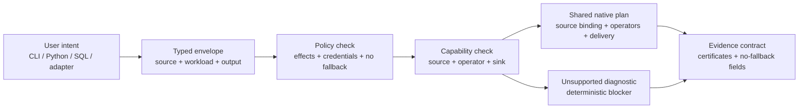
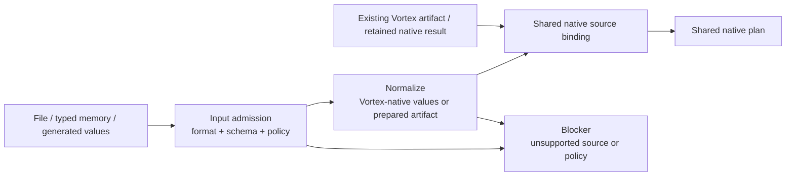
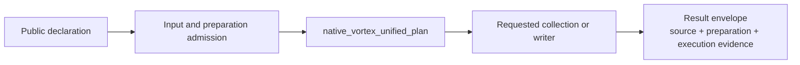
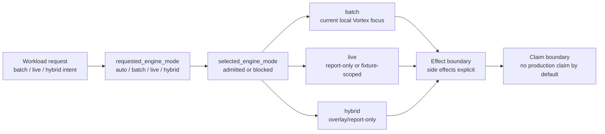
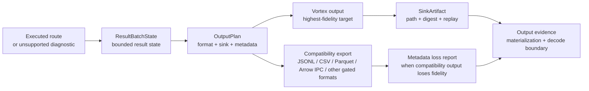
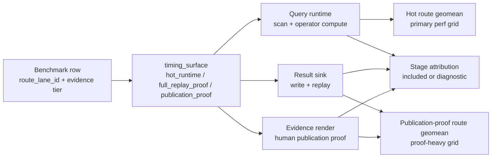

# ShardLoom Compute Engine Flow Reference

## Purpose

This file is the canonical ShardLoom compute-flow reference. It defines the public mental model,
runtime route vocabulary, benchmark timing surfaces, and claim boundaries that the website,
benchmarks, docs, and Codex agents should use.

Keep this file compact. It is a reference atlas, not a phase ledger, benchmark appendix, or
implementation history. Detailed work queues live in the phase plan and linked architecture docs.

Canonical source:

```text
docs/architecture/compute-engine-flow-reference.md
```

Website sync:

```text
website-src/scripts/sync-content.mjs
-> website/assets/data/compute-engine-flow-reference.md
-> website-public/assets/data/compute-engine-flow-reference.md
-> website/compute-engine-flow/index.html
-> website/compute-engine-flow.html
```

Public harness alignment note:

```text
docs/architecture/compute-engine-flow-overhaul-review.md
```

This reference owns current compute-flow vocabulary. The harness alignment note describes its
public invocation and verification boundaries. The phase plan owns the active work queue.

## One-Sentence Model

ShardLoom receives admitted inputs or a source-free declaration, normalizes data into Vortex-native
state, executes the shared native plan, and delivers the requested result or output with explicit
resource, materialization and no-fallback evidence.

```text
CLI / SQL / Python / DataFrame declaration
-> capability, type and policy admission
-> input adapters or generated values
-> Vortex-native preparation and retained state
-> one shared native plan and operator family
-> requested collection or output adapter
-> complete result, resource and no-fallback evidence
```

Core identity:

```text
Vortex-first
no external fallback
encoded-columnar execution
late materialization
explicit unsupported diagnostics
evidence-certified routes
claim-gated benchmark reporting
```

CLI, SQL, Python and DataFrame APIs declare the same engine work. Input format, prepared-state
reuse and output format describe data boundaries; they do not select alternative evaluators.
The executed public plan family is `native_vortex_unified_plan`.

## Documentation Structure

This reference uses a small set of source-grounded documentation rules:

- Root READMEs should explain what the project does, why it is useful, how to get started, and
  where to get more help or detail; long docs belong outside the README
  ([GitHub README docs](https://docs.github.com/en/repositories/managing-your-repositorys-settings-and-features/customizing-your-repository/about-readmes)).
- Architecture diagrams stay in Markdown Mermaid blocks so GitHub, pull requests, and the static
  website can render them from the same source
  ([GitHub diagram docs](https://docs.github.com/en/get-started/writing-on-github/working-with-advanced-formatting/creating-diagrams)).
- Reference material should be optimized for scanning, random access, complete examples, and
  related links rather than narrative sprawl
  ([Diataxis-style reference guidance](https://nix.dev/contributing/documentation/diataxis)).

## How To Use This Reference

| Reader | Start here | Stop when you can answer |
| --- | --- | --- |
| New user | At a glance, Route atlas, Current support snapshot | How does my input reach the native engine? |
| Runtime implementer | Runtime contract, Execution mode lanes, Native operator hot path | Where is support decided? |
| Benchmark reviewer | Timing surfaces, Stage attribution, Benchmark route labels | What was timed? |
| Release reviewer | Evidence fields, Claim gate, What must never happen | Is a public claim allowed? |
| Codex agent | Codex anchor prompt, Required invariants, Validation | Which invariant must my edit preserve? |

Entry anatomy for future additions:

```text
term or route name
one-sentence definition
where it appears in the flow
current posture
required evidence fields
claim boundary
next owning doc or phase item
```

## At A Glance


```mermaid
flowchart LR
    ACCESS["Declaration<br/>CLI / SQL / Python / DataFrame"]
    REQUEST["Typed request<br/>source + workload + output intent"]
    ADMISSION["Admission<br/>policy + capability + semantics"]
    SOURCE["Input boundary<br/>file / memory / generated / no source"]
    PREPARE["Vortex-native preparation<br/>normalize or reuse native state"]
    EXECUTE["Shared native plan<br/>prune / transform / aggregate / compose"]
    OUTPUT["Delivery<br/>collection or requested output format"]
    TIMING["Timing surface<br/>hot_runtime / replay / publication"]
    CLAIM["Claim gate<br/>evidence + blockers + no fallback"]

    ACCESS --> REQUEST --> ADMISSION --> SOURCE --> PREPARE --> EXECUTE --> OUTPUT --> TIMING --> CLAIM
```

## Required Invariants

| Invariant | Meaning |
| --- | --- |
| No fallback execution | Unsupported work returns deterministic diagnostics with `fallback_attempted=false` and `external_engine_invoked=false`; Spark, DataFusion, DuckDB, Polars, pandas, Dask, Ray, Velox, Trino, databases, and warehouses do not execute ShardLoom work as fallback. |
| Vortex is native | Vortex is the preferred input/output persistence target; compatibility formats are translation or import/export boundaries, not fallback execution engines. |
| Front door is not route | CLI, Python, SQL, notebooks, adapters, and planned REST/event APIs express work; route evidence names the actual source/preparation/execution/output path. |
| Preparation is visible | Admitted file adapters, typed memory and generated values normalize into Vortex-native state. Existing Vortex artifacts and retained native results can be reused. Evidence distinguishes normalization, artifact preparation and reuse. |
| One execution family | Public requests report `public_workflow_native_vortex_plan_route_family=native_vortex_unified_plan`. Shared planners, kernels, resource admission and writers own execution. Source-free plans use that same family. |
| Claims are gated | Runtime support, claim-grade evidence, production support, package readiness, performance claims, and Spark-replacement claims are separate fields. |
| Timing surface is explicit | `hot_runtime`, `full_replay_proof`, and `publication_proof` rows must never silently replace each other. |

## Reference Groups

| Group | Owns | Primary evidence |
| --- | --- | --- |
| Access and front doors | CLI, Python, SQL, adapters, planned API surfaces | typed request envelope, typed output envelope |
| Source and preparation | `UniversalIngress`, `InputAdapter`, `SourceState`, `vortex-prepare`, `VortexPreparedState` | metadata-first source identity, optional source-content digest proof, prepared-state IDs/digests, stream batch policy, source-unit hints, dictionary handoff posture, import certificates |
| Native execution | one shared plan with native operators and explicit admission | `public_workflow_native_vortex_plan_route_family`, execution certificates, resource evidence |
| Engine fabric | batch, live, hybrid, auto engine mode | `requested_engine_mode`, `selected_engine_mode`, effect and state boundaries |
| Output and materialization | `OutputPlan`, `SinkArtifact`, Vortex output, compatibility exports | decode/materialization status, result-sink replay, metadata preservation/loss |
| Timing and benchmarks | route lanes, timing surfaces, stage attribution | `timing_surface`, `route_total_formula`, stage milliseconds, claim gate status |
| Claims and release gates | hard release readiness, benchmark publication, package channel, public website | no-fallback fields, blockers, public claim booleans |

## Route Atlas

These are input and preparation states around the same engine.

| Boundary | Starts from | Includes | Does not imply |
| --- | --- | --- | --- |
| File import | An admitted CSV, JSON, JSONL, Parquet, Arrow IPC, Avro or ORC file | format-specific reading and Vortex normalization before native computation | support for every schema, broad remote I/O or a format-specific evaluator |
| Native or prepared input | An existing Vortex artifact or retained Vortex-native state | native source binding, reuse, planning and computation | that preparation was timed in the query |
| Typed memory | Explicitly typed caller values | native value admission and normalization before the same plan | Python or another library executing transformations |
| Generated or source-free input | Admitted rows, ranges, sequences or source-free SQL | native value generation and the shared plan | source file reads or a frontend evaluator |
| Collection or file output | The native result | bounded delivery and an admitted writer for the requested format | zero decode, preserved compatibility-format metadata or state spill |

## Native Operator Hot Path

Native Vortex routes should consume ShardLoom techniques automatically; users should not need to
call PulseWeave, capillary, or metadata-first APIs by hand.

| Operator family | Current hot-path posture | Required evidence |
| --- | --- | --- |
| Aggregate/distinct | Direct typed/dictionary scalar `count`/`sum`/`avg`/`min`/`max` and `count_distinct`, direct nullable primitive accessors with typed validity masks, FxHash exact distinct state for scalar/direct routes, dense-ID per-chunk exact distinct pre-union for compact integer ranges, repeated numeric SUM/AVG expression fusion over shared accessors, exact dictionary distinct over used codes rather than unused dictionary values, null-aware Vortex and chunk-local UTF-8 dictionary grouping without row materialization, compact count/sum/avg grouped state including exact UTF-8 `length(...)` measures, typed numeric-pair state, typed numeric/minute/string count state, transformed dictionary URL-domain/length grouping, exact chunk-local UTF-8 dictionary grouping when Vortex dictionary codes are not surfaced, streaming count-star top-K finalization for exact count-only ordered groups, and residual-free pushdown-filtered admission into the same heavy-hitter/late-measure aggregate families. Accessor evidence separates true Vortex dictionary codes, direct nullable primitive masks, dense integer pre-union, chunk-local UTF-8 dictionaries, and materialized values; packed/proof-bound key paths require non-null proof when their key representation cannot encode nulls. State-budget evidence classifies observed in-memory pressure before any spill claim is made; `spill_supported=false` remains explicit until a real native spill-backed exact merge exists. | `aggregate_update_strategy`, `aggregate_accessor_summary`, `aggregate_accessor_materialization_status`, `aggregate_accessor_blockers`, `expression_fusion_strategy`, `expression_plan_fingerprint_status`, `aggregate_key_encoding_mode`, `compact_group_state_strategy`, `distinct_state_strategy`, `group_output_strategy`, `group_state_mode`, `state_pressure_class`, `state_budget_status`, `state_budget_diagnostic_code`, `capillary_work_units`, `pulseweave_pressure_signals`, `decoded_string_count`, `estimated_group_key_storage_bytes` |
| String predicates | Safe Vortex pushdown first, embedded derived-column rewrites for exact non-empty string predicates when available, ShardLoom residual UTF-8 byte predicates where needed, null-aware host/Vortex/chunk-dictionary contains over encoded or direct UTF-8 values, selected-row masks and row references before materialization. Nullable string rows are skipped for positive and negated contains semantics rather than forcing materialized fallback. | `filter_pushdown_applied`, `residual_predicate_materialization`, `embedded_derived_column_rewrite_status`, selected/materialized row counts, `aggregate_accessor_summary`, `data_materialized` |
| Bounded top-K/order | Capillary select-nth retained windows, source ordinals, embedded predicate rewrites before candidate scans, dynamic row-reference candidate scans for large bounded payload projections, final retained-row materialization from the single `.vortex` artifact. | `bounded_topk_strategy`, `retention_selection_strategy`, `candidate_rows_seen`, `retained_candidate_rows`, `late_output_materialization`, `row_ref_topk_materialization_policy`, `embedded_derived_column_rewrites` |
| Metadata/layout | Vortex footer/statistics pruning before scan where available; expression-project collect, row-transform collect, materializing filter, filter-project, distinct, drop-duplicate, sample, and schema-known structured row exports can return or write an empty result without opening a scan when footer stats prove no rows match. Transform families apply source predicates before expression rewrite, melt/explode expansion, pivot state updates, or rolling-window state, while predicate-only columns stay out of visible output. Prepared `.vortex` artifacts now expose single-artifact OLAP posture from the artifact itself: writer/layout strategy, row-block sizing, root/layout encodings, segment-map membership, dictionary/domain status, derived layout-stat posture, row-position locality, and layout-reader cache status. Richer domain-specific indexes still require measured proof before any speed claim. | `embedded_layout_planner_consumption_status`, selected/skipped segments, `layout_encoding_inventory`, `segment_membership_status`, `domain_dictionary_status`, `row_position_locality_status`, `upstream_scan_called`, `data_read`, `data_decoded`, `data_materialized`, no-query-answer-cache posture |

Public runtime envelopes also lift the compact evidence a caller needs to verify that the shared
Vortex-normalized path was used: `local_primitive_metadata_elimination_stage`,
`local_primitive_metadata_elimination_outcome`, `local_primitive_rows_avoided_by_metadata`,
`local_primitive_decode_avoided_by_metadata`,
`local_primitive_materialization_avoided_by_metadata`,
`local_primitive_physical_policy_summary`,
`local_primitive_evidence_collector_status`,
`local_primitive_control_plane_micros`,
`local_primitive_evidence_collection_micros`,
`local_primitive_evidence_compact_signature_count`,
`local_primitive_evidence_full_split_count`, and the selected resource-envelope budget fields. The
compact evidence collector reports repeated layout/encoding signatures and representative split
references while retaining the full replay split evidence required for proof lanes.
Universal Ingest layout-advisor output must identify itself as the
`universal_ingest_optimizer`, state that query-answer sidecars are disallowed, and record the
single-artifact, compact-derived-metadata, membership-sketch, row-position-locality, and
surface-unification policies.

Universal Ingest source-state evidence now separates source-native units from emitted batches:
`source_state_stream_batch_size`, `source_state_stream_unit_count_hint`,
`source_state_stream_unit_hint_kind`, `source_state_stream_policy`, and
`source_state_dictionary_preservation_status` identify whether the prepared Vortex artifact was fed
by product columnar stream batches, Parquet row-group hints, Arrow IPC batch hints, or a scalar text
adapter. Parquet product preparation can additionally report
`source_state_ingest_executor_status=bounded_shared_runtime_source` with a
coalesced metadata-reused row-group task count. Source tasks, conversion, statistics
and native writer work share the admitted local CPU grant. A full source queue yields
its driver to ready work in another stage. The supplied `max_parallelism` is a ceiling;
the process's available CPU capacity can narrow the applied grant. Source task count
and memory admission bound unfinished work separately from CPU drivers. Large columnar
sources may use the
`product_columnar_stream_batch_size_262144_rows` capillary stream policy to reduce writer handoff
and segment metadata churn; smaller product sources keep the 65,536-row policy.
Metadata-based memory admission can choose smaller batches. A fixed allocation is
selected at each operation's start; P4/P6/P8 are examples, not hard-coded tiers.

Large streaming prepared artifacts keep the same single-file runtime contract and use the retained
custom ShardLoom large-source writer strategy when the layout advisor admits it. UAT rejected the
upstream Vortex default writer for this 100M streaming shape because it produced less temp output
over the same safety window, so the default product route does not switch to upstream-default
writer behavior. The active ingest optimization instead uses Capillary/PulseWeave-style source and
writer overlap plus a source-text dictionary-Zstd writer profile: Parquet row-group workers emit
ordered `RecordBatch` units as soon as they are read instead of buffering an entire coalesced task
before the writer can proceed, and the Arrow-to-Vortex normalization layer uses a bounded
`capillary_vortex_array_prefetch_window` selected from the applied CPU grant and observed
batch memory requirements. Conversion tasks share drivers with source and writer work. Known
source text fields use Vortex dictionary-Zstd compression and typed/numeric fields stay on the
faster flat/zoned/stat path. The layout advisor exposes source scale, profile family,
text-domain/time-bucket/counter posture, prepared-layout family, high-cardinality/text/time key
profile, dictionary profile, and source-profile-specific read/write tradeoff labels as first-class
evidence rather than requiring downstream route checks to parse `workload_constitution`. Rejected
variants include physical hidden derived-column synthesis for large Parquet streams, separate
physical batch coalescing ahead of the source stream, and
upstream-default writer substitution.

Universal Ingest can also embed exact reusable derived columns in that same `.vortex` artifact when
the source adapter can produce them without making large preparation slower. The retained derived
families are compact `UInt32` UTF-8 byte length, dictionary-encoded URL/Referer/URI domain
extraction for URL-like fields, and compact `UInt8` minute-of-hour keys plus `Int64` epoch-minute
date-trunc buckets for admitted typed time-like fields. Large product columnar preparation uses a
lean runtime profile first: URL, Referer, SearchPhrase, and EventTime helpers are retained because
they feed shared SQL/Python/DataFrame predicate, aggregate, and top-K lanes; broader candidates such
as OriginalURL, ClientEventTime, LocalEventTime, and Title length are omitted unless the adapter can
provide a cheaper compact boundary. These columns are internal storage/layout features: user
`select *` output hides
`__shardloom_derived_*` fields, while native predicate, aggregate, bounded sort/top-K, and admitted
row-export/sample planning can consume them for `length(...)`, URL-domain grouping,
`extract(minute ...)`, `DATE_TRUNC('minute', ...)`, and non-empty string predicates before row
export. Filter,
filter-project, distinct, drop-duplicate, and sample row-export routes apply residual selected-row
filters before deterministic sampling, exact row-key state, or compatibility writes; nested/list row
keys stay encoded row-key state instead of being decoded as output columns. When footer statistics
prove a filtered materializing route cannot match, expression-project and row-transform collect can
return an empty bounded result and filter, filter-project, distinct, drop-duplicate, sample, and
schema-known structured export routes write the requested empty sink without opening a Vortex scan
or decoding rows. Expression-project source predicates are applied before typed rewrites so
replacement, mask, and row-number transforms do not silently redefine source filtering. Melt,
explode, pivot, and rolling-window routes now share the same Vortex-normalized predicate planning:
source filters are pushed down or materialized before expansion/window/state updates, and
predicate-only columns stay out of user-visible collect/export output. Row-expansion and window
families remain separate semantic contracts because filtering before/after expansion changes
cardinality and order. For URL-like fields, the admitted typed-text bridge derives byte length and
domain in one pass over the source strings. Product columnar adapters keep the rejected broad
per-row synthesis disabled, but public columnar preparation now applies a source-native
dictionary/typed-time wrapper when the source already exposes a safe layout: dictionary-backed
URL-like fields derive byte length and domain by transforming dictionary values once and remapping
existing codes while preserving the source Arrow dictionary key width, and typed numeric/time
fields plus Arrow timestamp columns across second/millisecond/microsecond/nanosecond units may
derive compact minute keys when admitted by the lean or broader source-native profile. Plain UTF-8 columnar batches still report
`source_native_embedded_derived_columns=not_available_for_current_arrow_layout` rather than paying a
large preparation-time string scan.

Local file preparation and execution:

```text
local non-Vortex input
-> UniversalIngress / InputAdapter
-> SourceState
-> vortex-prepare
-> VortexPreparedState
-> shared native source binding
-> native_vortex_unified_plan
-> OutputPlan
-> SinkArtifact
-> evidence
-> claim gate
```

Generated and source-free execution:

```text
admitted generated values or source-free declaration
-> Vortex-native values and source evidence
-> native_vortex_unified_plan
-> OutputPlan
-> SinkArtifact
-> evidence
-> claim gate
```

Generated-source contract markers:

```text
schema=shardloom.generated_source_certificate_contract.v1
no_dataset_smoke
user_generated_source
engine_native_generated_source
not_applicable_no_generated_rows
generated-source-user-rows
generated-source-range
generated-source-sequence
ctx.from_rows([{"id": 1}])
ctx.range(0, 10)
ctx.sequence([1, 2, 3])
none_scoped_local_range_sequence_jsonl_csv_smoke_only
shardloom.generated_source_api_admission.v1
shardloom.generated_source_evidence_alignment.v1
python_ctx_from_rows
python_ctx_range
python_ctx_sequence
python_generated_source_write
sql_values
sql_dataframe_source_free
foundry_generated_output
dataframe_generated_with_column
```

Observability/export contract markers:

```text
shardloom.openlineage_facet_mapping.v1
shardloom.opentelemetry_trace_export_contract.v1
openlineage_export_enabled=false
openlineage_facet_mapping_event_emitted=false
openlineage_facet_mapping_network_call_performed=false
opentelemetry_trace_export_trace_export_enabled=false
opentelemetry_trace_export_otlp_exporter_configured=false
opentelemetry_trace_export_network_exporter_enabled=false
opentelemetry_trace_export_network_call_performed=false
opentelemetry_export_enabled=false
opentelemetry_network_exporter_enabled=false
```

Novel/advisory performance markers:

```text
GAR-NOVEL-1A
GAR-NOVEL-1B
GAR-NOVEL-1C
GAR-NOVEL-1D
shardloom.traditional_analytics.bayesian_claim_confidence.v1
posterior_runtime_distribution=not_fit
credible_interval=not_computed
probability_of_regression=not_computed
runtime_decision_applied=false
layout_decision_applied=false
benchmark_recomputed=false
claim_gate_status=advisory_only_not_claim_grade
bayesian_confidence_enabled=false
```

## Timing Surfaces

Route timing rows must state their timing surface before any number is compared.

| Timing surface | Evidence tier | Route-total meaning | Sink/render inclusion |
| --- | --- | --- | --- |
| `hot_runtime` | `metadata_sink` | Hot route geomean. Query runtime only, or query plus compact metadata sink when explicitly declared. | `sink_timing_included_in_route_total=false` unless the row declares compact metadata inclusion. |
| `full_replay_proof` | `full_vortex_replay` | Full replay proof route total. Machine replay proof includes result-sink write/replay timing. | `sink_timing_included_in_route_total=true`. |
| `publication_proof` | `publication_full` | Publication-proof route geomean. Includes proof/output work needed for human publication evidence. | `sink_timing_included_in_route_total=true`; evidence render may be included. |

Required formula examples:

```text
route_total_formula=timing_surface=hot_runtime; query_runtime_millis
route_total_formula=timing_surface=full_replay_proof; query_runtime_millis + result_sink_write_millis + replay_millis
route_total_formula=timing_surface=publication_proof; preparation + query + result_sink_write + evidence_render
```

Stage attribution can show every measured piece, but each piece must be classified:

```text
included_hot_runtime
included_publication_proof
diagnostic_only
```

A `publication_full` row must not replace a missing hot-runtime row. If no hot-runtime row exists,
show `hot runtime row missing`.

## Benchmark Route Labels

The current parameterized harness has one candidate identity, `shardloom`.
Its workload catalog supplies complete SQL declarations to the public engine.
`raw` and `prepared` input state, input format and requested sink are independent
parameters. They never dispatch query-specific candidate executors. ClickBench
uses the same public SQL workflow and verifies the shared native plan family.

Record the actual input binding, complete declaration, binary and source hashes,
reference identity, requested output, complete-value comparison and no-fallback
fields. Attribute preparation, native query process time, writer/readback work
and harness wall time explicitly. External baselines run in independent comparison
processes and cannot satisfy candidate execution.

Older immutable benchmark reports retain their original lane and timing labels.
They describe those historical measurements; they do not define current runtime
dispatch or establish performance for the consolidated engine. The
[harness alignment note](compute-engine-flow-overhaul-review.md) and
[October 5 acceptance report](../benchmarks/native-typed-reductions-full43-2026-10-05.md)
record the current invocation, complete result and evidence boundaries.

## Current Support Snapshot

| Surface | Current posture | Claim boundary |
| --- | --- | --- |
| Public CLI, SQL, Python and DataFrame | Shared native plan admission, execution and result delivery; retained native results compose without frontend evaluation. | Support remains bounded by admitted operators, schemas, resources and output representations. |
| Local inputs | Eight admitted file formats, typed memory and source-free declarations are covered by the parameterized public acceptance. | Format recognition does not admit every logical type or remote connector. |
| Vortex preparation | Compatibility data normalizes before execution; native artifacts and retained results are reusable. | Vortex is native input and highest-fidelity output. Preparation and query time remain distinct. |
| Native operators | Relational composition, nested payloads/keys, typed expressions/unary operators and exact decimal reductions have their accepted finite scopes. [Typed reductions](../benchmarks/native-typed-reductions-full43-2026-10-05.md), [analytic frames](../benchmarks/native-analytic-frames-full43-2026-10-05.md) and [scalar-value subqueries](../benchmarks/native-scalar-subqueries-full43-2026-10-05.md) have completed local acceptance; scalar subqueries also completed hosted integration in PR #1524. Current source after v0.4.0 admits static List/FixedSizeList/Struct pivot roles with focused checks; full-workflow, resource and hosted acceptance remain pending under the [nested pivot contract](native-nested-pivot-state-2026-10-06.md). | Named windows, variable offsets, dynamic-pivot-dependent scalar schemas, lateral relations, broader adapters, reader/codec accounting and general state spill remain open; nested pivot retains its explicit type/fill/margins/spill limits. |
| Current benchmark harness | Raw/prepared input and requested output parameters exercise one public candidate; all 129 Full43 executions verify `native_vortex_unified_plan`. | Complete correctness evidence is available; this consolidation has no paired speedup claim. |
| Object store, lakehouse, Foundry, live/hybrid | Mostly report-only, fixture-scoped, or blocked. | No production platform claim. |
| Package/release | Selected-channel v0.4.0 proofs are complete; see the [publication verification](../release/v0.4.0-publication-verification.md). Scalar-subquery and nested-pivot support added after v0.4.0 require a later package release. | Existing package publication does not certify unshipped source or production readiness. |

## Runtime Contract


```mermaid
flowchart LR
    USER["User intent<br/>CLI / Python / SQL / adapter"]
    ENVELOPE["Typed envelope<br/>source + workload + output"]
    POLICY["Policy check<br/>effects + credentials + no fallback"]
    CAPABILITY["Capability check<br/>source + operator + sink"]
    UNSUPPORTED["Unsupported diagnostic<br/>deterministic blocker"]
    ROUTE["Shared native plan<br/>source binding + operators + delivery"]
    CERT["Evidence contract<br/>certificates + no-fallback fields"]

    USER --> ENVELOPE --> POLICY --> CAPABILITY
    CAPABILITY --> ROUTE --> CERT
    CAPABILITY --> UNSUPPORTED --> CERT
```

Admission happens before execution. Capability recognition is not runtime support. Unsupported
work returns deterministic diagnostics with no external execution. Vortex native array, compute,
scan and sink providers stay isolated inside the admitted ShardLoom boundary; query-engine
integrations are never providers for unsupported work.

## Source And Preparation


```mermaid
flowchart LR
    INPUT["File / typed memory / generated values"]
    ADAPTER["Input admission<br/>format + schema + policy"]
    INGEST["Normalize<br/>Vortex-native values or prepared artifact"]
    NATIVE["Existing Vortex artifact / retained native result"]
    SOURCE["Shared native source binding"]
    PLAN["Shared native plan"]
    BLOCK["Blocker<br/>unsupported source or policy"]

    INPUT --> ADAPTER --> INGEST --> SOURCE --> PLAN
    NATIVE --> SOURCE
    ADAPTER --> BLOCK
    INGEST --> BLOCK
```

Adapters own reading and normalization. Operators consume the native binding; they do not replay
original compatibility files. A source-free declaration can generate native values or evaluate
admitted expressions in the same plan. Remote references are recognized only where a concrete
adapter and effect policy admit them; recognition alone performs no remote I/O.

## Execution Mode Lanes


```mermaid
flowchart LR
    REQUEST["Public declaration"]
    INPUT["Input and preparation admission"]
    NATIVE["native_vortex_unified_plan"]
    OUTPUT["Requested collection or writer"]
    RESULT["Result envelope<br/>source + preparation + execution evidence"]

    REQUEST --> INPUT --> NATIVE --> OUTPUT --> RESULT
```

Serialized evidence still distinguishes `compatibility_import_certified`, `prepared_vortex` and
`native_vortex` to describe import/preparation attribution. These values do not select separate
executors. Public workflow policy is `vortex_middle`, and its plan-family evidence names the shared
native engine. Retired transient and query-specific benchmark executors are deleted; prior
publications do not justify retaining them.

## Engine Fabric


```mermaid
flowchart LR
    WORKLOAD["Workload request<br/>batch / live / hybrid intent"]
    REQUESTED["requested_engine_mode<br/>auto / batch / live / hybrid"]
    SELECTED["selected_engine_mode<br/>admitted or blocked"]
    BATCH["batch<br/>current local Vortex focus"]
    LIVE["live<br/>report-only or fixture-scoped"]
    HYBRID["hybrid<br/>overlay/report-only"]
    EFFECTS["Effect boundary<br/>side effects explicit"]
    CLAIMS["Claim boundary<br/>no production claim by default"]

    WORKLOAD --> REQUESTED --> SELECTED
    SELECTED --> BATCH --> EFFECTS --> CLAIMS
    SELECTED --> LIVE --> EFFECTS
    SELECTED --> HYBRID --> EFFECTS
```

Engine mode is about workload semantics. It is not permission to delegate to an external streaming
system, database, warehouse, or lakehouse engine.

## Output And Materialization


```mermaid
flowchart LR
    EXECUTED["Executed route<br/>or unsupported diagnostic"]
    RESULT_BATCH["ResultBatchState<br/>bounded result state"]
    OUTPUT_PLAN["OutputPlan<br/>format + sink + metadata"]
    VORTEX_OUT["Vortex output<br/>highest-fidelity target"]
    COMPAT_OUT["Compatibility export<br/>JSONL / CSV / Parquet / Arrow IPC / other gated formats"]
    SINK["SinkArtifact<br/>path + digest + replay"]
    LOSS["Metadata loss report<br/>when compatibility output loses fidelity"]
    EVIDENCE["Output evidence<br/>materialization + decode boundary"]

    EXECUTED --> RESULT_BATCH --> OUTPUT_PLAN
    OUTPUT_PLAN --> VORTEX_OUT --> SINK --> EVIDENCE
    OUTPUT_PLAN --> COMPAT_OUT --> LOSS --> EVIDENCE
```

Input format and output format are independent. Vortex output is the highest-fidelity persistence
target. Compatibility output must report metadata preservation or loss.

## Timing And Stage Attribution


```mermaid
flowchart LR
    ROW["Benchmark row<br/>route_lane_id + evidence tier"]
    SURFACE["timing_surface<br/>hot_runtime / full_replay_proof / publication_proof"]
    QUERY["Query runtime<br/>scan + operator compute"]
    SINK["Result sink<br/>write + replay"]
    RENDER["Evidence render<br/>human publication proof"]
    HOT["Hot route geomean<br/>primary perf grid"]
    PUB["Publication-proof route geomean<br/>proof-heavy grid"]
    STAGE["Stage attribution<br/>included or diagnostic"]

    ROW --> SURFACE
    SURFACE --> QUERY --> HOT
    SURFACE --> SINK --> PUB
    SURFACE --> RENDER --> PUB
    QUERY --> STAGE
    SINK --> STAGE
    RENDER --> STAGE
```

Hot runtime comparisons should use `timing_surface=hot_runtime`. Publication-proof rows can be
slower because they include result-sink and human evidence-render work. That is extra proof work,
not automatically a core runtime regression.

## Evidence And Claim Gate


```mermaid
flowchart LR
    OUTCOME["Execution outcome<br/>result or blocker"]
    CORRECT["Correctness evidence<br/>digest / replay / oracle where allowed"]
    CERT["Certificates<br/>execution + Native I/O + source/sink"]
    NOFALLBACK["No-fallback evidence<br/>fallback_attempted=false"]
    TIMING["Timing evidence<br/>surface + formula + stage rows"]
    BLOCKERS["Blocker matrix<br/>missing or disallowed claims"]
    CLAIM["claim_gate_status<br/>claim_grade / not_claim_grade / fixture_smoke_only"]
    PUBLIC["Public claim booleans<br/>performance / production / package / Spark-displacement"]

    OUTCOME --> CORRECT --> CERT --> NOFALLBACK --> TIMING --> BLOCKERS --> CLAIM --> PUBLIC
```

Public claim booleans default to false:

```text
performance_claim_allowed=false
production_claim_allowed=false
spark_replacement_claim_allowed=false
public_release_claim_allowed=false
public_package_claim_allowed=false
publication_attempted=false
tag_created=false
secrets_required=false
fallback_attempted=false
external_engine_invoked=false
```

## External Baseline Boundary

External engines may appear only as comparison baselines, migration references, or correctness
oracles in tests where the boundary is explicit.

Allowed:

- `external_baseline_only` benchmark rows.
- Correctness/differential oracles that never satisfy runtime execution.
- Migration notes explaining what ShardLoom does not yet support.

Not allowed:

- Executing unsupported ShardLoom work through Spark, DataFusion, DuckDB, Polars, pandas, Dask, Ray,
  Velox, Trino, a database, or a warehouse.
- Reporting an external engine's residual evaluation as ShardLoom execution.
- Treating Vortex query-engine integrations as runtime fallback.

## What Must Never Happen

- Do not make `publication_full` rows drive the primary hot route grid.
- Do not compare hot query runtime against publication-proof totals without saying so.
- Do not call `prepared_vortex` a direct reader for compatibility files.
- Do not hide source admission, preparation, materialization, decode, sink, or evidence-render costs.
- Do not use mode labels to hide unsupported work or introduce an alternate evaluator.
  Admit the declaration through the shared native plan or return an explicit diagnostic.
- Do not let website copy imply production support, package publication, Spark-displacement, object-store/lakehouse runtime, Foundry production, or performance superiority without claim-grade evidence.
- Do not keep outdated legacy docs on public pages when this reference, the phase plan, or promoted benchmark artifacts have moved on.

## Optimization Direction

Optimize remaining high-timing components by first separating route categories:

| Work area | Optimize toward | Keep visible |
| --- | --- | --- |
| Hot query runtime | Vortex-native scans, encoded kernels, pruning, pushdown, residual minimization | `timing_surface=hot_runtime`, query-only formula, route lane ID |
| Preparation | reusable `SourceState` and `VortexPreparedState`, narrow preparation timing, differential preparation | `prepared_state_lookup_or_create_ms`, `prepare_route_total_ms`, `prepare_cli_wall_ms` |
| Result sink/replay | lower write/replay overhead where proof surfaces need it | `result_sink_write_millis`, replay status, sink inclusion flag |
| Evidence render | avoid making human publication rendering part of hot runtime | `evidence_render_ms`, `included_publication_proof`, `diagnostic_only` |
| CI hard gate | parallel producer evidence jobs plus strict final artifact verification | final release rehearsal, production usability, hard release report |

## Codex Anchor Prompt

Use this prompt when an agent is about to change runtime, benchmark, website, or claim-surface code:

```text
You are editing ShardLoom. Preserve the no-fallback and Vortex-native architecture.
Before changing behavior, identify the front door, source route, preparation route,
execution route, output route, timing surface, evidence fields, and claim gate.
If unsupported, emit deterministic diagnostics with fallback_attempted=false and
external_engine_invoked=false. If benchmarking, keep hot_runtime, full_replay_proof,
and publication_proof rows separate. Do not make external baselines or publication
proof work stand in for ShardLoom hot runtime.
```

## Validation

After editing this file, sync and validate the website copies:

```bash
cd website-src
npm run sync-content
npm run build
npm run check
cd ..
python scripts/check_website_readiness.py
node scripts/validate_static_assets.cjs
git diff --check
```

For CI gate changes, also run:

```bash
python scripts/check_ci_gate_matrix.py
```

## Related Sources

- Active phase plan, kept as the repo-only source of truth for planned implementation work.
- `docs/architecture/canonical-terminology.md`
- `docs/architecture/universal-input-contract.md`
- `docs/architecture/universal-ingress-route-taxonomy.md`
- `docs/architecture/universal-compatibility-coverage-scoreboard.md`
- `docs/architecture/capability-certification-sequencing.md`
- `docs/benchmarks/local-taxonomy-benchmark.md`
- `docs/benchmarks/baseline-comparison-boundary.md`
- `benchmarks/traditional_analytics/README.md`
- `docs/release/ci-gate-matrix.md`
- `docs/release/hard-release-readiness-gate.md`

## Footer

This reference authorizes vocabulary and evidence shape. It does not authorize production claims,
package publication, performance superiority, Spark-displacement, broad SQL/DataFrame support,
object-store/lakehouse runtime, Foundry production support, or any external fallback execution.
